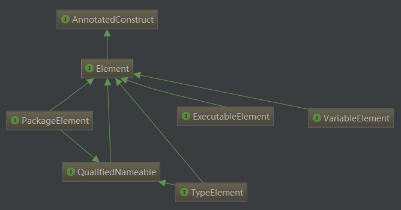

前面写了[Android 开发:由模块化到组件化(一)](http://blog.csdn.net/dd864140130/article/details/53645290),很多小伙伴来问怎么没有Demo啊?之所以没有立刻放demo的原因在还有许多技术点没说完.

今天我们就来细细评味[Java](http://lib.csdn.net/base/javase)当中Annotation,也就是我们常说的注解.

本文按照以下顺序进行:元数据->元注解->运行时注解->编译时注解处理器.

## 什么是元数据(metadata)

元数据由metadata译来，所谓的元数据就是“关于数据的数据”,更通俗的说就是描述数据的数据，对数据及信息资源的描述性信息.比如说一个文本文件,有创建时间,创建人,文件大小等数据,这都可以理解为是元数据.

在java中,元数据以标签的形式存在java代码中,它的存在并不影响程序代码的编译和执行，通常它被用来生成其它的文件或运行时知道被运行代码的描述信息。java当中的javadoc和注解都属于元数据.

## 什么是注解(Annotation)?

注解是从[Java ](http://lib.csdn.net/base/java)5.0开始加入,可以用于标注包,类,方法,变量等.比如我们常见的@Override,再或者[Android](http://lib.csdn.net/base/android)源码中的@hide,@systemApi,@privateApi等

对于@Override,多数人往往都是知其然而不知其所以然,今天我就来聊聊Annotation背后的秘密,开始正文.

### 元注解

元注解就是定义注解的注解,是java提供给我们用于定义注解的基本注解.在java.lang.annotation包中我们可以看到目前元注解共有以下几个:

- @Retention
- @Target
- @Inherited
- @Documented
- @interface

下面我们将集合@Override注解来解释着5个基本注解的用法.

#### @interface

@interface是java中用于声明注解类的关键字.使用该注解表示将自动继承java.lang.annotation.Annotation类,该过程交给编译器完成.

因此我们想要定义一个注解只需要如下做即可,以@Override注解为例

```java
public @interface Override {
}
```

> 需要注意:在定义注解时,不能继承其他注解或接口.

#### @Retention

@Retention:该注解用于定义注解保留策略,即定义的注解类在什么时候存在(源码阶段 or 编译后 or 运行阶段).该注解接受以下几个参数:`RetentionPolicy.SOURCE,RetentionPolicy.CLASS,RetentionPolicy.RUNTIME`,其具体使用及含义如下:

| 注解保留策略                              | 含义                                       |
| ----------------------------------- | ---------------------------------------- |
| @Retention(RetentionPolicy.SOURCE)  | 注解仅在源码中保留,class文件中不存在                    |
| @Retention(RetentionPolicy.CLASS)   | 注解在源码和class文件中都存在,但运行时不存在,即运行时无法获得,该策略也是默认的保留策略 |
| @Retention(RetentionPolicy.RUNTIME) | 注解在源码,class文件中存在且运行时可以通过反射机制获取到          |

来看一下@Override注解的保留策略:

```java
@Retention(RetentionPolicy.SOURCE)
public @interface Override {
}
```

这表明@Override注解只在源码阶段存在,javac在编译过程中去去掉该注解.

#### @Target

该注解用于定义注解的作用目标,即注解可以用在什么地方,比如是用于方法上还是用于字段上,该注解接受以下参数:

| 作用目标                                 | 含义                   |
| :----------------------------------- | :------------------- |
| @Target(ElementType.TYPE)            | 用于接口(注解本质上也是接口),类,枚举 |
| @Target(ElementType.FIELD)           | 用于字段,枚举常量            |
| @Target(ElementType.METHOD)          | 用于方法                 |
| @Target(ElementType.PARAMETER)       | 用于方法参数               |
| @Target(ElementType.CONSTRUCTOR)     | 用于构造参数               |
| @Target(ElementType.LOCAL_VARIABLE)  | 用于局部变量               |
| @Target(ElementType.ANNOTATION_TYPE) | 用于注解                 |
| @Target(ElementType.PACKAGE)         | 用于包                  |

以@Override为例,不难看出其作用目标为方法:

```java
@Target(ElementType.METHOD)
public @interface Override {
}
```

到现在,通过@interface,@Retention,@Target已经可以完整的定义一个注解,来看@Override完整定义:

```java
@Target(ElementType.METHOD)
@Retention(RetentionPolicy.SOURCE)
public @interface Override {
}
```

#### @Inherited

默认情况下,我们自定义的注解用在父类上不会被子类所继承.如果想让子类也继承父类的注解,即注解在子类也生效,需要在自定义注解时设置@Inherited.一般情况下该注解用的比较少.

#### @Documented

该注解用于描述其它类型的annotation应该被javadoc文档化,出现在api doc中. 
比如使用该注解的@Target会出出现在api说明中.

```java
@Documented
@Retention(RetentionPolicy.RUNTIME)
@Target(ElementType.ANNOTATION_TYPE)
public @interface Target {

    ElementType[] value();
}
```


借助@Interface,@Target,@Retention,@Inherited,@Documented这五个元注解,我们就可以自定义注解了,其中前三个注解是任何一个注解都必备具备的.

你以为下面会直接来将如何自定义注解嘛?不,你错了,我们还是来聊聊java自带的几个注解.

### 系统注解

java设计者已经为我们自定义了几个常用的注解,我们称之为系统注解,主要是这三个:

| 系统注解               | 含义                  |
| :----------------- | :------------------ |
| @Override          | 用于修饰方法,表示此方法重写了父类方法 |
| @Deprecated        | 用于修饰方法,表示此方法已经过时    |
| @SuppressWarnnings | 该注解用于告诉编译器忽视某类编译警告  |

如果你已经完全知道这三者的用途,跳过这一小节,直接往下看.

#### @Override

它用作标注方法,说明被标注的方法重写了父类的方法,其功能类似断言.如果在一个没有重写父类方法的方法上使用该注解,java编译器将会以一个编译错误提示: 


#### @Deprecated

当某个类型或者成员使用该注解时意味着 
编译器不推荐开发者使用被标记的元素.另外,该注解具有”传递性”,子类中重写该注解标记的方法,尽管子类中的该方法未使用该注解,但编译器仍然报警.

```java
public class SimpleCalculator {

    @Deprecated
    public int add(int x, int y) {
        return x+y;
    }
}

public class MultiplCalculator extends SimpleCalculator {
    // 重写SimpleCalculator中方法,但不使用@Deprecated
    public int add(int x, int y) {
        return  Math.abs(x)+Math.abs(y);
    }
}

//test code
public class Main {

    public static void main(String[] args) {
        new SimpleCalculator().add(3, 4);
        new MultiplCalculator().add(3,5);
    }
}
```

对于像new SimpleCalculator().add(3,4)这种直接调用的,Idea会直接提示,而像第二种则不是直接提示: 


但是在编译过程中,编译器都会警告:


需要注意@Deprecated和@deprecated这两者的区别,前者被javac识别和处理,而后者则是被javadoc工具识别和处理.因此当我们需要在源码标记某个方法已经过时应该使用@Deprecated,如果需要在文档中说明则使用@deprecated,因此可以这么:

```java
public class SimpleCalculator {
    /**
     * @param x
     * @param y
     * @return
     * 
     * @deprecated deprecated As of version 1.1,
     * replace by <code>SimpleCalculator.add(double x,double y)</code>
     */
    @Deprecated
    public int add(int x, int y) {
        return x+y;
    }

    public double add(double x,double y) {
        return x+y;
    }

}
```

#### @SuppressWarnning

该注解被用于有选择的关闭编译器对类,方法,成员变量即变量初始化的警告.该注解可接受以下参数:

| 参数          | 含义                                   |
| ----------- | ------------------------------------ |
| deprecated  | 使用已过时类,方法,变量                         |
| unchecked   | 执行了未检查的转告时的警告,如使用集合是为使用泛型来制定集合保存时的类型 |
| fallthrough | 使用switch,但是没有break时                  |
| path        | 类路径,源文件路径等有不存在的路径                    |
| serial      | 可序列化的类上缺少serialVersionUID定义时的警告      |
| finally     | 任何finally字句不能正常完成时的警告                |
| all         | 以上所有情况的警告                            |

滋溜一下,我们飞过了2016年,不,是看完了上一节.继续往下飞.


## 自定义注解

了解完系统注解之后,现在我们就可以自己来定义注解了,通过上面@Override的实例,不难看出定义注解的格式如下:

```java
public @interface 注解名 {定义体}
```

定义体就是方法的集合,每个方法实则是声明了一个配置参数.方法的名称作为配置参数的名称,方法的返回值类型就是配置参数的类型.和普通的方法不一样,可以通过default关键字来声明配置参数的默认值.

需要注意:

1. 此处只能使用public或者默认的defalt两个权限修饰符
2. 配置参数的类型只能使用基本类型(byte,boolean,char,short,int,long,float,double)和String,Enum,Class,annotation
3. 对于只含有一个配置参数的注解,参数名建议设置中value,即方法名为value
4. 配置参数一旦设置,其参数值必须有确定的值,要不在使用注解的时候指定,要不在定义注解的时候使用default为其设置默认值,对于非基本类型的参数值来说,其不能为null.

像@Override这样,没有成员定义的注解称之为标记注解.

现在我们来自定义个注解@UserMeta,这个注解目前并没啥用,就是为了演示一番:

```java
@Documented
@Target(ElementType.CONSTRUCTOR)
@Retention(RetentionPolicy.RUNTIME)
public @interface UserMeta {
    public int id() default 0;

    public String name() default "";

    public int age() default ;
}
```

有了米饭,没有筷子没法吃啊(手抓饭的走开),下面来看看如何处理注解.

## 注解处理器

上面我们已经学会了如何定义注解,要想注解发挥实际作用,需要我们为注解编写相应的注解处理器.根据注解的特性,注解处理器可以分为运行时注解处理和编译时注解处理器.运行时处理器需要借助反射机制实现,而编译时处理器则需要借助APT来实现.

无论是运行时注解处理器还是编译时注解处理器,主要工作都是读取注解及处理特定注解,从这个角度来看注解处理器还是非常容易理解的.

先来看看如何编写运行时注解处理器.

### 运行时注解处理器

熟悉java反射机制的同学一定对java.lang.reflect包非常熟悉,该包中的所有api都支持读取运行时Annotation的能力,即属性为@Retention(RetentionPolicy.RUNTIME)的注解.

在java.lang.reflect中的AnnotatedElement接口是所有程序元素的(Class,Method)父接口,我们可以通过反射获取到某个类的AnnotatedElement对象,进而可以通过该对象提供的方法访问Annotation信息,常用的方法如下:

| 方法                                       | 含义                |
| ---------------------------------------- | ----------------- |
| `<T extends Annotation> T getAnnotation(Class<T> annotationClass)` | 返回该元素上存在的制定类型的注解  |
| `Annotation[] getAnnotations()`          | 返回该元素上存在的所有注解     |
| `default <T extends Annotation> T[] getAnnotationsByType(Class<T> annotationClass)` | 返回该元素指定类型的注解      |
| `default <T extends Annotation> T getDeclaredAnnotation(Class<T> annotationClass)` | 返回直接存在与该元素上的所有注释  |
| `default <T extends Annotation> T[] getDeclaredAnnotationsByType(Class<T> annotationClass)` | 返回直接存在该元素岸上某类型的注释 |
| `Annotation[] getDeclaredAnnotations()`  | 返回直接存在与该元素上的所有注释  |

编写运行时注解大体就需要了解以上知识点,下面来做个小实验.

#### 简单示例

首先我们用一个简单的实例来介绍如何编写运行时注解处理器:我们的系统中存在一个User实体类：

```java
public class User {
    private int id;
    private int age;
    private String name;

    @UserMeta(id=1,name="dong",age = 10)
    public User() {
    }


    public User(int id, int age, String name) {
        this.id = id;
        this.age = age;
        this.name = name;
    }

  //...省略setter和getter方法

    @Override
    public String toString() {
        return "User{" +
                "id=" + id +
                ", age=" + age +
                ", name='" + name + '\'' +
                '}';
    }
}
```

我们希望可以通过`@UserMeta(id=1,name="dong",age = 10)`(这个注解我们在上面提到了)来为设置User实例的默认值。

自定义注解类如下：

```java
@Retention(RetentionPolicy.RUNTIME)
@Target(ElementType.CONSTRUCTOR)
public @interface UserMeta {
    public int id() default 0;

    public String name() default "";

    public int age() default 0;
}
```

该注解类作用于构造方法，并在运行时存在，这样我们就可以在运行时通过反射获取注解进而为User实例设值,看看如何处理该注解吧.

运行时注解处理器：

```java
public class AnnotationProcessor {

    public static void init(Object object) {

        if (!(object instanceof User)) {
            throw new IllegalArgumentException("[" + object.getClass().getSimpleName() + "] isn't type of User");
        }

        Constructor[] constructors = object.getClass().getDeclaredConstructors();
        for (Constructor constructor : constructors) {
            if (constructor.isAnnotationPresent(UserMeta.class)) {
                UserMeta userFill = (UserMeta) constructor.getAnnotation(UserMeta.class);
                int age = userFill.age();
                int id = userFill.id();
                String name = userFill.name();
                ((User) object).setAge(age);
                ((User) object).setId(id);
                ((User) object).setName(name);
            }
        }
    }
}
```

[测试](http://lib.csdn.net/base/softwaretest)代码：

```java
public class Main {

    public static void main(String[] args) {
        User user = new User();
        AnnotationProcessor.init(user);
        System.out.println(user.toString());
    }
}
```

运行测试代码，便得到我们想要的结果：

> User{id=1, age=10, name=’dong’}

这里通过反射获取User类声明的构造方法，并检测是否使用了@UserMeta注解。然后从注解中获取参数值并将其赋值给User对象。

正如上面提到，运行时注解处理器的编写本质上就是通过反射获取注解信息，随后进行其他操作。编译一个运行时注解处理器就是这么简单。运行时注解通常多用于参数配置类模块。

#### 自己动手编写ButterKnife

对从事Android开发的小伙伴而言，ButterKnife可谓是神兵利器，能极大的减少我们书写`findViewById(XXX)`.现在，我们就利用刚才所学的运行时注解处理器来编写一个简化版的ButterKnife。

自定义注解：

```java
//该注解用于配置layout资源
@Target(ElementType.TYPE)
@Retention(RetentionPolicy.RUNTIME)
public @interface ContentView {
    int value();//只有一个返回时,可用value做名称,这样在使用的时候就不需要使用的名称进行标志
}

//该注解用于配置控件ID
@Target(ElementType.FIELD)
@Retention(RetentionPolicy.RUNTIME)
public @interface ViewInject {
    int id();
    boolean clickable() default  false;
}
```

自定义运行时注解：

```java
public class ButterKnife {

    //view控件
    public static void initViews(Object object, View sourceView){
        //获取该类声明的成员变量
        Field[] fields = object.getClass().getDeclaredFields();
        for (Field field : fields){
            //获取该成员变量上使用的ViewInject注解
            ViewInject viewInject = field.getAnnotation(ViewInject.class);
            if(viewInject != null){
                int viewId = viewInject.id();//获取id参数值
                boolean clickable = viewInject.clickable();//获取clickable参数值
                if(viewId != -1){
                    try {
                        field.setAccessible(true);
                        field.set(object, sourceView.findViewById(viewId));
                        if(clickable == true){
                            sourceView.findViewById(viewId).setOnClickListener((View.OnClickListener) (object));
                        }
                    } catch (Exception e) {
                        e.printStackTrace();
                    }
                }
            }
        }
    }

    //布局资源
    public static void initLayout(Activity activity){
        Class<? extends Activity> activityClass =  activity.getClass();
        ContentView contentView = activityClass.getAnnotation(ContentView.class);
        if(contentView != null){
            int layoutId = contentView.value();
            try {
                //反射执行setContentView（）方法
                Method method = activityClass.getMethod("setContentView", int.class);
                method.invoke(activity, layoutId);
            } catch (Exception e) {
                e.printStackTrace();
            }
        }
    }


    public static void init(Activity activity) {
        initLayout(activity);
        initViews(activity,activity.getWindow().getDecorView());
    }
}
```

测试代码：

```java
@ContentView(id=R.layout.activity_main)
public class MainActivity extends Activity implements View.OnClickListener {

    @ViewInject(id=R.id.tvDis,clickable = true)
    private TextView tvDis;

    @ViewInject(id=R.id.btnNew,clickable =true)
    private Button btnNew;

    @ViewInject(id =R.id.btnScreenShot,clickable = true)
    private Button btnScreenShot;

    @ViewInject(id =R.id.imgContainer)
    private ImageView imgContainer;


    @Override
    protected void onCreate(Bundle savedInstanceState) {
        super.onCreate(savedInstanceState);
        AnnotationUtil.inJect(this);

    }

    @Override
    public void onClick(View v) {
        switch (v.getId()) {
            case R.id.tvDis:
                break;
            case R.id.btnNew:
                break;
            case R.id.btnScreenShot:
                break;
        }
    }
}
```

一个简单的ButterKnife就实现了，是不是非常简单。下面我们就进入本文的最重要的一点：编译时注解处理器。

### 编译时注解处理器

不同于运行时注解处理器，编写编译时注解处理器（Annotation Processor Tool）.

APT用于在编译时期扫描和处理注解信息.一个特定的注解处理器可以以java源码文件或编译后的class文件作为输入,然后输出另一些文件,可以是.java文件,也可以是.class文件,但通常我们输出的是.java文件.(注意:并不是对源文件修改).如果输出的是.java文件,这些.java文件回合其他源码文件一起被javac编译.

你可能很纳闷,注解处理器是到底是在什么阶段介入的呢?好吧,其实是在javac开始编译之前,这也就是通常我们为什么愿意输出.java文件的原因.

> 注解最早是在java 5引入，主要包含apt和com.sum.mirror包中相关mirror api，此时apt和javac是各自独立的。从java 6开始，注解处理器正式标准化，apt工具也被直接集成在javac当中。

我们还是回到如何编写编译时注解处理器这个话题上,编译一个编译时注解处理主要分两步：

1. 继承AbstractProcessor，实现自己的注解处理器
2. 注册处理器,并打成jar包

看起来很简单不是么?来慢慢的看看相关的知识点吧.

#### 自定义注解处理器

首先来看一下一个标准的注解处理器的格式：

```java
public class MyAnnotationProcessor extends AbstractProcessor {

    @Override
    public Set<String> getSupportedAnnotationTypes() {
        return super.getSupportedAnnotationTypes();
    }

    @Override
    public SourceVersion getSupportedSourceVersion() {
        return super.getSupportedSourceVersion();
    }

    @Override
    public synchronized void init(ProcessingEnvironment processingEnv) {
        super.init(processingEnv);
    }

    @Override
    public boolean process(Set<? extends TypeElement> annotations, RoundEnvironment roundEnv) {
        return false;
    }
}
```

来简单的了解下其中5个方法的作用

| 方法                                       | 作用                                       |
| ---------------------------------------- | ---------------------------------------- |
| init(ProcessingEnvironment processingEnv) | 该方法有注解处理器自动调用，其中ProcessingEnvironment类提供了很多有用的工具类：Filter，Types，Elements，Messager等 |
| getSupportedAnnotationTypes()            | 该方法返回字符串的集合表示该处理器用于处理那些注解                |
| getSupportedSourceVersion()              | 该方法用来指定支持的java版本，一般来说我们都是支持到最新版本，因此直接返回`SourceVersion.latestSupported(）`即可 |
| process(Set annotations, RoundEnvironment roundEnv) | 该方法是注解处理器处理注解的主要地方，我们需要在这里写扫描和处理注解的代码，以及最终生成的java文件。其中需要深入的是RoundEnvironment类，该用于查找出程序元素上使用的注解 |

编写一个注解处理器首先要对ProcessingEnvironment和RoundEnvironment非常熟悉。接下来我们一览这两个类的风采.首先来看一下ProcessingEnvironment类：

```java
public interface ProcessingEnvironment {

    Map<String,String> getOptions();

    //Messager用来报告错误，警告和其他提示信息
    Messager getMessager();

    //Filter用来创建新的源文件，class文件以及辅助文件
    Filer getFiler();

    //Elements中包含用于操作Element的工具方法
    Elements getElementUtils();

     //Types中包含用于操作TypeMirror的工具方法
    Types getTypeUtils();

    SourceVersion getSourceVersion();

    Locale getLocale();
}
```

重点来认识一下Element，Types和Filer。Element（元素）是什么呢？

##### Element

element表示一个静态的，语言级别的构件。而任何一个结构化文档都可以看作是由不同的element组成的结构体，比如XML，JSON等。这里我们用XML来示例：

```xml
<root>
  <child>
    <subchild>.....</subchild>
  </child>
</root>
```

这段xml中包含了三个元素：`<root>,<child>,<subchild>`,到现在你已经明白元素是什么。对于java源文件来说，他同样是一种结构化文档：

```java
package com.closedevice;             //PackageElement

public class Main{                  //TypeElement
    private int x;                  //VariableElement

    private Main(){                 //ExecuteableElement

    }

    private void print(String msg){ //其中的参数部分String msg为TypeElement

    }

}
```

对于java源文件来说，Element代表程序元素：包，类，方法都是一种程序元素。另外如果你对网页解析工具jsoup熟悉，你会觉得操作此处的element是非常容易，关于jsoup不在本文讲解之内。

接下来看看看各种Element之间的关系图图,以便有个大概的了解： 


| 元素                | 含义                                       |
| :---------------- | :--------------------------------------- |
| VariableElement   | 代表一个 字段, 枚举常量, 方法或者构造方法的参数, 局部变量及 异常参数等元素 |
| PackageElement    | 代表包元素                                    |
| TypeElement       | 代表类或接口元素                                 |
| ExecutableElement | 代码方法，构造函数，类或接口的初始化代码块等元素，也包括注解类型元素       |

##### TypeMirror

这三个类也需要我们重点掌握： 
**DeclaredType**代表声明类型：类类型还是接口类型，当然也包括参数化类型，比如`Set<String>`，也包括原始类型

**TypeElement**代表类或接口元素，而DeclaredType代表类类型或接口类型。

**TypeMirror**代表java语言中的类型.Types包括基本类型，声明类型（类类型和接口类型），数组，类型变量和空类型。也代表通配类型参数，可执行文件的签名和返回类型等。TypeMirror类中最重要的是`getKind()`方法，该方法返回TypeKind类型，为了方便大家理解，这里附上其源码：

```java
public enum TypeKind {
    BOOLEAN,BYTE,SHORT,INT,LONG,CHAR,FLOAT,DOUBLE,VOID,NONE,NULL,ARRAY,DECLARED,ERROR,  TYPEVAR,WILDCARD,PACKAGE,EXECUTABLE,OTHER,UNION,INTERSECTION;

    public boolean isPrimitive() {
        switch(this) {
        case BOOLEAN:
        case BYTE:
        case SHORT:
        case INT:
        case LONG:
        case CHAR:
        case FLOAT:
        case DOUBLE:
            return true;

        default:
            return false;
        }
    }
}
```

简单来说，Element代表源代码，TypeElement代表的是源码中的类型元素，比如类。虽然我们可以从TypeElement中获取类名，TypeElement中不包含类本身的信息，比如它的父类，要想获取这信息需要借助TypeMirror，可以通过Element中的`asType()`获取元素对应的TypeMirror。

然后来看一下RoundEnvironment,这个类比较简单,一笔带过:

```java
public interface RoundEnvironment {

    boolean processingOver();

     //上一轮注解处理器是否产生错误
    boolean errorRaised();

     //返回上一轮注解处理器生成的根元素
    Set<? extends Element> getRootElements();

   //返回包含指定注解类型的元素的集合
    Set<? extends Element> getElementsAnnotatedWith(TypeElement a);

    //返回包含指定注解类型的元素的集合
    Set<? extends Element> getElementsAnnotatedWith(Class<? extends Annotation> a);
}
```

##### Filer

Filer用于注解处理器中创建新文件。具体用法在下面示例会做演示.另外由于Filer用起来实在比较麻烦,后面我们会使用[javapoet](https://github.com/square/javapoet)简化我们的操作.

好了,关于AbstractProcessor中一些重要的知识点我们已经看完了.假设你现在已经编写完一个注解处理器了,下面,要做什么呢?

#### 打包并注册

自定义的处理器如何才能生效呢?为了让java编译器或能够找到自定义的注解处理器我们需要对其进行注册和打包：自定义的处理器需要被打成一个jar，并且需要在jar包的META-INF/services路径下中创建一个固定的文件javax.annotation.processing.Processor,在javax.annotation.processing.Processor文件中需要填写自定义处理器的完整路径名，有几个处理器就需要填写几个。

从java 6之后，我们只需要将打出的jar防止到项目的buildpath下即可，javac在运行的过程会自动检查javax.annotation.processing.Processor注册的注解处理器，并将其注册上。而java 5需要单独使用apt工具,java 5想必用的比较少了,就略过吧.

到现在为止,已经大体的介绍了与注解处理器相关的一些概念,最终我们需要获得是一个包含注解处理器代码的jar包.

接下来,来实践一把.

#### 简单实例

用个简单的示例,来演示如何在Gradle来创建一个编译时注解处理器,为了方便起见,这里就直接借助Android studio.当然你也可以采用maven构建.

首先创建AnnotationTest工程,在该工程内创建apt moudle.需要注意,AbstractProcessor是在javax包中,而android 核心库中不存在该包,因此在选择创建moudle时需要选择java Library: 


此时项目结构如下: 


接下在我们在apt下创建annotation和processor子包,其中annotation用于存放我们自定义的注解,而processor则用于存放我们自定义的注解处理器.

先来个简单的,自定义@Print注解:该注解最终的作用是输出被注解的元素:

```java
@Target({ElementType.TYPE, ElementType.FIELD, ElementType.METHOD})  
@Retention(RetentionPolicy.CLASS)                                  
public @interface Print {                                     
}
```

接下来为其编写注解处理器:

```java
public class PrintProcessor extends AbstractProcessor {

    private Messager mMessager;

    @Override
    public synchronized void init(ProcessingEnvironment processingEnvironment) {
        super.init(processingEnvironment);
        mMessager = processingEnvironment.getMessager();
    }

    @Override
    public boolean process(Set<? extends TypeElement> annotations, RoundEnvironment roundEnv) {
        for (TypeElement te : annotations) {
            for (Element e : roundEnv.getElementsAnnotatedWith(te)) {//find special annotationed element
                print(e.toString());//print element
            }
        }
        return true;
    }

    @Override
    public SourceVersion getSupportedSourceVersion() {

        return SourceVersion.latestSupported();
    }

    @Override
    public Set<String> getSupportedAnnotationTypes() {
        LinkedHashSet<String> annotations = new LinkedHashSet<>();
        annotations.add(Print.class.getCanonicalName());
        return super.getSupportedAnnotationTypes();
    }

    private void print(String msg) {
        mMessager.printMessage(Diagnostic.Kind.NOTE, msg);
    }
}
```

现在我们完成了一个简单的注解.在编译阶段,编译器将会输出被注解元素的信息.由于我们是在Gradle环境下,因此该信息将在Gradle Console下输出.

接下来我们编写一个稍微难点的注解@Code:该注解会生成一个指定格式的类,先看看该注解的定义:

```java
@Retention(CLASS)
@Target(METHOD)
public @interface Code {
    public String author();
    public String date() default "";
}
```

接下来,我们需要为其编写注解处理器,代码比较简单,直接来看:

```java
public class CodeProcessor extends AbstractProcessor {

    private final String SUFFIX = "$WrmRequestInfo";

    private Messager mMessager;
    private Filer mFiler;
    private Types mTypeUtils;

    @Override
    public synchronized void init(ProcessingEnvironment processingEnvironment) {
        super.init(processingEnvironment);
        mMessager = processingEnvironment.getMessager();
        mFiler = processingEnvironment.getFiler();
        mTypeUtils = processingEnvironment.getTypeUtils();

    }

    @Override
    public SourceVersion getSupportedSourceVersion() {
        return SourceVersion.latestSupported();
    }

    @Override
    public Set<String> getSupportedAnnotationTypes() {
        LinkedHashSet<String> annotations = new LinkedHashSet<>();
        annotations.add(Code.class.getCanonicalName());
        return annotations;
    }

    @Override
    public boolean process(Set<? extends TypeElement> set, RoundEnvironment roundEnvironment) {
        for (Element e : roundEnvironment.getElementsAnnotatedWith(Code.class)) {//find special annotationed element
            Code ca = e.getAnnotation(Code.class);
            TypeElement clazz = (TypeElement) e.getEnclosingElement();
            try {
                generateCode(e, ca, clazz);
            } catch (IOException x) {
                processingEnv.getMessager().printMessage(Diagnostic.Kind.ERROR,
                        x.toString());
                return false
            }
        }
        return true;
    }

    //generate 
    private void generateCode(Element e, Code ca, TypeElement clazz) throws IOException {
        JavaFileObject f = mFiler.createSourceFile(clazz.getQualifiedName() + SUFFIX);
        mMessager.printMessage(Diagnostic.Kind.NOTE, "Creating " + f.toUri());
        Writer w = f.openWriter();
        try {
            String pack = clazz.getQualifiedName().toString();
            PrintWriter pw = new PrintWriter(w);
            pw.println("package " + pack.substring(0, pack.lastIndexOf('.')) + ";"); //create package element
            pw.println("\n class " + clazz.getSimpleName() + "Autogenerate {");//create class element
            pw.println("\n    protected " + clazz.getSimpleName() + "Autogenerate() {}");//create class construction
            pw.println("    protected final void message() {");//create method
            pw.println("\n//" + e);
            pw.println("//" + ca);
            pw.println("\n        System.out.println(\"author:" + ca.author() + "\");");
            pw.println("\n        System.out.println(\"date:" + ca.date() + "\");");
            pw.println("    }");
            pw.println("}");
            pw.flush();
        } finally {
            w.close();
        }
    }

}
```

核心内容在`generateCode()`方法中,该方法利用上面我们提到的Filer来写出源文件.你会发现,这里主要就是字符创拼接类的过程嘛,真是太麻烦了.

到现在为止,我们已经编写好了两个注解及其对应的处理器.现在我们仅需要对其进行配置.

在resources资源文件夹下创建META-INF.services,然后在该路径下创建名为javax.annotation.processing.Processor的文件,在该文件中配置需要启用的注解处理器,即写上处理器的完整路径,有几个处理器就写几个,分行写幺,比如我们这里是:

```gradle
com.closedevice.processor.PrintProcessor
com.closedevice.processor.CodeProcessor1212
```

到现在我们已经做好打包之前的准备了,此时项目结构如下: 


下面就需要将apt moudle打成jar包.无论你是在什么平台上,最终打出jar包就算成功一半了.为了方便演示,直接可视化操作: 


来看一下apt.jar的结构: 


接下来将apt.jar文件复制到主moudle app下的libs文件夹中,开始使用它.我们简单的在MainActivity.java中使用一下:

```java
public class MainActivity extends AppCompatActivity {

    @Override
    @Print
    protected void onCreate(Bundle savedInstanceState) {
        super.onCreate(savedInstanceState);
        setContentView(R.layout.activity_main);
        process();
    }

    @Code(author = "closedevice",date="20161225")
    private void process() {

    }


}
```

分别在onCreate()和process()方法中使用我们的注解,现在编译app模块,在编译过程中你可以在Gradle Console看到输出的信息,不出意外的话,你讲看到一下信息: 


另外在app moudle的`build/intermediates/classes/debug/com/closedevice/annotationtest`就可以看到自动生成的MainActivityAutogenerate.class了.当然你也可以直接查看编译阶段生成的源码文件`com/closedevice/annotationtest/MainActivity$WrmRequestInfo.java`


再来看看自动生成的源代码:

```java
package com.closedevice.annotationtest;

 class MainActivityAutogenerate {

    protected MainActivityAutogenerate() {}
    protected final void message() {

//process()
//@com.closedevice.annotation.Code(date=20161225, author=closedevice)

        System.out.println("author:closedevice");

        System.out.println("date:20161225");
    }
}
```

将该工程部署到我们的模拟器上,不出意外,会看到以下日志信息: 


就这样,一个简单的编译时注解处理器就实现了.上面我们利用运行时注解处理器来做了个简单的ButterKnife,但真正ButterKnife是利用编译是利用APT来实现的,限于篇幅,这一小节就不做演示了

## 总结

本文初步介绍了运行时注解处理器和编译时注解处理器,但是有关APT的内容绝非一文可以说明白的,我将在后面逐步介绍有关APT的相关知识.

[示例Demo在这](https://github.com/closedevice/MagicAnnotation)