Java虚拟机(Java Virtual Machine=JVM)的内存空间分为五个部分，分别是： 

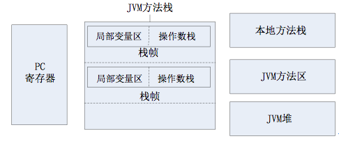

- 程序计数器 
- ava虚拟机栈 
- 本地方法栈 
- 堆 
- 方法区

下面对这五个区域展开深入的介绍。 

## 程序计数器


### 什么是程序计数器？

程序计数器是一块较小的内存空间，可以把它看作当前线程正在执行的字节码的行号指示器。也就是说，程序计数器里面记录的是当前线程正在执行的那一条字节码指令的地址。

注：但是，如果当前线程正在执行的是一个本地方法，那么此时程序计数器为空。 

### 程序计数器的作用

程序计数器有两个作用：字节码解释器通过改变程序计数器来依次读取指令，从而实现代码的流程控制，如：顺序执行、选择、循环、异常处理。

在多线程的情况下，程序计数器用于记录当前线程执行的位置，从而当线程被切换回来的时候能够知道该线程上次运行到哪儿了。 

### 程序计数器的特点

- 是一块较小的存储空间。
- 线程私有。每条线程都有一个程序计数器。
- 是唯一一个不会出现OutOfMemoryError的内存区域。
- 生命周期随着线程的创建而创建，随着线程的结束而死亡。 

## Java虚拟机栈(JVM Stack)

### 什么是Java虚拟机栈？

Java虚拟机栈是描述Java方法运行过程的内存模型。

Java虚拟机栈会为每一个即将运行的Java方法创建一块叫做“栈帧”的区域，这块区域用于存储该方法在运行过程中所需要的一些信息，这些信息包括：

- 局部变量表
- 存放基本数据类型变量、引用类型的变量、returnAddress类型的变量。
- 操作数栈
- 动态链接
- 方法出口信息

当一个方法即将被运行时，Java虚拟机栈首先会在Java虚拟机栈中为该方法创建一块“栈帧”，栈帧中包含局部变量表、操作数栈、动态链接、方法出口信息等。当方法在运行过程中需要创建局部变量时，就将局部变量的值存入栈帧的局部变量表中。

当这个方法执行完毕后，这个方法所对应的栈帧将会出栈，并释放内存空间。

注意：人们常说，Java的内存空间分为“栈”和“堆”，栈中存放局部变量，堆中存放对象。

这句话不完全正确！这里的“堆”可以这么理解，但这里的“栈”只代表了Java虚拟机栈中的局部变量表部分。真正的Java虚拟机栈是由一个个栈帧组成，而每个栈帧中都拥有：局部变量表、操作数栈、动态链接、方法出口信息。 

### Java虚拟机栈的特点

局部变量表的创建是在方法被执行的时候，随着栈帧的创建而创建。而且，局部变量表的大小在编译时期就确定下来了，在创建的时候只需分配事先规定好的大小即可。此外，在方法运行的过程中局部变量表的大小是不会发生改变的。

Java虚拟机栈会出现两种异常：StackOverFlowError和OutOfMemoryError。

a) StackOverFlowError：

若Java虚拟机栈的内存大小不允许动态扩展，那么当线程请求栈的深度超过当前Java虚拟机栈的最大深度的时候，就抛出StackOverFlowError异常。

b) OutOfMemoryError：

若Java虚拟机栈的内存大小允许动态扩展，且当线程请求栈时内存用完了，无法再动态扩展了，此时抛出OutOfMemoryError异常。

Java虚拟机栈也是线程私有的，每个线程都有各自的Java虚拟机栈，而且随着线程的创建而创建，随着线程的死亡而死亡。

注：StackOverFlowError和OutOfMemoryError的异同？

StackOverFlowError表示当前线程申请的栈超过了事先定好的栈的最大深度，但内存空间可能还有很多。

而OutOfMemoryError是指当线程申请栈时发现栈已经满了，而且内存也全都用光了。 

## 本地方法栈

### 什么是本地方法栈？

本地方法栈和Java虚拟机栈实现的功能类似，只不过本地方法区是本地方法运行的内存模型。

本地方法被执行的时候，在本地方法栈也会创建一个栈帧，用于存放该本地方法的局部变量表、操作数栈、动态链接、出口信息。

方法执行完毕后相应的栈帧也会出栈并释放内存空间。

也会抛出StackOverFlowError和OutOfMemoryError异常。

## 堆

### 什么是堆？

堆是用来存放对象的内存空间。几乎所有的对象都存储在堆中。 

### 堆的特点

- 线程共享
- 整个Java虚拟机只有一个堆，所有的线程都访问同一个堆。而程序计数器、Java虚拟机栈、本地方法栈都是一个线程对应一个的。
- 在虚拟机启动时创建
- 垃圾回收的主要场所。
- 可以进一步细分为：新生代、老年代。
- 新生代又可被分为：Eden、From Survior、To Survior。

不同的区域存放具有不同生命周期的对象。这样可以根据不同的区域使用不同的垃圾回收算法，从而更具有针对性，从而更高效。

堆的大小既可以固定也可以扩展，但主流的虚拟机堆的大小是可扩展的，因此当线程请求分配内存，但堆已满，且内存已满无法再扩展时，就抛出OutOfMemoryError。 

## 方法区

### 什么是方法区？

Java虚拟机规范中定义方法区是堆的一个逻辑部分。

方法区中存放已经被虚拟机加载的类信息、常量、静态变量、即时编译器编译后的代码等。 

### 方法区的特点

- 线程共享
- 方法区是堆的一个逻辑部分，因此和堆一样，都是线程共享的。整个虚拟机中只有一个方法区。

永久代

方法区中的信息一般需要长期存在，而且它又是堆的逻辑分区，因此用堆的划分方法，我们把方法区称为老年代。

内存回收效率低

方法区中的信息一般需要长期存在，回收一遍内存之后可能只有少量信息无效。

对方法区的内存回收的主要目标是：对常量池的回收 和 对类型的卸载。

Java虚拟机规范对方法区的要求比较宽松。

和堆一样，允许固定大小，也允许可扩展的大小，还允许不实现垃圾回收。 

### 什么是运行时常量池？

方法区中存放三种数据：类信息、常量、静态变量、即时编译器编译后的代码。其中常量存储在运行时常量池中。

我们一般在一个类中通过public static final来声明一个常量。这个类被编译后便生成Class文件，这个类的所有信息都存储在这个class文件中。

当这个类被Java虚拟机加载后，class文件中的常量就存放在方法区的运行时常量池中。而且在运行期间，可以向常量池中添加新的常量。如：String类的intern()方法就能在运行期间向常量池中添加字符串常量。

当运行时常量池中的某些常量没有被对象引用，同时也没有被变量引用，那么就需要垃圾收集器回收。 

## 直接内存

直接内存是除Java虚拟机之外的内存，但也有可能被Java使用。

在NIO中引入了一种基于通道和缓冲的IO方式。它可以通过调用本地方法直接分配Java虚拟机之外的内存，然后通过一个存储在Java堆中的DirectByteBuffer对象直接操作该内存，而无需先将外面内存中的数据复制到堆中再操作，从而提升了数据操作的效率。

直接内存的大小不受Java虚拟机控制，但既然是内存，当内存不足时就会抛出OOM异常。 

综上所述

Java虚拟机的内存模型中一共有两个“栈”，分别是：Java虚拟机栈和本地方法栈。

两个“栈”的功能类似，都是方法运行过程的内存模型。并且两个“栈”内部构造相同，都是线程私有。

只不过Java虚拟机栈描述的是Java方法运行过程的内存模型，而本地方法栈是描述Java本地方法运行过程的内存模型。

Java虚拟机的内存模型中一共有两个“堆”，一个是原本的堆，一个是方法区。方法区本质上是属于堆的一个逻辑部分。堆中存放对象，方法区中存放类信息、常量、静态变量、即时编译器编译的代码。

堆是Java虚拟机中最大的一块内存区域，也是垃圾收集器主要的工作区域。

程序计数器、Java虚拟机栈、本地方法栈是线程私有的，即每个线程都拥有各自的程序计数器、Java虚拟机栈、本地方法区。并且他们的生命周期和所属的线程一样。

而堆、方法区是线程共享的，在Java虚拟机中只有一个堆、一个方法栈。并在JVM启动的时候就创建，JVM停止才销毁。

JVM内存模型总体[架构](http://lib.csdn.net/base/architecture)图

> Run-Time Data Areas
>
> The [Java ](http://lib.csdn.net/base/java)Virtual Machine defines various run-time data areas that are used during execution of a program. Some of these data areas are created on [java ](http://lib.csdn.net/base/java)Virtual Machine start-up and are destroyed only when the [Java](http://lib.csdn.net/base/java) Virtual Machine exits. Other data areas are per thread. Per-thread data areas are created when a thread is created and destroyed when the thread exits.

JVM定义了不同运行时数据区，他们是用来执行应用程序的。某些区域随着JVM启动及销毁，另外一些区域的数据是线程性独立的，随着线程创建和销毁。

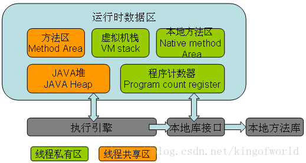

程序计数器（The Program Counter Register）多线程时，当线程数超过CPU数量或CPU内核数量，线程之间就要根据时间片轮询抢夺CPU时间资源。因此每个线程有要有一个独立的程序计数器，记录下一条要运行的指令。线程私有的内存区域。如果执行的是JAVA方法，计数器记录正在执行的java字节码地址，如果执行的是native方法，则计数器为空。

> If that method is not native, the pc register contains the address of the Java Virtual Machine instruction currently being executed. If the method currently being executed by the thread is native, the value of the Java Virtual Machine's pc register is undefined. The Java Virtual Machine's pc register is wide enough to hold a returnAddress or a native pointer on the specific platform.

虚拟机栈 (Java Virtual Machine Stacks)线程私有的，与线程在同一时间创建。管理JAVA方法执行的内存模型。每个方法执行时都会创建一个桢栈来存储方法的私有变量、操作数栈、动态链接方法、返回值、返回地址等信息。栈的大小决定了方法调用的可达深度（递归多少层次，或嵌套调用多少层其他方法，-Xss参数可以设置虚拟机栈大小）。栈的大小可以是固定的，或者是动态扩展的。如果栈的深度是固定的，请求的栈深度大于最大可用深度，则抛出stackOverflowError；如果栈是可动态扩展的，但没有内存空间支持扩展，则抛出OutofMemoryError。

> The following exceptional conditions are associated with Java Virtual Machine stacks:If the computation in a thread requires a larger Java Virtual Machine stack than is permitted, the Java Virtual Machine throws aStackOverflowError.If Java Virtual Machine stacks can be dynamically expanded, and expansion is attempted but insufficient memory can be made available to effect the expansion, or if insufficient memory can be made available to create the initial Java Virtual Machine stack for a new thread, the Java Virtual Machine throws an OutOfMemoryError.

放在栈中的运算是比java堆速度快，所以尽量使用方法内的局部变量运算速度会比较快。使用jclasslib工具可以查看class类文件的结构。下图为栈帧结构图：

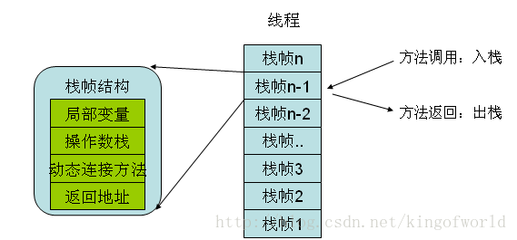

本地方法区(Native Method Stacks)和虚拟机栈功能相似，但管理的不是JAVA方法，是本地方法，本地方法是用C实现的。

JAVA堆（JVM heap）线程共享的，存放所有对象实例和数组。垃圾回收的主要区域。可以分为新生代和老年代(tenured)。新生代用于存放刚创建的对象以及年轻的对象，如果对象一直没有被回收，生存得足够长，老年对象就会被移入老年代。新生代又可进一步细分为eden、survivorSpace0(s0,from space)、survivorSpace1(s1,to space)。刚创建的对象都放入eden,s0和s1都至少经过一次GC并幸存。如果幸存对象经过一定时间仍存在，则进入老年代(tenured)。

> A Java Virtual Machine implementation may provide the programmer or the user control over the initial size of the heap, as well as, if the heap can be dynamically expanded or contracted, control over the maximum and minimum heap size.The following exceptional condition is associated with the heap:If a computation requires more heap than can be made available by the automatic storage management system, the Java Virtual Machine throws an OutOfMemoryError.

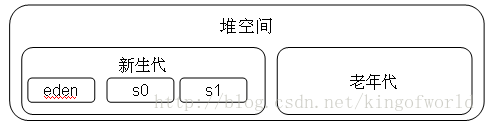

方法区( Method Area) 线程共享的，用于存放被虚拟机加载的类的元数据信息：如常量、静态变量、即时编译器编译后的代码。也成为永久代。如果hotspot虚拟机确定一个类的定义信息不会被使用，也会将其回收。回收的基本条件至少有：所有该类的实例被回收，而且装载该类的ClassLoader被回收

## 垃圾回收算法

标记-清除算法(Mark-Sweep)从根节点开始标记所有可达对象，其余没标记的即为垃圾对象，执行清除。但回收后的空间是不连续的。复制算法(copying)将内存分成两块，每次只使用其中一块，垃圾回收时，将标记的对象拷贝到另外一块中，然后完全清除原来使用的那块内存。复制后的空间是连续的。复制算法适用于新生代，因为垃圾对象多于存活对象，复制算法更高效。在新生代串行垃圾回收算法中，将eden中标记存活的对象拷贝未使用的s1中，s0中的年轻对象也进入s1，如果s1空间已满，则进入老年代；这样交替使用s0和s1。这种改进的复制算法，既保证了空间的连续性，有避免了大量的内存空间浪费。

标记-压缩算法(Mark-compact)适合用于老年代的算法（存活对象多于垃圾对象）。标记后不复制，而是将存活对象压缩到内存的一端，然后清理边界外的所有对象。

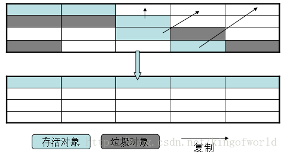

JVM参数：

-XX:+PrintGCDetails  打印垃圾回收信息

-Xms 为Heap区域的初始值，线上环境需要与-Xmx设置为一致，否则capacity的值会来回飘动

-Xmx 为Heap区域的最大值-Xss（或-ss） 线程栈大小（指一个线程的native空间）1.5以后是1M的默认大小

-XX:PermSize与-XX:MaxPermSize  方法区（永久代）的初始大小和最大值（但不是本地方法区）

-XX:NewRatio  老年代与新生代比率

-XX:SurvivorRatio  Eden与Survivor的占用比例。例如8表示，一个survivor区占用 1/8 的Eden内存，即1/10的新生代内存，为什么不是1/9？因为我们的新生代有2个survivor，即S1和S22。所以survivor总共是占用新生代内存的 2/10，Eden与新生代的占比则为 8/10。

-XX:MaxHeapFreeRatio  GC后，如果发现空闲堆内存占到整个预估的比例小于这个值，则减小堆空间。

-XX:MinHeapFreeRatio  GC后，如果发现空闲堆内存占到整个预估的比例大于这个值，则增大堆空间。

-XX:NewSize    新生代大小

JVM定义了若干个程序执行期间使用的数据区域。这个区域里的一些数据在JVM启动的时候创建，在JVM退出的时候销毁。而其他的数据依赖于每一个线程，在线程创建时创建，在线程退出时销毁。

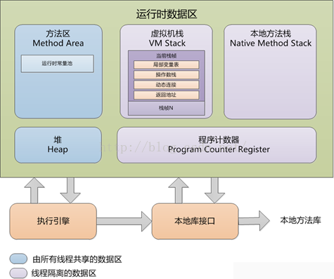

## 程序计数器

程序计数器是一块较小的内存空间，可以看作是当前线程所执行的字节码的行号指示器。分支、循环、跳转、异常处理、线程恢复等基础功能都需要依赖这个计数器来完成。

由于[Java](http://lib.csdn.net/base/java) 虚拟机的多线程是通过线程轮流切换并分配处理器执行时间的方式来实现的，在任何一个确定的时刻，一个处理器（对于多核处理器来说是一个内核）只会执行一条线程中的指令。因此，为了线程切换后能恢复到正确的执行位置，每条线程都需要有一个独立的程序计数器，各条线程之间的计数器互不影响，独立存储，我们称这类内存区域为“线程私有”的内存。

如果线程正在执行的是一个Java 方法，这个计数器记录的是正在执行的虚拟机字节码指令的地址；如果正在执行的是Natvie 方法，这个计数器值则为空（Undefined）。

此内存区域是唯一一个在Java 虚拟机规范中没有规定任何OutOfMemoryError情况的区域。

## 虚拟机栈

线程私有，它的生命周期与线程相同。虚拟机栈描述的是Java 方法执行的内存模型：每个方法被执行的时候都会同时创建一个栈帧（Stack Frame）用于存储局部变量表、操作栈、动态链接、方法出口等信息。

动画是由一帧一帧图片连续切换结果的结果而产生的，其实虚拟机的运行和动画也类似，每个在虚拟机中运行的程序也是由许多的帧的切换产生的结果，只是这些帧里面存放的是方法的局部变量，操作数栈，动态链接，方法返回地址和一些额外的附加信息组成。每一个方法被调用直至执行完成的过程，就对应着一个栈帧在虚拟机栈中从入栈到出栈的过程。

对于执行引擎来说，活动线程中，只有栈顶的栈帧是有效的，称为当前栈帧，这个栈帧所关联的方法称为当前方法。执行引擎所运行的所有字节码指令都只针对当前栈帧进行操作。

## 局部变量表

局部变量表是一组变量值存储空间，用于存放方法参数和方法内部定义的局部变量。在Java程序被编译成Class文件时，就在方法的Code属性的max_locals数据项中确定了该方法所需要分配的最大局部变量表的容量。

局部变量表的容量以变量槽（Slot）为最小单位，32位虚拟机中一个Slot可以存放一个32位以内的数据类型（boolean、byte、char、short、int、float、reference和returnAddress八种）。

reference类型虚拟机规范没有明确说明它的长度，但一般来说，虚拟机实现至少都应当能从此引用中直接或者间接地查找到对象在Java堆中的起始地址索引和方法区中的对象类型数据。

returnAddress类型是为字节码指令jsr、jsr_w和ret服务的，它指向了一条字节码指令的地址。

虚拟机是使用局部变量表完成参数值到参数变量列表的传递过程的，如果是实例方法（非static），那么局部变量表的第0位索引的Slot默认是用于传递方法所属对象实例的引用，在方法中通过this访问。

 Slot是可以重用的，当Slot中的变量超出了作用域，那么下一次分配Slot的时候，将会覆盖原来的数据。Slot对对象的引用会影响GC（要是被引用，将不会被回收）。

系统不会为局部变量赋予初始值（实例变量和类变量都会被赋予初始值）。也就是说不存在类变量那样的准备阶段。
操作数栈

和局部变量区一样，操作数栈也是被组织成一个以字长为单位的数组。但是和前者不同的是，它不是通过索引来访问，而是通过标准的栈操作——压栈和出栈—来访问的。比如，如果某个指令把一个值压入到操作数栈中，稍后另一个指令就可以弹出这个值来使用。

虚拟机在操作数栈中存储数据的方式和在局部变量区中是一样的：如int、long、float、double、reference和returnType的存储。对于byte、short以及char类型的值在压入到操作数栈之前，也会被转换为int。

虚拟机把操作数栈作为它的工作区——大多数指令都要从这里弹出数据，执行运算，然后把结果压回操作数栈。比如，iadd指令就要从操作数栈中弹出两个整数，执行加法运算，其结果又压回到操作数栈中，看看下面的示例，它演示了虚拟机是如何把两个int类型的局部变量相加，再把结果保存到第三个局部变量的：
```
begin
iload_0    // push the int in local variable 0 ontothe stack
iload_1    //push the int in local variable 1 onto the stack
iadd       // pop two ints, add them, push result
istore_2   // pop int, store into local variable 2
end  
```
在这个字节码序列里，前两个指令iload_0和iload_1将存储在局部变量中索引为0和1的整数压入操作数栈中，其后iadd指令从操作数栈中弹出那两个整数相加，再将结果压入操作数栈。第四条指令istore_2则从操作数栈中弹出结果，并把它存储到局部变量区索引为2的位置。下图详细表述了这个过程中局部变量和操作数栈的状态变化，图中没有使用的局部变量区和操作数栈区域以空白表示。

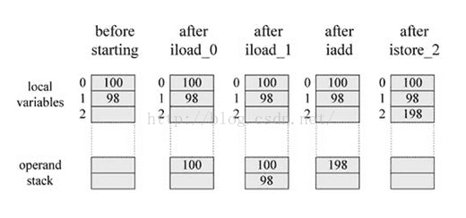

## 动态连接

虚拟机运行的时候,运行时常量池会保存大量的符号引用，这些符号引用可以看成是每个方法的间接引用。如果代表栈帧A的方法想调用代表栈帧B的方法，那么这个虚拟机的方法调用指令就会以B方法的符号引用作为参数，但是因为符号引用并不是直接指向代表B方法的内存位置，所以在调用之前还必须要将符号引用转换为直接引用，然后通过直接引用才可以访问到真正的方法。

如果符号引用是在类加载阶段或者第一次使用的时候转化为直接应用，那么这种转换成为静态解析，如果是在运行期间转换为直接引用，那么这种转换就成为动态连接。

## 返回地址

方法的返回分为两种情况，一种是正常退出，退出后会根据方法的定义来决定是否要传返回值给上层的调用者，一种是异常导致的方法结束，这种情况是不会传返回值给上层的调用方法。

不过无论是那种方式的方法结束，在退出当前方法时都会跳转到当前方法被调用的位置，如果方法是正常退出的，则调用者的PC计数器的值就可以作为返回地址,，果是因为异常退出的，则是需要通过异常处理表来确定。

方法的的一次调用就对应着栈帧在虚拟机栈中的一次入栈出栈操作，因此方法退出时可能做的事情包括：恢复上层方法的局部变量表以及操作数栈，如果有返回值的话，就把返回值压入到调用者栈帧的操作数栈中，还会把PC计数器的值调整为方法调用入口的下一条指令。

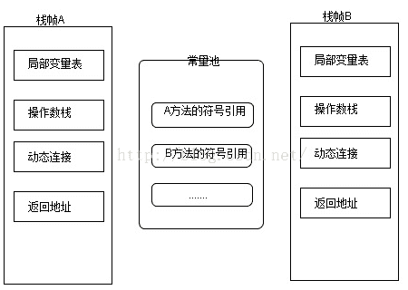

## 异常

在Java 虚拟机规范中，对虚拟机栈规定了两种异常状况：如果线程请求的栈深度大于虚拟机所允许的深度，将抛出StackOverflowError 异常；如果虚拟机栈可以动态扩展（当前大部分的Java虚拟机都可动态扩展，只不过Java虚拟机规范中也允许固定长度的虚拟机栈），当扩展时无法申请到足够的内存时会抛出OutOfMemoryError 异常。

## 本地方法栈

本地方法栈（Native MethodStacks）与虚拟机栈所发挥的作用是非常相似的，其区别不过是虚拟机栈为虚拟机执行Java方法（也就是字节码）服务，而本地方法栈则是为虚拟机使用到的Native 方法服务。虚拟机规范中对本地方法栈中的方法使用的语言、使用方式与[数据结构](http://lib.csdn.net/base/datastructure)并没有强制规定，因此具体的虚拟机可以自由实现它。甚至有的虚拟机（譬如Sun HotSpot 虚拟机）直接就把本地方法栈和虚拟机栈合二为一。

与虚拟机栈一样，本地方法栈区域也会抛出StackOverflowError和OutOfMemoryError异常。

## 堆

堆是Java 虚拟机所管理的内存中最大的一块。Java 堆是被所有线程共享的一块内存区域，在虚拟机启动时创建。此内存区域的唯一目的就是存放对象实例，几乎所有的对象实例都在这里分配内存。但是随着JIT 编译器的发展与逃逸分析技术的逐渐成熟，栈上分配、标量替换优化技术将会导致一些微妙的变化发生，所有的对象都分配在堆上也渐渐变得不是那么“绝对”了。

堆是垃圾收集器管理的主要区域，因此很多时候也被称做“GC 堆”。

堆的大小可以通过-Xms(最小值)和-Xmx(最大值)参数设置，-Xms为JVM启动时申请的最小内存，默认为[操作系统](http://lib.csdn.net/base/operatingsystem)物理内存的1/64但小于1G，-Xmx为JVM可申请的最大内存，默认为物理内存的1/4但小于1G，默认当空余堆内存小于40%时，JVM会增大Heap到-Xmx指定的大小，可通过-XX:MinHeapFreeRation=来指定这个比列；当空余堆内存大于70%时，JVM会减小heap的大小到-Xms指定的大小，可通过XX:MaxHeapFreeRation=来指定这个比列，对于运行系统，为避免在运行时频繁调整Heap的大小，通常-Xms与-Xmx的值设成一样。

如果从内存回收的角度看，由于现在收集器基本都是采用的分代收集[算法](http://lib.csdn.net/base/datastructure)，所以Java 堆中还可以细分为：新生代和老年代；

新生代：程序新创建的对象都是从新生代分配内存，新生代由Eden Space和两块相同大小的Survivor Space(通常又称S0和S1或From和To)构成，可通过-Xmn参数来指定新生代的大小，也可以通过-XX:SurvivorRation来调整Eden Space及SurvivorSpace的大小。

老年代：用于存放经过多次新生代GC仍然存活的对象，例如缓存对象，新建的对象也有可能直接进入老年代，主要有两种情况：1、大对象，可通过启动参数设置-XX:PretenureSizeThreshold=1024(单位为字节，默认为0)来代表超过多大时就不在新生代分配，而是直接在老年代分配。2、大的数组对象，且数组中无引用外部对象。
老年代所占的内存大小为-Xmx对应的值减去-Xmn对应的值。

如果在堆中没有内存完成实例分配，并且堆也无法再扩展时，将会抛出OutOfMemoryError 异常。

## 方法区

方法区在一个jvm实例的内部，类型信息被存储在一个称为方法区的内存逻辑区中。类型信息是由类加载器在类加载时从类文件中提取出来的。类(静态)变量也存储在方法区中。

简单说方法区用来存储类型的元数据信息，一个.class文件是类被java虚拟机使用之前的表现形式，一旦这个类要被使用，java虚拟机就会对其进行装载、连接（验证、准备、解析）和初始化。而装载（后的结果就是由.class文件转变为方法区中的一段特定的数据结构。这个数据结构会存储如下信息：

- 类型信息
    - 这个类型的全限定名
    - 这个类型的直接超类的全限定名
    - 这个类型是类类型还是接口类型
    - 这个类型的访问修饰符
    - 任何直接超接口的全限定名的有序列表
- 字段信息
    - 字段名
    - 字段类型
    - 字段的修饰符
- 方法信息
    - 方法名
    - 方法返回类型
    - 方法参数的数量和类型（按照顺序）
    - 方法的修饰符
- 其他信息
    - 除了常量以外的所有类（静态）变量
    - 一个指向ClassLoader的指针
    - 一个指向Class对象的指针
    - 常量池（常量数据以及对其他类型的符号引用）

JVM为每个已加载的类型都维护一个常量池。常量池就是这个类型用到的常量的一个有序集合，包括实际的常量(string,integer,和floating point常量)和对类型，域和方法的符号引用。池中的数据项象数组项一样，是通过索引访问的。

每个类的这些元数据，无论是在构建这个类的实例还是调用这个类某个对象的方法，都会访问方法区的这些元数据。

构建一个对象时，JVM会在堆中给对象分配空间，这些空间用来存储当前对象实例属性以及其父类的实例属性（而这些属性信息都是从方法区获得），注意，这里并不是仅仅为当前对象的实例属性分配空间，还需要给父类的实例属性分配，到此其实我们就可以回答第一个问题了，即实例化父类的某个子类时，JVM也会同时构建父类的一个对象。从另外一个角度也可以印证这个问题：调用当前类的构造方法时，首先会调用其父类的构造方法直到Object，而构造方法的调用意味着实例的创建，所以子类实例化时，父类肯定也会被实例化。

类变量被类的所有实例共享，即使没有类实例时你也可以访问它。这些变量只与类相关，所以在方法区中，它们成为类数据在逻辑上的一部分。在JVM使用一个类之前，它必须在方法区中为每个non-final类变量分配空间。

方法区主要有以下几个特点：

1、方法区是线程安全的。由于所有的线程都共享方法区，所以，方法区里的数据访问必须被设计成线程安全的。例如，假如同时有两个线程都企图访问方法区中的同一个类，而这个类还没有被装入JVM，那么只允许一个线程去装载它，而其它线程必须等待

2、方法区的大小不必是固定的，JVM可根据应用需要动态调整。同时，方法区也不一定是连续的，方法区可以在一个堆(甚至是JVM自己的堆)中自由分配。

3、方法区也可被垃圾收集，当某个类不在被使用(不可触及)时，JVM将卸载这个类，进行垃圾收集

可以通过-XX:PermSize 和 -XX:MaxPermSize 参数限制方法区的大小。

对于习惯在HotSpot 虚拟机上开发和部署程序的开发者来说，很多人愿意把方法区称为“永久代”（PermanentGeneration），本质上两者并不等价，仅仅是因为HotSpot 虚拟机的设计团队选择把GC 分代收集扩展至方法区，或者说使用永久代来实现方法区而已。对于其他虚拟机（如BEA JRockit、IBM J9 等）来说是不存在永久代的概念的。

相对而言，垃圾收集行为在这个区域是比较少出现的，但并非数据进入了方法区就如永久代的名字一样“永久”存在了。这个区域的内存回收目标主要是针对常量池的回收和对类型的卸载。

当方法区无法满足内存分配需求时，将抛出OutOfMemoryError异常。

总结

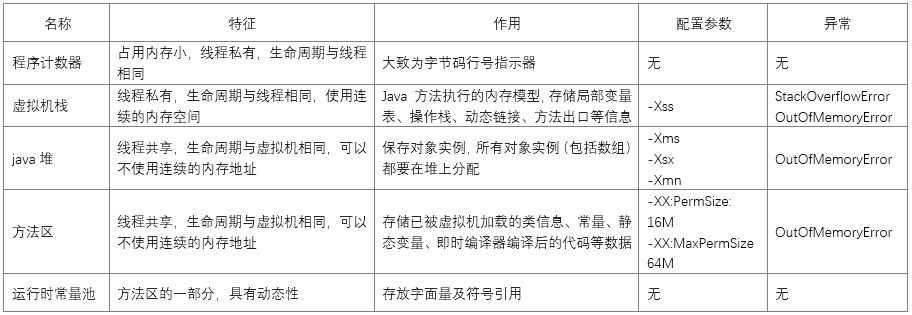

## 直接内存

直接内存（Direct Memory）并不是虚拟机运行时数据区的一部分，也不是Java虚拟机规范中定义的内存区域，但是这部分内存也被频繁地使用，而且也可能导致OutOfMemoryError 异常出现，所以我们放到这里一起讲解。

在JDK 1.4 中新加入了NIO（NewInput/Output）类，引入了一种基于通道（Channel）与缓冲区（Buffer）的I/O 方式，它可以使用Native 函数库直接分配堆外内存，然后通过一个存储在Java 堆里面的DirectByteBuffer 对象作为这块内存的引用进行操作。这样能在一些场景中显著提高性能，因为避免了在Java 堆和Native 堆中来回复制数据。

## 堆与栈的对比

经常有人把Java 内存区分为堆内存（Heap）和栈内存（Stack），这种分法比较粗糙，Java内存区域的划分实际上远比这复杂。这种划分方式的流行只能说明大多数程序员最关注的、与对象内存分配关系最密切的内存区域是这两块。

堆很灵活，但是不安全。对于对象，我们要动态地创建、销毁，不能说后创建的对象没有销毁，先前创建的对象就不能销毁，那样的话我们的程序就寸步难行，所以Java中用堆来存储对象。而一旦堆中的对象被销毁，我们继续引用这个对象的话，就会出现著名的 NullPointerException，这就是堆的缺点——错误的引用逻辑只有在运行时才会被发现。

栈不灵活，但是很严格，是安全的，易于管理。因为只要上面的引用没有销毁，下面引用就一定还在，在大部分程序中，都是先定义的变量、引用先进栈，后定义的后进栈，同时，区块内部的变量、引用在进入区块时压栈，区块结束时出栈，理解了这种机制，我们就可以很方便地理解各种编程语言的作用域的概念了，同时这也是栈的优点——错误的引用逻辑在编译时就可以被发现。

栈--主要存放引用和基本数据类型。
堆--用来存放 new 出来的对象实例。

## 内存溢出和内存泄漏

内存溢出 out of memory，是指程序在申请内存时，没有足够的内存空间供其使用，出现out of memory；比如申请了一个integer，但给它存了long才能存下的数，那就是内存溢出。

内存泄露 memory leak，是指程序在申请内存后，无法释放已申请的内存空间，一次内存泄露危害可以忽略，但内存泄露堆积后果很严重，无论多少内存,迟早会被占光。

memory leak会最终会导致out ofmemory。

Java 堆内存的OutOfMemoryError异常是实际应用中最常见的内存溢出异常情况。出现Java 堆内存溢出时，异常堆栈信息“java.lang.OutOfMemoryError”会跟着进一步提示“[Java ](http://lib.csdn.net/base/java)heapspace”。

要解决这个区域的异常，一般的手段是首先通过内存映像分析工具（如Eclipse Memory Analyzer）对dump 出来的堆转储快照进行分析，重点是确认内存中的对象是否是必要的，也就是要先分清楚到底是出现了内存泄漏（Memory Leak）还是内存溢出（Memory Overflow）。

如果是内存泄漏，可进一步通过工具查看泄漏对象到GC Roots 的引用链。于是就能找到泄漏对象是通过怎样的路径与GC Roots 相关联并导致垃圾收集器无法自动回收它们的。掌握了泄漏对象的类型信息，以及GC Roots 引用链的信息，就可以比较准确地定位出泄漏代码的位置。

如果不存在泄漏，换句话说就是内存中的对象确实都还必须存活着，那就应当检查虚拟机的堆参数（-Xmx 与-Xms），与机器物理内存对比看是否还可以调大，从代码上检查是否存在某些对象生命周期过长、持有状态时间过长的情况，尝试减少程序运行期的内存消耗。

内存分配过程

1. JVM 会试图为相关Java对象在Eden Space中初始化一块内存区域。
2. 当Eden空间足够时，内存申请结束；否则到下一步。
3. JVM 试图释放在Eden中所有不活跃的对象（这属于1或更高级的垃圾回收）。释放后若Eden空间仍然不足以放入新对象，则试图将部分Eden中活跃对象放入Survivor区。
4. Survivor区被用来作为Eden及Old的中间交换区域，当Old区空间足够时，Survivor区的对象会被移到Old区，否则会被保留在Survivor区。
5. 当Old区空间不够时，JVM 会在Old区进行完全的垃圾收集（0级）。
6. 完全垃圾收集后，若Survivor及Old区仍然无法存放从Eden复制过来的部分对象，导致JVM无法在Eden区为新对象创建内存区域，则出现“outofmemory”错误。

## 对象访问

对象访问在Java 语言中无处不在，是最普通的程序行为，但即使是最简单的访问，也会却涉及Java 栈、Java 堆、方法区这三个最重要内存区域之间的关联关系，如下面的这句代码：

```java
Object obj = newObject();
```

假设这句代码出现在方法体中，那“Object obj”这部分的语义将会反映到Java 栈的本地变量表中，作为一个reference 类型数据出现。而“new Object()”这部分的语义将会反映到Java 堆中，形成一块存储了Object 类型所有实例数据值（Instance Data，对象中各个实例字段的数据）的结构化内存，根据具体类型以及虚拟机实现的对象内存布局（Object Memory Layout）的不同，这块内存的长度是不固定的。另外，在Java 堆中还必须包含能查找到此对象类型数据（如对象类型、父类、实现的接口、方法等）的地址信息，这些类型数据则存储在方法区中。

由于reference 类型在Java 虚拟机规范里面只规定了一个指向对象的引用，并没有定义这个引用应该通过哪种方式去定位，以及访问到Java 堆中的对象的具体位置，因此不同虚拟机实现的对象访问方式会有所不同，主流的访问方式有两种：使用句柄和直接指针。

如果使用句柄访问方式，Java 堆中将会划分出一块内存来作为句柄池，reference中存储的就是对象的句柄地址，而句柄中包含了对象实例数据和类型数据各自的具体地址信息。

学过C语言的朋友都知道C编译器在划分内存区域的时候经常将管理的区域划分为数据段和代码段，数据段包括堆、栈以及静态数据区。那么在Java语言当中，内存又是如何划分的呢？

由于Java程序是交由JVM执行的，所以我们在谈Java内存区域划分的时候事实上是指JVM内存区域划分。在讨论JVM内存区域划分之前，先来看一下Java程序具体执行的过程：

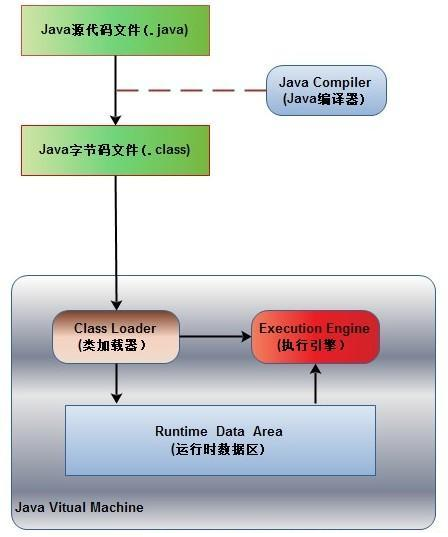

如上图所示，首先Java源代码文件(.java后缀)会被Java编译器编译为字节码文件(.class后缀)，然后由JVM中的类加载器加载各个类的字节码文件，加载完毕之后，交由JVM执行引擎执行。在整个程序执行过程中，JVM会用一段空间来存储程序执行期间需要用到的数据和相关信息，这段空间一般被称作为Runtime Data Area（运行时数据区），也就是我们常说的JVM内存。因此，在Java中我们常常说到的内存管理就是针对这段空间进行管理（如何分配和回收内存空间）。

在知道了JVM内存是什么东西之后，下面我们就来讨论一下这段空间具体是如何划分区域的，是不是也像C语言中一样也存在栈和堆呢？

## 运行时数据区包括哪几部分？

根据《Java虚拟机规范》的规定，运行时数据区通常包括这几个部分：程序计数器(Program Counter Register)、Java栈(VM Stack)、本地方法栈(Native Method Stack)、方法区(Method Area)、堆(Heap)。

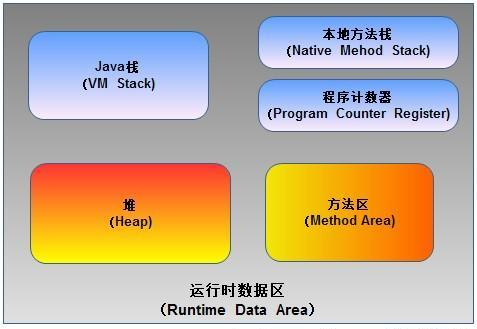

如上图所示，JVM中的运行时数据区应该包括这些部分。在JVM规范中虽然规定了程序在执行期间运行时数据区应该包括这几部分，但是至于具体如何实现并没有做出规定，不同的虚拟机厂商可以有不同的实现方式。

## 运行时数据区的每部分到底存储了哪些数据？

下面我们来了解一下运行时数据区的每部分具体用来存储程序执行过程中的哪些数据。

### 1. 程序计数器

程序计数器（Program Counter Register），也有称作为PC寄存器。想必学过汇编语言的朋友对程序计数器这个概念并不陌生，在汇编语言中，程序计数器是指CPU中的寄存器，它保存的是程序当前执行的指令的地址（也可以说保存下一条指令的所在存储单元的地址），当CPU需要执行指令时，需要从程序计数器中得到当前需要执行的指令所在存储单元的地址，然后根据得到的地址获取到指令，在得到指令之后，程序计数器便自动加1或者根据转移指针得到下一条指令的地址，如此循环，直至执行完所有的指令。

虽然JVM中的程序计数器并不像汇编语言中的程序计数器一样是物理概念上的CPU寄存器，但是JVM中的程序计数器的功能跟汇编语言中的程序计数器的功能在逻辑上是等同的，也就是说是用来指示 执行哪条指令的。

由于在JVM中，多线程是通过线程轮流切换来获得CPU执行时间的，因此，在任一具体时刻，一个CPU的内核只会执行一条线程中的指令，因此，为了能够使得每个线程都在线程切换后能够恢复在切换之前的程序执行位置，每个线程都需要有自己独立的程序计数器，并且不能互相被干扰，否则就会影响到程序的正常执行次序。因此，可以这么说，程序计数器是每个线程所私有的。

在JVM规范中规定，如果线程执行的是非native方法，则程序计数器中保存的是当前需要执行的指令的地址；如果线程执行的是native方法，则程序计数器中的值是undefined。

由于程序计数器中存储的数据所占空间的大小不会随程序的执行而发生改变，因此，对于程序计数器是不会发生内存溢出现象(OutOfMemory)的。

### 2. Java栈

Java栈也称作虚拟机栈（Java Vitual Machine Stack），也就是我们常常所说的栈，跟C语言的数据段中的栈类似。事实上，Java栈是Java方法执行的内存模型。为什么这么说呢？下面就来解释一下其中的原因。

Java栈中存放的是一个个的栈帧，每个栈帧对应一个被调用的方法，在栈帧中包括局部变量表(Local Variables)、操作数栈(Operand Stack)、指向当前方法所属的类的运行时常量池（运行时常量池的概念在方法区部分会谈到）的引用(Reference to runtime constant pool)、方法返回地址(Return Address)和一些额外的附加信息。当线程执行一个方法时，就会随之创建一个对应的栈帧，并将建立的栈帧压栈。当方法执行完毕之后，便会将栈帧出栈。因此可知，线程当前执行的方法所对应的栈帧必定位于Java栈的顶部。讲到这里，大家就应该会明白为什么 在 使用 递归方法的时候容易导致栈内存溢出的现象了以及为什么栈区的空间不用程序员去管理了（当然在Java中，程序员基本不用关系到内存分配和释放的事情，因为Java有自己的垃圾回收机制），这部分空间的分配和释放都是由系统自动实施的。对于所有的程序设计语言来说，栈这部分空间对程序员来说是不透明的。下图表示了一个Java栈的模型：

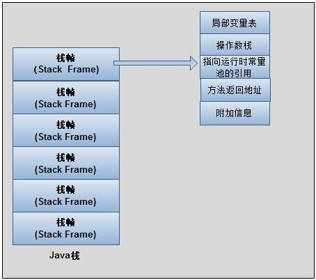

局部变量表，顾名思义，想必不用解释大家应该明白它的作用了吧。就是用来存储方法中的局部变量（包括在方法中声明的非静态变量以及函数形参）。对于基本数据类型的变量，则直接存储它的值，对于引用类型的变量，则存的是指向对象的引用。局部变量表的大小在编译器就可以确定其大小了，因此在程序执行期间局部变量表的大小是不会改变的。

操作数栈，想必学过数据结构中的栈的朋友想必对表达式求值问题不会陌生，栈最典型的一个应用就是用来对表达式求值。想想一个线程执行方法的过程中，实际上就是不断执行语句的过程，而归根到底就是进行计算的过程。因此可以这么说，程序中的所有计算过程都是在借助于操作数栈来完成的。

指向运行时常量池的引用，因为在方法执行的过程中有可能需要用到类中的常量，所以必须要有一个引用指向运行时常量。

方法返回地址，当一个方法执行完毕之后，要返回之前调用它的地方，因此在栈帧中必须保存一个方法返回地址。
由于每个线程正在执行的方法可能不同，因此每个线程都会有一个自己的Java栈，互不干扰。

### 3. 本地方法栈

本地方法栈与Java栈的作用和原理非常相似。区别只不过是Java栈是为执行Java方法服务的，而本地方法栈则是为执行本地方法（Native Method）服务的。在JVM规范中，并没有对本地方发展的具体实现方法以及数据结构作强制规定，虚拟机可以自由实现它。在HotSopt虚拟机中直接就把本地方法栈和Java栈合二为一。

### 4. 堆

在C语言中，堆这部分空间是唯一一个程序员可以管理的内存区域。程序员可以通过malloc函数和free函数在堆上申请和释放空间。那么在Java中是怎么样的呢？

Java中的堆是用来存储对象本身的以及数组（当然，数组引用是存放在Java栈中的）。只不过和C语言中的不同，在Java中，程序员基本不用去关心空间释放的问题，Java的垃圾回收机制会自动进行处理。因此这部分空间也是Java垃圾收集器管理的主要区域。另外，堆是被所有线程共享的，在JVM中只有一个堆。

### 5. 方法区

方法区在JVM中也是一个非常重要的区域，它与堆一样，是被线程共享的区域。在方法区中，存储了每个类的信息（包括类的名称、方法信息、字段信息）、静态变量、常量以及编译器编译后的代码等。
在Class文件中除了类的字段、方法、接口等描述信息外，还有一项信息是常量池，用来存储编译期间生成的字面量和符号引用。

在方法区中有一个非常重要的部分就是运行时常量池，它是每一个类或接口的常量池的运行时表示形式，在类和接口被加载到JVM后，对应的运行时常量池就被创建出来。当然并非Class文件常量池中的内容才能进入运行时常量池，在运行期间也可将新的常量放入运行时常量池中，比如String的intern方法。

在JVM规范中，没有强制要求方法区必须实现垃圾回收。很多人习惯将方法区称为“永久代”，是因为HotSpot虚拟机以永久代来实现方法区，从而JVM的垃圾收集器可以像管理堆区一样管理这部分区域，从而不需要专门为这部分设计垃圾回收机制。不过自从JDK7之后，Hotspot虚拟机便将运行时常量池从永久代移除了。

以上为个人看法和观点，如有不正之处希望谅解并欢迎指正。

## 参考资料

- [深入Java虚拟机之一：Java内存区域与内存溢出](http://blog.csdn.net/ns_code/article/details/17565503)
- [JVM介绍](http://www.cnblogs.com/sunada2005/p/3577799.html)
- 《深入理解Java虚拟机》
- 《Java虚拟机规范 SE7》