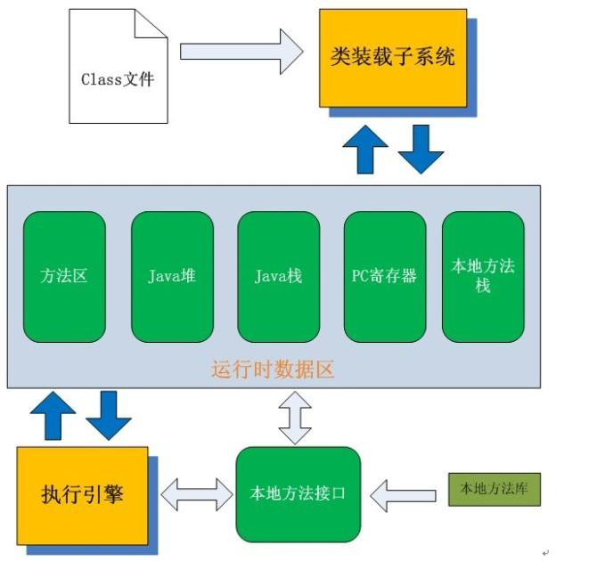
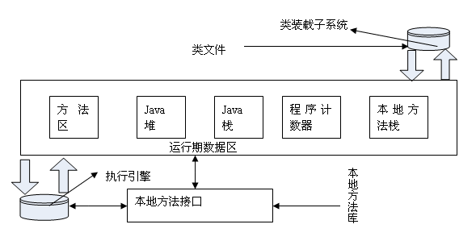
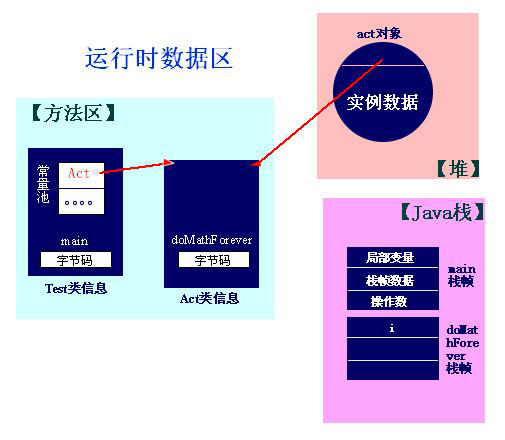
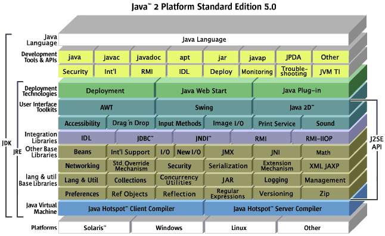

# 1. 详细介绍

## 1.1 JVM -- java virtual machine

JVM就是我们常说的java虚拟机，它是整个java实现跨平台的 最核心的部分，所有的java程序会首先被编译为.class的类文件，这种类文件可 以在虚拟机上执行，也就是说class并不直接与机器的操作系统相对应，而是经过虚拟机间接与操作系统交互，由虚拟机将程序解 释给本地系统执行。

JVM 是 Java 平台的基础，和实际的机器一样，它也有自己的指令集，并且在运行 时操作不同的内存区域。 JVM 通过抽象操作系统和 CPU 结构，提供了一种与平台无关的代码执行方法，即与特殊的实现方 法、主机硬件、主机操作系统无关。但是在一些小的方面， JVM 的实现也是互不相同的，比如垃圾回收 算法，线程调度算法（可能不同 OS 有不同的实现）。 

JVM 的主要工作是解释自己的指令集（即字节码）到 CPU 的指令集或 OS 的系统调用，保护用户免被恶意程序骚扰。 JVM 对上层的 Java 源文件是不关心的，它关注的只是由源文件生成的类文件（ class file ）。类文件的 组成包括 JVM 指令集，符号表以及一些补助信息。

## 1.2 JRE -- java runtime environment

JRE是指java运行环境。光有JVM还不能成class的 执行，因为在解释class的时候JVM需要调用解释所需要的类库lib。 在JDK的安装目 录里你可以找到jre目录，里面有两个文件夹bin和lib,在 这里可以认为bin里的就是jvm，lib中则是jvm工 作所需要的类库，而jvm和 lib和起来就称为jre。所以，在你写完java程序编译成.class之后，你可以把这个.class文件 和jre一起打包发给朋友，这样你的朋友就 可以运行你写程序了。（jre里有运行.class的java.exe）

JRE 是 Sun 公司发布的一个更大的系统，它里面就有一个 JVM 。 JRE 就与具体的 CPU 结构和操作系统有关，我们从 Sun 下载 JRE 的时候就看到了不同的各种版本。同 JVM 一起组成 JRE 的还有一些 API （如 awt ， swing 等）。 JRE 是运行 Java 程序必不可少的。

JRE （ Java Runtime Environment ），是运行 Java 程序必不可少的（除非用其他一些编译环境编译成.exe可执行文件……），JRE的 地位就象一台PC机一样，我们写好的Win32应用程序需要操作系统帮 我们运行，同样的，我们编写的Java程序也必须要JRE才能运行。

JRE里面有一个 JVM ， JRE 与具体的 CPU 结构和操作系统有关，我们从 Sun 下载 JRE 的时候就看到了不同的各种版本，，同 JVM 一起组成 JRE 的还有 一些 API （如 awt ， swing 等）， JRE 是 运行 Java 程序必不可少的.

## 1.3 JDK -- java development kit

JDK是java开发工具包，基本上每个学java的人都会先在机器 上装一个JDK，那他都包含哪几部分呢？让我们看一下JDK的安装目录。在目录下面有 六个文件夹、一个src类库源码压缩包、和其他几个声明文件。其中，真正在运行java时起作用的 是以下四个文件夹：bin、include、lib、 jre。现在我们可以看出这样一个关系，JDK包含JRE，而JRE包 含JVM。

- bin:最主要的是编译器(javac.exe)
- include:java和JVM交互用的头文件
- lib:类库
- jre:java运行环境

注意：这里的bin、lib文件夹和jre里的bin、lib是 不同的，总的来说JDK是用于java程序的开发,而jre则 是只能运行class而没有编译的功能。eclipse、idea等 其他IDE有自己的编译器而不是用JDK bin目录中自带的，所以在安装时你会发现他们只要求你 选中jre路径就ok了。

# 2. 三者联系

Java 喊出的带有标志性的口号“ Write Once ， Run Anywhere （一次编写，到处运行）”，正是建立在 JRE 的基础之上。何以实现？就是在 Java 应用程序和操作系统之间增加了一虚拟层—— JRE 。

程序源代码不是直 接编译、链接成机器代码，而是先转化到字节码（ bytecode ） 这种特殊的中间形式，字节码再转换成机器码或系统调用。前者是传统的编译方法，生成的机器代码就不可避免地跟特殊的操作系统和特殊的机器结构相关。

而 Java 程序的字节码文件可以放到任意装有 JRE 的计算机运行，再由不同 JRE 的将它们转化成相应的机器代码，这就实现了 Java 程序的可移植性。这样程序员也不用去关心程序运行的具体环境，而可以专心编写软件。这种分层抽象、隐藏细节的思想在计算机科学中处处可见，比如机器组织结构的设计、网络协议的实现等。 Pascal 语言的发明者 Niklaus Wirth ，就富有预见性地指出应该有这样一种可移植的语言，其生成的中间代码可以在一台假想的机器（ a hypothetical machine ）上运行。

而 Java 虚拟机（ Java virtual machine 或 JVM ）就是这样的一台机器，它模拟实际处理器的结构，解释字节码。 怎么一会说是 JRE ，一会儿又成了 JVM ，两者是否同物不同名？ 回答是否定的。

JRE的地位就象一台PC机一样，我们写好的Win32应用程序需要操作系统帮 我们运行，同样的，我们编写的Java程序也必须要JRE才能运行。

要运行Applet，在客户端必须安装有 JRE，即“运行时”，容易一点理解，就象所谓的“插件”，要开发JAVA应用程序\Web应用，就必须在服务器端安装相应的 JVM+JDK 了(开发应用 Java web应用 时，客户端不需要安装任何的JVM）

如果你使用JAVA开发应用，就需要安装 JRE+JDK，就是 J2SE
如果在客户端运行Applet，客户端浏览器必须嵌有JAVA JVM，如果没有，就需要安装，即：在客户端创建JRE（运行时，包含JVM），而客户端是不需要做开发的，所以，JDK就没有必要安装 了

不同版本的Applet在不同的JVM下可能无法正常运行,而Microsoft JVM只是Sun JVM的“低版本”，微软在windows xp/2003中干脆将JVM去掉了