# 1. 计算机基础知识

## 1.1 计算机

计算机（Computer）全称：电子计算机，俗称电脑。是一种能够按照程序运行，自动、高速处理海量数据的现代化智能电子设备。由硬件和软件所组成，没有安装任何软件的计算机称为裸机。常见的形式有台式计算机、笔记本计算机、大型计算机等。

计算机的应用已渗透到社会的各个领域，正在改变着人们的工作、学习和生活的方式，推动着社会的发展。

计算机的应用主要在以下几个方面：

### 1.1.1 科学计算

科学计算也称数值计算。计算机最开始是为解决科学研究和工程设计中遇到的大量数学问题的数值计算而研制的计算工具。例如，人造卫星轨迹的计算，房屋抗震强度的计算，火箭、宇宙飞船的研究设计都离不开计算机的精确计算。就连我们每天收听收看的天气预报都离不开计算机的科学计算。 

### 1.1.2 数据处理

在科学研究和工程技术中，会得到大量的原始数据，其中包括大量图片、文字、声音等信息处理就是对数据进行收集、分类、排序、存储、计算、传输、制表等操作。

### 1.1.3 自动控制

自动控制是指通过计算机对某一过程进行自动操作，它不需人工干预，能按人预定的目标和预定的状态进行过程控制。例如，无人驾驶飞机、导弹、人造卫星和宇宙飞船等飞行器的控制，都是靠计算机实现的。

### 1.1.4 计算机辅助设计

计算机辅助设计(Computer Aided Design，简称CAD)是指。借助计算机的帮助，人们可以自动或半自动地完成各类工程设计工作。目前CAD技术已应用于飞机设计、船舶设计、建筑设计、机械设计、大规模集成电路设计等。在京九铁路的勘测设计中，使用计算机辅助设计系统绘制一张图纸仅需几个小时，而过去人工完成同样工作则要一周甚至更长时间。可见采用计算机辅助设计，可缩短设计时间，提高工作效率，节省人力、物力和财力，更重要的是提高了设计质量。

### 1.1.5 人工智能

人工智能(Artificial Intelligence，简称AI)是指计算机模拟人类某些智力行为的理论、技术和应用。例如，用计算机模拟人脑的部分功能进行思维学习、推理、联想和决策，使计算机具有一定“思维能力”。我国已开发成功一些中医专家诊断系统，可以模拟名医给患者诊病开方。 还有就是机器人也是计算机人工智能的典型例子。

### 1.1.6 多媒体应用

随着电子技术特别是通信和计算机技术的发展，人们已经有能力把文本、音频、视频、动画、图形和图像等各种媒体综合起来，构成一种全新的概念—“多媒体”(Multimedia)。比如一些flash广告，网页游戏等。

### 1.1.7 计算机网络

计算机网络是由一些独立的和具备信息交换能力的计算机互联构成，以实现资源共享的系统。如在全国范围内的银行信用卡的使用，火车和飞机票系统的使用等。

##1.2 计算机硬件

计算机硬件（Computer Hardware）是指计算机系统中由电子，机械和光电元件等组成的各种物理装置的总称。这些物理装置按系统结构的要求构成一个有机整体为计算机软件运行提供物质基础。

计算机通常由CPU、主板、内存、电源、主机箱、硬盘、显卡、键盘、鼠标，显示器等多个部件组成。

## 1.3 计算机软件
计算机软件是使用计算机过程中必不可少的东西，计算机软件可以使计算机按照事先预定好的顺序完成特定的功能，计算机软件按照其功能划分为系统软件与应用软件

- 系统软件： DOS(Disk Operating System), Windows, Linux, Unix, Mac, Android, iOS
- 应用软件：office  QQ聊天  YY语言  扫雷

## 1.4 软件开发

- 软件：按照特定顺序组织的计算机数据和指令的集合
- 开发：软件的制作过程
- 软件开发：借助开发工具与计算机语言制作软件

## 1.5 计算机语言

语言：人类进行沟通交流的各种表达符号，方便人与人之间进行沟通与信息交换
计算机语言：

- 人与计算机之间进行信息交流沟通的一种特殊语言
- 计算机语言中也有字符，符号等等
- 常见的计算机语言如C,C++,C#,JAVA

计算机软件都是用各种计算机语言（后面讲）编写的。最底层的叫机器语言，它由一些0和1组成，可以被某种电脑直接理解，但人就很难理解。上面一层叫汇编语言，它只能由某种电脑的汇编器软件翻译成机器语言程序，才能执行。人能够勉强理解汇编语言。人常用的语言是更上一层的高级语言，比如C，C++，C#， Java等。这些语言编写的程序一般都能在多种电脑上运行，但必须先由一个叫作编译器或者是解释器的软件将高级语言程序翻译成特定的机器语言程序。编写计算机软件的人员叫程序设计员、程序员、编程人员。他们当中的高手有时也自称为黑客。 

## 1.6 人机交互方式

软件的出现实现了人与计算机之间更好的交互。

交互方式：

- 图形化界面：这种方式简单直观，使用者易于接受，容易上手操作。
- 命令行方式：需要有一个控制台，输入特定的指令，让计算机完成一些操作。较为麻烦，需要记录住一些命令。

## 1.7 键盘功能键及快捷键介绍

键盘功能键介绍

| 功能键                | 说明               |
| :----------------- | :--------------- |
| Tab                | 制表符              |
| Shift              | 上档转换键，也可以用于中英文转换 |
| Ctrl               | 控制键，通常和其他键结合使用   |
| Alt                | 交替换挡键，更改键，替换键    |
| 空格                 | 空格键，输入空格         |
| ↑ ↓ ← →            | 上下左右方向键          |
| Enter              | 回车键              |
| PrtSc(PrintScrenn) | 屏幕截屏             |

键盘快捷键介绍

| 快捷键      | 说明   |
| :------- | :--- |
| Ctrl + A | 全选   |
| Ctrl + C | 复制   |
| Ctrl + V | 粘贴   |
| Ctrl + X | 剪切   |
| Ctrl + Z | 撤销   |
| Ctrl + S | 保存   |
| Ctrl + F | 搜索   |

## 1.8 常用的DOS命令

打开DOS命令行的方式

- 开始 → 程序 → 附件 → 命令提示符
- 开始 → 运 → cmd → 回车
- win+r → cmd →回车

| dos命令  | 功能描述                      |
| :----- | :------------------------ |
| d:  回车 | 盘符切换                      |
| cd     | 进入指定目录                    |
| cd..   | 退回到上一级目录                  |
| cd\    | 退回到根目录                    |
| md     | 创建文件夹                     |
| rd     | 删除文件夹                     |
| rd+/s  | 删除带内容的文件夹                 |
| dir    | directory，列出当前目录下的文件以及文件夹 |
| del    | 删除文件，删除一堆后缀名一样的文件*.txt    |
| cls    | clear screen，清屏           |
| exit   | 退出                        |

# 2. Java语言概述

在揭开Java语言的神秘面纱之前，先来认识一下什么是计算机语言。

计算机语言（Computer Language）是人与计算机之间通信的语言，它主要由一些指令组成，这些指令包括数字、符号和语法等内容，程序员可以通过这些指令来指挥计算机进行各种工作。计算机语言的种类非常多，总的来说可以分成机器语言、汇编语言、高级语言三大类。计算机所能识别的语言只有机器语言，但通常人们编程时，不采用机器语言，这是因为机器语言都是由二进制的0和1组成的编码，不便于记忆和识别。目前通用的编程语言是汇编语言和高级语言，汇编语言采用了英文缩写的标识符，容易识别和记忆；而高级语言采用接近于人类的自然语言进行编程，进一步简化了程序编写的过程，所以，高级语言目前是绝大多数编程者的选择。

Java是一种高级计算机语言，它是由SUN公司（已被Oracle公司收购）于1995年5月推出的一种可以编写跨平台应用软件、完全面向对象的程序设计语言。Java语言简单易用、安全可靠、主要面向Internet编程，自问世以来，与之相关的技术和应用发展得非常快。在计算机、移动电话、家用电器等领域中，Java技术无处不在。

为了使软件开发人员、服务提供商和设备生产商可以针对特定的市场进行开发，SUN公司将Java划分为三个技术平台，它们分别是JavaSE、JavaEE和JavaME。

Java SE（Java Platform Standard Edition）标准版，是为开发普通桌面和商务应用程序提供的解决方案。JavaSE是三个平台中最核心的部分，JavaEE和JavaME都是从JavaSE的基础上发展而来的，JavaSE平台中包括了Java最核心的类库，如集合、IO、数据库连接以及网络编程等。

Java EE(Java Platform Enterprise Edition) 企业版，是为开发企业级应用程序提供的解决方案。JavaEE可以被看作一个技术平台，该平台用于开发、装配以及部署企业级应用程序，其中主要包括Servlet、JSP 、JavaBean 、JDBC、EJB、Web Service等技术。

Java ME(Java Platform Micro Edition) 小型版，是为开发电子消费产品和嵌入式设备提供的解决方案。JavaME主要用于小型数字电子设备上软件程序的开发。例如，为家用电器增加智能化控制和联网功能，为手机增加新的游戏和通讯录管理功能。此外，Java ME提供了HTTP等高级Internet协议，使移动电话能以Client/Server方式直接访问Internet的全部信息，提供最高效率的无线交流。

## 2.1 Java语言发展史

Java之父-- 詹姆斯·高斯林（James Gosling）


1977年获得了加拿大卡尔加里大学计算机科学学士学位，1983年获得了美国卡内基梅隆大学计算机科学博士学位，毕业后到IBM工作，设计IBM第一代工作站NeWS系统，但不受重视。后来转至Sun公司，1990年，与Patrick，Naughton和Mike Sheridan等人合作“绿色计划”，后来发展一套语言叫做“Oak”，后改名为Java。

## 2.2 Java语言平台版本

- J2SE(Java 2 Platform Standard Edition)标准版

  是为开发普通桌面和商务应用程序提供的解决方案，该技术体系是其他两者的基础，可以完成一些桌面应用程序的开发

- J2ME(Java 2 Platform Micro Edition)小型版

  是为开发电子消费产品和嵌入式设备提供的解决方案

- J2EE(Java 2 Platform Enterprise Edition)企业版

  是为开发企业环境下的应用程序提供的一套解决方案，该技术体系中包含的技术如 Servlet、Jsp等，主要针对于Web应用程序开发

## 2.3 Java语言特点

Java语言是一门优秀的编程语言，它之所以应用广泛，受到大众的欢迎，是因为它有众多突出的特点，其中最主要的特点有以下几个。

- 简单性：解释性

Java语言是一种相对简单的编程语言，它通过提供最基本的方法来完成指定的任务，只需理解一些基本的概念，就可以用它编写出适合于各种情况的应用程序。Java丢弃了C++中很难理解的运算符重载、多重继承等模糊概念。特别是Java语言不使用指针，而是使用引用，并提供了自动的垃圾回收机制，使程序员不必为内存管理而担忧。

- 面向对象：高性能

Java语言提供了类、接口和继承等原语，为了简单起见，只支持类之间的单继承，但支持接口之间的多继承，并支持类与接口之间的实现机制（关键字为implements）。Java语言全面支持动态绑定，而C++语言只对虚函数使用动态绑定。总之，Java语言是一个纯粹的面向对象程序设计语言。

- 分布式处理：多线程

Java语言是支持多线程的。所谓多线程可以简单理解为程序中有多个任务可以并发执行，这样可以在很大程度上提高程序的执行效率。

- 健壮性：动态
- 结构中立：安全性

Java语言不支持指针，一切对内存的访问都必须通过对象的实例变量来实现，从而使应用更安全。

- 开源
- 跨平台

Java语言编写的程序可以运行在各种平台之上，也就是说同一段程序既可以在Windows操作系统上运行，也可以在Linux操作系统上运行。

## 2.4 跨平台性

- 什么是跨平台性？

通过Java语言编写的应用程序在不同的系统平台上都可以运行。

- 原理是什么？

只要在需要运行java应用程序的操作系统上，先安装一个Java虚拟机(JVM Java Virtual Machine)即可。由JVM来负责Java程序在该系统中的运行。


因为有了JVM，所以同一个Java程序在三个不同的操作系统中都可以执行。这样就实现了Java程序的跨平台性。也称为Java具有良好的可移植性。

PS：Java语言是跨平台的，而JVM不是跨平台的。

## 2.5 JDK与JRE

SUN公司提供了一套Java开发环境，简称JDK(Java Development Kit)，它是整个Java的核心，其中包括Java编译器、Java运行工具、Java文档生成工具、Java打包工具等。

为了满足用户日新月异的需求，JDK的版本也在不断地升级。在1995年，Java诞生之初就提供了最早的版本JDK1.0，随后相继推出了JDK1.1、JDK1.2、JDK1.3、JDK1.4、JDK5.0、JDK6.0、JDK7.0、JDK8.0

SUN公司除了提供JDK，还提供了一种JRE(Java Runtime Environment)工具，它是Java运行环境，是提供给普通用户使用的。由于用户只需要运行事先编写好的程序，不需要自己动手编写程序，因此JRE工具中只包含Java运行工具，不包含Java编译工具。值得一提的是，为了方便使用，SUN公司在其JDK工具中自带了一个JRE工具，也就是说开发环境中包含运行环境，这样一来，开发人员只需要在计算机上安装JDK即可，不需要专门安装JRE工具了。

Oracle公司提供了多种操作系统的JDK，每种操作系统的JDK在使用上基本类似，初学者可以根据自己使用的操作系统，从Oracle官方网站下载相应的JDK安装文件。

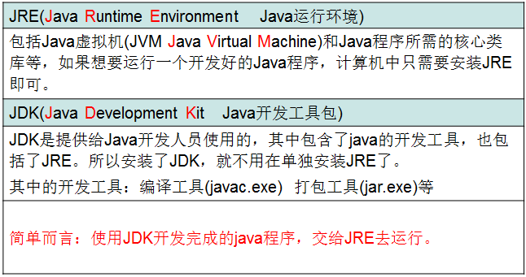

# 3. JDK的下载,安装

通过官方网站获取JDK：http://www.oracle.com
针对不同操作系统，下载不同的JDK版本：识别计算机的操作系统

JDK的下载步骤图1

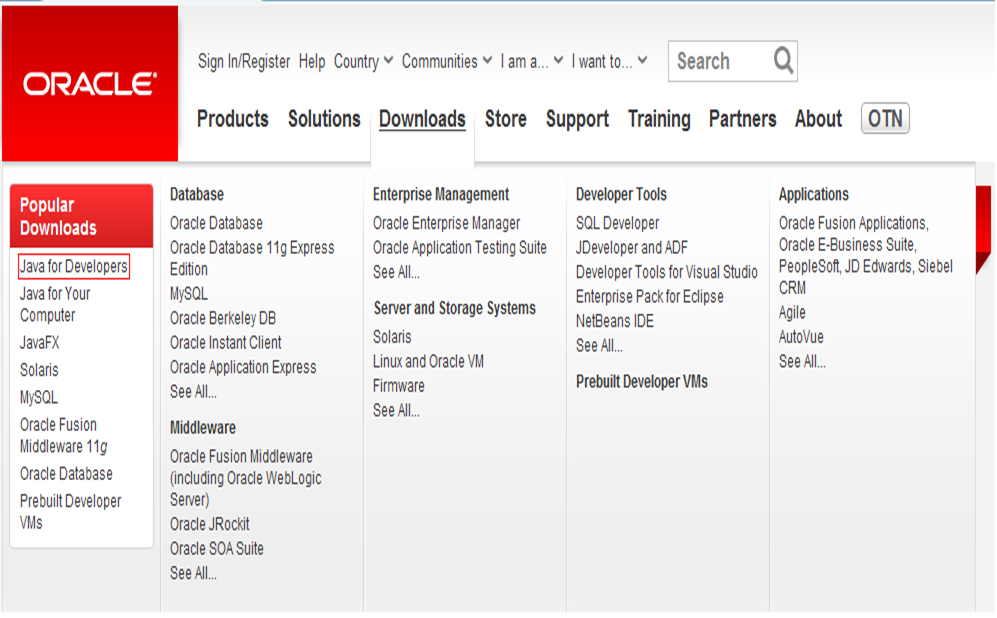

JDK的下载步骤图2

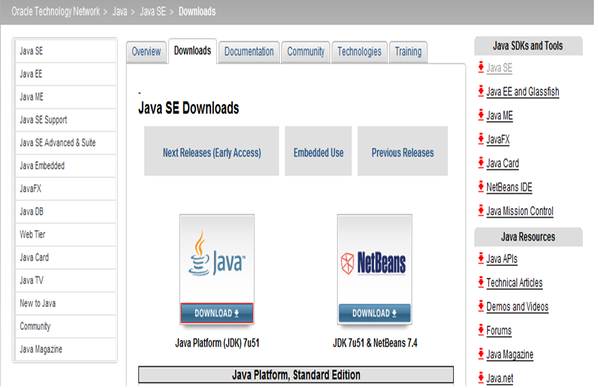

JDK的下载步骤图3

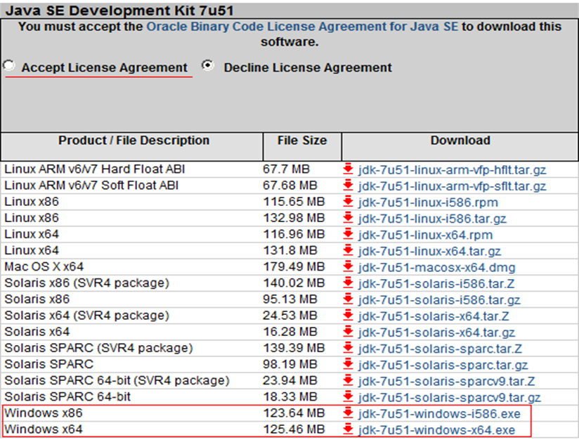

## 3.1 JDK的安装
傻瓜式安装，下一步即可。
建议：安装路径不要有中文或者特殊符号如空格等。最好目录统一。
当提示安装JRE时，可以选择不安装。

为了更好地学习JDK，初学者必须要对JDK安装目录下各个子目录的意义和作用有所了解，接下来分别对JDK安装目录下的子目录进行介绍。

- bin目录：该目录用于存放一些可执行程序，如javac.exe（Java编译器）、java.exe（Java运行工具）、jar.exe（打包工具）和javadoc.exe（文档生成工具）等。
- db目录：db目录是一个小型的数据库。从JDK 6.0开始，Java中引入了一个新的成员JavaDB，这是一个纯 Java 实现、开源的数据库管理系统。这个数据库不仅很轻便，而且支持JDBC 4.0所有的规范，在学习JDBC时，不再需要额外地安装一个数据库软件，选择直接使用JavaDB即可。
- jre目录：“jre”是Java Runtime Environment的缩写，意为Java程序运行时环境。此目录是Java运行时环境的根目录，它包含Java虚拟机，运行时的类包、Java应用启动器以及一个bin目录，但不包含开发环境中的开发工具。
- include目录：由于JDK是通过C和C++实现的，因此在启动时需要引入一些C语言的头文件，该目录就是用于存放这些头文件的。
- lib目录：lib是library的缩写，意为Java类库或库文件，是开发工具使用的归档包文件。
- src.zip文件：src.zip为src文件夹的压缩文件，src中放置的是JDK核心类的源代码，通过该文件可以查看Java基础类的源代码。

值得一提的是，在JDK的bin目录下放着很多可执行程序，其中最重要的就是javac.exe和java.exe，分别如下：

- javac.exe是Java编译器工具，它可以将编写好的Java文件编译成Java字节码文件（可执行的Java程序）。Java源文件的扩展名为.java，如“HelloWorld.java”。编译后生成对应的Java字节码文件，文件的扩展名为.class，如“HelloWorld.class”。
- java.exe是Java运行工具，它会启动一个Java虚拟机（JVM）进程，Java虚拟机相当于一个虚拟的操作系统，它专门负责运行由Java编译器生成的字节码文件（.class文件）。

# 4. HelloWorld案例

## 4.1 开发工具介绍

- 编写Java程序可以使用很多种工具
- notepad(微软操作系统自带)
- Notepad++
- Eclipse
- MyEclipse

## 4.2 HelloWorld

- 首先定义一个类：class 类名
- 在类定义后加上一对大括：{  }
- 在大括号中间添加一个主(main)方法/函数

```java
public static void main(String [] args){ 
}
```

在主方法的大括号中间添加一行输出语句

```java
System.out.println(“hello world”);
```

```java
class HelloWorld {
     public static void main(String [] args){
         System.out.println(“Hello World”);
    }
}
```

## 4.3 程序解析

- 首先编写java源代码程序，扩展名.java
- 在命令行模式中，输入javac命令对源代码进行编译，生成字节码文件
- javac 源文件名.java
- 编译完成后，如果没有报错信息，输入java命令对class字节码文件进行解释运行,执行时不需要添加.class扩展名
- java HelloWorld

## 4.4 运行与工作原理


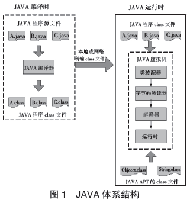

## 4.5 常见错误

- 文件扩展名隐藏导致编译失败
- class写错Class claas…
- 类名格式有问题暂时全部使用英文
- 类名后面的大括号匹配不正确
- main方法格式错误

```java
public static void main(String [] args){ 
}
```
- main方法大括号缺失
- 打印语句拼写错误

```java
 System.out.println(“”);
```

- 引号使用错误，使用成中文全角引号

# 5. 环境变量的配置

在计算机操作系统中可以定义一系列变量，这些变量可供操作系统上所有的应用程序使用，被称作系统环境变量。在学习Java的过程中，需要涉及两个系统环境变量path和classpath

## 5.1 path环境变量

path环境变量是系统环境变量中的一种，它用于保存一系列的路径，每个路径之间以分号分隔。当在命令行窗口运行一个可执行文件时，操作系统首先会在当前目录下查找是否存在该文件，如果不存在会继续在path环境变量中定义的路径下寻找这个文件，如果仍未找到，系统会报错。例如，在命令行窗口输入“javac”命令，并按下回车，会看到错误提示。如下图所示：

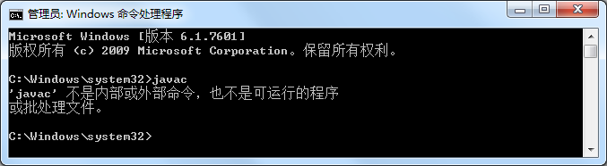

从上图的错误提示可以看出系统没有找到javac命令。在命令行窗口输入“set path”命令，可以查看当前系统的path环境变量，如下图所示：

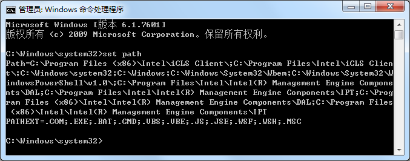

从上图中列出的path环境变量可以看出，其中并没有包含“javac”命令所在的目录，因此操作系统找不到该命令。为了解决这个问题，需要在命令行窗口输入一行命令，将“javac”命令所在的目录添加至path环境变量。命令如下所示：

```
set path=%path%;C:\Program Files\Java\jdk1.7.0_60\bin;
```

其中，“%path%”表示引用原有的path环境变量，“C:\Program Files\Java\jdk1.7.0_60\bin” 表示javac命令所在的目录。整行命令的作用就是在原有的path环境变量值中添加javac命令所在的目录。

再次输入“set path”命令查看path环境变量，结果如下图所示：

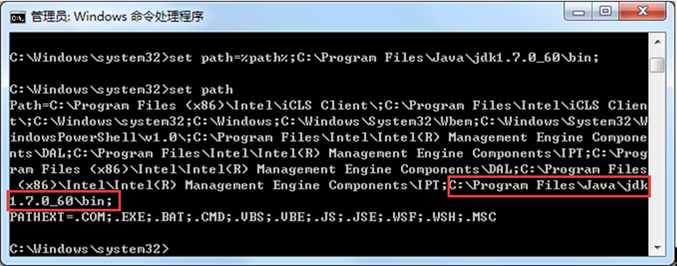

设置完path环境变量后，再次运行“javac”命令，找不到javac.exe命令的错误情况就不会再出现了，命令行中会显示“javac”命令的帮助信息，如下图所示：

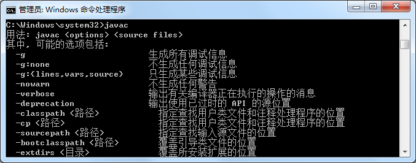

由于“java”命令和“javac”命令位于同一个目录中，因此在配置完path环境变量后，同样可以在任意的路径下执行“java”命令。

重新打开一个新的命令行窗口，再次运行javac命令，又会出现找不到javac.exe命令错误，使用“set path”命令查看环境变量，会发现之前的设置无效了。出现这种现象的原因在于，在命令窗口中，对环境变量进行任何修改只对当前窗口有效，一旦关闭窗口，所有的设置都会失效。因此，要想让环境变量永久生效，就需要在系统中对环境变量进行配置。让Windows系统永久性地记住所配置的环境变量。配置系统环境变量步骤如下：

1、查看Windows系统属性中的环境变量

右键单击桌面上的【计算机】，从下拉菜单中选择【属性】，在出现的【系统】窗口中选择左边的【高级系统设置】选项，然后在【高级】窗口中单击【环境变量】按钮，打开【环境变量】窗口，如下图所示：

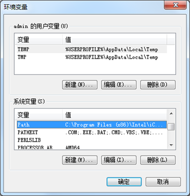

2、设置path系统环境变量

在【环境变量】窗口中的【系统变量】区域选中名为“Path”的系统变量，单击【编辑】按钮，打开【编辑系统变量】窗口，如下图所示：

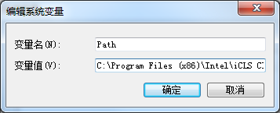

在【变量值】文本区域内开始处添加“javac”命令所在的目录“C:\Program
Files\Java\jdk1.7.0_60\bin”，末尾用英文半角分号(;)结束，与后面的路径隔开。如下图所示：

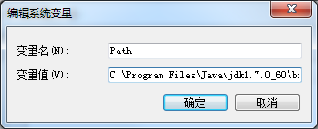

添加完成后，依次单击打开窗口的【确定】按钮，完成设置。

3、查看和验证设置的path系统环境变量

打开命令行窗口，执行“set path”命令，查看设置后的path变量的变量值，如下图所示：

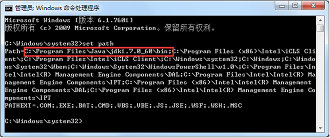

从上图中环境变量path值的第一行中，已经显示出来配置路径信息。在命令行窗口中执行javac命令，如果能正常地显示帮助信息，说明系统path环境变量配置成功，这样系统就永久性地记住了path环境变量的设置。

## 5.2 classpath环境变量

classpath环境变量也用于保存一系列路径，它和path环境变量的查看与配置的方式完全相同。当Java虚拟机需要运行一个类时，会在classpath环境变量中所定义的路径下寻找所需的class文件。

打开命令提示行窗口，进入C盘根目录下，然后执行“java HelloWorld”命令，运行之前编译好的Java程序，结果会报错，如下图所示：

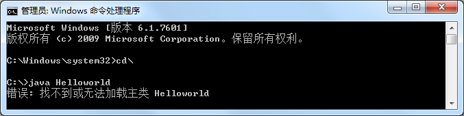

出现上图中所示错误的原因在于，Java虚拟机在运行程序时无法找到“HelloWorld.class”文件。为了解决这个错误，首先来通过“set classpath”命令查看当前classpath环境变量的值，如下图所示：

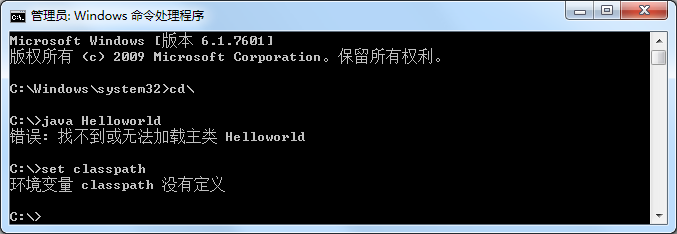

从上图中可以看出，当前classpath环境变量没有设置，为了让Java虚拟机能找到所需的class文件，就需要对classpath环境变量进行设置，在命令行窗口输入下面的命令：

```
set classpath=C:\Program Files\Java\jdk1.7.0_60\bin
```

再次执行“java HelloWorld”命令运行程序，会看到正确的结果，如下图所示：

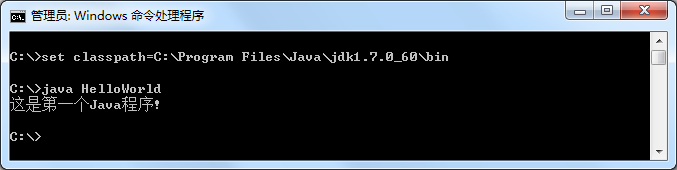

值得注意的是，在1.3小节中并没有对classpath环境变量进行设置，但在“C:\Program Files \Java\jdk1.7.0_60\bin”目录下仍然可以使用“java”命令正常运行程序，而没有出现无法找到“HelloWorld.class”文件的错误。这是因为从JDK5.0开始，如果classpath环境变量没有进行设置，Java虚拟机会自动将其设置为“.”，也就是当前目录。

## 5.3 path环境变量配置的作用

- 程序的执行需要使用外部指令javac，但是javac指令仅仅能在JDK安装目录下的bin目录下时候，因此程序只能写入bin目录
- 程序开发过程中，不能将源代码写入JDK的安装目录，因此需要将源程序保存到任意位置的指定目录(英文目录)，所以需要使javac指令在任意目录下可以运行

### 5.3.1 path环境变量配置方式1

通过配置path环境变量，将javac指令所在目录也就是JDK安装目录下的bin目录配置到path变量下，即可使javac指令在任意目录下运行

win7，win8系统：右键`点击桌面计算机` → `选择属性` → `选择高级系统设置` → `选择高级选项卡` → `点击环境变量` → `下方系统变量` 中查找 `path` → `双击path`

XP系统：右键点击桌面计算机→选择属性→选择高级选项卡→点击环境变量→下方系统变量中查找path→双击path

将jdk安装目录下的bin目录添加到最左边并添加分号

### 5.3.2 path环境变量配置方式2
path环境变量的参照形配置方式

- 创建新的变量名称：JAVA_HOME
- 为JAVA_HOME添加变量值：JDK安装目录
- 将path环境变量中JDK目录修改：%JAVA_HOME%\bin;
- path环境变量具有先后顺序

### 5.3.3 classpath环境变量配置方式
classpath环境变量配置方式

- 创建新的变量名称：classpath
- 值设定为指定的还有class文件的目录，多个目录间使用分号(;)分割
- 作用：使classpath目录中的.class文件可以在任意目录运行

技巧：通常将配置的目录最前面添加.配置，即便当前目录，使.class文件搜索时首先搜索当前目录，然后根据目录配置的顺序依次查找，找到后即运行，因此classpath目录中的配置存在先后顺序

## 5.4 path和classpath的区别

- path环境变量里面记录的是可执行性文件，如.exe文件，对可执行文件先在当前路径去找，如果没找到就去path环境变量中配置的路径去找
- classpath环境变量里记录的是java类的运行文件所在的目录

# 6. Java的运行机制

使用Java语言进行程序设计时，不仅要了解Java语言的显著特点，还需要了解Java程序的运行机制。

Java程序运行时，必须经过编译和运行两个步骤。首先将后缀名为.java的源文件进行编译，最终生成后缀名为.class的字节码文件。然后Java虚拟机将字节码文件进行解释执行，并将结果显示出来。

以HelloWorld为例，对Java程序的运行过程进行详细的分析，具体步骤如下：

- 编写一个HelloWorld.java的文件。
- 使用“javac HelloWorld.java”命令开启Java编译器并进行编译。编译结束后，会自动生成一个HelloWorld.class的字节码文件。
- 使用“java HelloWorld”命令启动Java虚拟机运行程序，Java虚拟机首先将编译好的字节码文件加载到内存，这个过程被称为类加载，它是由类加载器完成的，然后虚拟机针对加载到内存中的Java类进行解释执行，便可看到运行结果。

通过上面的分析不难发现，Java程序是由虚拟机负责解释执行的，而并非操作系统。这样做的好处是可以实现跨平台性，也就是说针对不同的操作系统可以编写相同的程序，只需安装不同版本的虚拟机即可，如下图所示：

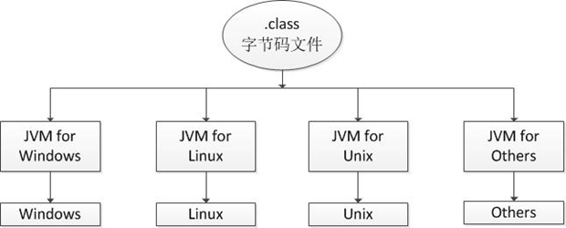

从上图可以看出，不同的操作系统需要使用不同版本的虚拟机，这种方式使得Java语言具有“一次编写，到处运行（write once，run anywhere）”的特性，有效地解决了程序设计语言在不同操作系统编译时产生不同机器代码的问题，大大降低了程序开发和维护的成本。

需要注意的是，Java程序通过Java虚拟机可以达到跨平台特性，但Java虚拟机并不是跨平台的。也就是说，不同操作系统上的Java虚拟机是不同的，即Windows平台上的Java虚拟机不能用在Linux平台上，反之亦然。

# 7. Eclipse开发工具

在实际项目开发过程中，由于使用记事本编写代码速度慢，且不容易排错，所以程序员很少用它来编写代码。为了提高程序的开发效率，大部分软件开发人员都是使用集成开发工具（IDE，Integrated Development Environment）来进行Java程序开发的。正所谓“工欲善其事，必先利其器”，接下来就为读者介绍一种Java常用的开发工具——Eclipse。

Eclipse是由蓝色巨人IBM花费巨资开发的一款功能完整且成熟的IDE集成开发环境，它是一个开源的、基于Java的可扩展开发平台，是目前最流行的Java语言开发工具。Eclipse具有强大的代码编排功能，可以帮助程序开发人员完成语法修正、代码修正、补全文字、信息提示等编码工作，大大提高了程序开发的效率。

Eclipse的设计思想是“一切皆插件”。就其本身而言，它只是一个框架和一组服务，所有功能都是将插件组件加入到Eclipse框架中来实现的。Eclipse作为一款优秀的开发工具，其自身附带了一个标准的插件集，其中包括了Java开发工具（JDK），因此，使用Eclipse工具进行Java程序开发不需要再安装JDK以及配置Java运行环境。下面将为读者具体的讲解Eclipse工具的使用。

# 8. 包的定义与使用

为了便于对硬盘上的文件进行管理，通常都会将文件分目录进行存放。同理，在程序开发中，也需要将编写的类在项目中分目录存放，以便于文件管理。为此，Java引入了包(package)机制，程序可以通过声明包的方式对Java类定义目录。

Java中的包是专门用来存放类的，通常功能相同的类存放在相同的包中。在声明包时，使用package语句，具体示例如下：

```java
package cn.itcast.chapter01; // 使用package关键字声明包
public class Example01{…}
```

需要注意的是，包的声明只能位于Java源文件的第一行。

在实际程序开发过程中，定义的类都是含有包名的，如果没有显式地声明package语句，创建的类则处于默认包下，在实际开发中，这种情况是不应该出现的，本教材的示例代码主要展现的是功能部分的代码，所以在大多数示例代码中没有为示例指定包名，但是在提供的源码中，都已使用包名。

在开发时，一个项目中可能会使用很多包，当一个包中的类需要调用另一个包中的类时，就需要使用import关键字引入需要的类。使用import可以在程序中一次导入某个指定包下的类，这样就不必在每次用到该类时都书写完整类名，简化了代码量。使用import关键字的具体格式如下所示：

```java
import 包名.类名;
```

需要注意的是，import通常出现在package语句之后，类定义之前。如果有时候需要用到一个包中的许多类，则可以使用“import 包名.*; ”来导入该包下所有类。

在JDK中，不同功能的类都放在不同的包中，其中Java的核心类主要放在java包及其子包下，Java扩展的大部分类都放在javax包及其子包下。为了便于后面的学习，接下来简单介绍Java语言中的常用包。

- java.util:包含Java中大量工具类、集合类等，例如Arrays、List、Set等。
- java.net:包含Java网络编程相关的类和接口。
- java.io:包含了Java输入、输出有关的类和接口。
- java.awt:包含用于构建图形界面(GUI)的相关类和接口。

除了上面提到的常用包，JDK中还有很多其它的包，比如数据库编程的java.sql包，编写GUI的javax.swing包等等，JDK中所有包中的类构成了Java类库。在以后的章节中，这些包中的类和接口将逐渐介绍，这里只需要有个大致印象即可。