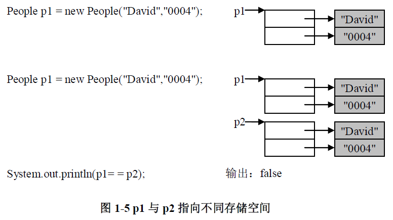

尽管在Java中没有显式的使用指针并且也不允许程序员使用指针，而实际上对象的访问就是使用指针来实现的。一个对象会从实际的存储空间的某个位置开始占据一定数量的存储体。该对象的指针就是一个保存了对象的存储地址的变量，并且这个存储地址就是对象在存储空间中的起始地址。在许多高级语言中指针是一种数据类型，而在Java中是使用对象的引用来替代的。

考虑前面我们定义的People类，以及下列语句：

```java
People p = null; q = new People("Jack","0001");
```

这里创建了两个对于对象引用的变量p和q。变量p初始化为null，null是一个空指针，它不指向任何地方，也就是它不指向任何类的对象，因此null可以赋值给任何类的对象的引用。变量q是一个对于People类的实例的引用，操作符new的作用实际上是为对象开辟足够的内存空间，而引用p是指向这一内存空间地址的指针。

为此请读者考虑如下代码的运行结果：

```java
People p1 = new People("David","0004");
People p2 = p1;
p2.setName("Denny");
System.out.println(p1.getName());
```

这段代码中对People类的对象引用p2的name成员变量进行了设置，使其值为字符串"Denny"。但是我们会发现在输出p1的成员变量name时并不是输出"David"，而是"Denny"。原因是p1与p2均是对对象的引用，在完成赋值语句" People p2 = p1; "后，p2与p1指向同一存储空间，因此对于p2的修改自然会影响到s1。通过图1-4可以清楚说明这段代码运行的情况。


请读者继续考虑以下代码的运行结果：

```java
People p1 = new People("David","0004");
People p2 = new People("David","0004");
System.out.println(p1= = p2);
```

在这里虽然p1与p2的所有成员变量的内容均相同，但是由于它们指向不同的存储空间，因此，输出语句输出的结果为false。图1-5说明了p1与p2的指向。



可见如果我们希望完成对象的拷贝，使用一个简单的赋值语句是无法完成的。要达到这一目的可以通过实现Cloneable接口并重写clone方法来完成。如果我们希望判断两个对象引用是否一致时可以覆盖继承自Object类的equals方法来实现。