这10本书在Java程序员界都是被认为很棒的书。当一个程序员开始初学Java时，他的第一个问题应该是如何选择一本书来作为指导学习Java。这个问题也就表明，相对于其他的教程和博客，Java书籍还是很重要的参考，主要表现在以下两点：

通常书籍是由比较权威的程序员来撰写的。

相比其他媒介，书籍对于内容的描述更加详细，解释更加明确。

这10本书是我个人非常喜欢的Java书籍，当我有时间的时候，我就会将它们捧在手里阅读。甚至有些书我反复读过很多遍，每次重新读的时候总会有新的收获。因此这些书也是大部分Java程序员喜欢的书籍。

## Head First Java

Head First Java是所有编程或者Java初学者最适合的书籍，我很喜欢轻松和寓教于乐的Head First风格，这应该是最有意思的关于Java的书。无论是初级，中级还是高级都能从中有所收获。学习本书，你可以了解到类，对象，线程，集合等编程知识，还可以了解到泛型，枚举，可变参数和自动装箱等语言特性。本书中还涉及到了Java高级编程中的Swing，网络编程，IO操作等，可以让初学者对Java有比较完整地概念。如果你是一位Java初学者，不要犹豫，这本书最适合你了。

## Head First 设计模式

Head First设计模式又是一部Head First系列的书籍。作者为Kathy Sierra及其团队。当我在2006年开始读这本书的时候，我对设计模式并不是很了解。设计模式解决什么问题，怎么解决问题，如何使用设计模式，设计模式有什么好处，这些问题我几乎都无法回答出来。但是当我读完这本书的时候，一切都豁然开朗。在本书介绍继承和组合一章，使用简单有趣的例子，一步一步提出问题并解决问题，最终得出最优解。本书中会有很多要点总结，幽默对话，练习题还有有名的单词接龙等帮助你更好地了解设计模式。如果你想了解Java中的设计模式，请带走这本书。

## Effective Java

Effective Java这本书也是一本我最喜欢的。本书为领导开发Java集合框架和并发API包的 约书亚·布洛克 大神所著。本书适合于有着数年开发经验Java程序员，通过本书我们可以很多编程中的最佳实践，并且可以从JDK贡献者布洛克大神这里汲取经验。Effective Java从质量，内容和问题解答方式上来说都是一本评价很高的书，因此读这本书会是一种感觉很棒的体验。另外本书的章节相对比较轻量，与其他章节耦合度较低，因此在旅行或者闲暇时间阅读也是可以的。在内容方面，Effective Java包含了从静态工厂，序列化，equals和hashcode到泛型，枚举，可变参数以及反射的最佳解决方法。本书对Java各方面知识点的讲解会让你受益匪浅。

## Java并发编程实战

又一部 约书亚·布洛克 大神的经典之作，当然本书的另一位主作者为 Doug Lea（影响两次Java历史上的大变革的大神）。这本书几乎就是Java并发和多线程编程方面的权威，同时也是核心Java开发人员必读的一本书。本书的强大主要表现在本书非常详细地描述了多线程和并发中的诸多(小)细节。

本书并非聚焦于核心Java代码的实现，而是关注并发引起的问题，比如死锁，饥饿，线程安全，竞争条件，然后提供可行的方法来解决这些问题。因此这本书可以很好地帮助开发者了解并掌握并发包以及其中的CountDownLatch，CyclicBarrier，BlockingQueue，Semaphore这些类。这也是我一遍一遍阅读这本书的原因。

书中的例子简明扼要清晰，很能描述问题。解释明确：本书很好地解释了什么是错的，为什么错，怎样改正。这也是本书畅销的原因之一。

## Java Generics and Collections

这本书是来自O’Reilly的一本成功之作，作者为Naftalin和Philip Wadler。正如书名可知，这本书的内容关注于泛型和集合这两个Java语言的核心方面。本书对于那些有编程经验的程序员加强对集合和泛型的理解和掌握有很大的帮助。本书详细介绍了每一个集合的API，Set, List, Map, Queue，以及他们的实现，对比不同场景下它们的性能优劣。每个章节最后的对比图表很不错。

## Java性能优化权威指南

本书为我个人的最爱，本书重点关注性能监视，性能剖析以及如何使用工具对性能分析。本书不同于其他的编程书籍，因为本书中涉及到很多Java虚拟机的细节，垃圾回收机制，Java堆内存监视以及对程序性能剖析。其中讲述JVM的章节写的很不错，很值得咀嚼。注意，这本书属于编程高级层次，阅读需要具有足够的Java编程经验。初级和中级Java开发者也可以阅读本书也会学到不同程度的干货。所以，你想进行性能调优，把这本书放到你的书架上吧。

## Java Puzzlers

再介绍一本 约书亚·布洛克 大神写的书。本书的另一位作者为Neal Gafter（已转到微软做Donet Compiler技术Lead）。本书讲述了Java语言中的极端情况和陷阱。相对于C++，Java更加安全低风险，JVM有着垃圾回收机制，让Java程序员不用关心内存分配和释放，大大提高了程序的开发效率。但是有些时候，即便是经验丰富的程序员也会被Java中的极端情况或陷阱给绊倒。本书列举并详细描述了Java中的这些陷阱。如果你喜欢刨根问底，钻牛角尖，这本书就是为你而写。通过本书，你可以了解很多java的核心知识并对自己的Java水平有所知晓。本人更加喜欢上面提到的 约书亚·布洛克 的 Effective Java 和 Concurrency Practice in Java。但是如果你感兴趣，还是可以去尝试的。为了让收获最大化，你可以先尝试解决书中的问题，然后对着书中的解释进行比较。

## Head First Object Oriented Analysis and Design

这是一本属于Head First系列的关于面向对象编程的书。本书建议和Head First设计模式结合阅读，效果更佳。本书关注于面向对象设计原则，比如多用组合少用继承，针对接口编程而非针对实现编程，不要重复你自己等。这本书可以帮助你写出好代码并且参考最佳实践进行优化改善。当然本书中的内容也适合使用其他面向对象的语言的程序员。想学好面向对象编码和设计规则，现在就开始读这本书哈。

## Thinking in Java

Thinking in Java book应该是Java中文界最有名的书籍了，中文又名 Java编程思想。作者为Bruce Eckel，他也是Thinking in C++的作者，他用自己很独特的观点讲述了Java。据我所知，这本书获得了很高的认可，本书是一本介绍齐全的Java学习参考书。如果你不喜欢Head First类似小人书那样的讲解，可以尝试这本书。本书的内容讲解详细，成熟（相对Head First有种教科书的感觉）。

## Java程序员修炼之道

《Java程序员修炼之道》分为四部分，第一部分全面介绍Java 7的新特性，第二部分探讨Java关键编程知识和技术，第三部分讨论JVM上的新语言和多语言编程，第四部分将平台和多语言编程知识付诸实践。从介绍Java 7的新特性入手，《Java程序员修炼之道》涵盖了Java开发中最重要的技术，比如依赖注入、测试驱动的开发和持续集成，探索了JVM上的非Java语言，并详细讲解了多语言项目， 特别是涉及Groovy、Scala和Clojure语言的项目。此外，书中含有大量代码示例，帮助读者从实践中理解Java语言和平台。《Java程序员修炼之道》适合Java开发人员以及对Java7和JVM新语言感兴趣的各领域人士阅读。 

这就是我的关于Java编程相关的推荐的书，这些都可以说是看成经典中的经典。像Effective Java 和 Head First 系列我已经反复阅读了很多遍。相信看完本文，根据自己的水平和想要提升的知识侧重，你应该能选出最适合自己的书了。

----

本文绝对是殿堂级和化石级收藏佳作，不管是刚入门的新手，还是进阶高手，本文推荐了超过20本Java进阶专业书籍。可谓用（fei）心（jin）良（xin）苦（ji）！

**《Java编程思想》**

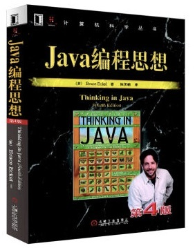

这本书适合开发过一两个项目，对java已经有一定的了解的人。

这本书首先不是java的入门书，虽然这本书介绍了一部分语法，但是更多内容是java特性的讲解，里面的用例水平非常高，对于面向对象讲解，接口，内部类，容器，多线程，I/O的讲解很透彻同时又很深刻，他会告诉你，在什么情况下你应该作何选择。以及各种选择的利弊。这本书不适合从头看到尾，适合在迷惑不解的 时候，带着疑问去翻，让你的求知欲带着你去看书，而不是给自己定一个Java编程思想的读书计划。

**《深入剖析Tomcat》**

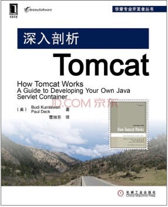

试读人群：做过两三个项目，对面向对象设计有一定了解，设计模式似懂非懂，想好好看看什么是面向接口编程，对serlet的加载，映射，及整个http请求处理流程感兴趣，不能容忍自己的知识体系存在黑箱的人。认为Java后台开发仅仅是CRUD的人。

Tomcat大家都很熟悉了，不论我们做的课程设计的小项目，还是淘宝天猫等每天PV访问量过亿的大型网站都在用，你还敢瞧不起它吗？还是认为入门的技术 不值一提吗？

你可能更换数据库框架，mvc框架，容器，但是很少有人换掉Tomcat。为什么，因为她是一个优秀的设计（帮你做了很多，但在可定制性方面不如Jetty）。

这本书从一个简单的socket B/S 程序入门，作者从头编写连接器，处理器，请求（request），处理(response)开始讲解tomcat的设计理念，中间讲Tomcat4及5的源码，讲解tomcat核心的设计 Container 四大容器 ，然后讲解tomcat安全，权限，以及配置文件的读取，java对象的管理 ，定制性Tomcat 项目管理的后台(就是你访问tomcat路径的根路径进入的管理网站)。这本书适合于，心无旁骛，没有项目，没有太多事的情况下，对照实际的源码，一行行的读，明白处理流程，了解什么时候是优秀的代码？扩展性，健壮性

**《深入理解Java虚拟机》**

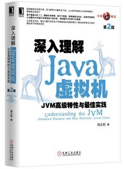

适度人群：想学习并发编程，反射，想了解JVM优化。闲着无聊，没项目的人

首先这本书可能有点枯燥，没有什么用，真的，对于你现在的实际项目没有直接用处，但是，你要想在java方面研究得更深，不可避免，你需要对jvm及其优化，java的内存模型,java类的加载机制，字节码文件到底是什么,以及并发编程,Java性能优化等方面有所了解。，你需要好好读这本书，可能比较枯燥，有点难，但是他值得你用心读 。

**《设计模式-可复用软件的设计》 GoF（《设计模式的艺术之道》刘伟）**

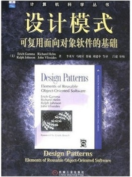

适读人群：有过三四大小个项目经验，想了解什么是软件，什么是程序，什么是面向对象，只有读了这本书，你才知道除了算法，性能，之外，我们还要为之奋斗是扩 展性，究其原因是：软件行业的梗，需求变更，可能项目初期的需求和项目开发后期的需求有天壤之便，但如何在设计阶段就为需求的变动做好准备，那就是对变化 的部分抽离抽象，分层，分工，虽然提高了复杂度，但是后期我们可以轻松一点，如果前期不设计好，真的 一个项目可以在需求变化面前，彻底玩完。根本无法继续开发。如果你还没接触到 需求变更，只能说你的客户不太重视他的项目，或者客户本身就是程序员自己。一个main函数一个人从头写到尾绝对不是软件。

作者从创建型，结构性，行为型三个方面详细介绍了23种设计模式，字字珠玑，耐心的看，耐心的 理解，把这本书和Java编程思想放在一起，没事就翻翻看，没准哪一天你在写程序，发现，如果 我这么设计，后面的开发我可以非常轻松的。那时，你一定要感谢作者总结了这些设计模式。可能GOF的书距今不叫遥远，设计案例比较陈旧，所以可以同时看《设计模式的艺术之道 》这本书同样不错，例子可能更容易理解一些。

软件行业的圣经之作，只要你做技术，你应该时常翻翻看。

**《JavaScript编程全解》（JavaScript高级程序设计）**

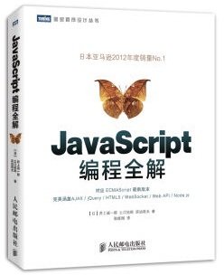

适读人群： 学会基本的 javascript dom编程，jquery，做过两三个项目，但是没有系统的学习javascript，总是在为一些语法，或者莫名其妙的 错误烦恼的人，这本书绝对适合你，应为他就是写给java程序员的Javasript书籍 。

Java程序员进阶，为什么要谈JavaScript，我个人不喜欢JavaScript，应该我找了半天错，可能就是因为一个简单的语法错误，还有就是只能操作控件，我一直希望前端人员可以帮我做这些事，后来发现这几乎不可能，JavaScript还得自己写，可能以后工作之后，更得自己写，所以我想系统学习下 script,后来这本书真的没有让我失望，这本书后面高级部分还没来得及看，但是仅仅在讲述JavaScript的语法特性，就有一种如沐春风的 感觉，良心之作 。

有事没事的可以看看。当然这本书并没有侧重于dom编程，可能我们做的更多是dom编程，所以我还推荐你可以看看JavaScript高级程序设计。我看我们前端美女帅哥 都在看这书，应该还不错 ，就是有点厚，但是说明讲的详细，可以做工具书。

**《深入分析javaweb技术内幕》**

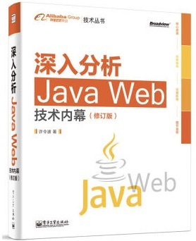

适读人群：做过三四个项目，看过上面的 深入剖析Tomcat,深入理解Java虚拟机，设计模式，使用过Spring,mybatis的读者。

这本书的水平真是很高，说实话，看这本书的时候，我几乎流下了眼泪，我能感受到作者真的是用心在写书，不是为了出版赚版权费，不是为了装X，而是真的是希望自己当年吃过的苦，别人能少吃一点，别人可以学的更轻松。尤其是作者的细致认真，用工匠精神来说，一点不为过，同时再加上当时看Tomcat源码时的感想，可以总结 一句话，一个优秀的程序员在每一个细节都精益求精。在他们的知识体系里，永远不能容忍一个小漏洞存在，在细节处着手，踏踏实实的写好每一行代码。把每一个有疑问的点都在合适的时机解决掉。作者在细节上击败了我。

同时不光在细节上，作者详细讲述了 Javaweb中 的技术方向，多得数不清，但是每一章你都感觉不到 作者的 疏漏与不足。博广精专，这就是本书的作者 值得我们学习的

本文目录大概包括Java I/o ,字节码，编译，jvm，tomcat,spring,ibatis,等等。

**《重构改善既有代码的设计》**

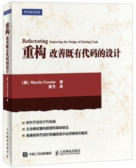

适读人群：挣扎于需求剧烈变更，维护升级的孩子们。

这本书与设计模式并成为软件行业的两本圣经，虽然我不这么认为，但是毋庸置疑，当你看完这本书，之后，你会更关注你写的 代码的的结构，这两本书都是让我们可以写出可维护，可扩展，健壮性强的代码，这本书就是教你如何修改代码，如何修改 能够引入更少的错误，同时更加容易维护。作者讲述很多的技巧，实用性极强，但是如果 你写的项目 变动不是很大，或者没有一些修改代码的苦痛的经历，可能体会不会很深，这是一本独立性比较强的 书，看一看是绝对值得的。

**《操作系统设计 xinu方法》**

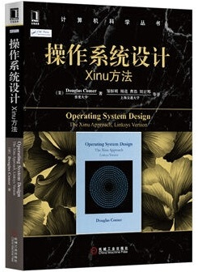

适读人群：学习完操作系统课程，想深入了解下操作系统内部的细节，如何实现线程调度，内核态用户态转化到底是什么，消息循环，进程 管理，等等，你都可以看。

这是一本用C语言写的书，但是身为Java程序员，最起码得会C语言，看了这本书有什么好处呢，说实话，对Java的面向对象开发没有什么帮助，他的帮助仅仅是在于你对 操作系统的了解更加深刻，当你去看JVM的 时候，可能会轻松一点点，同时他也在告诉你，其实操作系统并没有那么高不可攀，你就可以从源代码级别看懂操作系统。同时可能，我觉得当你编写程序到一定级 别后，走上架构师之路，操作系统绝对是知识体系中不可避免的一个重要环节。现在可以打个基础。这本书适合于操作系统课程上完一大半之后在读。

一点都不难，真的！

**《超越传统的软件开发-极限编程的幻想和真实》（《解析极限编程-拥抱变化》《人月神话》）**

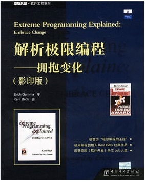

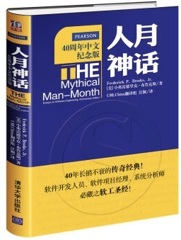

这三本书都是软件工程方向的书籍，关注于如何构造高效开发流程。在这方面我懂得很少 ，我会找别人再来给大家完善这方面的知识，但是这三本书肯定都不难，有过项目领导经验 的人来看，收获一定会更多，其他人随便看看，你会收获很多，例如，测试先行，结对编程，螺旋开发，循环迭代，不断优化的理念。等等

**《Java程序性能优化》**

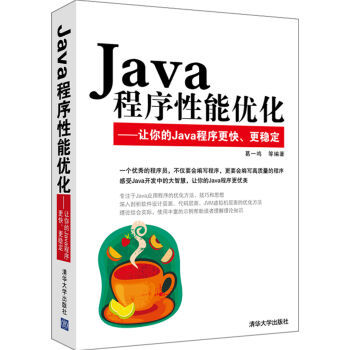

适读人群：做项目 三四个以上，了解java内存模型，以及初步掌握多线程编程，再有就是速度狂们。

这本书从一些编程技巧，性能优化的理念，以及多线程并发编程 的一些 设计模式入手，讲解了如何找到项目性能的瓶颈，如何提升系统吞吐量，从细粒度，编程角度去思考这些问题，（而不是分布式处理），真的尤其是后面的多线程部 分，如沐春风，激起了我对并发 编程的兴趣。

**《Java并发编程》（《java多线程编程的艺术》）**

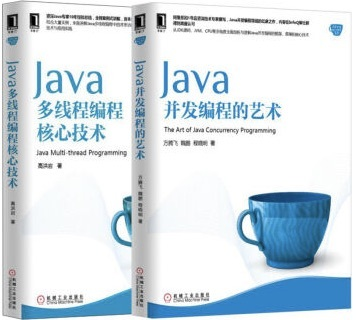

适读人群：想深入学习并发编程，对 jvm内存模型有了解（深入理解jvm虚拟机内本书很重要） 速度狂 ，对java已经有了不错的感觉，感觉 可以代码水平需要更上一层楼的人

Java并发编程是Java并发包的作者写的，java.util.concurrent 大名鼎鼎，很有名的，学习并发编程的圣经之作，但是不太适合入门，入门需要看看后面的java多线程编程的艺术，一行行的代码，一个个的小技巧，慢慢来，并发编程绝对是是否是高级程序员的一个评判标准。

Java并发编程，你应该时常翻翻看 。

**《深入分析Spring 技术内幕》**

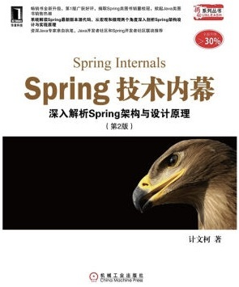

适读人群：熟悉精通设计模式，对面向接口，对象编程特别有感觉的人。时间充裕

这本书，让我为之震颤，震颤的原因不是因为 这本书讲解多么细致，清晰，而是Spring的开发团队为什么把Spring搞得这么复杂，面对 一个个的UML图，我真的是很捉急，表示看不懂，可能是我本人比较笨。但是要想读懂这本书，还真需要长时间的阅读，思考。但是

正如那句话，当你感觉生活艰难的时候，可能你在拔一个大萝卜，当你真的透彻了Spring，你就不可限量了。国内，应该没有比这本书更系统从源代码级别详细讲解Spring的了。

**《EJB3.0 入门经典》**

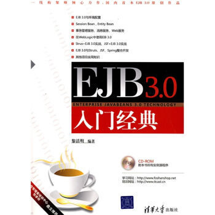

适读人群: 闲着没事的人.

这本书放在最后，不是因为他重要，而是因为这本书无关紧要，为什么呢，因为现在的开发，可以不适用EJB,但是你了解他之后，你就明白了什么是分布式程序，什么是程序的分布式部署。同时你还会知道除了Spring容器还有一种容器叫做 EJB，而是还是J2ee的嫡长子，还会明白，为什么在j2ee领域让野孩子Spring抢了风光。当你学会对比学习两个 框架的时候，可能你真的是一个 大神了。Spring和EJB就是可以对比的。SpringMVC和Struts，

Hibernate和mybatis, 等等，只有学会对比，才会看得更加广阔.但首先还是要踏实

**《架构探险，从零开始Javaweb框架》**

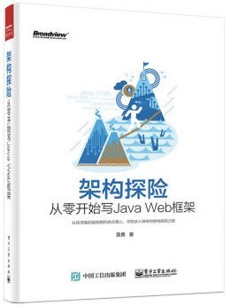

适读人群：想写框架，对反射，对集合比较熟悉的人；

你 可以把这本书，当做自己设计框架的 入门书，可以看到一个框架的编写是多么的简单，你应该也学会参与开源项目，这本书不难，但是需要用心去读。需要 边看边敲代码。什么是Aop，事务处理，mvc框架，等等等等，作者的编码水平高，实在太高，同时讲解的也很透彻

《j2ee核心模式》

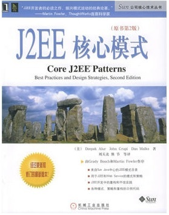

适读人群:闲着没事,想开发框架的大神

这是Sun公司出版的一本书，对于J2ee的 开发非常有指导性，里面总结了一些非常实用经过实践检验的设计思想，设计技巧，有很多你应用了但是你没有注意到，例如，一个不好的实践是控制层有太多的逻 辑代码，这种情况下，视图层需求的变动很容易影响到控制层，而你如果利用好”传输对象“这个设计技巧，就可以把需求变化控制在业务处理层和视图层，

（传输对象正如其名，仅仅是一个容器，里面载入了大家需要的各种数据）

有很多你使用的框架应用了，你也没有注意到，例如前端控制器模式

我在做微信开发的时候就不曾理解微信为什么只能定义一个接口，后来的实践告诉我

正是这种模式，才能让我们的控制层与Servlet解耦，我们借助于这个前端控制器拦截请求，

将请求转发到我们的控制器中，甚至你有兴趣可以自己封装request,response，等，事实上

SpringMVC框架就是利用了前端控制器DispathcerServlet将请求映射到controller中。

这本书后面还会介绍jsp中的一些优秀实践，EJB的实践，EJB这部分可以看看数据处理部分。

但是可能没有做过EJB项目的读者，不会收获太多。

《高性能MySQL》(Mysql技术内幕-Innodb引擎)

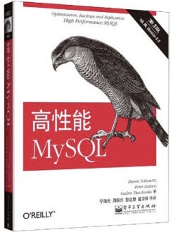

适度人群：熟练使用Sql,有一般数据库设计经验，对索引，mysql原理，及常用优化方法感兴趣，以及有志于成为DBA的同学。

谈java还是离不开数据库的，开发中会遇到很多数据库相关问题，尤其是索引部分，这本书介绍的很是透彻，从数据类型，索引原理，联合索引设计的陷阱，常用优化方法，等方面来谈，都是可以直接应用到实际工作中的经验。对于后面偏架构运维章节，可根据个人兴趣工作需要而定。

第二本书偏原理，能直接应用于工作的很少，但是读完之后，还是让人感觉思维焕然一新，可能感受一下mysql的设计，对于自己以后设计类似功能（事务实现，缓冲池实现，todo ,undo..，锁.等）会有很大借鉴意义。

## 1.《Java in a Nutshell》（Java技术手册）

与其说是必读书籍，还不说是参考文献。

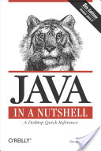

## 2.《The elements of Java style》（Java[编程风格](http://www.codeceo.com/article/programming-style.html)）

目标读者就是Java程序员。通过提出一系列的Java从业规则，以及一些标准、惯例和准则，来说明如何有助于编写可靠又易于理解和维护的Java代码。

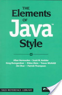

## 3.《Effective Java》（通用程序设计）

这本书真的只适合那些深入了解Java的开发人员。它汇集了78种不可或缺的程序员经验法则：为你每天在工作中都会遇到的编程挑战，提出了实践的最佳解决方案。

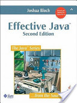

## 4.《The Java language specification》（Java编程规范）

作者为Java的发明者，这本书不仅提供了完整和准确的语言覆盖范围，还包含了实际编译行为时的正式语言规则。虽然阅读这本书不能让你学到什么技能，但是如果你想在Java VM更进一步的话，那就非读不可。

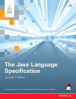

## 5.《Design patterns: elements of reusable object-oriented software》（[设计模式](http://www.codeceo.com/article/category/develop/design-patterns)：可复用面向对象软件的元素）

其实，这本书中的例子是用C ++和Smalltalk写的，是不是很奇怪为什么我还要推荐它呢？如果你想成长为一个开发人员，那么你就必须知道设计模式，这样才能充分利用他人最佳的实践经验，以及还可以向那些面临过相同问题的开发人员学习。当然其他类似的书籍还有很多，但它们都只能当做一些辅助性的学习。

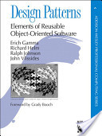

## 6.《The Pragmatic Programmer: From Journeyman to Master》（程序员的修炼：从中级到大师）

此书并不只适合于Java开发人员。 “这本书之所以值得推荐，其原因是它大大保持了编程过程的新鲜度，还有助于我们从前人那里汲取力量、不断地自我成长。”

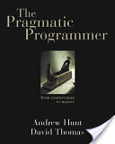

## 7.《Patterns of Enterprise Application Architecture》（企业应用架构模式）

学会了设计模式之后该如何应用到企业框架中呢？这本书介绍了很多常见的企业设计模式。

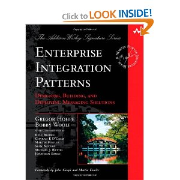

## 8.《Refactoring: Improving the Design of Existing Code》（重构：改善现有代码设计）

如果你已经在编程行业淫浸过几年了，那么你一定得读一读这本书。重构可以使得代码可读性更强，也更容易维护。

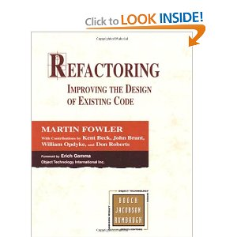

## 9.《OSGi in Action: Creating Modular Applications in Java》（OSGi实战：用Java创建模块化应用）

无论如何，了解一下面向服务的编程是怎么回事，总归不是坏事。这本书的前几章就给出了非常不错的入门介绍和具体的例子。

## 10.《Clean Code: A Handbook of Agile Software Craftsmanship》（代码整洁之道）

最后但并非最不重要的，时不时地检查编码风格总是对的。 开发人员90％的精力是花在维护上的，所以干净的代码真的非常重要。

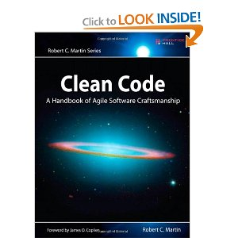