# 1. 语句

## 1.1 流程控制语句

在一个程序执行的过程中，各条语句的执行顺序对程序的结果是有直接影响的。也就是说程序的流程对运行结果有直接的影响。所以，我们必须清楚每条语句的执行流程。而且，很多时候我们要通过控制语句的执行顺序来实现我们要完成的功能。

流程控制语句分类：顺序结构、选择结构、循环结构

## 1.2 顺序结构概述

是程序中最简单最基本的流程控制，没有特定的语法结构，按照代码的先后顺序，依次执行，程序中大多数的代码都是这样执行的。

总的来说：写在前面的先执行，写在后面的后执行

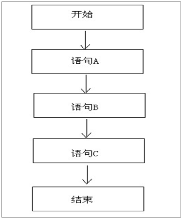

## 1.3 选择结构

选择结构也被称为分支结构。选择结构有特定的语法规则，代码要执行具体的逻辑运算进行判断，逻辑运算的结果有两个，所以产生选择，按照不同的选择执行不同的代码。

Java语言提供了两种选择结构语句：（1）if语句（2）switch语句

### 1.3.1 选择结构(if语句)
if语句有三种格式

if语句第一种格式：
```java
if(关系表达式) {
  语句体
}
```
执行流程：

- 首先判断关系表达式看其结果是true还是false
- 如果是true就执行语句体
- 如果是false就不执行语句体

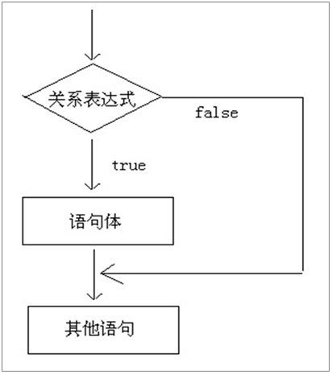

注意事项：

- 关系表达式无论简单还是复杂，结果必须是boolean类型
- if语句控制的语句体如果是一条语句，大括号可以省略；如果是多条语句，就不能省略。建议永远不要省略。
- 一般来说：有左大括号就没有分号，有分号就没有左大括号

if语句第二种格式：
```java
if(关系表达式) {
	语句体1;
}else {
	语句体2;
}
```
执行流程：

- 首先判断关系表达式看其结果是true还是false

- 如果是true就执行语句体1

- 如果是false就执行语句体2

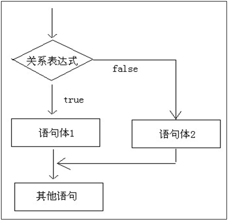

```java
/*
    if语句格式2的练习：
        A:获取两个数据中较大的值
        B:判断一个数据是奇数还是偶数,并输出是奇数还是偶数
*/  
import java.util.Scanner;  

class IfTest {  
    public static void main(String[] args) {  
        //创建键盘录入对象  
        Scanner sc = new Scanner(System.in);  

        //获取两个数据中较大的值  
        System.out.println("请输入第一个数据：");  
        int a = sc.nextInt();  

        System.out.println("请输入第二个数据：");  
        int b = sc.nextInt();  

        //定义一个变量接收最大值  
        int max;  

        if(a > b) {  
            max = a;  
        }else {  
            max = b;  
        }  

        System.out.println("max:"+max);  
        System.out.println("----------------");  

        //判断一个数据是奇数还是偶数  
        System.out.println("请输入你要判断的数据：");  
        int x = sc.nextInt();  

        if(x%2 == 0) {  
            System.out.println(x+"这个数据是偶数");  
        }else {  
            System.out.println(x+"这个数据是奇数");  
        }  
    }  
}  
```

运行结果：

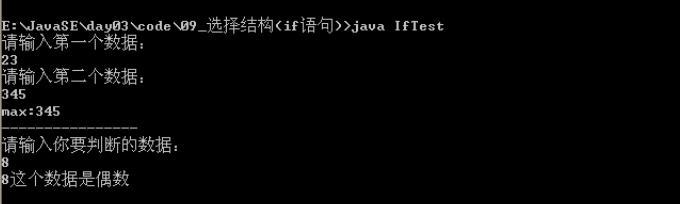

if语句第三种格式：
```java
if(关系表达式1) {
   语句体1;
}else  if (关系表达式2) {
   语句体2;
}
…
else {
   语句体n+1;
}
```
执行流程：

- 首先判断关系表达式1看其结果是true还是false
- 如果是true就执行语句体1
- 如果是false就继续判断关系表达式2看其结果是true还是false
- 如果是true就执行语句体2
- 如果是false就继续判断关系表达式…看其结果是true还是false
  …
- 如果没有任何关系表达式为true，就执行语句体n+1。

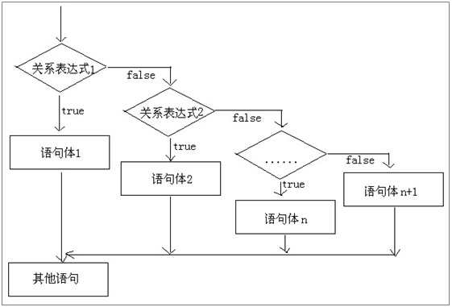

```java
/*
    三种if语句分别适合做什么事情呢?
        格式1：适合做单个判断
        格式2：适合做两个判断
        格式3：适合做多个判断

    需求：
        键盘录入x的值，计算出y的并输出。

        x>=3 y = 2x + 1;
        -1<=x<3   y = 2x;
        x<=-1    y = 2x – 1;

    分析：
        A:由于数据要键盘录入，所以必须使用Scanner。
        B:由于是三种判断，所以我们选择if语句格式3。
*/  
import java.util.Scanner;  

class IfTest2 {  
    public static void main(String[] args) {  
        //创建键盘录入对象  
        Scanner sc = new Scanner(System.in);  

        System.out.println("请输入x的值：");  
        int x = sc.nextInt();  

        //定义一个y  
        int y;  

        //用if语句格式3进行判断  
        if(x >= 3) {  
            y = 2*x + 1;  
        }else if(x>=-1 && x<3) {  
            y = 2*x;  
        }else {  
            y = 2*x - 1;  
        }  

        System.out.println("y:"+y);  
    }  
}  
```
运行结果：

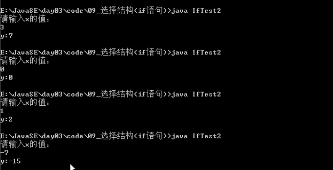

switch语句格式：
```java
switch(表达式) {
  case 值1：
    语句体1;
    break;
  case 值2：
    语句体2;
    break;
  …
  default：
    语句体n+1;
    break;
}
```
格式解释

- switch表示这是switch语句
  - 表达式的取值：byte，short，int，char
  - JDK5以后可以是枚举
  - JDK7以后可以是String
- case后面跟的是要和表达式进行比较的值
- 语句体部分可以是一条或多条语句
- break表示中断，结束的意思，可以结束switch语句
- default语句表示所有情况都不匹配的时候，就执行该处的内容，和if语句的else相似。

执行流程

- 首先计算出表达式的值
- 其次，和case依次比较，一旦有对应的值，就会执行相应的语句，在执行的过程中，遇到break就会结束。
- 最后，如果所有的case都和表达式的值不匹配，就会执行default语句体部分，然后程序结束掉。

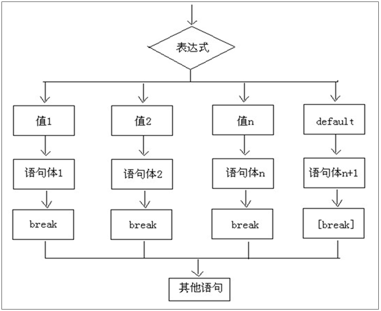

```java
/*
    用switch语句实现键盘录入月份，输出对应的季节

    分析：
        A:键盘录入一个月份，用Scanner实现
        B:用switch语句实现即可
*/  
import java.util.Scanner;  

class SwitchTest4 {  
    public static void main(String[] args) {  
        //创建键盘录入对象  
        Scanner sc = new Scanner(System.in);  

        //录入数据  
        System.out.println("请输入月份(1-12)：");  
        int month = sc.nextInt();  

        //case穿透  
        switch(month) {  
            case 1:  
            case 2:  
            case 12:  
                System.out.println("冬季");  
                break;  
            case 3:  
            case 4:  
            case 5:  
                System.out.println("春季");  
                break;  
            case 6:  
            case 7:  
            case 8:  
                System.out.println("夏季");  
                break;  
            case 9:  
            case 10:  
            case 11:  
                System.out.println("秋季");  
                break;  
            default:  
                System.out.println("你输入的月份有误");  
        }  
    }  
}  
```

运行结果：

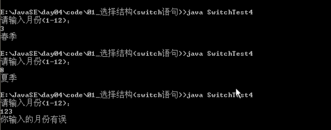

（3）if语句和switch语句的区别?
if语句：

- A:针对结果是boolean类型的判断
- B:针对一个范围的判断
- C:针对几个常量值的判断

switch语句：针对几个常量值的判断

注意事项：

- case后面只能是常量，不能是变量，而且，多个case后面的值不能出现相同的
- default可以省略吗?可以省略。一般不建议。除非判断的值是固定的。
- break可以省略吗?可以省略，一般不建议。否则结果可能不是你想要的
- default的位置一定要在最后吗?可以出现在switch语句任意位置。
- switch语句的结束条件，遇到break执行到程序的末尾

# 2. 循环结构

循环语句可以在满足循环条件的情况下，反复执行某一段代码，这段被重复执行的代码被称为循环体语句，当反复执行这个循环体时，需要在合适的时候把循环判断条件修改为false，从而结束循环，否则循环将一直执行下去，形成死循环。

## 2.1 循环语句的组成

- 初始化语句：一条或者多条语句，这些语句完成一些初始化操作
- 判断条件语句：这是一个boolean 表达式，这个表达式能决定是否执行循环体
- 循环体语句：这个部分是循环体语句，也就是我们要多次做的事情
- 控制条件语句：这个部分在一次循环体结束后，下一次循环判断条件执行前执行。通过用于控制循环条件中的变量，使得循环在合适的时候结束

## 2.2 for循环语句格式
```java
for(初始化语句;判断条件语句;控制条件语句) {
       循环体语句;
}
```
执行流程

- 执行初始化语句
- 执行判断条件语句，看其结果是true还是false
  - 如果是false，循环结束
  - 如果是true，继续执行
- 执行循环体语句
- 执行控制条件语句
- 回到B继续

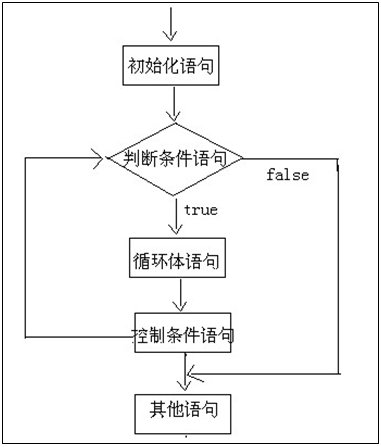

注意事项

- 判断条件语句的结果是一个boolean类型

- 循环体语句如果是一条语句，大括号可以省略；如果是多条语句，大括号不能省略。建议永远不要省略。

- 一般来说：有左大括号就没有分号，有分号就没有左大括号

## 2.3 for语句的练习

### 代码示例：在控制台输出所有的”水仙花数”

```java
/*
    需求：在控制台输出所有的”水仙花数”

    分析：
        我们都不知道什么叫"水仙花数"，你让我怎么做呢?

        所谓的水仙花数是指一个三位数，其各位数字的立方和等于该数本身。
        举例：153就是一个水仙花数。
        153 = 1*1*1 + 5*5*5 + 3*3*3 = 1 + 125 + 27 = 153

        A:三位数其实是告诉了我们范围。
        B:通过for循环我们就可以实现获取每一个三位数
          但是麻烦是如何获取这个三位数的个,十,百位上的数据

          我们如何获取一个数据的个,十,百呢?
            假设有个一个数据:153
            ge: 153%10 = 3
            shi: 153/10%10 = 5
            bai：153/10/10%10 = 1
            qian：x/10/10/10%10
            wan:  x/10/10/10/10%10
            ...

        C:让ge*ge*ge+shi*shi*shi+bai*bai*bai和该数据比较
          如果相同，就把该数据在控制台输出。
*/  
class ForDemo6 {  
    public static void main(String[] args) {  
        //三位数其实是告诉了我们范围。  
        for(int x=100; x<1000; x++) {  
            int ge = x%10;  
            int shi = x/10%10;  
            int bai = x/10/10%10;  

            //让ge*ge*ge+shi*shi*shi+bai*bai*bai和该数据比较  
            if(x == (ge*ge*ge+shi*shi*shi+bai*bai*bai)) {  
                //如果相同，就把该数据在控制台输出。  
                System.out.println(x);  
            }  
        }  
    }  
}  
```

运行结果：


### 代码示例：回文数

```java
/*
    练习：
        请在控制台输出满足如下条件的五位数
        个位等于万位
        十位等于千位
        个位+十位+千位+万位=百位

    分析：
        A:五位数就告诉了我们范围。
        B:分解每一个五位数的个，十，百，千，万位上的数据
        C:按照要求进行判断即可
*/  
class ForDemo7 {  
    public static void main(String[] args) {  
        //五位数就告诉了我们范围。  
        for(int x=10000; x<100000; x++) {  
            //分解每一个五位数的个，十，百，千，万位上的数据  
            int ge = x%10;  
            int shi = x/10%10;  
            int bai  = x/10/10%10;  
            int qian = x/10/10/10%10;  
            int wan = x/10/10/10/10%10;  

            //按照要求进行判断即可  
            if((ge==wan) && (shi==qian) && (ge+shi+qian+wan==bai)) {  
                System.out.println(x);  
            }  
        }  
    }  
}
```

运行结果：

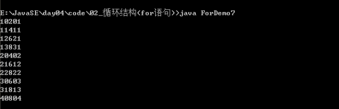

## 2.4 while循环语句格式

### 基本格式

```java
while(判断条件语句) {
      循环体语句;
}
```
### 扩展格式

```java
初始化语句;
while(判断条件语句) {
      循环体语句;
      控制条件语句;
}
```
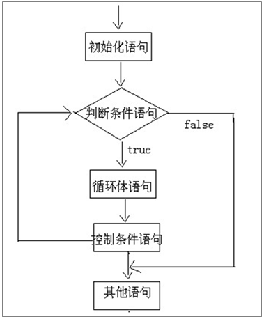

### 循环结构(for循环和while循环的区别)：

for循环语句和while循环语句可以等价转换，但还是有些小区别的

- 使用区别：控制条件语句所控制的那个变量，在for循环结束后，就不能再被访问到了，而while循环结束还可以继续使用，如果你想继续使用，就用while，否则推荐使用for。原因是for循环结束，该变量就从内存中消失，能够提高内存的使用效率。
- 场景区别：for循环适合针对一个范围判断进行操作,while循环适合判断次数不明确操作

```java
/*
    练习：用while循环实现
    左边：求出1-100之和
    右边：统计水仙花数有多少个

    初始化语句;
    while(判断条件语句) {
         循环体语句;
         控制条件语句;
    }


    for(初始化语句;判断条件语句;控制条件语句) {
        循环体语句;
    }

*/  
class WhileDemo2 {  
    public static void main(String[] args) {  
        //求出1-100之和  
        //for语句版本  
        int sum = 0;  

        for(int x=1; x<=100; x++) {  
            sum+=x;  
        }  

        System.out.println("sum:"+sum);  
        System.out.println("--------");  
        //while语句版本  
        int sum2 = 0;  

        int y=1;  
        while(y<=100) {  
            sum2+=y;  
            y++;  
        }  

        System.out.println("sum2:"+sum2);  
        System.out.println("--------");  
    }  
}  
```

运行结果：

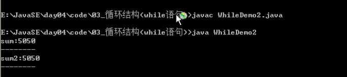

```java
/*
    需求：统计水仙花数有多少个
*/  
class WhileDemo3 {  
    public static void main(String[] args) {  
        //for循环版本  
        int count = 0;  

        for(int x=100; x<1000; x++) {  
            int ge = x%10;  
            int shi = x/10%10;  
            int bai = x/10/10%10;  

            if((ge*ge*ge+shi*shi*shi+bai*bai*bai) == x) {  
                count++;  
            }  
        }  

        System.out.println("count:"+count);  
        System.out.println("------------");  

        //while循环版本  
        int count2 = 0;  

        int y = 100;  
        while(y<1000) {  
            int ge = y%10;  
            int shi = y/10%10;  
            int bai = y/10/10%10;  

            if((ge*ge*ge+shi*shi*shi+bai*bai*bai) == y) {  
                count2++;  
            }  

            y++;  
        }  

        System.out.println("count2:"+count2);  
    }  
}  
```

运行结果：

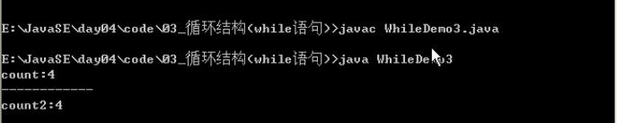

## 2.4 while循环和for循环的区别?

使用区别：如果你想在循环结束后，继续使用控制条件的那个变量，用while循环，否则用for循环。不知道用for循环。因为变量及早的从内存中消失，可以提高内存的使用效率。

其实还有一种场景的理解:
如果是一个范围的，用for循环非常明确。
如果是不明确要做多少次，用while循环较为合适。举例：吃葡萄。

```java
class WhileDemo4 {  
    public static void main(String[] args) {  
        //for循环实现  
        for(int x=0; x<10; x++) {  
            System.out.println("学习Java技术哪家强,中国北京传智播客");  
        }  
        //这里不能在继续访问了  
        //System.out.println(x);  

        //while循环实现  
        int y = 0;  
        while(y<10) {  
            System.out.println("学习Java技术哪家强,中国北京传智播客");  
            y++;  
        }  
        //这里是可以继续访问的  
        System.out.println(y);  
    }  
}   
```

## 2.5 do…while循环语句格式

### 基本格式

```java
do {
      循环体语句;
}while((判断条件语句);
```
### 扩展格式

```java
初始化语句;
do {
     循环体语句;
     控制条件语句;
} while((判断条件语句);
```
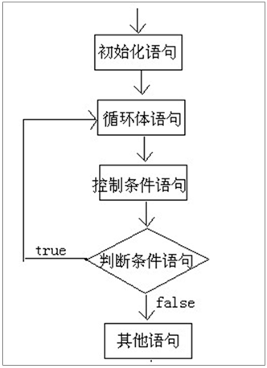

注意死循环：

A:一定要注意控制条件语句控制的那个变量的问题，不要弄丢了，否则就容易死循环。
B:两种最简单的死循环格式
```java
while(true){...}
for(;;){...}
```
## 2.6 循环嵌套

代码示例：九九表

```java
/*
    需求：在控制台输出九九乘法表。

    首先我们写出九九乘法表：
        1*1=1
        1*2=2   2*2=4
        1*3=3   2*3=6   3*3=9
        1*4=4   2*4=8   3*4=12  4*4=16
        ...
        1*9=9   2*9=18  3*9=27  ...

    我们先把这个九九乘法表看出是这样的一个形状：
        *
        **
        ***
        ****
        *****
        ******
        *******
        ********
        *********

    注意：
        '\x' x表示任意，这种做法叫转移字符。

        '\t'    tab键的位置
        '\r'    回车
        '\n'    换行
*/  
class ForForDemo3 {  
    public static void main(String[] args) {  
        for(int x=0; x<9; x++) {  
            for(int y=0; y<=x; y++) {  
                System.out.print("*");  
            }  
            System.out.println();  
        }  
        System.out.println("--------------");  
        //为了使用数据，我们从1开始  
        for(int x=1; x<=9; x++) {  
            for(int y=1; y<=x; y++) {  
                System.out.print(y+"*"+x+"="+y*x+"\t");  
            }  
            System.out.println();  
        }  
    }  
}  
```

运行结果：

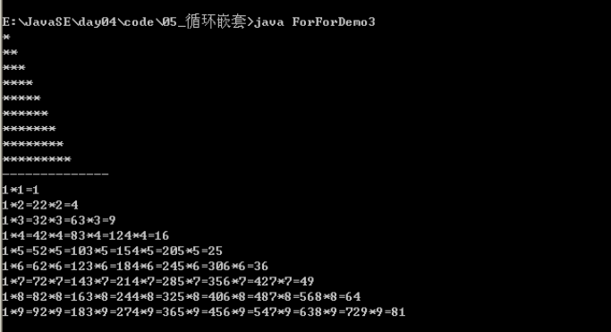

## 2.7 跳转控制语句

 Java中的goto是保留字，目前不能使用。虽然没有goto语句可以增强程序的安全性，但是也带来很多不便，比如说，我想在某个循环知道到某一步的时候就结束，现在就做不了这件事情。为了弥补这个缺陷，Java就提供了break，continue和return来实现控制语句的跳转和中断。

 break 中断、continue 继续、return 返回

### 2.7.1 break的使用场景

- 在选择结构switch语句中
- 在循环语句中
- 离开使用场景的存在是没有意义的

### 2.7.2 break的作用

- 跳出单层循环
- 跳出多层循环
  带标签的跳出
  格式：标签名: 循环语句
  标签名要符合Java的命名规则

```java
/*
    控制跳转语句：
        break:中断
        continue:继续
        return:返回

    break:中断的意思
    使用场景：
        A:switch语句中
        B:循环语句中。
            (循环语句中加入了if判断的情况)
        注意：离开上面的两个场景，无意义。

    如何使用呢?
        A:跳出单层循环
        B:跳出多层循环
            要想实现这个效果，就必须知道一个东西。带标签的语句。
            格式：
                标签名: 语句
*/  
class BreakDemo {  
    public static void main(String[] args) {  
        //在 switch 或 loop 外部中断  
        //break;  

        //跳出单层循环  
        for(int x=0; x<10; x++) {  
            if(x == 3) {  
                break;  
            }  
            System.out.println("HelloWorld");  
        }  

        System.out.println("over");  
        System.out.println("-------------");  

        wc:for(int x=0; x<3; x++) {  
            nc:for(int y=0; y<4; y++) {  
                if(y == 2) {  
                    //break nc;  
                    break wc;  
                }  
                System.out.print("*");  
            }  
            System.out.println();  
        }  
    }  
}  
```

### 2.7.3 continue的使用场景

- 在循环语句中
- 离开使用场景的存在是没有意义的

### 2.7.4 continue的作用

- 单层循环对比break，然后总结两个的区别
  - break  退出当前循环
  - continue  退出本次循环
- 也可以带标签的使用

```java
/*
    continue:继续

    使用场景：
        循环中。离开此场景无意义。

    测试，找到和break的区别：
        break:跳出单层循环
        continue:跳出一次循环，进入下一次的执行

    练习题：
        for(int x=1; x<=10; x++) {
            if(x%3==0) {
                //在此处填写代码
            }
            System.out.println(“Java基础班”);
        }

        我想在控制台输出2次:“Java基础班“
            break;
        我想在控制台输出7次:“Java基础班“
            continue;
        我想在控制台输出13次:“Java基础班“    
            System.out.println(“Java基础班”);


*/  
class ContinueDemo {  
    public static void main(String[] args) {  
        for(int x=0; x<10; x++) {  
            if(x == 3) {  
                //break;  
                continue;  
            }  

            System.out.println(x);  
        }  
    }  
}  
```

### 2.7.5 return关键字

不是为了跳转出循环体，更常用的功能是结束一个方法，也就是退出一个方法。跳转到上层调用的方法。这个在方法的使用那里会在详细的讲解

```java
/*
    return:返回

    其实它的作用不是结束循环的，而是结束方法的。
*/  
class ReturnDemo {  
    public static void main(String[] args) {  
        for(int x=0; x<10; x++) {  
            if(x == 2) {  
                System.out.println("退出");  
                //break;  
                //continue;  
                return;  
            }  

            System.out.println(x);  
        }  

        System.out.println("over");  
    }  
}  
```

# 3. 方法

## 3.1 方法概述

假设有一个游戏程序，程序在运行过程中，要不断地发射炮弹(植物大战僵尸)。发射炮弹的动作需要编写100行的代码，在每次实现发射炮弹的地方都需要重复地编写这100行代码，这样程序会变得很臃肿，可读性也非常差。为了解决代码重复编写的问题，可以将发射炮弹的代码提取出来放在一个{}中，并为这段代码起个名字，这样在每次发射炮弹的地方通过这个名字来调用发射炮弹的代码就可以了。上述过程中，所提取出来的代码可以被看作是程序中定义的一个方法，程序在需要发射炮弹时调用该方法即可。

## 3.2 方法定义及格式

1、简单的说：方法就是完成特定功能的代码块
  在很多语言里面都有函数的定义，函数在Java中被称为方法
2、格式：
```Java
修饰符 返回值类型 方法名(参数类型 参数名1，参数类型 参数名2…) {
     函数体;
     return 返回值;
 }
```
## 3.3 方法格式解释

- 修饰符 比较多，后面会详细介绍。目前public static
- 返回值类型 用于限定返回值的数据类型
- 方法名 一个名称，为了方便我们调用方法
- 参数类型 限定调用方法时传入参数的数据类型
- 参数名 是一个变量，接收调用方法时传入的参数
- 方法体 完成功能的代码
- return 结束方法以及返回方法指定类型的值
- 返回值 程序被return带回的结果，返回给调用者

## 3.4 有明确返回值的方法调用
- 单独调用，没有意义
- 输出调用，有意义，但是不够好，因为我不一定非要把结果输出
- 赋值调用，推荐方式

注意事项：

- 方法不调用不执行
- 方法与方法是平级关系，不能嵌套定义
- 方法定义的时候参数之间用逗号隔开
- 方法调用的时候不用在传递数据类型
- 如果方法有明确的返回值，一定要有return带回一个值

## 3.5 没有明确返回值的函数调用
- 其实就是void类型方法的调用
- 只能单独调用

## 3.6 方法调用图解

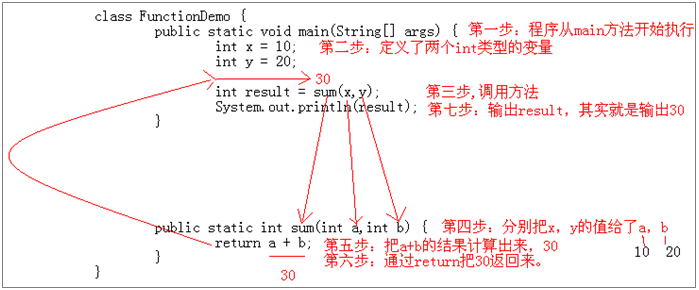

## 3.7 方法重载
- 方法重载概述

   在同一个类中，允许存在一个以上的同名方法，只要它们的参数个数或者参数类型不同即可。

- 方法重载特点

   与返回值类型无关，只看方法名和参数列表
   在调用时，虚拟机通过参数列表的不同来区分同名方法

```java
/*
    比较两个数据是否相等。参数类型分别为
        两个byte类型，两个short类型，两个int类型，两个long类型，
    并在main方法中进行测试
*/  
class FunctionTest6 {  
    public static void main(String[] args) {  
        //测试  
        byte b1 = 3;  
        byte b2 = 4;  
        System.out.println("byte:"+compare(b1,b2));  

        //测试  
        short s1 = 5;  
        short s2 = 5;  
        System.out.println("short:"+compare(s1,s2));  

        //后面的两个自己测试  
    }  

    //byte类型  
    public static boolean compare(byte a,byte b) {  
        System.out.println("byte");  
        return a == b;  
    }  

    //short类型  
    public static boolean compare(short a,short b) {  
        System.out.println("short");  
        return a == b;  
    }  

    //int类型  
    public static boolean compare(int a,int b) {  
        System.out.println("int");  
        return a == b;  
    }  

    //long类型  
    public static boolean compare(long a,long b) {  
        System.out.println("long");  
        return a == b;  
    }  
}  
```

运行结果：

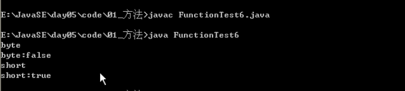

# 4. 数组

## 4.1 数组概述

需求：现在需要统计某公司员工的工资情况，例如计算平均工资、找到最高工资等。假设该公司有80名员工，用前面所学的知识，程序首先需要声明80个变量来分别记住每位员工的工资，然后在进行操作，这样做会显得很麻烦。为了解决这种问题，Java就提供了数组供我们使用

那么数组到底是什么呢?有什么特点呢?通过上面的分析：我们可以得到如下两句话：

- 数组是存储多个变量(元素)的东西(容器)
- 这多个变量的数据类型要一致

## 4.2 数组概念

- 数组是存储同一种数据类型多个元素的集合。也可以看成是一个容器
- 数组既可以存储基本数据类型，也可以存储引用数据类型

## 4.3 数组的定义格式

格式1：数据类型[] 数组名;
格式2：数据类型 数组名[];
注意：这两种定义做完了，数组中是没有元素值的

## 4.4 数组初始化概述：

- Java中的数组必须先初始化,然后才能使用
- 所谓初始化：就是为数组中的数组元素分配内存空间，并为每个数组元素赋值
- 数组的初始化方式
  - 动态初始化：初始化时只指定数组长度，由系统为数组分配初始值。
  - 静态初始化：初始化时指定每个数组元素的初始值，由系统决定数组长度
- 动态初始化：初始化时只指定数组长度，由系统为数组分配初始值

格式：数据类型[] 数组名 = new 数据类型[数组长度];
数组长度其实就是数组中元素的个数。
举例：int[] arr = new int[3];
解释：定义了一个int类型的数组，这个数组中可以存放3个int类型的值。

## 4.5 Java中的内存分配

Java 程序在运行时，需要在内存中的分配空间。为了提高运算效率，就对空间进行了不同区域的划分，因为每一片区域都有特定的处理数据方式和内存管理方式。

- 栈 存储局部变量
- 堆 存储new出来的东西
- 方法区 (面向对象部分讲)
- 本地方法区 (和系统相关)
- 寄存器 (给CPU使用)

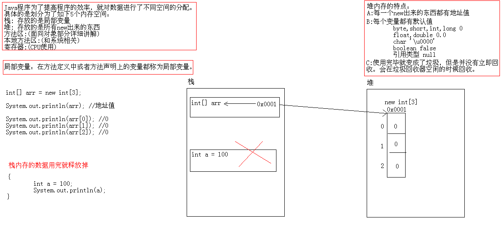

## 4.6 Java中数组的内存图解

图解1：定义一个数组，输出数组名及元素。然后给数组中的元素赋值，再次输出数组名及元素。

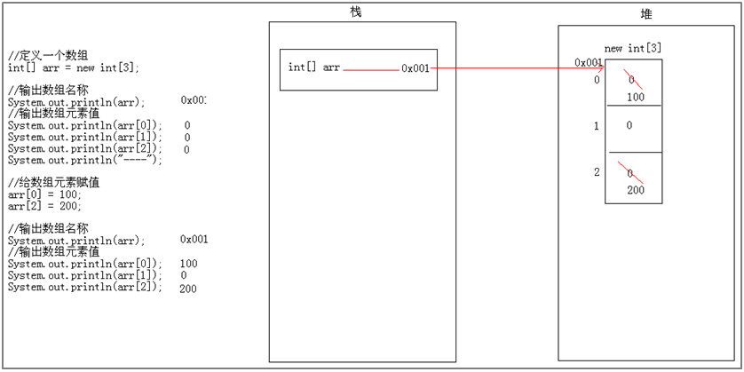

图解2：定义两个数组，分别输出数组名及元素。然后分别给数组中的元素赋值，分别再次输出数组名及元素。


图解3：定义两个数组，先定义一个数组，赋值，输出。然后定义第二个数组的时候把第一个数组的地址赋值给第二个数组。然后给第二个数组赋值，再次输出两个数组的名及元素。

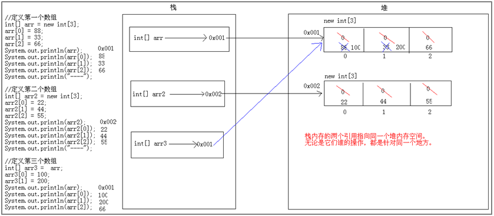

## 4.7 数组的初始化
静态初始化：初始化时指定每个数组元素的初始值，由系统决定数组长度。
格式：数据类型[] 数组名 = new 数据类型[]{元素1,元素2,…};
举例：int[] arr = new int[]{1,2,3};
解释：定义了一个int类型的数组，这个数组中可以存放3个int类型的值，并且值分别是1,2,3。
其实这种写法还有一个简化的写法：int[] arr = {1,2,3};

## 4.8 数组操作常见的两个小问题

- ArrayIndexOutOfBoundsException 数组索引越界
  访问到了数组中的不存在的索引时发生
- NullPointerException 空指针异常
  数组引用没有指向实体，却在操作实体中的元素时。

## 4.9 二维数组概述

二维数组概述

我们传智播客的Java基础班每个班有很多个学生，所以，可以用数组来存储，而我们又同时有很多个Java基础班。这个也应该用一个数组来存储。如何来表示这样的数据呢?Java就提供了二维数组供我们使用。由此可见：其实二维数组其实就是一个元素为一维数组的数组。

二维数组定义格式
（1）格式1
```java
数据类型[][] 变量名 = new 数据类型[m][n];
// m表示这个二维数组有多少个一维数组
// n表示每一个一维数组的元素个数
```
举例：
```java
int[][] arr = new int[3][2];
// 定义了一个二维数组arr
// 这个二维数组有3个一维数组，名称是arr[0],arr[1],arr[2]
// 每个一维数组有2个元素，可以通过arr[m][n]来获取
// 表示获取第m+1个一维数组的第n+1个元素
```

（2）格式2
```java
数据类型[][] 变量名 = new 数据类型[m][];
// m表示这个二维数组有多少个一维数组
// 这一次没有直接给出一维数组的元素个数，可以动态的给出。
```
举例：
```java
int[][] arr = new int[3][];
arr[0] = new int[2];
arr[1] = new int[3]
arr[2] = new int[1];
```
（3）格式3
```java
数据类型[][] 变量名 = new 数据类型[][]{ {元素…},{元素…},{元素…} };
简化版格式：数据类型[][] 变量名 = { {元素…},{元素…},{元素…} };
举例：int[][] arr =  { {1,2,3},{4,6},{6} };
```
## 4.10 数组常见操作

### 4.10.1 数组遍历

```java
/*
    数组遍历：就是依次输出数组中的每一个元素。

    注意：数组提供了一个属性length，用于获取数组的长度。
          格式：数组名.length
*/  
class ArrayTest {  
    public static void main(String[] args) {  
        //定义数组  
        int[] arr = {11,22,33,44,55};  

        //获取每一个元素  
        //如何获取呢?我们知道数组名结合编号(索引)就可以找到数据  
        for(int x=0; x<5; x++) {  
            //x=0,1,2,3,4  
            System.out.println(arr[x]);  
        }  
        System.out.println("--------------------");  

        //从0开始我们是明确的，但是为什么到5呢，我们是数了一下数组的个数  
        //继续看下个数组如何遍历  
        int[] arr2 = {1,2,3,4,5,6,7,8,9,10,11,2,2,3,4,5,7,8,5,3,5,6,8,7,8,5,3,5,6,8,7,8,5,3,5,6,8,7,8,5,3,5,6,8,7,8,5,3,5,6,8};  
        //而我们在很多时候，数组的元素不能靠数  
        //这个时候，数组就给我们提供了一个属性：length专门用于获取数组的长度  
        //格式：数组名.length 返回数组的长度  
        System.out.println(arr.length);  
        System.out.println(arr2.length);  
        System.out.println("--------------------");  

        //改进第一个程序  
        for(int x=0; x<arr.length; x++) {  
            System.out.println(arr[x]);  
        }  
        System.out.println("--------------------");  

        //我们如果想要对多个数组进行遍历，每个数组的遍历我们都把代码写一遍，麻烦不  
        //麻烦，所以，我们准备用方法改进。  
        //用方法改进后，请调用  
        printArray(arr);  
        System.out.println("--------------------");  
        printArray(arr2);  
        System.out.println("--------------------");  
        printArray2(arr);  
    }  

    /*
        遍历数组的方法

        两个明确：
            返回值类型：void
            参数列表：int[] arr
    */  
    public static void printArray(int[] arr) {  
        for(int x=0; x<arr.length; x++) {  
            System.out.println(arr[x]);  
        }  
    }  

    //请看改进版本  
    public static void printArray2(int[] arr) {  
        System.out.print("[");  
        for(int x=0; x<arr.length; x++) {  
            if(x == arr.length-1) { //这是最后一个元素  
                System.out.println(arr[x]+"]");  
            }else {  
                System.out.print(arr[x]+", ");  
            }  
        }  
    }  
}
```

### 4.10.2 获取数组最值

```java
/*
    数组获取最值(获取数组中的最大值最小值)

    分析：
        A:定义一个数组，并对数组的元素进行静态初始化。
        B:从数组中任意的找一个元素作为参照物(一般取第一个),默认它就是最大值。
        C:然后遍历其他的元素，依次获取和参照物进行比较，如果大就留下来，如果小，就离开。
        D:最后参照物里面保存的就是最大值。
*/  
class ArrayTest2 {  
    public static void main(String[] args) {  
        //定义一个数组  
        int[] arr = {34,98,10,25,67};  

        //请获取数组中的最大值  
        /*
        //从数组中任意的找一个元素作为参照物
        int max = arr[0];
        //然后遍历其他的元素
        for(int x=1; x<arr.length; x++) {
            //依次获取和参照物进行比较，如果大就留下来，如果小，就离开。
            if(arr[x] > max) {
                max = arr[x];
            }
        }
        //最后参照物里面保存的就是最大值。
        System.out.println("max:"+max);
        */  

        //把这个代码用方法改进  
        //调用方法  
        int max = getMax(arr);  
        System.out.println("max:"+max);  

        //请获取数组中的最小值  
        int min = getMin(arr);  
        System.out.println("min:"+min);  
    }  

    /*
        需求：获取数组中的最大值
        两个明确：
            返回值类型：int
            参数列表：int[] arr
    */  
    public static int getMax(int[] arr) {  
        //从数组中任意的找一个元素作为参照物  
        int max = arr[0];  
        //然后遍历其他的元素  
        for(int x=1; x<arr.length; x++) {  
            //依次获取和参照物进行比较，如果大就留下来，如果小，就离开。  
            if(arr[x] > max) {  
                max = arr[x];  
            }  
        }  
        //最后参照物里面保存的就是最大值。  
        return max;  
    }  

    public static int getMin(int[] arr) {  
        //从数组中任意的找一个元素作为参照物  
        int min = arr[0];  
        //然后遍历其他的元素  
        for(int x=1; x<arr.length; x++) {  
            //依次获取和参照物进行比较，如果小就留下来，如果大，就离开。  
            if(arr[x] < min) {  
                min = arr[x];  
            }  
        }  
        //最后参照物里面保存的就是最小值。  
        return min;  
    }  
}
```
运行结果：

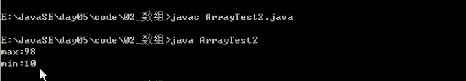

### 4.10.3 数组元素逆序

```java
/*
    数组元素逆序 (就是把元素对调)

    分析：
        A:定义一个数组，并进行静态初始化。
        B:思路
            把0索引和arr.length-1的数据交换
            把1索引和arr.length-2的数据交换
            ...
            只要做到arr.length/2的时候即可。
*/  
class ArrayTest3 {  
    public static void main(String[] args) {  
        //定义一个数组，并进行静态初始化。  
        int[] arr = {12,98,50,34,76};  

        //逆序前  
        System.out.println("逆序前：");  
        printArray(arr);  

        //逆序后  
        System.out.println("逆序后：");  
        //reverse(arr);  
        reverse2(arr);  
        printArray(arr);  
    }  

    /*
        需求：数组逆序
        两个明确：
            返回值类型：void (有人会想到应该返回的是逆序后的数组，但是没必要，因为这两个数组其实是同一个数组)
            参数列表：int[] arr
    */  
    public static void reverse(int[] arr) {  
        /*
        //第一次交换
        int temp = arr[0];
        arr[0] = arr[arr.length-1-0];
        arr[arr.length-1-0] = temp;

        //第二次交换
        int temp = arr[1];
        arr[1] = arr[arr.length-1-1];
        arr[arr.length-1-1] = temp;

        //第三次交换
        int temp = arr[2];
        arr[2] = arr[arr.length-1-2];
        arr[arr.length-1-2] = temp;
        */  
        //用循环改进  
        for(int x=0; x<arr.length/2; x++) {  
            int temp = arr[x];  
            arr[x] = arr[arr.length-1-x];  
            arr[arr.length-1-x] = temp;  
        }  
    }  

    public static void reverse2(int[] arr) {  
        for(int start=0,end=arr.length-1; start<=end; start++,end--) {  
            int temp = arr[start];  
            arr[start] = arr[end];  
            arr[end] = temp;  
        }  
    }  

    //遍历数组  
    public static void printArray(int[] arr) {  
        System.out.print("[");  
        for(int x=0; x<arr.length; x++) {  
            if(x == arr.length-1) { //这是最后一个元素  
                System.out.println(arr[x]+"]");  
            }else {  
                System.out.print(arr[x]+", ");  
            }  
        }  
    }  
}  
```
运行结果：

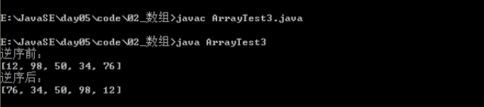

### 4.10.4 数组基本查找

```java
/*
    需求：数组元素查找(查找指定元素第一次在数组中出现的索引)

    分析：
        A:定义一个数组，并静态初始化。
        B:写一个功能实现
            遍历数组，依次获取数组中的每一个元素，和已知的数据进行比较
            如果相等，就返回当前的索引值。
*/  
class ArrayTest5 {  
    public static void main(String[] args) {  
        //定义一个数组，并静态初始化  
        int[] arr = {200,250,38,888,444};  

        //需求：我要查找250在这个数组中第一次出现的索引  
        int index = getIndex(arr,250);  
        System.out.println("250在数组中第一次出现的索引是："+index);  

        int index2 = getIndex2(arr,250);  
        System.out.println("250在数组中第一次出现的索引是："+index2);  

        int index3 = getIndex2(arr,2500);  
        System.out.println("2500在数组中第一次出现的索引是："+index3);  
    }  

    /*
        需求：查找指定数据在数组中第一次出现的索引
        两个明确：
            返回值类型：int
            参数列表：int[] arr,int value
    */  
    public static int getIndex(int[] arr,int value) {  
        //遍历数组，依次获取数组中的每一个元素，和已知的数据进行比较  
        for(int x=0; x<arr.length; x++) {  
            if(arr[x] == value) {  
                //如果相等，就返回当前的索引值。  
                return x;  
            }  
        }  

        //目前的代码有一个小问题  
        //就是假如我要查找的数据在数组中不存在，那就找不到，找不到，你就对应的返回吗?  
        //所以报错。  

        //只要是判断，就可能是false，所以大家要细心。  


        //如果找不到数据，我们一般返回一个负数即可，而且是返回-1  
        return -1;  
    }  

    public static int getIndex2(int[] arr,int value) {  
        //定义一个索引  
        int index = -1;  

        //有就修改索引值  
        for(int x=0; x<arr.length; x++) {  
            if(arr[x] == value) {  
                index = x;  
                break;  
            }  
        }  

        //返回index  
        return index;  
    }  
}  
```
运行结果：

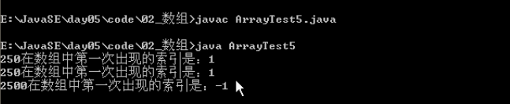

## 4.11 随机点名器

```java
package cn.itcast.chapter02.task03;
import java.util.Random;
import java.util.Scanner;
/**
 * 随机点名器
 */
public class CallName {
	/**
	 * 1.存储全班同学姓名 创建一个存储多个同学姓名的容器（数组） 键盘输入每个同学的姓名，存储到容器中（数组）
	 */
	public static void addStudentName(String[] students) {
		// 键盘输入多个同学姓名存储到容器中
		Scanner sc = new Scanner(System.in);
		for (int i = 0; i < students.length; i++) {
			System.out.println("存储第" + (i + 1) + "个姓名：");
			// 接收控制台录入的姓名字符串
			students[i] = sc.next();
		}
	}

	/**
	 * 2.总览全班同学姓名
	 */
	public static void printStudentName(String[] students) {
		// 遍历数组，得到每个同学姓名
		for (int i = 0; i < students.length; i++) {
			String name = students[i];
			// 打印同学姓名
			System.out.println("第" + (i + 1) + "个学生姓名：" + name);
		}
	}

	/**
	 * 3.随机点名其中一人
	 */
	public static String randomStudentName(String[] students) {
		// 根据数组长度，获取随机索引
		int index = new Random().nextInt(students.length);
		// 通过随机索引从数组中获取姓名
		String name = students[index];
		// 返回随机点到的姓名
		return name;
	}

	public static void main(String[] args) {
		System.out.println("--------随机点名器--------");
		// 创建一个可以存储多个同学姓名的容器（数组）
		String[] students = new String[3];
		/*
		 * 1.存储全班同学姓名
		 */
		addStudentName(students);
		/*
		 * 2.总览全班同学姓名
		 */
		printStudentName(students);
		/*
		 * 3.随机点名其中一人
		 */
		String randomName = randomStudentName(students);
		System.out.println("被点到名的同学是 :" + randomName);
	}
}
```