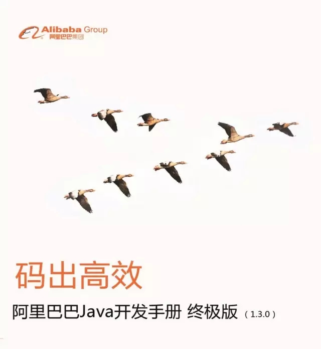
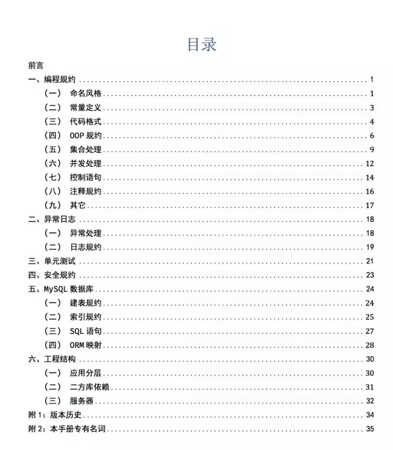

别人都说我们是码农，但我们知道，自己是个艺术家。也许我们不过多在意自己的外表和穿着，但我们不羁的外表下，骨子里追求着代码的美、质量的美。而代码规约其实就是一个对美的定义。

《阿里巴巴Java开发手册》系统性地从编程、数据库、异常日志、工程结构、安全、单元测试六大方面，总结出优秀Java开发者必备的技术素养。时值手册发布一周年之际，阿里官方对外正式公开《阿里巴巴Java开发手册》终！极！版！！！

该版本将是阿里官方对外释放的最后一个PDF版本，也是史上内容最全、修正最为彻底的一个版本，并且史无前例地增加了单元测试规约，绝对值得珍藏。

## 如何快速下载？

关注阿里技术微信公众号，回复“手册”两字即可免费下载。

## 单元测试规约，优秀开发者的必备技能

单元测试是一件老生常谈，深入人心的事情，但是喜欢写单元测试的开发同学少之又少。单元测试似乎是功不在当下的事情，快速完成需求成为了王道。在工作量评估的时候，如果开发同学说需要花上若干天时间来写单测，产品可能就会磨刀霍霍杀来。

尽管如此，单元测试是一件有情怀，有技术素养，有远期收益的工作。它能够有效监测软件模块质量、促进代码深度优化，进而降低线上故障率，长期执行有助于提升项目迭代效率，并增加重构自信，减少重构成本。简直就是bug灭绝器有木有！

所以此次在终极版本中，阿里根据内部单元测试的实践经验，详细描述了单元测试的相关原则和重要建议。

## AIR原则

A：Automatic，单元测试需要测试框架自动化执行，才有意义。

I：Independent，单元测试用例之间互相独立，不存在依赖关系。

R：Repeatable，单元测试可以被重复执行，且结果一致。

## BCDE原则

B：Border，边界值测试，包括循环边界、特殊取值、特殊时间点等。

C：Correct，正确的输入，并得到预期的结果。

D：Design，与设计文档相结合，来编写单元测试。

E：Error，强制错误信息输入（如：非法数据），并得到预期的结果。

更多关于单元测试的内容、优化项目，欢迎查阅《阿里巴巴Java开发手册》终极版。

## 一劳永逸：官方自动化IDE检测插件即将问世

为了帮助开发者更好提高编码效率，阿里巴巴基于手册内容，独立研发一套自动化IDE检测插件。该插件在扫描代码后，将不符合《手册》的代码按block/critical/major三个等级显示在下方；实时编写代码时，还会给出智能提示，告诉你如何编写可以更优雅；对于历史代码，部分规则实现了批量一键修复的功能。是不是很方便？

据悉，10月14日，杭州云栖大会研发效能峰会场，阿里将正式对外开放插件及源码。届时，阿里技术公众号将第一时间公开免费下载地址。

## 手册虽有终极版，技术没有终点站

编码规范的价值在业内有着广泛的共识，但在现实中却被否定得一塌糊涂。工程师曾经最引以为豪的代码，因为编码规范的缺失、命名的草率而全面地摧毁了彼此的互信，并严重地制约了彼此的高效协同。工程师一边吐槽别人的代码，一边写着可能遭受同样命运的代码，不时的推倒重建或心惊胆战的维护似乎成了工作的主旋律。

《阿里巴巴Java开发手册》的使命，在于帮助工程师脱离繁琐，重燃技术激情。业务会变、玩法会变、需求会变，做好代码质量的决心永不会变。

手册虽有终极版，技术没有终点站。不断打磨技术，成为更好的自己，我们共勉。

你对《阿里巴巴Java开发手册》终极版有哪些想法或建议？欢迎在留言区一起交流讨论哦。