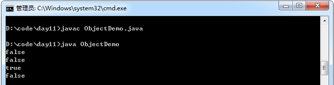
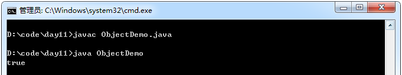
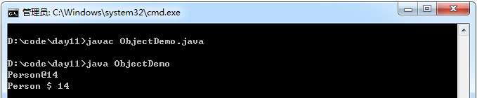

## Object类
在JDK中提供了一个Object类，它是类层次结构的根类，每个类都直接或间接继承自该类，所有对象（包括数组）

Object：所有类的根类。Object是不断抽取而来，具备着所有对象都具备的共性内容。


- getClass().getName()代表返回对象所属类的类名，即Animal。
- hashCode()代表返回该对象的哈希值。
- Integer.toHexString(hashCode())代表将对象的哈希值用16进制表示。

其中，hashCode()是Object类中定义的一个方法，这个方法将对象的内存地址进行哈希运算，返回一个int类型的哈希值。

示例：

```java
 class Person{
       private int age ;
       Person(int age){
              this.age = age;
       }
 }

 class Demo{
 }

 class ObjectDemo{
        public static void main(String[] args){
             Person p1 = new Person(20);
             Person p2 = new Person(20);
             Person p3 = p1;

             Demo d = new Demo();

             System. out.println(p1 == p2);//false
             System. out.println(p1.equals(p2));//false
             System. out.println(p1.equals(p3));//true
             System. out.println(p1.equals(d));//false
       }
 }
```

运行结果：




==以及Object类的equals方法默认都是根据对象的哈希值判断两个对象是否相等。可以通过覆盖Object的equals方法来重写比较规则。

示例：

```java
class Person{
    private int age ;
    Person( int age){
        this.age = age;
    }
    //比较Person的年龄，是否是同龄人
    //一般都会覆盖此方法，根据对象的特有内容，建立判断对象是否相同的依据。
    public boolean equals(Object obj){
        if(!(obj instanceof Person))
            throw new ClassCastException("类型错误");
        Person p = (Person)obj;
        return this .age == p.age;
    }
}

class ObjectDemo{
    public static void main(String[] args){
        Person p1 = new Person(20);
        Person p2 = new Person(20);

        System. out.println(p1.equals(p2));
    }
}
```

运行结果：



Object类的toString方法默认返回的内容是“对象所属的类名+@+对象的哈希值（十六进制）”。

示例：

```java
class Person{
    private int age ;
    Person(int age){
        this.age = age;
    }
    public int hashCode(){
        return age ;
    }
}

class ObjectDemo{
    public static void main(String[] args){
        Person p1 = new Person(20);

        System. out.println(p1);
        System. out.println(p1.getClass().getName() + " $ " +
                Integer.toHexString(p1.hashCode()));
    }
}
```

运行结果：



## Java 7 新增的 Objects 类