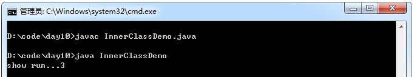
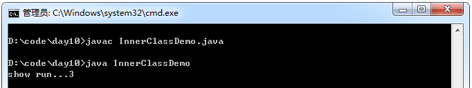
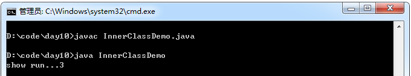
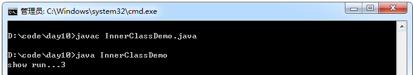
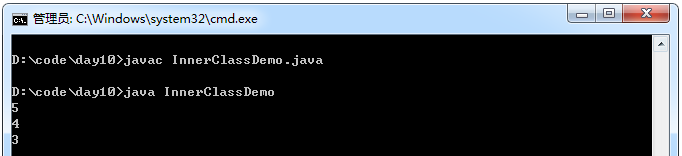
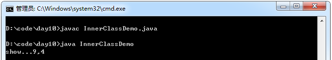
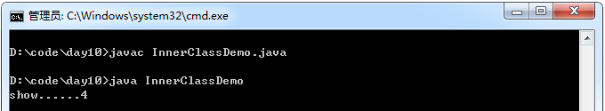
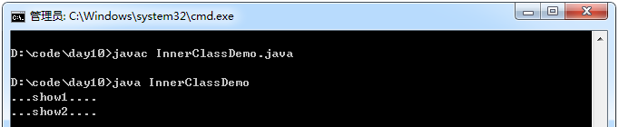
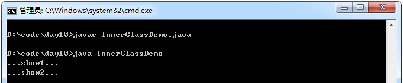
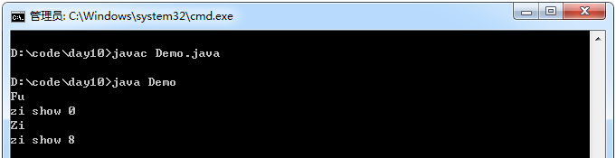

## 内部类

定义：将一个类定义在另一个类的里面，里面那个类就称为内部类（内置类，嵌套类）。

访问特点：内部类可以直接访问外部类中的成员，包括私有成员。而外部类要访问内部类中的成员必须要建立内部类的对象。

示例1：

```java
 /*
 内部类的设计：
 分析事物时，发现该事物描述中还有事物，而且这个事物还在访问被描述事物的内容，这时候就定义
内部类。
 */
 class Outer{
        private int num = 3;

        class Inner //内部类
        {
              void show(){
                   System.out.println("show run..." + num);
              }
        }

        public void method(){
             Inner in = new Inner();
             in.show();
        }
 }

 class InnerClassDemo{
        public static void main(String[] args){
             Outer out = new Outer();
             out.method();
        }
 }
```
运行结果：



示例2：

```java
class Outer{
    private int num = 3;

    class Inner
    {
        void show(){
            System.out.println("show run..." + num);
        }
    }
}

class InnerClassDemo{
    public static void main(String[] args){
        //直接访问外部类中的内部类中的成员
        Outer.Inner in = new Outer().new Inner();
        in.show();
    }
}
```
运行结果：



### 内部类的位置

内部类定义在成员位置上，可以被private、static成员修饰符修饰。被static修饰的内部类只能访问外部类中
的静态成员。

示例1：

```java
class Outer{
    private static int num = 3;

    static class Inner
    {
        void show(){
            System.out.println("show run..." + num);
        }
    }
}

class InnerClassDemo{
    public static void main(String[] args){
        //如果内部类是静态的，相当于一个外部类
        Outer.Inner in = new Outer.Inner();
        in.show();
    }
}
```
运行结果：



示例2：如果内部类是静态的，内部类成员也是静态的，可以不用创建内部类对象，直接调用。
```java
class Outer{
    private static int num = 3;

    static class Inner
    {
        static void show(){
            System.out.println("show run..." + num);
        }
    }
}

class InnerClassDemo{
    public static void main(String[] args){
        Outer.Inner.show();
    }
}
```
运行结果：



PS：如果内部类中定义了静态成员，该内部类也必须是静态的！

示例：
```java
class Outer{
    private static int num = 3;

    static class Inner
    {
        static void show(){
            System.out.println("show run..." + num);
        }
    }
}
```
2、为什么内部类能直接访问外部类中的成员呢？
那是因为内部类持有了外部类的引用，外部类名.this。

示例：

```java
class Outer{
    int num = 3;
    class Inner{
        int num = 4;
        void show(){
            int num = 5;
            System.out.println(num);
            System.out.println(this.num);
            System.out.println(Outer.this.num);
        }
    }
    void method(){
        new Inner().show();
    }
}

class InnerClassDemo{
    public static void main(String[] args){
        new Outer().method();
    }
}
```
运行结果：



3、内部类定义在局部位置上，也可以直接访问外部类中的成员。
同时可以访问所在局部中的局部变量，但必须是被final修饰的。

示例：

```java
class Outer{
    int num = 3;
    void method(final int y){
        final int x = 9;
        class Inner{
            void show(){
                System.out.println("show..." + x + "," + y);
            }
        }
        Inner in = new Inner();
        in.show();
    }
}

class InnerClassDemo{
    public static void main(String[] args){
        new Outer().method(4);
    }
}
```
运行结果：



### 匿名内部类

定义：就是内部类的简化写法。
前提：内部类可以继承或实现一个外部类或者接口。
格式：new 外部类名或者接口名(){覆盖类或者接口中的代码，(也可以自定义内容。)}
简单理解：就是建立一个带内容的外部类或者接口的子类匿名对象。

什么时候使用匿名内部类呢？
通常使用方法是接口类型参数，并且该接口中的方法不超过三个，可以将匿名内部类作为参数传递。

好处：增强阅读性。

示例1：

```java
abstract class Demo{
    abstract void show();
}

class Outer{
    int num = 4;

    void method(){
        new Demo(){//匿名内部类
            void show(){
                System.out.println("show......" + num);
            }
        }.show();
    }
}

class InnerClassDemo{
    public static void main(String[] args){
        new Outer().method();
    }
}
```
运行结果：



示例2：

```java
interface Inter{
    void show1();
    void show2();
}

class Outer{
    public void method(){
        Inter in = new Inter(){
            public void show1(){
                System.out.println("...show1...." );
            }
            public void show2(){
                System.out.println("...show2...." );
            }
        };
        in.show1();
        in.show2();
    }
}

class InnerClassDemo{
    public static void main(String[] args){
        new Outer().method();
    }
}
```
运行结果：



示例3：

```java
interface Inter{
    void show1();
    void show2();
}

/*
通常的使用场景之一：
当函数参数是接口类型时，而且接口中的方法不超过三个。
可以用匿名内部类作为实际参数进行传递。
*/
class InnerClassDemo{
    public static void main(String[] args){
        show(new Inter(){
            public void show1(){
                System.out.println("...show1..." );
            }
            public void show2(){
                System.out.println("...show2..." );
            }
        });
    }
    public static void show(Inter in){
        in.show1();
        in.show2();
    }
}
```
运行结果：



对象的初始化过程

示例：

```java
class Fu{
    int num = 9;

    {
        System.out.println("Fu" );
    }

    Fu(){
        super();//Object
        //显示初始化
        //构造代码块初始化
        show();
    }
    void show(){
        System.out.println("fu show " + num);//被覆盖，运行子类的
    }
}

class Zi extends Fu{
    int num = 8;

    {
        System.out.println("Zi" );
    }

    Zi(){
        super();
        //显示初始化
        //构造代码块初始化
        show();
    }

    void show(){
        System.out.println("zi show " + num);
    }
}

public class Demo{
    public static void main(String[] args){
        new Zi();
    }
}
```
运行结果


