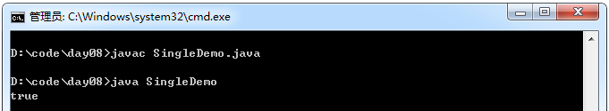
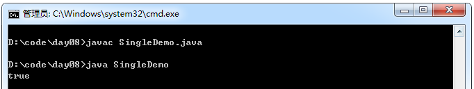

###  单例设计模式

设计模式：对问题行之有效的解决方式，其实，它是一种思想。
单例设计模式解决的问题：就是可以保证一个类在内存中的对象唯一性。
比如多个程序使用同一个配置信息对象时，就需要保证该对象的唯一性。

如何保证对象唯一性呢？

1. 不允许其他程序用new创建该类对象。
2. 在该类创建一个本类实例。
3. 对外提供一个方法让其他程序可以获取该对象。

步骤：

1. 私有化该类构造函数。
2. 通过new在本类中创建一个本类对象。
3. 定义一个公有的方法，将创建的对象返回。

示例（饿汉式）：

```java
class Single{
    //类已加载，对象就已经存在了
    private static Single s = new Single();
    private Single(){}
    public static Single getInstance(){
        return s ;
    }
}

class SingleDemo{
    public static void main(String[] args){
        Single s1 = Single.getInstance();
        Single s2 = Single. getInstance();
        System.out.println(s1 == s2);
    }
}
```
运行结果：



**注意事项：**

之所以不用Single.s;的方式获取Single对象，而采用getInstance获取是因为在getInstance方法中我们可以做一些判断来决定是否返回Single的对象，也就是实现了对单例对象的可控。所以，给Single的构造方法加上了private限制，禁止使用者直接采用Single.s;的方式获取。

示例（懒汉式）：

```java
class Single{
    //类加载进来，没有对象，只有调用了getInstance方法时，才会创建对象
    //延迟加载形式
    private static Single s = null;
    private Single(){}
    public static Single getInstance(){
        if(s == null)
            s = new Single();
        return s ;
    }
}
class SingleDemo{
    public static void main(String[] args){
        Single s1 = Single. getInstance();
        Single s2 = Single. getInstance();
        System.out.println(s1 == s2);
    }
}
```
运行结果：


