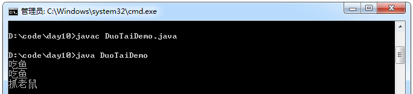
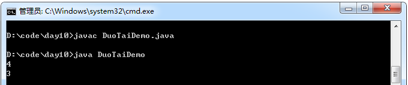
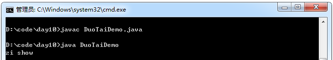
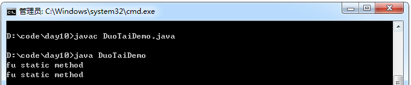

## 多态

在设计一个方法时，通常希望该方法具备一定的通用性。例如要实现一个动物叫的方法，由于每种动物的叫声是不同的，因此可以在方法中接收一个动物类型的参数，当传入猫类对象时就发出猫类的叫声，传入犬类对象时就发出犬类的叫声。在同一个方法中，这种由于参数类型不同而导致执行效果各异的现象就是多态。继承是多态得以实现的基础。

在Java中为了实现多态，允许使用一个父类类型的变量来引用一个子类类型的对象，根据被引用子类对象特征的不同，得到不同的运行结果。

定义：某一类事物的多种存在形态。

例：动物中猫，狗。
猫这个对象对应的类型是猫类型：猫 x = new 猫();
同时猫也是动物中的一种，也可以把猫称为动物：动物  y = new 猫();
动物是猫和狗具体事物中抽取出来的父类型。
父类型引用指向了子类对象。

多态性简单说就是一个对象对应着不同类型。

体现：父类或者接口的引用指向或者接收自己的子类对象。
作用：多态的存在提高了程序的扩展性和后期可维护性。

前提：

1. 需要存在继承或者实现关系。
2. 需要有覆盖操作。

好处：提高了代码的扩展性，前期定义的代码可以使用后期的内容。
弊端：前期定义的内容不能使用（调用）后期子类的特有内容。

示例1：
```java
 abstract class Animal{
        abstract void eat();
 }

 class Dog extends Animal{
        void eat(){
             System.out.println("啃骨头");
        }
        void lookHome(){
             System.out.println("看家");
        }
 }

 class Cat extends Animal{
        void eat(){
             System.out.println("吃鱼");
        }
        void catchMouse(){
             System.out.println("抓老鼠");
        }
 }

 class Pig extends Animal{
        void eat(){
             System.out.println("饲料");
        }
        void gongdi(){
             System.out.println("拱地");
        }
 }

 class DuoTaiDemo{
        public static void main(String[] args){
             Cat c = new Cat();
             Dog d = new Dog();

              method(c);
              method(d);
              method(new Pig());
        }

        public static void method(Animal a){
             a.eat();
        }
 }
```
运行结果：


示例2：

```java
class DuoTaiDemo{
    public static void main(String[] args){
        //自动类型提升，猫对象提升到了动物类型。但是特有功能无法访问，作用就是限制对特有功能
        的访问。
        //专业讲：向上转型，将子类型隐藏。就不能使用子类的特有方法了。
        Animal a = new Cat();
        a.eat();
        //a.catchMouse();//报错

        //如果还想用具体动物猫的特有功能。
        //你可以将该对象进行向下转型。
        Cat c = (Cat)a; //向下转型的目的是为了能够使用子类中的特有方法。
        c.eat();
        c.catchMouse();

        //注意：对于转型，自始至终都是子类对象在做类型的变化。
        //Animal a = new Dog();
        //Cat c = (Cat)a;//但是类型不能随意转换，否则可能会报出ClassCastException的异常
    }

    public static void method(Animal a){
        a.eat();
    }
}
```
运行结果：



示例3：

```java
/*
 毕老师和毕姥爷的故事
 */
class 毕姥爷{
    void 讲课(){
        System.out.println("管理");
    }
    void 钓鱼(){
        System.out.println("钓鱼");
    }
}

class 毕老师 extends 毕姥爷{
    void 讲课(){
        System.out.println("Java");
    }
    void 看电影(){
        System.out.println("看电影");
    }
}

class DuoTaiDemo{
    public static void main(String[] args){
        毕老师 x = new 毕老师();
        x.讲课(); //Java
        x.看电影(); //看电影

        毕姥爷 y = new 毕老师();
        y.讲课(); //Java
        y.钓鱼(); //钓鱼

        毕老师 z = (毕老师)y;
        z.看电影(); //看电影
    }
}
```
运行结果：


instanceof ：用于判断对象的具体类型，只能用于引用数据类型判断，通常在向下转型前用于健壮性的判断。

示例4：

```java
class DuoTaiDemo{
    public static void main(String[] args){
    }

    public static void method(Animal a){
        a.eat();

        if(a instanceof Cat){
            Cat c = (Cat )a;
            c.catchMouse();
        }
        else if (a instanceof Dog){
            Dog d = (Dog )a;
            d.lookHome();
        }
    }
}
```

多态时，成员的特点：

1. 成员变量


编译时：参考引用型变量所属的类中是否有调用的成员变量。有，编译通过，没有，编译失败。

运行时：参考引用型变量所属的类中是否有调用的成员变量，并运行该所属类中的成员变量。

简单说：编译和运行都参考等号的左边。

示例：

```java
class Fu{
    int num = 3;
}

class Zi extends Fu{
    int num = 4;
}

class DuoTaiDemo{
    public static void main(String[] args){
        Zi f1 = new Zi();
        System.out.println(f1.num);
        Fu f2 = new Zi();
        System.out.println(f2.num);
    }
}
```
运行结果：



2. 成员函数（非静态）

编译时：参考引用型变量所属的类中是否有调用的函数。有，编译通过。没有，编译失败。

运行时：参考的是对象所属的类中是否有调用的函数。

简单说：编译看左边，运行看右边。

示例：
```java
class Fu{
    void show(){
        System.out.println("fu show");
    }
}

class Zi extends Fu{
    void show(){
        System.out.println("zi show");
    }
}

class DuoTaiDemo{
    public static void main(String[] args){
        Fu f = new Zi();
        f.show();
    }
}
```
运行结果：



3. 静态函数

编译时：参考的是对象所属的类中是否有调用的函数。

运行时：参考的是对象所属的类中是否有调用的函数。

简单说：编译和运行看左边。

示例：
```java
class Fu{
    static void method(){
        System.out.println("fu static method");
    }
}

class Zi extends Fu{
    static void method(){
        System.out.println("zi static method");
    }
}

class DuoTaiDemo{
    public static void main(String[] args){
        Fu f = new Zi();
        f.method();// fu static method
        Fu.method();
    }
}
```
运行结果：



## java中实现多态的机制是什么？

靠的是父类或接口定义的引用变量可以指向子类或具体实现类的实例对象，而程序调用的方法在运行期才动态绑定，就是引用变量所指向的具体实例对象的方法，也就是内存里正在运行的那个对象的方法，而不是引用变量的类型中定义的方法。重写、重载是多态性的不同表现

父类A有一个方法function(),子类B,C分别继承A并且重写function()，当创建一个对象A b = new B();b.function()就调用B的funciotn,假如你new C(),那调用的就是C重写的function。怎么判断使用那个类的function就是动态绑定，这个现象就是多态...

动态绑定机制