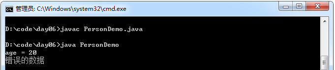

## 封装

封装：是指隐藏对象的属性和实现细节，仅对外提供公共访问方式。

好处：

1.  将变化隔离。
2.  便于使用。
3.  提高重用性。
4.  提高安全性。

封装原则：

1. 将不需要对外提供的内容都隐藏起来。
2. 把属性都隐藏，提供公共方法对其访问。如，getXXX，setXXX。

示例：

```java
    /**
     人：
     属性：年龄
     行为：说话
     */
    class Person{
        //private：私有，是一个权限修饰符，用于修饰
        //不希望别人直接访问赋值，需要通过私有化把属性进行隐藏
        private int age ;

        //通过提供set、get公共方法对其访问
        public void setAge( int a){
            //在set方法内可以对属性的赋值进行限制
            if (a > 0 && a < 130){
                age = a;
            } else
                System.out .println("错误的数据" );
        }

        public int getAge(){
            return age ;
        }

        void speak(){
            System.out .println("age = " + age);
        }
    }

    class PersonDemo{
        public static void main(String[] args){
            Person p = new Person();
            //通过其他方式访问
            p.setAge(20);
            p.speak();
            //赋值不合法，set方法就不允许成功赋值
            p.setAge(-20);
        }
    }
```

运行结果：



注意事项：

- 私有仅仅是封装的一种体现而已。
- private关键字：是一个权限修饰符，用于修饰成员(成员变量和成员函数)，被私有化的成员只在本类中有效。
- 常用场景之一：将成员变量私有化，对外提供对应的set、get方法对其进行访问，提高对数据访问的安全性。
