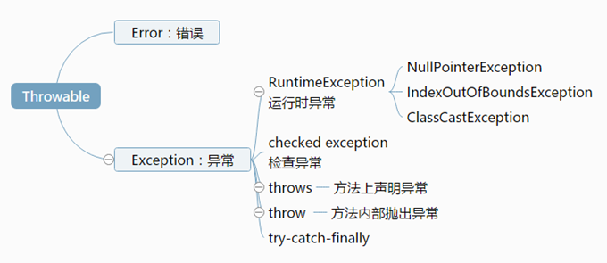
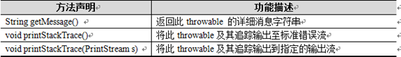
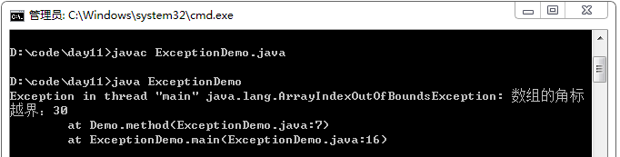
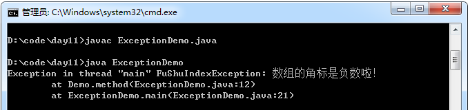
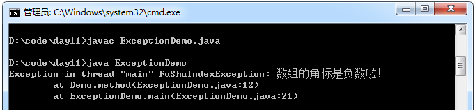
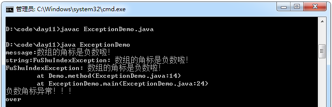
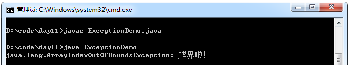
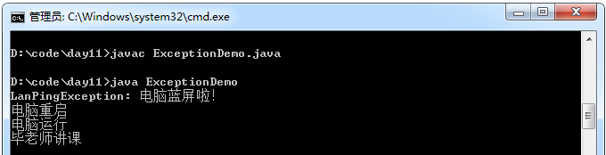

尽管人人希望自己身体健康，处理的事情都能顺利进行，但在实际生活中总会遇到各种状况，比如感冒发烧，工作时电脑蓝屏、死机等。同样，在程序运行的过程中，也会发生各种非正常状况，比如程序运行时磁盘空间不足、网络连接中断、被装载的类不存在等。针对这种情况，在Java语言中，引入了异常，以异常类的形式对这些非正常情况进行封装，通过异常处理机制对程序运行时发生的各种问题进行处理。

## 异常的体系



异常：是在运行时期发生的不正常情况。 在java中用类的形式对不正常情况进行了描述和封装对象。描述不正常的情况的类，就称为异常类。

1. 以前正常流程代码和问题处理代码相结合，现在将正常流程代码和问题处理代码分离，提高阅读性。
2. 其实异常就是java通过面向对象的思想将问题封装成了对象，用异常类对其进行描述。
3. 不同的问题用不同的类进行具体的描述。比如角标越界、空指针异常等等。
4. 问题很多，意味着描述的类也很多，将其共性进行向上抽取，形成了异常体系。

不正常情况分成了两大类：

Error类称为错误类，它表示Java运行时产生的系统内部错误或资源耗尽的错误，是比较严重的，仅靠修改程序本身是不能恢复执行的。举一个生活中的例子，在盖楼的过程中因偷工减料，导致大楼坍塌，这就相当于一个Error。使用java命令去运行一个不存在的类就会出现Error错误。

Exception类称为异常类，它表示程序本身可以处理的错误，在开发Java程序中进行的异常处理，都是针对Exception类及其子类。在Exception类的众多子类中有一个特殊的RuntimeException类，该类及其子类用于表示运行时异常，除了此类，Exception类下所有其他的子类都用于表示编译时异常。本节主要针对Exception类及其子类进行讲解。

Throwable：无论是error，还是异常、问题，问题发生就应该可以抛出，让调用者知道并处理。



该体系的特点就在于Throwable及其所有的子类都具有可抛性。

可抛性到底指的是什么呢？怎么体现可抛性呢？

其实是通过两个关键字来体现的：throws、throw，凡是可以被这两个关键字所操作的类和对象都具备可抛性。

1. 一般不可处理的：Error

   特点：是由jvm抛出的严重性问题。

   这种问题发生，一般不针对性处理，直接修改程序。

2. 可以处理的：Exception

   该体系的特点：子类的后缀名都是用其父类名作为后缀，阅读性很强。

## 常见异常

| 异常                              | 说明      |
| :------------------------------ | :------ |
| IndexOutOfBoundsException       | 角标越界异常  |
| NullPointerException            | 空指针异常   |
| ConcurrentModificationException | 并发修改异常  |
| ClassCastException              | 类型转换异常  |
| UnsupportedOperationException   | 不支持操作异常 |
| NullPointerException            | 没有元素异常  |
| IllegalArgumentException        | 非法参数异常  |
| IllegalAccessException          | 非法的访问异常 |

## Throwable常用方法

| 方法声明                          | 功能描述                               |
| :---------------------------- | :--------------------------------- |
| getMessage()                  | 获取异常信息，返回字符串。                      |
| toString()                    | 获取异常类名和异常信息，返回字符串。                 |
| printStackTrace()             | 获取异常类名和异常信息，以及异常出现在程序中的位置，返回值void。 |
| printStackTrace(PrintStreams) | 通常用该方法将异常内容保存在日志文件中，以便查阅。          |

示例：

```java
class Demo{
   public static int method(int[] arr, int index){
       if(arr == null){
           throw new NullPointerException("数组的引用不能为空！");
       }
       if(index >= arr.length ){
           throw new ArrayIndexOutOfBoundsException("数组的角标越界：" +
                   index);
       }
       return arr[index];
   }
}
class ExceptionDemo{
   public static void main(String[] args){
       int[] arr = new int[3];
       Demo.method(arr,30);
   }
}
```

运行结果：



## 自定义异常

可以自定义出现的问题称为自定义异常。
对于角标为负数的情况，可以用负数角标异常来表示，负数角标这种异常在java中并没有定义过。
那就按照java异常的创建思想，面向对象，将负数角标进行自定义描述，并封装成对象。
这种自定义的问题描述称为自定义异常。

**注意事项：**

如果让一个类成为异常类，必须要继承异常体系，因为只有成为异常体系的子类才有资格具备可抛性，才可以被两个关键字所操作：throws、throw。

自定义类继承Exception或者其子类，通过构造函数定义异常信息。

**示例：**

```java
Class DemoException extends Exception

{
    DemoException(Stringmessage)
    {
        super(message);
    }
}
```

通过throw将自定义异常抛出。

自定义类继承Exception，作为基类

```java
public class HMException extends Exception {

	public HMException() {
		super();
		// TODO Auto-generated constructor stub
	}

	public HMException(String detailMessage, Throwable throwable) {
		super(detailMessage, throwable);
		// TODO Auto-generated constructor stub
	}

	public HMException(String detailMessage) {
		super(detailMessage);
		// TODO Auto-generated constructor stub
	}

	public HMException(Throwable throwable) {
		super(throwable);
		// TODO Auto-generated constructor stub
	}

}
```
子类

```java
public class HMAException extends HMException {

}

public class HMBException extends HMException {

}

public class HMCException extends HMException {

}

public class HMDException extends HMException {

}
```
ExceptionHandler异常处理器

```java
public class ExceptionHandler {
	/**
	 * 根据不同的HMException给用户具体的提示
	 * @param e
	 */
	public static void toastByHMException(Context context, HMException e) {
		int errCode = 0;
		// errCode 具体化
		if (e instanceof HMAException) {
			errCode = 1;
		} else if (e instanceof HMBException) {
			errCode = 2;
		} else if (e instanceof HMCException) {
			errCode = 3;

		} else if (e instanceof HMDException) {
			errCode = 4;
		}
		// 根据不同的errcode给用户做提示
		toastByErrCode(context, errCode);
	}

	private static void toastByErrCode(Context context, int errCode) {
		String content = "";
		switch (errCode) {
		case 1:
			content = "程序出现了HMAException";
			break;
		case 2:
			content = "程序出现了HMBException";
			break;
		case 3:
			content = "程序出现了HMCException";
			break;
		case 4:
			content = "程序出现了HMDException";
			break;

		default:
			break;
		}
		Toast.makeText(context, content, 0).show();
	}
}
```
HMApi

```java
public class HMApi {
	public void method1() throws HMException {
		// 模拟,某一个时刻出现了HMAException
		throw new HMAException();
	}

	public void method2() throws HMException {
		// 模拟,某一个时刻出现了HMBException
		throw new HMBException();
	}

	public void method3() throws HMException {
		// 模拟,某一个时刻出现了HMCException
		throw new HMCException();
	}

	public void method4() throws HMException {
		// 模拟,某一个时刻出现了HMDException
		throw new HMDException();
	}
}
```
MainActivity.class，使用自定义异常

```java
public class MainActivity extends Activity {

	private HMApi	mApi;

	@Override
	protected void onCreate(Bundle savedInstanceState) {
		super.onCreate(savedInstanceState);
		setContentView(R.layout.activity_main);
		mApi = new HMApi();
	}

	public void method1(View v) {
		try {
			mApi.method1();
		} catch (HMException e) {
			e.printStackTrace();
			ExceptionHandler.toastByHMException(MainActivity.this, e);
		}
	}

	public void method2(View v) {
		try {
			mApi.method2();
		} catch (HMException e) {
			e.printStackTrace();
			ExceptionHandler.toastByHMException(MainActivity.this, e);
		}
	}

	public void method3(View v) {
		try {
			mApi.method3();
		} catch (HMException e) {
			e.printStackTrace();
			ExceptionHandler.toastByHMException(MainActivity.this, e);
		}
	}

	public void method4(View v) {
		try {
			mApi.method4();
		} catch (HMException e) {
			e.printStackTrace();
			ExceptionHandler.toastByHMException(MainActivity.this, e);
		}
	}

}
```

## throws和throw的区别

1. throws用于标识函数暴露出的异常类，并且可以抛出多个，用逗号分隔。throw用于抛出异常对象

2. thorws用在函数上，后面跟异常类名。throw用在函数内，后面跟异常对象。

定义功能方法时，需要把出现的问题暴露出来让调用者去处理，那么就通过throws在函数上标识。

在功能方法内部出现某种情况，程序不能继续运行，需要进行跳转时，就用throw把异常对象抛出。

**示例：**

```java
class FuShuIndexException extends Exception {
    FuShuIndexException() {
    }

    FuShuIndexException(String msg) {
        super(msg);
    }
}

class Demo {
    public static int method(int[] arr, int index) throws FuShuIndexException {
        if (index < 0) {
            throw new FuShuIndexException ("数组的角标是负数啦！");
        }
        return arr[index];
    }
}

class ExceptionDemo {
    public static void main(String[] args) throws FuShuIndexException {
        int[] arr = new int[3];
        Demo.method(arr, -30);
    }
}
```

运行结果：



## 异常的分类：

### 运行时异常和编译时异常

在实际开发中，经常会在程序编译时产生一些异常，而这些异常必须要进行处理，这种异常被称为编译时异常，也称为checked异常。另外还有一种异常是在程序运行时产生的，这种异常即使不编写异常处理代码，依然可以通过编译，因此被称为运行时异常，也称为unchecked异常。

**1．编译时异常**

在Java中，Exception类中除了RuntimeException类及其子类都是编译时异常。编译时异常的特点是Java编译器会对其进行检查，如果出现异常就必须对异常进行处理，否则程序无法通过编译。处理编译时期的异常有两种方式：

- 使用try…catch语句对异常进行捕获
- 使用throws关键字声明抛出异常，调用者对其处理。

**2．运行时异常**

RuntimeException类及其子类都是运行时异常。运行时异常的特点是Java编译器不会对其进行检查，也就是说，当程序中出现这类异常时，即使没有使用try..catch语句捕获或使用throws关键字声明抛出，程序也能编译通过。运行时异常一般是由程序中的逻辑错误引起的，在程序运行时无法恢复。比如通过数组的角标访问数组的元素时，如果超过了数组的最大角标，就会发生运行时异常，代码如下所示：


上面代码中，由于数组arr的length为5，最大角标应为4，当使用arr[6]访问数组中的元素就会发生数组角标越界的异常。

### 编译时被检测异常

只要是Exception和其子类都是，除了特殊子类RuntimeException体系。这种问题一旦出现，希望在编译时就进行检测，让这种问题有对应的处理方式。这样的问题都可以针对性的处理。

### 编译时不检测异常（运行时异常）

就是Exception中的RuntimeException和其子类。这种问题的发生，无法让功能继续，运算无法运行，更多是因为调用的原因导致的或者引发了内部状态的改变导致的。

那么这种问题一般不处理，直接编译通过，在运行时，让调用者调用时的程序强制停止，让调用者对代码进行调整。

所以自定义异常时，要么继承Exception，要么继承RuntimeException。

**示例：**

```java
class FuShuIndexException extends RuntimeException {
    FuShuIndexException() {
    }

    FuShuIndexException(String msg) {
        super(msg);
    }
}

class Demo {
    public static int method(int[] arr, int index) {
        // RuntimeException没有必要用throws抛出，并不是必须要处理
        if (index < 0) {
            throw new FuShuIndexException("数组的角标是负数啦！");
        }
        return arr[index];
    }
}
```

运行结果：



**注意事项：**

RuntimeException是那些可能在Java虚拟机正常运行期间抛出的异常的超类。可能在执行方法期间抛出但未被捕获的RuntimeException的任何子类都无需在throws子句中进行声明。

## 异常处理的捕捉形式

可以对异常进行针对性处理的方式。具体格式是：

```java
    try{
         //需要被检测异常的代码。
    }
    catch(异常类 变量) //该变量用于接收发生的异常对象
    {
         //处理异常的代码。
    }
    finally{
         //一定会执行的代码；
    }
```

**注意事项：**

finally代码块只有一种情况不会被执行，就是在之前执行了System.exit(0)。

**处理过程：**

try 中检测到异常会将异常对象传递给catch，catch捕获到异常进行处理。
finally 里通常用来关闭资源。比如：数据库资源，IO资源等。

需要注意：try是一个独立的代码块，在其中定义的变量只在该变量块中有效。如果在try以外继续使用，需要在try外建立引用，在try中对其进行初始化。IO，Socket就会遇到。

**示例：**

```java
class FuShuIndexException extends RuntimeException{
    FuShuIndexException(){}

    FuShuIndexException(String msg){
        super(msg);
    }
}

class Demo{
    public static int method(int[] arr, int index) throws
            NullPointerException,FuShuIndexException{
        if(arr == null)
            throw new NullPointerException("没有任何数组实体");
        if(index < 0){
            throw new FuShuIndexException("数组的角标是负数啦！");
        }
        return arr[index];
    }
}

class ExceptionDemo{
    public static void main(String[] args){
        int[] arr = new int[3];
        try{
            int num = Demo.method(arr,-30);
            System.out.println("num:" + num);
        } catch(NullPointerException e){
            System.out.println(e);
        } catch(FuShuIndexException e){
            System. out.println("message:" + e.getMessage());
            System.out.println("string:" + e);
            e.printStackTrace(); //jvm 默认的异常处理机制就是调用异常对象的这个方法。
            System.out.println("负数角标异常！！！");
        } catch(Exception e){//Exception的catch放在最下面，先处理有针对性的异常
            System.out.println(e);
        }
        System.out.println("over" );
    }
}
```

运行结果：



## 异常处理的原则

1.  函数内容如果抛出需要检测的异常，那么函数上必须要声明。否则，必须在函数内用try/catch捕捉，否则编译失败。

2. 如果调用到了声明异常的函数，要么try/catch，要么throws，否则编译失败。

3. 什么时候catch，什么时候throws呢？

    功能内容可以解决，用catch。解决不了，用throws告诉调用者，由调用者解决。

4. 一个功能如果抛出了多个异常，那么调用时，必须有对应多个catch进行针对性处理。内部有几个需要检测的异常，就抛几个异常，抛出几个，就catch几个。

示例：

```java
 class Demo{
        public int show(int index) throws ArrayIndexOutOfBoundsException{
              if(index < 0)
                    throw new ArrayIndexOutOfBoundsException("越界啦！");
              int[] arr = new int[3];
              return arr[index];
        }
 }

 class ExceptionDemo{
        public static void main(String[] args){
             Demo d = new Demo();
             try{
                   int num = d.show(-3);
                   System.out.println("num = " + num);
              } catch(ArrayIndexOutOfBoundsException e){
                   System.out.println(e.toString());
                   System.exit(0);//退出jvm
              } finally{//通常用于关闭（释放）资源
                   System.out.println("finally");//由于前面执行了System.exit(0);，故不会执行此语句。
              }
             System.out.println("over");
       }
 }
```

运行结果：



try catch finally 代码块组合特点：

1. try catch finally
2. try catch(多个)：当没有资源需要释放时，可以不用定义finally。
3. try finally：异常无法直接catch处理，但是资源必须关闭。

示例：

```java
 void show() throws Exception{
      try{
           //开启资源
           throw new Exception();
       }finally{
           //关闭资源
       }
 }
```

## 异常综合案例

```java
 /*
 毕老师用电脑上课。

 问题领域中涉及两个对象。
 毕老师，电脑。

 分析其中的问题。
 比如电脑蓝屏，冒烟等。
 */
 class LanPingException extends Exception{
       LanPingException(String msg){
              super(msg);
       }
 }

 class MaoYanException extends Exception{
       MaoYanException(String msg){
              super(msg);
       }
 }

 class NoPlanException extends Exception{
       NoPlanException(String msg){
              super(msg);
       }
 }

 class Computer{
        private int state = 1;//0 2
        public void run() throws LanPingException,MaoYanException{
              if(state == 1)
                    throw new LanPingException("电脑蓝屏啦！");
              if(state == 2)
                    throw new MaoYanException("电脑冒烟啦！");
              System. out.println("电脑运行");
        }
        public void reset(){
             state = 0;
             System.out.println("电脑重启");
        }
 }

 class Teacher{
        private String name ;
        private Computer comp ;

        Teacher(String name){
              this.name = name;
              comp = new Computer();
        }

        public void prelect() throws NoPlanException{
              try{
                   comp.run();
                   System. out.println(name + "讲课");
              } catch(LanPingException e){
                   System.out.println(e.toString());
                   comp.reset();
                   prelect();
              } catch(MaoYanException e){
                   System. out.println(e.toString());
                   test();
                    //可以对电脑进行维修
                    throw new NoPlanException("课时进度无法完成，原因：" + e.getMessage());
              }
        }
        public void test(){
             System.out.println("大家练习");
        }
 }

 class ExceptionDemo{
        public static void main(String[] args){
             Teacher t = new Teacher("毕老师");
              try{
                   t.prelect();
              } catch(NoPlanException e){
                   System.out.println(e.toString() + "......." );
                   System.out.println("换人");
              }
        }
 }
```

运行结果：



## 异常的注意事项    

1. RuntimeException以及其子类如果在函数中被throw抛出，可以不用在函数上声明。
2. 子类在覆盖父类方法时，父类的方法如果抛出了异常，那么子类的方法只能抛出父类的异常或者该异常的子类。
3. 如果父类抛出多个异常，那么子类只能抛出父类异常的子集。

简单说：子类覆盖父类只能抛出父类的异常或者子类的子集。如果父类的方法没有抛出异常，那么子类覆盖时绝对不能抛，就只能try。

## 异常常见问题

**1. try{ }里有一个return x语句，那么紧跟在这个try后的finally { }里的code会不会被执行，什么时候被执行，在return前还是后?**

在return中间执行，return x其实是先执行了返回值计算，并把计算结果的地址保存在一个临时的局部变量中，然后开始执行finally子句，finally执行完毕后，再从先前的临时变量中取得返回地址，返回方法的最终结果。根据这样的处理方式，当我们试图在finally子句中再行改变x的值时，已经不会对方法的返回结果造成影响。

return并不是让函数马上返回，而是return语句执行后，将把返回结果放置进函数栈中，此时函数并不是马上返回，它要执行finally语句后才真正开始返回

**2. 运行时异常runtime exception与一般异常checked exception有何异同？**

对于检查异常，编译器强制要求我们去try catch，否则编译不通过；运行时异常我们可以不处理。这样的异常由虚拟机接管。出现运行时异常后，系统会把异常一直往上层抛，一直遇到处理代码。如果不对运行时异常进行处理，那么出现运行时异常之后，要么是线程中止，要么是主程序终止

异常表示程序运行过程中可能出现的非正常状态，运行时异常表示虚拟机的通常操作中可能遇到的异常，是一种常见运行错误。java编译器要求方法必须声明抛出可能发生的非运行时异常，但是并不要求必须声明抛出未被捕获的运行时异常

## UncaughtExceptionHandler

UncaughtException处理类，当程序发生Uncaught异常的时候，有该类来接管程序，并记录发送错误报告，我们可以实现UncaughtExceptionHandler类的uncaughtException方法，该方法的参数为发生异常的线程和异常信息，我们可以在该类中自己处理异常，例如上报服务器或者记录异常等，也可以交由系统的异常处理机制去处理。

示例代码：

```java
package com.github.news.base;

import android.content.Context;
import android.content.pm.PackageInfo;
import android.content.pm.PackageManager;
import android.os.Build;
import android.os.Environment;
import android.os.Looper;
import android.util.Log;

import java.io.File;
import java.io.FileOutputStream;
import java.io.PrintWriter;
import java.io.StringWriter;
import java.io.Writer;
import java.lang.reflect.Field;
import java.text.DateFormat;
import java.text.SimpleDateFormat;
import java.util.Date;
import java.util.HashMap;
import java.util.Locale;
import java.util.Map;

/**
 * UncaughtException处理类,当程序发生Uncaught异常的时候,有该类来接管程序,并记录发送错误报告
 */
public class CrashHandler implements Thread.UncaughtExceptionHandler {
    public static final String TAG = CrashHandler.class.getSimpleName();
    //系统默认的UncaughtException处理类 
    private Thread.UncaughtExceptionHandler mDefaultHandler;
    //CrashHandler实例
    private static CrashHandler INSTANCE = new CrashHandler();
    //程序的Context对象
    private Context mContext;
    //用来存储设备信息和异常信息
    private Map<String, String> infos     = new HashMap<String, String>();
    //用于格式化日期,作为日志文件名的一部分
    private DateFormat          formatter = new SimpleDateFormat("yyyy-MM-dd-HH-mm-ss", Locale.CHINA);

    /**
     * 保证只有一个CrashHandler实例
     */
    private CrashHandler() {
    }

    /**
     * 获取CrashHandler实例 ,单例模式
     */
    public static CrashHandler getInstance() {
        return INSTANCE;
    }

    /**
     * 初始化
     *
     * @param context
     */
    public void init(Context context) {
        mContext = context;
        //获取系统默认的UncaughtException处理器
        mDefaultHandler = Thread.getDefaultUncaughtExceptionHandler();
        //设置该CrashHandler为程序的默认处理器
        Thread.setDefaultUncaughtExceptionHandler(this);
    }

    /**
     * 当UncaughtException发生时会转入该函数来处理
     */
    @Override
    public void uncaughtException(Thread thread, Throwable ex) {
        if (!handleException(ex) && mDefaultHandler != null) {
            //如果用户没有处理则让系统默认的异常处理器来处理
            mDefaultHandler.uncaughtException(thread, ex);
        } else {
            try {
                Thread.sleep(3000);
            } catch (InterruptedException e) {
                Log.e(TAG, "error : ", e);
            }
            mDefaultHandler.uncaughtException(thread, ex);
            // 退出程序
            // android.os.Process.killProcess(android.os.Process.myPid());
            // System.exit(1);
        }
    }

    /**
     * 自定义错误处理,收集错误信息 发送错误报告等操作均在此完成.
     *
     * @param ex
     * @return true:如果处理了该异常信息;否则返回false.
     */
    private boolean handleException(Throwable ex) {
        if (ex == null) {
            return false;
        }
        //使用Toast来显示异常信息
        new Thread() {
            @Override
            public void run() {
                Looper.prepare();
                // Toast.makeText(mContext, "很抱歉,程序出现异常,即将退出.", Toast.LENGTH_LONG).show();
                Looper.loop();
            }
        }.start();
        //收集设备参数信息 
        collectDeviceInfo(mContext);
        //保存日志文件 
        Log.i(TAG, "ex:" + ex.toString() + "--" + ex.getLocalizedMessage());
        saveCrashInfo2File(ex);
        return true;
    }

    /**
     * 收集设备参数信息
     *
     * @param ctx
     */
    public void collectDeviceInfo(Context ctx) {
        try {
            PackageManager pm = ctx.getPackageManager();
            PackageInfo pi = pm.getPackageInfo(ctx.getPackageName(), PackageManager.GET_ACTIVITIES);
            if (pi != null) {
                String versionName = pi.versionName == null ? "null" : pi.versionName;
                String versionCode = pi.versionCode + "";
                infos.put("versionName", versionName);
                infos.put("versionCode", versionCode);
            }
        } catch (PackageManager.NameNotFoundException e) {
            Log.e(TAG, "an error occured when collect package info", e);
        }
        Field[] fields = Build.class.getDeclaredFields();
        for (Field field : fields) {
            try {
                field.setAccessible(true);
                infos.put(field.getName(), field.get(null).toString());
                //                Log.d(TAG, field.getName() + " : " + field.get(null));
            } catch (Exception e) {
                Log.e(TAG, "an error occured when collect crash info", e);
            }
        }
    }

    /**
     * 保存错误信息到文件中
     *
     * @param ex
     * @return 返回文件名称, 便于将文件传送到服务器
     */
    private String saveCrashInfo2File(Throwable ex) {
        StringBuffer sb = new StringBuffer();
        //        for (Map.Entry<String, String> entry : infos.entrySet()) {
        //            String key = entry.getKey();
        //            String value = entry.getValue();
        //            sb.append(key + "=" + value + "\n");
        //        }      
        Writer writer = new StringWriter();
        PrintWriter printWriter = new PrintWriter(writer);
        ex.printStackTrace(printWriter);
        Throwable cause = ex.getCause();
        while (cause != null) {
            Log.i(TAG, "cause:" + cause.toString() + "--");
            cause.printStackTrace(printWriter);
            cause = cause.getCause();
        }
        printWriter.close();
        String result = writer.toString();
        Log.i(TAG, "result:" + result);
        sb.append(result);
        try {
            long timestamp = System.currentTimeMillis();
            String time = formatter.format(new Date());
            String fileName = "crash-" + time + "-" + timestamp + ".log";
            if (Environment.getExternalStorageState().equals(Environment.MEDIA_MOUNTED)) {
                String path = "/sdcard/crash/";
                File dir = new File(path);
                if (!dir.exists()) {
                    dir.mkdirs();
                }
                FileOutputStream fos = new FileOutputStream(path + fileName);
                fos.write(sb.toString().getBytes());
                fos.close();
            }
            return fileName;
        } catch (Exception e) {
            Log.e(TAG, "an error occured while writing file...", e);
        }
        return null;
    }
}
```
```java
public class App extends Application {
	 @Override
    public void onCreate() {
        super.onCreate();
	    // 设置未捕获异常的处理器
        CrashHandler.getInstance().init(this);
    }
}
```
## Java常见异常及解释

常见 Java 异常解释：（译者注：非技术角度分析。阅读有风险，理解需谨慎）

| **java.lang**                       | 说明                                       |
| ----------------------------------- | ---------------------------------------- |
| **ArithmeticException**             | 你正在试图使用电脑解决一个自己解决不了的数学问题，请重新阅读你的算术表达式并再次尝试。 |
| **ArrayIndexOutOfBoundsException**  | 请查看 [IndexOutOfBoundsException]()。不同之处在于这个异常越界的元素不止一个。 |
| **ArrayStoreException**             | 你已用光了所有数组，需要从数组商店中购买更多的数组。               |
| **ClassCastException**              | 你需要呆在自己出生的种姓或阶级。Java 不会允许达利特人表现得像刹帝利或者高贵种族的人假装成为工人阶级。**为了保持向前兼容，Java 1.0中把Caste误写为Cast保留到了现在。** |
| **ClassNotFoundException**          | 你似乎创造了自己的类。这也是目前 Java 还未实现的种姓制度，但是 Java 明显使用了巴厘岛的种姓制度。也就是说，如果你是一个武士，也就相当于印度种姓制度中的第三层——吠舍。 |
| **CloneNotSupportedException**      | 你是一名克隆人。找到你的原型，告诉他你想做什么，然后自杀。            |
| **IllegalAccessException**          | 你是一个正在运行 Java 程序入室盗窃的小偷，请结束对电脑的盗窃行为，离开房子，然后再试一次。 |
| **IllegalArgumentException**        | 你试图反对之前的异常。                              |
| **IllegalMonitorStateException**    | 请打开你的电脑屏幕背面。                             |
| **IllegalStateException**           | 你来自一个尚未被联合国承认的国家，也许是库尔德斯坦或者巴勒斯坦。拿到真正的国籍后重新编译你的 Java 代码，然后再试一次。 |
| **IllegalThreadStateException**     | 你电脑的一颗螺丝上到了错误的螺纹孔里，请联系你的硬盘供应商。           |
| **IndexOutOfBoundsException**       | 你把食指放在了无法接收的地方，重新放置，再试一次。                |
| **InstantiationException**          | 不是每件事都会立即发生，请更耐心一点。                      |
| **InterruptedException**            | 告诉你的同事、室友等，当你工作的时候，请勿打扰。                 |
| **NegativeArraySizeException**      | 你创建了一个负数长度的数组。这会丢失信息，长期发展将会毁灭宇宙。不过放宽心，Java 发现了你正在做的事，不要再这么干了。 |
| **NoSuchFieldException**            | 你正试图去一个不存在的区域游览。如果你试图去参观一个事实上不存在，其实已经是最高机密的飞机场时，也会得到这个异常。我可以给你示例，然后不得不杀了你。 |
| **NoSuchMethodException**           | 不要使用那个方法！拜托了，就像我们一直做的那样去解决事情吧。           |
| **NullPointerException**            | 你没有狗。请你先找一只狗，比如一只布烈塔尼獵犬，然后再试一次。          |
| **NumberFormatException**           | 你正在使用过时的测量单位，比如英寸或者品脱。请转换成国际基本单位。有一个已知的 bug 会导致 Java 抛出这个异常，那就是你太矮了或者太高了。 |
| **RuntimeException**                | 你不能跑得足够快，可能因为你太胖了。关掉你的电脑，出门锻炼吧。          |
| **SecurityException**               | 你已被认为是国家安全的一个威胁。请你呆在原地别动，然后等着警察来并带你走。    |
| **StringIndexOutOfBoundsException** | 你的内裤和这个地方格格不入。换掉它们，再试一次。另外如果你根本不穿任何内裤，也会得到这个异常。 |
| **UnsupportedOperationException**   | 因为一些原因，你正试图做一个在道德上不被 Java 支持的手术。包括不必要的截肢，例如割包皮。请停止滥用你的身体，不要移除你的孩子，该死的！ |

| **java.util**                       | 说明                                       |
| ----------------------------------- | ---------------------------------------- |
| **ConcurrentModificationException** | 有人修改了你的 Java 代码。你应该更改密码。                 |
| **EmptyStackException**             | 为了让 Java 工作，你必须在桌子上放一叠 Java 书籍。当然，如果书很厚的话，一本就够了。 |
| **MissingResourceException**        | 你太穷了，不配使用 Java。换一个更便宜的语言吧（比如 Whitespace、Shakesperre、Cow、Spaghetti 或者 C#）。 |
| **NoSuchElementException**          | 这里只存在四种元素（地球、水、空气、火）。《第五元素》只是部电影而已。      |
| **TooManyListenersException**       | 你被太多秘密机构窃听了，SecurityException 马上就到。      |

| **java.awt**                       | 说明                                       |
| ---------------------------------- | ---------------------------------------- |
| **AWTException**                   | 你正在使用AWT，也就是说你的图形界面会很丑。这个异常只是一个警告可以被忽略。  |
| **FontFormatException**            | 你的布局很丑陋，或者你选择了一个糟糕的字体，或者太多的字体。请咨询一名专业的设计师。 |
| **HeadlessException**              | Java 认为身为一名程序员，你实在是太蠢了。                  |
| **IllegalComponentStateException** | 你的一个硬件（例如硬盘、CPU、内存）坏掉了。请联系你的硬件供应商。       |

| **java.awt.color**       | 说明                                       |
| ------------------------ | ---------------------------------------- |
| **CMMException**         | 你的 CMM 坏掉了，真是见鬼了。我经常烧毁自己的房子，然后去一个新的城市重新开始。 |
| **ProfileDataException** | 你的个人档案包含可疑信息。如果你不是一名共产主义者、恐怖分子或者无神论者，请联系 CIA 修正错误。 |

| **java.awt.datatransfer**      | 说明                                       |
| ------------------------------ | ---------------------------------------- |
| **MimeTypeParseException**     | 你的哑剧（Mime）糟透了，没人能够理解你到底想表达什么。尝试一些更简单的事情吧，比如迎风散步，或者被困在一个看不见的盒子里。 |
| **UnsupportedFlavorException** | 你正试图使用一种 Java 不知道的香料。大部分人似乎只知道使用香草和樱桃。   |

| **java.beans**             | 说明                                       |
| -------------------------- | ---------------------------------------- |
| **IntrospectionException** | 你太内向了，你应该变得外向一些。 别再当一个呆子，出门去见见人吧！        |
| **PropertyVetoException**  | 你的一部分财产被冻结了。这条信息应该已经告诉你谁干的和原因。如果没看见，你可能也不该询问。 |

| **java.io**                      | 说明                                       |
| -------------------------------- | ---------------------------------------- |
| **CharConversionException**      | 你一直试图焚烧一些不燃物。也可能是因为你试着把自己变成一条鱼，但这不可能发生。  |
| **EOFException**                 | 你得到这条异常是因为你不知道EOF是什么意思。但是，我并不打算告诉你，因为你是一个不学无术的人。 |
| **FileNotFoundException**        | 一名木匠应该总是知道他的工具放在哪里。                      |
| **InterruptedIOException**       | 你不顾之前的 [IOException]()，一直在使用 IO，然后你的活动就被中断了。 |
| **InvalidClassException**        | 查看 [ClassNotFoundException]()。           |
| **InvalidObjectException**       | 反对无效，就像他们在法庭上说的一样。                       |
| **IOException**                  | IO 代表输入、输出，并且不得不做收发数据的事。IO 是一个安全问题，不应使用。 |
| **NotActiveException**           | 这个异常意味着两件事。要么是未激活，需要激活；要么是已激活，需要停止。到开始工作为止，激活与未激活都是随机的。 |
| **NotSerializableException**     | 你正试图把一部电影改成电视剧。                          |
| **ObjectStreamException**        | 你提出了一连串的反对（Object）意见。提出新的意见前，请限制自己一下，等待法官作出判决。查看 [InvalidObjectException]()。 |
| **OptionalDataException**        | 你似乎认为一些可选数据是必须的。不要让事情变得复杂。               |
| **StreamCorruptedException**     | 你的数据流被损坏了，这意味着它已经被截包，并在黑市上贩卖。            |
| **SyncFailedException**          | 你试图与其他人同步你的失败，然后被证明比他人更加失败。去找一些跟你同等水平的人吧。 |
| **UnsupportedEncodingException** | 如果你想在网上发送自己的代码，必须与美国国家安全局核对你的加密密匙。如果不这么做，将把你视为恐怖分子，并以适当方式处理。如果你得到这个异常，能跑多快跑多快。 |
| **UTFDataFormatException**       | UTF 代表通用传输格式，是一种无论你使用哪种格式都会用到的数据传输方式。你试图通过 UTF 传输错误格式的数据。 |
| **WriteAbortedException**        | 你需要在程序中的某处写上“aborted”。这通常没什么意义，但你就得这样做。  |

| **java.net**                 | 说明                                       |
| ---------------------------- | ---------------------------------------- |
| **BindException**            | Java编程和束缚不能混为一谈。                         |
| **ConnectException**         | 你正试图与一个不能连接的事物建立连接。试着连接其他事物吧。也许可以通过一个特殊的连接对象实现你想要的连接。 |
| **MalformedURLException**    | 你正在制作一个形状错误的壶（例如一个“L”状），或者你有拼写错误的单词“urn”（例如“url”）。 |
| **NoRouteToHostException**   | 没有通往主机的“道路”，请联系公路管理员。                    |
| **PortUnreachableException** | 港口必须正确地放置在水边。如果在内陆，它们将会无法接触。             |
| **ProtocolException**        | 这是一个严重违反规定的结果（例如在你主机上的“puk韓g”）。解决方法很简单：不要那样做！ |
| **SocketException**          | 你把电脑连接到了错误的电源插座。大部分情况下你不得不寻找其它插座，但一些电脑背部有一个开关，可以设置电源插座类型。 |
| **SocketTimeoutException**   | 你的电脑连接了一个带计时器的电源插座，并且时间已经走完。只有烙铁和相似的东西才会使用这种插座。 |
| **UnknownHostException**     | 你的父母没有教过你不要和陌生人说话么？                      |
| **UnknownServiceException**  | 你正试图进入接近一个未知服务。众所周知，未知服务或许是特工组织。         |
| **URISyntaxException**       | “You are I”是一个语法错误的句子。将其改为“You are me”，别管那到底啥意思。 |

| **java.rmi**               | 说明                                       |
| -------------------------- | ---------------------------------------- |
| **AccessException**        | 你正在使用“Microsoft Access”。请不要这样做。          |
| **AlreadyBoundException**  | 不管在 java.net.BindException 的描述中是什么状况，RMI 都提供捆绑服务。然而，你不能绑一个已经被捆绑的人。 |
| **ConnectException**       | 你正试图与一个不能连接的事物建立连接。试着连接其他事物吧。也许可以通过一个特殊的连接对象实现你想要的连接。 |
| **ConnectIOException**     | 你正试图通过 IO 与另一个不能被连接的事物建立连接。尝试连接其他事物吧。或许你可以通过一个特殊的连接对象实现想要的连接。 |
| **MarshalException**       | 你的“marshal”出问题了。你应做的事取决于我们正在讨论的是哪种“marshal”。他可以是陆军元帅、警察、消防队员或者只不过是一名普通的司仪。注意这个异常与马绍尔群岛共和国没有任何关系，也称为 RMI。 |
| **NoSuchObjectException**  | 你正试图使用一个不存在的对象。以爱因斯坦之名，创造它或者不要使用它！       |
| **NotBoundException**      | 如果你正在使用奴隶，请确认至少有一个人被绑住了。                 |
| **RemoteException**        | 这是一条远程抛出的特殊异常。如果其他人的应用变得不稳定，以致于不能产生一条异常，相反地，你可能会得到这条异常。请找到源头并提醒那位程序员这个错误。 |
| **RMISecurityException**   | 马绍尔群岛共和国变得不稳定了。如果你住在这儿，你最好离开，直到安全得到保障为止都别回来。如果你住在其他地方，可以无视这个异常。 |
| **ServerException**        | 第二发球（或者双发失误同样适用）。                        |
| **ServerRuntimeException** | 只要是网球比赛都很长。当你花太长时间发球时，就会得到这条异常。          |
| **StubNotFoundException**  | 当你去看电影的时候，你应该一直保留自己的票根。如果不这么做，并且离开了电影院，你就不能重新进去，不得不去买张新票。所以保留你的票根！ |
| **UnexpectedException**    | 这个异常对你来说应该会成为一个大惊喜。如果发生了，所有事都变成它应该的样子。   |
| **UnknownHostException**   | 你父母没有教过你不要和陌生人说话吗？                       |
| **UnmarshalException**     | .你没有完成一名法律工作人员的职责（例如你曾经的法官工作）。注意这个正确的术语是“曾经”（used to）。你已经被解雇（fire）了（如果你是一名消防队员（firefighter），这可真是讽刺啊）。 |

| **java.security**                      | 说明                                       |
| -------------------------------------- | ---------------------------------------- |
| **AccessControlException**             | 你失去了对 Microsoft Access 的控制。如果你无法重获控制或者通过其他方式停止程序，你应该尽快切断电脑电源。 |
| **DigestException**                    | 你应该注意自己的食物，消化不良也能变成严重的问题。                |
| **GeneralSecurityException**           | 在某些地方做一些事情并不安全。如果你有足够的权力，你应该随机入侵一个国家（最好在中东地区）。如果你没有那种权力，至少应该有一把枪。 |
| **InvalidAlgorithmParameterException** | 你向一位残疾人用他不能理解的方式解释你的算法。简单一点！             |
| **InvalidKeyException**                | 这个异常有两种不同的原因：1、你正在使用错误的钥匙。我的建议是在你的钥匙上画不同颜色的小点来帮助你记住哪一把对应哪一个锁。2、 你不能锁住残疾人却不给他们钥匙，如果他们足够聪明发现如何使用钥匙，他们就有自由移动的权利。 |
| **InvalidParameterException**          | 你使用了蔑视的术语去描述一名残疾人。                       |
| **KeyException**                       | 不要尝试不用钥匙就能开锁。                            |
| **KeyManagementException**             | 你遗失了自己的钥匙。很可能忘在办公室（如果你正试图进入你家）或者忘在家里（如果你正试图进入办公室）。 |
| **KeyStoreException**                  | 延续之前 [KeyManagementException]() 的解释就是你的钱包有个洞。 |
| **NoSuchAlgorithmException**           | 你试图用以前未知的方法解决问题。停止创新吧，用老算法重写一遍。你也可以为自己的想法申请专利，然后等待未来 Java 发布新版本的时候纳入其中。 |
| **NoSuchProviderException**            | 如果你是一名单亲妈妈，你没法成为家庭主妇。首先，你得为家庭找到一名供养者。    |
| **PrivilegedActionException**          | 你试图采取一个行动，但是没有得到权限。比如，只有名人才可以做到地从谋杀中逃脱，只有天主教神父和耶和华的高级见证人才能做地猥亵儿童，只有在私人企业担任管理职位的人才能被允许地偷钱。 |
| **ProviderException**                  | 你是一名妇女并试图供养一个家庭。显而易见，你的丈夫不能成为一名“家庭主妇”，所以你得让他供养个家庭。想象一下，Java固执且不肯改变，事情就是这样工作的，解决它。 |
| **SignatureException**                 | 要么你是伪造的其他人的签名，要么是无法接受你的签名。一个签名不能太丑陋、太易读或太大。 |
| **UnrecoverableKeyException**          | 该死。你把你的钥匙扔进了下水沟。我唯一能安慰你的就是其他人也无法恢复钥匙，所以倒不是必须换掉你的锁。 |

| **java.text**      | 说明                   |
| ------------------ | -------------------- |
| **ParseException** | 你做的没有任何意义，冷静下来，再试一次。 |