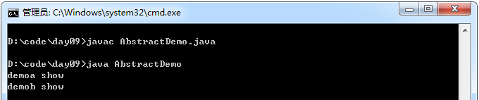
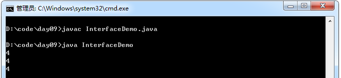
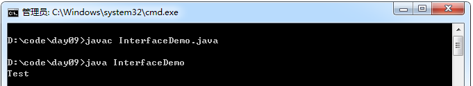
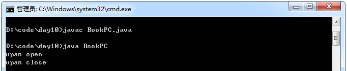

## 1. 抽象类

当定义一个类时，常常需要定义一些方法来描述该类的行为特征，但有时这些方法的实现方式是无法确定的。例如前面在定义Animal类时，shout()方法用于表示动物的叫声，但是针对不同的动物，叫声也是不同的，因此在shout()方法中无法准确描述动物的叫声。

针对上面描述的情况，Java允许在定义方法时不写方法体，不包含方法体的方法为抽象方法，抽象方法必须使用abstract关键字来修饰。

### 抽象类概述

抽象定义：抽象就是从多个事物中将共性的、本质的内容抽取出来。例如：狼和狗共性都是犬科，犬科就是抽象出来的概念。

抽象类：Java中可以定义没有方法体的方法，该方法的具体实现由子类完成，该方法称为抽象方法，包含抽象方法的类就是抽象类。

抽象方法的由来：多个对象都具备相同的功能，但是功能具体内容有所不同，那么在抽取过程中，只抽取了功能定义，并未抽取功能主体，那么只有功能声明，没有功能主体的方法称为抽象方法。

例如：狼和狗都有吼叫的方法，可是吼叫内容是不一样的。所以抽象出来的犬科虽然有吼叫功能，但是并不明确吼叫的细节。

抽象类实际上是定义了一个标准和规范，等着他的子类们去实现。

### 抽象类的特点

抽象类不能创建实例，只能当成父类来被继承。抽象类是从多个具体类中抽象出来的父类，它具有更高层次的抽象。

抽象类体现的就是一种模板模式的设计，抽象类作为多个子类的通用模板。

当一个类中包含了抽象方法，该类必须使用abstract关键字来修饰，使用abstract关键字修饰的类为抽象类。

在定义抽象类时需要注意，包含抽象方法的类必须声明为抽象类，但抽象类可以不包含任何抽象方法，只需使用abstract关键字来修饰即可。另外，抽象类是不可以被实例化的，因为抽象类中有可能包含抽象方法，抽象方法是没有方法体的，不可以被调用。如果想调用抽象类中定义的方法，则需要创建一个子类，在子类中将抽象类中的抽象方法进行实现。

抽象类和抽象方法必须用abstract关键字来修饰。
抽象方法只有方法声明，没有方法体，定义在抽象类中。
格式：修饰符 abstract 返回值类型 函数名(参数列表) ;
抽象类不可以被实例化，也就是不可以用new创建对象。

原因如下：

1. 抽象类是具体事物抽取出来的，本身是不具体的，没有对应的实例。例如：犬科是一个抽象的概念，真正存在的是狼和狗。

2. 而且抽象类即使创建了对象，调用抽象方法也没有意义。

3. 抽象类通过其子类实例化，而子类需要覆盖掉抽象类中所有的抽象方法后才可以创建对象，否则该子类也是抽象类。

示例：

```java
 abstract class Demo{
        abstract /*抽象*/ void show();
 }

 class DemoA extends Demo{
        void show(){
             System.out.println("demoa show" );
        }
 }

 class DemoB extends Demo{
        void show(){
             System.out.println("demob show" );
        }
 }

 class AbstractDemo{
        public static void main(String[] args){
             DemoA demoA = new DemoA();
             demoA.show();

             DemoB demoB = new DemoB();
             demoB.show();     
        }
 }
```
运行结果：



### 抽象类举例代码讲解

需求：公司中程序员有姓名，工号，薪水，工作内容。项目经理除了有姓名，工号，薪水，还有奖金，工作内容。

分析：在这个问题领域中，通过名词提炼法：

程序员：
属性：姓名，工号，薪水。
行为：工作。

经理：
属性：姓名，工号，薪水，奖金。
行为：工作。

程序员和经理不存在着直接继承关系。但是，程序员和经理却具有共性内容，可以进行抽取，因为他们都是公司的雇员。可以将程序员和经理进行抽取，建立体系。

代码：

```java
 //描述雇员。
 abstract class Employee{
        private String name ;
        private String id ;
        private double pay ;

       Employee(String name,String id, double pay){
              this.name = name;
              this.id = id;
              this.pay = pay;
       }

        public abstract void work();
 }

 //描述程序员
 class Programmer extends Employee{
       Programmer(String name,String id, double pay){
              super(name,id,pay);
       }

        public void work(){
             System.out.println("code..." );
        }
 }

 //描述经理
 class Manager extends Employee{
       private int bonus ;

       Manager(String name,String id, double pay,int bonus){
              super(name,id,pay);
              this.bonus = bonus;
       }

       public void work(){
             System.out.println("manage" );
       }
 }
```
### 抽象类相关问题

抽象类中是否有构造函数？
答：有，用于给子类对象进行初始化。

抽象关键字abstract不可以和哪些关键字共存？
答：private、static、final。

抽象类中可不可以没有抽象方法？

答：可以，但是很少见。目的就是不让该类创建对象，AWT的适配器对象就是这种类。通常这个类中的方法有方法体，但是却没有内容。

示例：

```java
abstract class Demo{
     void show1(){}
     void show2(){}
}
```
抽象类和一般类的区别？

相同点：抽象类和一般类都是用来描述事物的，都在内部定义了成员。

不同点：
1. 一般类有足够的信息描述事物。抽象类描述事物的信息有可能不足。
2. 一般类中不能定义抽象方法，只能定义非抽象方法。抽象类中可定义抽象方法，同时也可以定义非抽象方法。
3. 一般类可以被实例化。抽象类不可以被实例化。

抽象类一定是个父类吗？
答：是的，因为需要子类覆盖其方法后才可以对子类实例化。

## 2. 接口
当一个抽象类中的方法都是抽象的时候，这时可以将该抽象类用另一种形式定义和表示，就是接口。

格式：interface {}
接口中的成员修饰符是固定的：
成员常量：public static final
成员函数：public abstract
由此得出结论，接口中的成员都是公共的权限
接口是对外暴露的规则
接口是程序的功能扩展

注意事项：

- 虽然抽象类中的全局变量和抽象方法的修饰符都可以不用写，但是这样阅读性很差。所以，最好写上
- 类与类之间是继承关系，类与接口直接是实现关系
- 接口不可以实例化，能由实现了接口并覆盖了接口中所有的抽象方法的子类实例化。否则，这个子类就是一个抽象类。

通常所说的接口

- 接口还可以是对外提供的服务，你封装好的类库供人调用，这也可以理解为接口
- 程序接口应该是你公布出来供别人调用使用的类和方法
- 接口一般指的是HTTP接口，也可以说是HTTP API
- 接口由后端提供，前端调用后端接口以获取后端数据
- 接口由URL和HTTP方法构成，URL为接口的地址，HTTP方法指的是GET, PUT, DELETE等

示例：
```java
interface Demo{
    public static final int NUM = 4;
    public abstract void show1();
    public abstract void show2();
}

class DemoImpl implements /*实现*/Demo{
    public void show1(){}
    public void show2(){}
}

class InterfaceDemo{
    public static void main(String[] args){
        DemoImpl d = new DemoImpl();
        System.out.println(d.NUM);
        System.out.println(DemoImpl.NUM);
        System.out.println(Demo.NUM);
    }
}
```
运行结果：



接口的出现将“多继承”通过另一种形式体现出来，即“多实现”。
在java中不直接支持多继承，因为会出现调用的不确定性。
所以，java将多继承机制进行改良，在java中变成了多实现，一个类可以实现多个接口。
接口的出现避免了单继承的局限性。
示例：

```java
interface A{
    public void show();
}

interface Z{
    public void show();
}

//多实现
class Test implements A,Z{
    public void show(){
        System.out.println("Test");
    }
}

class InterfaceDemo{
    public static void main(String[] args){
        Test t = new Test();
        t.show();
    }
}
```
运行结果：



一个类在继承另一个类的同时，还可以实现多个接口。
示例1：

```java
 interface A{
        public void show();
 }

 interface Z{
        public void show();
 }

 class Q{
     public void method(){
     }
 }

 abstract class Test2 extends Q implements A,Z{

 }
```
示例2：
```java
 interface CC{
        void show();
 }

 interface MM{
        void method();
 }

 //接口与接口之间是继承关系，而且接口可以多继承
 interface QQ extends CC,MM{
        public void function();
 }

 class WW implements QQ{
        //覆盖3个方法
        public void show(){}
        public void method(){}
        public void function(){}
 }
```
抽象类和接口的异同点？

相同点：都是不断向上抽取而来的。

不同点：

1. 抽象类需要被继承，而且只能单继承。接口需要被实现，而且可以多实现。
2. 抽象类中可以定义抽象方法和非抽象方法，子类继承后，可以直接使用非抽象方法。接口中只能定义抽象方法，必须由子类去实现。
3. 抽象类的继承，是is a关系，定义该体系的基本共性内容。接口的实现是like a关系

###　接口应用综合案例

代码：

```java
/*
笔记本电脑使用。
为了扩展笔记本的功能，但日后出现什么功能设备不知道。
因此需要定义一个规则，只要日后出现的设备都符合这个规则就可以了。
规则在java中就是接口。
*/
interface USB{//暴露的原则
    public void open();
    public void close();
}

//实现原则
//这些设备和电脑的耦合性降低了
class UPan implements USB{
    public void open(){
        System.out.println("upan open");
    }
    public void close(){
        System.out.println("upan close");
    }
}

class UsbMouse implements USB{
    public void open(){
        System.out.println("usbMouse open");
    }
    public void close(){
        System.out.println("usbMouse close");
    }
}

class BookPC{
    public static void main(String[] args){
        //功能扩展了
        useUSB(new UPan());
    }
    //使用原则
    public static void useUSB(USB u){//接口类型的引用，用于接收（指向）接口的子类对象
        if(u != null ){
            u.open();
            u.close();
        }
    }
}
```
运行结果：



### Java8改进的接口

Java 8 对接口进行了改进，允许在接口中定义默认方法，默认方法可以提供方法实现。

## 3. 深入理解Java的接口和抽象类

对于面向对象编程来说，抽象是它的一大特征之一。在Java中，可以通过两种形式来体现OOP的抽象：接口和抽象类。这两者有太多相似的地方，又有太多不同的地方。很多人在初学的时候会以为它们可以随意互换使用，但是实际则不然。今天我们就一起来学习一下Java中的接口和抽象类。

### 抽象类

在了解抽象类之前，先来了解一下抽象方法。抽象方法是一种特殊的方法：它只有声明，而没有具体的实现。抽象方法的声明格式为：`abstract void fun();`

抽象方法必须用abstract关键字进行修饰。如果一个类含有抽象方法，则称这个类为抽象类，抽象类必须在类前用abstract关键字修饰。因为抽象类中含有无具体实现的方法，所以不能用抽象类创建对象。

下面要注意一个问题：在《Java编程思想》一书中，将抽象类定义为“包含抽象方法的类”，但是后面发现如果一个类不包含抽象方法，只是用abstract修饰的话也是抽象类。也就是说抽象类不一定必须含有抽象方法。个人觉得这个属于钻牛角尖的问题吧，因为如果一个抽象类不包含任何抽象方法，为何还要设计为抽象类？所以暂且记住这个概念吧，不必去深究为什么。

```java
public abstract class ClassName {
    abstract void fun();
}
```

从这里可以看出，抽象类就是为了继承而存在的，如果你定义了一个抽象类，却不去继承它，那么等于白白创建了这个抽象类，因为你不能用它来做任何事情。对于一个父类，如果它的某个方法在父类中实现出来没有任何意义，必须根据子类的实际需求来进行不同的实现，那么就可以将这个方法声明为abstract方法，此时这个类也就成为abstract类了。

包含抽象方法的类称为抽象类，但并不意味着抽象类中只能有抽象方法，它和普通类一样，同样可以拥有成员变量和普通的成员方法。注意，抽象类和普通类的主要有三点区别：

- 抽象方法必须为public或者protected（因为如果为private，则不能被子类继承，子类便无法实现该方法），缺省情况下默认为public

- 抽象类不能用来创建对象

- 如果一个类继承于一个抽象类，则子类必须实现父类的抽象方法。如果子类没有实现父类的抽象方法，则必须将子类也定义为为abstract类

在其他方面，抽象类和普通的类并没有区别。

### 接口

接口，英文称作interface，在软件工程中，接口泛指供别人调用的方法或者函数。从这里，我们可以体会到Java语言设计者的初衷，它是对行为的抽象。在Java中，定一个接口的形式如下：

```java
public interface InterfaceName {
 
}
```

接口中可以含有 变量和方法。但是要注意，接口中的变量会被隐式地指定为public static final变量（并且只能是public static final变量，用private修饰会报编译错误），而方法会被隐式地指定为public abstract方法且只能是public abstract方法（用其他关键字，比如private、protected、static、 final等修饰会报编译错误），并且接口中所有的方法不能有具体的实现，也就是说，接口中的方法必须都是抽象方法。从这里可以隐约看出接口和抽象类的区别，接口是一种极度抽象的类型，它比抽象类更加“抽象”，并且一般情况下不在接口中定义变量。

要让一个类遵循某组特地的接口需要使用implements关键字，具体格式如下：

```java
class ClassName implements Interface1,Interface2,[....]{
}
```
可以看出，允许一个类遵循多个特定的接口。如果一个非抽象类遵循了某个接口，就必须实现该接口中的所有方法。对于遵循某个接口的抽象类，可以不实现该接口中的抽象方法。

接口定义了一种规范，接口定义了某一批类所需要遵守的规范，接口不关心这些类的内部状态数据，也不关心这些类的内部方法的实现细节，它只规定这批类里必须提供某些方法，提供这些方法的类就可满足实际需要。

接口体现的是规范和实现分离的设计哲学。让规范和实现分离正是接口的好处，让软件系统的各组件之间面向接口耦合，是一种松耦合的设计。

类似的，软件系统的各模块之间也应该采用这种面向接口的耦合，从而尽量降低各模块之间的耦合，为系统提供更好的可扩展性和可维护性。

### 抽象类和接口的区别

1.语法层面上的区别

- 抽象类可以提供成员方法的实现细节，而接口中只能存在public abstract 方法；

- 抽象类中的成员变量可以是各种类型的，而接口中的成员变量只能是public static final类型的；

- 接口中不能含有静态代码块以及静态方法，而抽象类可以有静态代码块和静态方法；

- 一个类只能继承一个抽象类，而一个类却可以实现多个接口。

2.设计层面上的区别

接口是事物的能力，直接理解就是约定；抽象类是事物的本质。

抽象类是对一种事物的抽象，即对类抽象，而接口是对行为的抽象。抽象类是对整个类整体进行抽象，包括属性、行为，但是接口却是对类局部（行为）进行抽象。

继承是 `is a`的关系，而 接口实现则是 `has a` 的关系。如果一个类继承了某个抽象类，则子类必定是抽象类的种类，而接口实现就不需要有这层类型关系。

设计层面不同，抽象类作为很多子类的父类，它是一种模板式设计。而接口是一种行为规范，它是一种辐射式设计。也就是说：

- 对于抽象类，如果需要添加新的方法，可以直接在抽象类中添加具体的实现，子类可以不进行变更；
- 而对于接口则不行，如果接口进行了变更，则所有实现这个接口的类都必须进行相应的改动。

抽象类是对一种事物的抽象，即对类抽象，而接口是对行为的抽象。抽象类是对整个类整体进行抽象，包括属性、行为，但是接口却是对类局部（行为）进行抽象。举个简单的例子，飞机和鸟是不同类的事物，但是它们都有一个共性，就是都会飞。那么在设计的时候，可以将飞机设计为一个类Airplane，将鸟设计为一个类Bird，但是不能将 飞行 这个特性也设计为类，因此它只是一个行为特性，并不是对一类事物的抽象描述。此时可以将 飞行 设计为一个接口Fly，包含方法fly( )，然后Airplane和Bird分别根据自己的需要实现Fly这个接口。然后至于有不同种类的飞机，比如战斗机、民用飞机等直接继承Airplane即可，对于鸟也是类似的，不同种类的鸟直接继承Bird类即可。从这里可以看出，继承是一个 “是不是”的关系，而 接口 实现则是 “有没有”的关系。如果一个类继承了某个抽象类，则子类必定是抽象类的种类，而接口实现则是有没有、具备不具备的关系，比如鸟是否能飞（或者是否具备飞行这个特点），能飞行则可以实现这个接口，不能飞行就不实现这个接口。

设计层面不同，抽象类作为很多子类的父类，它是一种模板式设计。而接口是一种行为规范，它是一种辐射式设计。什么是模板式设计？最简单例子，大家都用过ppt里面的模板，如果用模板A设计了ppt B和ppt C，ppt B和ppt C公共的部分就是模板A了，如果它们的公共部分需要改动，则只需要改动模板A就可以了，不需要重新对ppt B和ppt C进行改动。而辐射式设计，比如某个电梯都装了某种报警器，一旦要更新报警器，就必须全部更新。也就是说对于抽象类，如果需要添加新的方法，可以直接在抽象类中添加具体的实现，子类可以不进行变更；而对于接口则不行，如果接口进行了变更，则所有实现这个接口的类都必须进行相应的改动。

下面看一个网上流传最广泛的例子：门和警报的例子：门都有open( )和close( )两个动作，此时我们可以定义通过抽象类和接口来定义这个抽象概念：

```java
abstract class Door {
    public abstract void open();
    public abstract void close();
}
```

或者

```java
interface Door {
    public abstract void open();
    public abstract void close();
}
```

但是现在如果我们需要门具有报警alarm( )的功能，那么该如何实现？下面提供两种思路：

- 将这三个功能都放在抽象类里面，但是这样一来所有继承于这个抽象类的子类都具备了报警功能，但是有的门并不一定具备报警功能；

- 将这三个功能都放在接口里面，需要用到报警功能的类就需要实现这个接口中的open( )和close( )，也许这个类根本就不具备open( )和close( )这两个功能，比如火灾报警器。

从这里可以看出， Door的open() 、close()和alarm()根本就属于两个不同范畴内的行为，open()和close()属于门本身固有的行为特性，而alarm()属于延伸的附加行为。因此最好的解决办法是单独将报警设计为一个接口，包含alarm()行为,Door设计为单独的一个抽象类，包含open和close两种行为。再设计一个报警门继承Door类和实现Alarm接口。

```java
interface Alram {
    void alarm();
}
 
abstract class Door {
    void open();
    void close();
}
 
class AlarmDoor extends Door implements Alarm {
    void oepn() {
      //....
    }
    void close() {
      //....
    }
    void alarm() {
      //....
    }
}
```

3.实际应用上的差异

在实际使用中，使用抽象类(也就是继承)，是一种强耦合的设计，用来描述`A is a B` 的关系，即如果说A继承于B，那么在代码中将A当做B去使用应该完全没有问题。比如在Android中，各种控件都可以被当做View去处理。

如果在你设计中有两个类型的关系并不是`is a`，而是`is like a`，那就必须慎重考虑继承。因为一旦我们使用了继承，就要小心处理好子类跟父类的耦合依赖关系。组合优于继承。

继承和实现接口的区别就是：继承描述的是这个类『是什么』的问题，而实现的接口则描述的是这个类『能做什么』的问题。

抽象类

- 体现的是 is a 关系，即继承关系，抽象类是多个具体类的抽象，是用来被继承的。
- 体现的是一种模板模式的设计

接口

- 定义的是一种规范，体现的是一种规范和实现分离的哲学
- 对Java单继承的补充，是一种功能增强
- 接口回调，一种消息通信机制
- 面向接口编程，解耦
- 接口无法保存状态