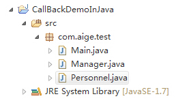
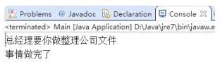

## 回调机制

所谓回调，在实现具有通用性质的应用框架时非常常见：对于一个具有通用性质的程序框架来说，程序架构完成整个应用的通用功能、流程，但在某个特定的点上，需要一段业务相关的代码——通用程序架构无法完成这段代码，那么程序架构会在这个点上留一个“空”。

对于Java程序来说，程序架构在某个点上留的”空“，有2种实现方式

- 以接口形式存在
- 以抽象方法的形式存在

回调机制的第一种实现方式就是典型的命令者模式。

## 接口回调

> 原文链接：http://blog.csdn.net/aigestudio/article/details/40869893

废话不多说，像许多网上介绍回调机制的文章一样，我这里也以一个现实的例子开头：假设你公司的总经理出差前需要你帮他办件事情，这件事情你需要花些时间去做，这时候总经理肯定不能守着你做完再出差吧，于是就他告诉你他的手机号码叫你如果事情办完了你就打电话告诉他一声；这是一个现实生活中常能碰到的例子，我们用呢就用代码的方式来实现一个这个过程，看一下这个过程究竟是怎样的。

首先在Eclipse中新建一个Java项目：CallBackDemoInJava

然后再新建三个类：Manager（该类用来模拟总经理），Personnel（该类用来模拟员工），Main（主类）



Manager的代码如下：

```java
package com.aige.test;  

/** 
 * @description 该类用来模拟总经理
 */  
public class Manager {  
    /** 
     * @param personnel 传入一个员工类的对象 
     */  
    public Manager(Personnel personnel) {  
        // 想让该让员工做什么  
        personnel.doSomething(this, "整理公司文件");  
    }  

    /** 
     * @description 当员工做完总经理让他做的事后就通过该方法通知总经理 
     * @param result 事情结果 
     */  
    public void phoneCall(String result) {  
        System.out.println("事情" + result);  
    }  
}  
```

Manager类是个模拟总经理的类，当该类的对象被造出来后就会通过Personnel的对象去执行Personnel中的doSomething方法告诉员工做些什么

Personnel的代码如下：

```java
package com.aige.test;  

/** 
 * @description 该类用来模拟员工
 */  
public class Personnel {  
    public void doSomething(Manager manager, String task) { 
        // 总经理通过doSomething方法告诉员工要做什么  
        System.out.println("总经理要你做" + task);  
        String result = "做完了";  
        // 当事情做完了我们就通过总经理公布的phoneCall方法通知总经理结果  
        manager.phoneCall(result);  
    }  
}  
```

总经理通过调用Personnel中的doSomething方法告诉员工该做些什么，当员工做完后就通过Manager中的phoneCall方法通知总经理结果

那么好的！万事俱备，我们在Main中测试运行下代码看看结果：

```java
package com.aige.test;  

public class Main {  
    public static void main(String[] args) {  
        // 首先我们需要一个员工  
        Personnel personnel = new Personnel();  
        // 其次把这个员工指派给总经理  
        new Manager(personnel);  
    }  
}  
```

代码执行结果如下：



回到我们刚才举的那个现实中的例子：总经理出差前要你去办件事情，这件事情通过doSomething告诉你了，事情要是办完了就打总经理的电话phoneCall通知他一声。这里的phoneCall我们就称为回调方法，为什么称之为回调呢？你问我我也不清楚哈，这你得问Sun公司了，不过我们从代码的执行过程可以看出数据的流向大致是Manager → Personnel → Manager，这不就是一个“回调”的过程么？现在我们来总结下满足回调的两个基本条件：

- Class A调用Class B中的X方法
- ClassB中X方法执行的过程中调用Class A中的Y方法完成回调

一切看上去都很完美，以上例子代码简单通俗地描述了回调，但是这里我就会有这样一个疑问：假设总经理出差前交了件事情给我去办，不巧……副总经理也要给我件事去办，更无耻的是……主管也发任务过来了，都要求说做完就打电话通知他们……这时我们就要定义更多类，什么总经理类啦、经理类啦、主管类啦、杂七杂八的类，但是这些杂七杂八的大爷们都要求做完事情就电话通知，每个类都会有一个类似phoneCall的方法作为回调方法，这时，我们利用面向对象的思想来看，是不是可以把这个回调方法抽象出来作为一个独立的抽象类或接口呢？多态的思想油然而生，鉴于JAVA接口的好处，我们就定义一个名为CallBack的接口作为回调接口，再在该接口下定义一个名为backResult的抽象方法作为回调方法，让那些总经理类啦、经理类啦、主管类啦、什么的都去实现该接口，这时候我们就来改造下我们的项目：


CallBack代码如下：

```java
package com.aige.test;  

/** 
 * @description 回调接口
 */  
public interface CallBack {  
    // 回调方法  
    public void backResult(String result);  
} 
```
Manager代码改造后如下：实现CallBack接口重写backResult方法
```java
package com.aige.test;  

/** 
 * @description 该类用来模拟总经理
 */  
public class Manager implements CallBack {  
    /** 
     * @param personnel  传入一个员工类的对象 
     */  
    public Manager(Personnel personnel) {  
        // 想让该让员工做什么  
        personnel.doSomething(this, "整理公司文件");  
    }  

    /** 
     * @description 当员工做完总经理让他做的事后就通过该方法通知总经理 
     * @param result 事情结果 
     */  
    public void backResult(String result) {  
        System.out.println("事情" + result);  
    }  
}  
```

Personnel代码改造后如下：doSomething方法不再传入一个Manager对象而是一个CallBack接口

```java
package com.aige.test;  

/** 
 * @description 该类用来模拟员工
 */  
public class Personnel {  
    public void doSomething(CallBack callBack, String task) {  
        // 总经理通过doSomething方法告诉员工要做什么  
        System.out.println("总经理要你做" + task);  
        String result = "做完了"; 
        // 当事情做完了我们就通过总经理公布的phoneCall方法通知总经理结果  
        callBack.backResult(result);  
    }  
}  
```

Main代码不变，执行结果也是一样的。

至此，回调的基本概念差不多就是这样了~其实回调真心不难理解，但是回调在Android中相当重要，几乎处处可见回调机制，如果你能理解到回调的奥秘~我相信对你的Android技术是一个不小的提升

## 接口回调机制

接口回调就是一个通知机制，作用:

1. 单纯的通知
2. 通知+传值

步骤:

1. 定义接口以及接口方法
2. 定义接口对象
3. 在某一个地方，接口对象调用接口方法
4. 暴露接口对象(构造方法，setter方法)

代码示例

```java
// 1.定义接口,以及接口方法
public interface OnTeacherComeListener {
	void onTeachCome(String teacherName);
	void onTeachCome();
}
```

```java
public class ClassMate {
	// 2.定义接口对象
	OnTeacherComeListener	mOnTeacherComeListener;

	// 方式1:通过构造方法赋值
	public ClassMate(OnTeacherComeListener onTeacherComeListener) {
		super();
		mOnTeacherComeListener = onTeacherComeListener;
	}

	public ClassMate() {
		super();
	}

	// 模拟老师来了
	public void doTeacherCome(String teacherName) {
		// 3.在某一个地方.接口对象调用接口方法-->老师来了的时候
		mOnTeacherComeListener.onTeachCome(teacherName);
	}

	// 4.暴露接口对象(构造方法,setter方法)

	// 方式2:通过setter赋值
	public void setOnTeacherComeListener(OnTeacherComeListener onTeacherComeListener) {
		mOnTeacherComeListener = onTeacherComeListener;
	}
}
```

```java
public class Me {
	private Timer	mTimer;

	/**想睡觉*/
	public void wantSleep() {
		System.out.println("昨晚敲代码敲到4点钟,突然想睡觉...");
	}

	/**开始睡觉*/
	public void startSleep() {
		mTimer = new Timer();
		mTimer.schedule(new TimerTask() {

			@Override
			public void run() {
				System.out.println("开始呼呼大睡.........");
			}
		}, 0, 1000);
	}

	/**停止睡觉*/
	public void stopSleep() {
		if (mTimer != null) {
			mTimer.cancel();
			mTimer = null;
			System.out.println("停止了睡觉");
		}
	}
}
```
我想要睡觉，但是睡觉前我跟同桌说，伍老师来了把我叫醒，要是李老师来了不用管，继续睡
```java
public class Test {
	public static void main(String[] args) {
		final Me me = new Me();

		// 我想睡觉
		me.wantSleep();
		// 找到一个同桌
		ClassMate classMate = new ClassMate();
		System.out.println("我去和同桌协商......");
		// 和他商量好-->如果老师来了.你拍醒我.让我停止睡觉
		classMate.setOnTeacherComeListener(new OnTeacherComeListener() {

			@Override
			public void onTeachCome(String teacherName) {// 通知+传值的效果
				if ("伍老师".equals(teacherName)) {// 回调过程中.有传值的效果
					System.out.println("伍老师不是班主任,我继续睡觉");
				} else if ("李老师".equals(teacherName)) {
					me.stopSleep();//
				}
			}

			@Override
			public void onTeachCome() {// 通知
			}
		});
		// 模拟商量了2s钟
		try {
			Thread.sleep(2000);
		} catch (InterruptedException e) {
			e.printStackTrace();
		}
		// 开始睡觉
		me.startSleep();

		// 模拟伍老师来了.
		try {
			Thread.sleep(10000);
		} catch (InterruptedException e) {
			e.printStackTrace();
		}

		classMate.doTeacherCome("伍老师");
		// 模拟伍老师来了.
		try {
			Thread.sleep(10000);
		} catch (InterruptedException e) {
			e.printStackTrace();
		}
		classMate.doTeacherCome("李老师");

	}
}
```
## 同步、异步、回调、轮询

- 同步

好比你去麦当劳点餐，你说“来个汉堡”，服务员告诉你，对不起，汉堡要现做，需要等5分钟，于是你站在收银台前面等了5分钟，拿到汉堡再去逛商场，这是同步。

- 异步

你说“来个汉堡”，服务员告诉你，汉堡需要等5分钟，你可以先去逛商场，等做好了，我们再通知你，这样你可以立刻去干别的事情（逛商场），这是异步

- 回调、轮询

很明显，使用异步来编写程序性能会远远高于同步，但是异步的缺点是编程模型复杂。想想看，你得知道什么时候通知你“汉堡做好了”，而通知你的方法也各不相同。如果是服务员跑过来找到你，这是回调模式，如果服务员发短信通知你，你就得不停地检查手机，这是轮询模式。总之，异步的复杂度远远高于同步

## 回调函数

你到一个商店买东西，刚好你要的东西没有货，于是你在店员那里留下了你的电话，过了几天店里有货了，店员就打了你的电话，然后你接到电话后就到店里去取了货。在这个例子里，你的电话号码就叫回调函数，你把电话留给店员就叫登记回调函数，店里后来有货了叫做触发了回调关联的事件，店员给你打电话叫做调用回调函数，你到店里去取货叫做响应回调事件。

回调函数是你写一个函数，让预先写好的系统来调用。你去调用系统的函数，是直调。让系统调用你的函数，就是回调。但假如满足于这种一句话结论，是不会真正明白的。

回调函数可以看成，让别人做事，传进去的额外信息。

比如 A 让 B 做事，根据粒度不同，可以理解成 A 函数调用 B 函数，或者 A 类使用 B 类，或者 A 组件使用 B 组件等等。反正就是 A 叫 B 做事。

当 B 做这件事情的时候，自身的需要的信息不够，而 A 又有。就需要 A 从外面传进来，或者 B 做着做着再向外面申请。对于 B 来说，一种被动得到信息，一种是主动去得到信息，有人给这两种方式术语，叫信息的 push，和信息的 pull。

A 调用 B，A 需要向 B 传参数。如简单的函数：

```c
int max(int a, int b); 
```

要使用这函数，得到两者最大的值, 外面就要传进来 a, b。这个很好理解。

```c
void qsort(void *, size_t, size_t, int (*)(const void *, const void *));
```

而这个函数用于排序，最后一个参数就是回调函数，似乎就比较难以理解了。这是因为人为割裂了代码和数据。

我们暂停一下，看看计算机中比较诡异的地方，也就是代码(code)和数据(data)的统一。这是一个槛，如果不跨过这槛，很多概念就不清楚。我们常常说计算机程序分成 code 和 data 两部分。很多人会理解成，code 是会运行的，是动态的，data 是给 code 使用，是静态的，这是两种完全不同的东西。

其实 code 只是对行为的一种描述，比如有个机器人可以开灯，关灯，扫地。如果跟机器人约定好，0 表示开灯，1 表示关灯，2 表示扫地。我发出指令串，0 1 2，就可以控制机器人开灯，关灯，扫地。再约定用二进制表示，两位一个指令，就有一个数字串，000111，这个时候 000111 这串数字就描述了机器人的一系列动作，这个就是从一方面理解是 code，它可以控制机器人的行为。但另一方面，它可以传递，可以记录，可以修改，也就是数据。只要大家都协商好，code 就可以编码成 data, 将 data 解释运行的时候，也变成了 code。

code 和 data 可以不用区分，统一称为信息。既然 int max(int a, int b) 中 int，double 等表示普通 data 的东西可以传递进去，自然表示 code 的函数也可以传进去了。有些语言确实是不区分的，它的 function(表示code)跟 int, double 的地位是一样的。这种语言就为函数是第一类值。

而有些语言是不能存储函数，不能动态创建函数，不能动态销毁函数。只能存储一个指向函数的指针，这种语言称为函数是第二类值。

另外有些语言不单可以传递函数，函数里面又用到一些外部信息(包括code, data)。那些语言可以将函数跟函数所用到的信息一起传递存储。这种将函数和它所用的信息作为一个整体，就为闭包。

过了这个槛，将代码和数据统一起来，很多难以理解的概念就会清晰很多。

现在我们再回头看看回调函数。回调函数也就是是 A 让 B 做事，B 做着做着，信息不够，不知道怎么做了，就再让外面处理。

比如上述排序例子，A 让 B 排序，B 会做排序，但排序需要知道哪个比哪个大，这点 B 自己不知道，就需要 A 告诉它。而这种判断大小本身是一种动作，既然 C 语言中不可以传进第一值的函数，就设计成传递第二值的函数指针，这个函数指针就是 A 传向 B 的信息，用来表示一个行为。这里本来 A 调用 B 的，结果 B 又调用了 A 告诉它的信息，也就叫 callback。

再比如 A 让 B 监听系统的某个消息，比如敲了哪个键。跟着 B 监听到了，但它不知道怎么去处理这个消息，就给外面关心这个消息，又知道怎么去处理这个消息的人去处理，这个处理过程本身是个行为，既然这个语言不可以传递函数，又只能传一个函数指针了。假如我将函数指针存储下来，以后就可以随时调用。代码和数据都是信息，数据可以存储下来，用来表示行为的函数自然也可以存储下来。

跟着有些人有会引申成，什么注册啊，通知啊等等等。假如 B 做监听，C, D, E, F, G, H 告诉 B 自己有兴趣知道这消息，那 B 监听到了就去告诉 C,D,E,F,G等人了，这样通知多人了，就叫广播。

理解后进行思考，根本不用关心术语。术语只是为了沟通，别人要告诉你，或者你去告诉人，使用的一套约定的词语。同一个东西往往有不同术语。

再将回调的概念泛化，比如某人同时关心 A, B, C, D, E, F 事件，并且这些事件是一组的，比如敲键盘，鼠标移动，鼠标点击等一组。将一组事件结合起来。在有些语言就映射成接口，接口有 N 个函数。有些语言就映射成一个结构，里面放着 N 个函数指针。跟着就不是将单个函数指针传进去，而是将接口，或者函数指针的结构传进去。根据不同的用途，有些人叫它为代理，监听者，观察者等等。

实际上也是将某种行为存储下来，以后有需要再进行调用。跟回调函数在更深层次是没有区别的。