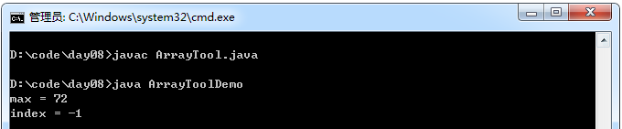

### 数组工具类

示例：

```java
public class ArrayTool{
     //该类中的方法都是静态的，所以该类是不需要创造对象的
     //为了保证不让他人创建该类对象，可以将构造函数私有化
     private ArrayTool(){}

     //获取整型数组的最大值
     public static int getMax(int[] arr){
         int maxIndex = 0;
         for(int x = 1; x < arr.length; x++){
             if(arr[x] > arr[maxIndex])
                 maxIndex = x;
         }
         return arr[maxIndex];
     }

     //对数组进行选择排序
     public static void selectSort(int[] arr){
         for(int x = 0; x <arr.length -1; x++){
             for(int y = x + 1; y < arr.length; y++){
                 if(arr[x] > arr[y])
                     swap(arr,x,y);
             }
         }
     }

     //用于给数组进行元素的位置置换。
     private static void swap(int[] arr, int a,int b){
         int temp = arr[a];
         arr[a] = arr[b];
         arr[b] = temp;
     }

     //获取指定的元素在指定数组中的索引
     public static int getIndex(int[] arr, int key){
         for(int x = 0; x < arr.length; x++){
             if(arr[x] == key)
                 return x;
         }
         return -1;
     }

     //将int 数组转换成字符串，格式是：[e1,e2,...]
     public static String arrayToString(int[] arr){
         String str = "[";

         for(int x = 0; x < arr.length; x++){
             if(x != arr.length - 1)
                 str = str + arr[x] + ",";
             else
                 str = str + arr[x] + "]";
         }
         return str;
     }
 }

 class ArrayToolDemo{
     //保证程序的独立运行
     public static void main(String[] args){
         int[] arr = {4,8,2,9,7,72,6};

         int max = ArrayTool.getMax(arr);
         System.out.println("max = " + max);
         int index = ArrayTool.getIndex(arr,10);
         System.out.println("index = " + index);
     }
 }
```
运行结果：

