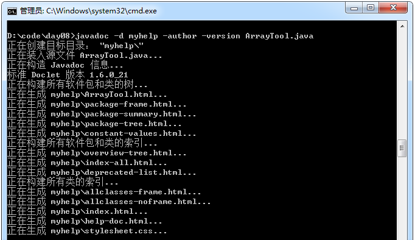
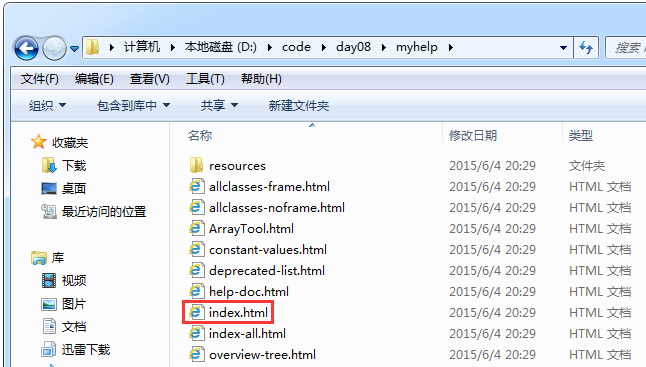
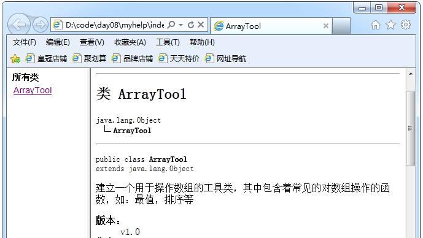

### 文档注释

示例：

```java
/**
  * 建立一个用于操作数组的工具类，其中包含着常见的对数组操作的函数，如：最值，排序等。
  * @author 张三
  * @version v1.0
  */
 public class ArrayTool{
     private ArrayTool(){}

     /**
      * 获取整型数组的最大值
      * @param arr 接收一个元素为int 类型的数组
      * @Return 该数组的最大的元素值
      */
     public static int getMax(int[] arr){
         int maxIndex = 0;
         for(int x = 1; x < arr.length; x++){
             if(arr[x] > arr[maxIndex])
                 maxIndex = x;
         }
         return arr[maxIndex];
     }

     /**
      * 对数组进行选择排序
      * @param arr 接收一个元素为int 的数组
      */
     public static void selectSort(int[] arr){
         for(int x = 0; x <arr.length -1; x++){
             for(int y = x + 1; y < arr.length; y++){
                 if(arr[x] > arr[y])
                     swap(arr,x,y);
             }
         }
     }

     //用于给数组进行元素的位置置换。
     private static void swap(int[] arr, int a,int b){
         int temp = arr[a];
         arr[a] = arr[b];
         arr[b] = temp;
     }

     /**
      * 获取指定的元素在指定数组中的索引
      * @param arr 接收一个元素为int 类型的数组
      * @param key 要找的元素
      * @return 返回该元素第一次出现的位置，如果不存在则返回 -1
      */
     public static int getIndex(int[] arr, int key){
         for(int x = 0; x < arr.length; x++){
             if(arr[x] == key)
                 return x;
         }
         return -1;
     }

     /**
      * 将int数组转换成字符串，格式是：[e1,e2,...]
      * @param arr 接收一个元素为int类型的数组
      * @return 返回该数组的字符串表现形式
      */
     public static String arrayToString(int[] arr){
         String str = "[";

         for(int x = 0; x < arr.length; x++){
             if(x != arr.length - 1)
                 str = str + arr[x] + ",";
             else
                 str = str + arr[x] + "]";
         }
         return str;
     }
 }
```
运行结果：

 

 



### 注意事项

- 如果想把一个类进行文档化，该类必须是public的。
- 私有的方法在文档中不会体现，例如ArrayTool类中的swap方法。