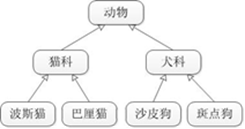
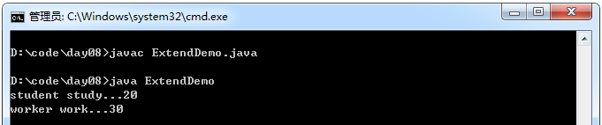
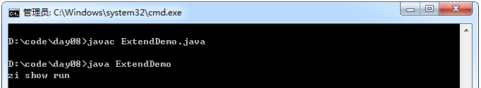
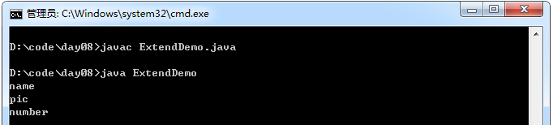
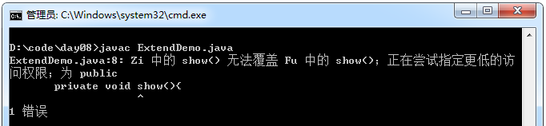
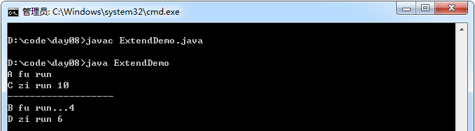
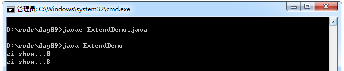
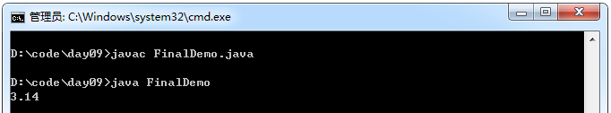

## 继承的描述

在现实生活中，继承一般指的是子女继承父辈的财产。在程序中，继承描述的是事物之间的所属关系，通过继承可以使多种事物之间形成一种关系体系。例如猫和狗都属于动物，程序中便可以描述为猫和狗继承自动物，同理，波斯猫和巴厘猫继承自猫，而沙皮狗和斑点狗继承自狗。这些动物之间会形成一个继承体系，具体如下图所示。



在Java中，类的继承是指在一个现有类的基础上去构建一个新的类，构建出来的新类被称作子类，现有类被称作父类，子类会自动拥有父类所有可继承的属性和方法。在程序中，如果想声明一个类继承另一个类，需要使用extends关键字。

通过 extends 关键字让类与类之间产生继承关系。

多个类中存在相同属性和行为时，将这些内容抽取到单独一个类中，那么多个类无需再定义这些属性和行为，只要继承那个类即可。多个类可以称为子类，单独这个类称为父类或者超类。

注意事项：

- 子类可以直接访问父类中的非私有的属性和行为。
- 子类无法继承父类中私有的内容。
- 父类怎么来的？共性不断向上抽取而来的。

示例：

```java
class Person{
    String name;
    int age ;
}
class Student extends Person{
    void study(){
        System.out.println("student study..." + age);
    }
}
class Worker extends Person{
    void work(){
        System.out.println("worker work..." + age);
    }
}
class ExtendDemo{
    public static void main(String[] args){
        Student s = new Student();
        s. name = "zhangsan" ;
        s. age = 20;
        s.study();
        Worker w = new Worker();
        w. name = "lisi" ;
        w. age = 30;
        w.work();
    }
}
```
运行结果：



好处：

- 继承的出现提高了代码的复用性。
- 继承的出现让类与类之间产生了关系，提供了多态的前提。

## 继承的特点

在类的继承中，需要注意一些问题，具体如下：

1．在Java中，类只支持单继承，不允许多重继承，也就是说一个类只能有一个直接父类，例如下面这种情况是不合法的。


2．多个类可以继承一个父类，例如下面这种情况是允许的。


3．在Java中，多层继承是可以的，即一个类的父类可以再去继承另外的父类，例如C类继承自B类，而B类又可以去继承A类，这时，C类也可称作A类的子类。例如下面这种情况是允许的。


4．在Java中，子类和父类是一种相对概念，也就是说一个类是某个类父类的同时，也可以是另一个类的子类。例如上面的示例中，B类是A类的子类，同时又是C类的父类。

Java只支持单继承，不支持多继承。一个类只能有一个父类，不可以有多个父类。
原因：因为多继承容易出现问题。两个父类中有相同的方法，子类到底要执行哪一个是不确定的。

示例：

```java
class A{
    void show(){
        System.out.println("a" );
    }
}
class B{
    void show(){
        System.out.println("b" );
    }
}
class C extends B,A{
}
```

那么创建类C的对象，调用show方法就不知道调用类A中的show方法还是类B中的show方法。所以java不支持多继承，但将这种机制换了另一个安全的方式来体现，也就是多实现（后面会详细说明）。

Java支持多层继承(继承体系)：

C继承B，B继承A，就会出现继承体系。多层继承出现的继承体系中，通常看父类中的功能，了解该体系的基本功能，建立子类对象，即可使用该体系功能。

定义继承需要注意：不要仅为了获取其他类中某个功能而去继承，类与类之间要有所属( "is a")关系。

## super关键字&函数覆盖

在继承关系中，子类会自动继承父类中定义的方法，但有时在子类中需要对继承的方法进行一些修改，即对父类的方法进行重写。需要注意的是，在子类中重写的方法需要和父类被重写的方法具有相同的方法名、参数列表以及返回值类型。

当子类重写父类的方法后，子类对象将无法访问父类被重写的方法，为了解决这个问题，在Java中专门提供了一个super关键字用于访问父类的成员。例如访问父类的成员变量、成员方法和构造方法。

在子父类中，成员的特点体现：

成员变量

- this和super的用法很相似
- this代表本类对象的引用
- super代表父类的内存空间的标识
- 当本类的成员和局部变量同名用this区分
- 当子父类中的成员变量同名用super区分父类

示例：

```java
class Fu{
   private int num = 4;

   public int getNum(){
       return num ;
   }
}

class Zi extends Fu{
   private int num = 5;

   void show(){
       System.out.println(this.num + "..." + super.getNum());
   }
}

class ExtendDemo{
   public static void main(String[] args){
       Zi z = new Zi();
       z.show();
   }
}
```
运行结果


成员函数

当子父类中出现成员函数一模一样的情况，会运行子类的函数。这种现象，称为覆盖操作，这是函数在子父类中的特性。

在子类覆盖方法中，继续使用被覆盖的方法可以通过super.函数名获取。

函数两个特性：

1. 重载，同一个类中。

2. 覆盖，子类中，覆盖也称为重写，覆写，override。

示例：

```java
class Fu{
   public void show(){
       System.out.println("fu show run" );
   }
}

class Zi extends Fu{
   public void show(){
       System.out.println("zi show run" );
   }
}

class ExtendDemo{
   public static void main(String[] args){
       Zi z = new Zi();
       z.show();
   }
}
```
运行结果：



**什么时候使用覆盖操作？**

当子类需要父类的功能，而功能主体子类有自己特有内容时，可以复写父类中的方法，这样，即沿袭了父类的功能，又定义了子类特有的内容。

示例：

```java
class Phone{
   void call(){}
   void show(){
       System.out.println("number" );
   }
}

class NewPhone extends Phone{
   void show(){
       System.out.println("name" );
       System.out.println("pic" );
       super.show();
   }
}

class ExtendDemo{
   public static void main(String[] args){
       NewPhone p = new NewPhone();
       p.show();
   }
}
```
运行结果：



注意事项：

- 父类中的私有方法不可以被覆盖
- 父类为static的方法无法覆盖
- 覆盖时，子类方法权限一定要大于等于父类方法权限

示例：

```java
class Fu{
    public void show(){
        System.out.println("fu show run" );
    }
}

class Zi extends Fu{
    private void show(){
        System.out.println("zi show run" );
    }
}

class ExtendDemo{
    public static void main(String[] args){
        Zi z = new Zi();
        z.show();
    }
}
```
运行结果：



## 构造函数

子父类中构造函数的特点：在子类构造函数执行时，发现父类构造函数也运行了。
原因：在子类的构造函数中，第一行有一个默认的隐式语句：super();。
注意：如果使用super(4);语句调用父类的其他构造函数，那么默认的父类构造函数将不会再被调用。

示例：

```java
class Fu{
    int num ;
    Fu(){
        num = 10;
        System.out.println("A fu run" );
    }
    Fu(int x){
        System.out.println("B fu run..." + x);
    }
}

class Zi extends Fu{
    Zi(){
        //super();//默认调用的就是父类中的空参数的构造函数
        System.out.println("C zi run " + num);
    }
    Zi(int x){
        super(4);
        System.out.println("D zi run " + x);
    }
}

class ExtendDemo{
    public static void main(String[] args){
        new Zi();
        System.out.println("-------------------" );
        new Zi(6);
    }
}
```
运行结果：



## 子类的实例化过程

子类中所有的构造函数默认都会访问父类中空参数的构造函数。因为每一个构造函数的第一行都有一条默认的语句super();。

为什么子类实例化的时候要访问父类中的构造函数呢？

那是因为子类继承了父类，获取到了父类中内容（属性），所以在使用父类内容之前，要先看父类是如何对自己的内容进行初始化的。

注意事项：

- 当父类中没有空参数的构造函数时，子类的构造函数必须通过this或者super语句指定要访问的构造函数。
- 子类构造函数中如果使用this调用了本类构造函数，那么默认的super();就没有了，因为super和this都只能定义在第一行，所以只能有一个。但是可以保证的是，子类中肯定会有其他的构造函数访问父类的构造函数。
- super语句必须要定义在子类构造函数的第一行！因为父类的初始化动作要先完成。

示例：
```java
class Fu{
    Fu(){
        super();
        //调用的是子类的show方法，此时其成员变量num还未进行显示初始化
        show();
        return;
    }
    void show(){
        System.out.println("fu show" );
    }
}
class Zi extends Fu{
    int num = 8;
    Zi(){
        super();
        //通过super初始化父类内容时，子类的成员变量并未显示初始化，等super()父类初始化完毕后，才进行子类的成员变量显示初始化
        return;
    }
    void show(){
        System.out.println("zi show..." + num);
    }
}
class ExtendDemo{
    public static void main(String[] args){
        Zi z = new Zi();
        z.show();
    }
}
```
运行结果：



总结：一个对象实例化过程，以`Person p = new Person();`为例

1. JVM会读取指定的路径下的Person.class文件，并加载进内存，并会先加载Person的父类（如果有直接的父类的情况下）
2. 在内存中开辟空间，并分配地址
3. 并在对象空间中，对对象的属性进行默认初始化
4. 调用对应的构造函数进行初始化
5. 在构造函数中，第一行会先到调用父类中构造函数进行初始化
6. 父类初始化完毕后，再对子类的属性进行显示初始化
7. 再进行子类构造函数的特定初始化
8. 初始化完毕后，将地址值赋值给引用变量

## final关键字

final关键字可用于修饰类、变量和方法，它有“无法改变”或者“最终”的含义，因此被final修饰的类、变量和方法将具有以下特性：

- final可以修饰类，方法，变量
- final修饰的类不可以被继承
- final修饰的方法不可以被覆盖
- final修饰的变量是一个常量，只能被赋值一次
- 为什么要用final修饰变量，其实，在程序中如果一个数据是固定的。那么直接使用这个数据就可以了，但是这种阅读性差，所以应该给数据起个名称。而且这个变量名称的值不能变化，所以加上final固定
- 写法规范：常量所有字母都大写，多个单词，中间用_连接

示例1：

```java
 //继承弊端：打破了封装性
 class Fu{
        void method(){
        }
 }

 class Zi extends Fu{
        public static final double PI = 3.14;
        void method(){
             System.out.println(PI);
        }
 }

 class FinalDemo{
        public static void main(String[] args){
             Zi zi = new Zi();
             zi.method();
        }
 }
```
运行结果：



示例2：
```java
class FinalDemo{
    public static void main(String[] args){
        final int x = 4;
        x = 5;
    }
}
```
运行结果：


## 内存结构

静态绑定，当方法被 static private final三个关键字其中一个修饰，执行的静态绑定

动态绑定，方法执行的动态绑定

属性看变量的类型，Person.this.salary

```java
public class TestChunApp
{

	public static void main(String[] args) {
		Person p = new Manager();
      	p.sing();
		//System.out.println(p);	//Person.this.salary
	}
}

class Person{
	private int salary = 10000;
	
	public static void sing(){
		System.out.println("忘情水");
	}
	int getSalary(){
		return salary;
	}
	public void printSalary(){
		System.out.println(salary);
	}
}

class Manager extends Person{
	int salary = 30000;
	
	public static void sing(){
		System.out.println("中国人");
	}
	public void printSalary(){
		System.out.println(getSalary());
	}
}
```