# 1. 面向对象思想

面向对象是一种符合人类思维习惯的编程思想。现实生活中存在各种形态不同的事物，这些事物之间存在着各种各样的联系。在程序中使用对象来映射现实中的事物，使用对象的关系来描述事物之间的联系，这种思想就是面向对象。

提到面向对象，自然会想到面向过程，面向过程就是分析出解决问题所需要的步骤，然后用函数把这些步骤一一实现，使用的时候依次调用就可以了。面向对象则是把构成问题的事务按照一定规则划分为多个独立的对象，然后通过调用对象的方法来解决问题。当然，一个应用程序会包含多个对象，通过多个对象的相互配合来实现应用程序的功能，这样当应用程序功能发生变动时，只需要修改个别的对象就可以了，从而使代码更容易得到维护。面向对象的特点主要可以概括为封装性、继承性和多态性。

**1、封装性**

封装是面向对象的核心思想，将对象的属性和行为封装起来，不需要让外界知道具体实现细节，这就是封装思想。例如，用户使用电脑，只需要使用手指敲键盘就可以了，无需知道电脑内部是如何工作的，即使用户可能碰巧知道电脑的工作原理，但在使用时，并不完全依赖电脑工作原理这些细节。

**2、继承性**

继承性主要描述的是类与类之间的关系，通过继承，可以在无需重新编写原有类的情况下，对原有类的功能进行扩展。例如，有一个汽车的类，该类中描述了汽车的普通特性和功能，而轿车的类中不仅应该包含汽车的特性和功能，还应该增加轿车特有的功能，这时，可以让轿车类继承汽车类，在轿车类中单独添加轿车特性的方法就可以了。继承不仅增强了代码的复用性、提高开发效率，还为程序的维护补充提供了便利。 

**3、多态性**

多态性指的是在程序中允许出现重名现象，它指在一个类中定义的属性和方法被其它类继承后，它们可以具有不同的数据类型或表现出不同的行为，这使得同一个属性和方法在不同的类中具有不同的语义。例如，当听到“Cut” 这个单词时，理发师的行为是剪发，演员的行为表现是停止表演，不同的对象，所表现的行为是不一样的。

## 1.1 面向对象思想引入

面向对象的编程思想，力图让程序中对事物的描述与该事物在现实中的形态保持一致。为了做到这一点，面向对象的思想中提出了两个概念，即类和对象。其中，类是对某一类事物的抽象描述，而对象用于表示现实中该类事物的个体。

前面我们讲过数组，当有多个数组都需要遍历时，我们可以将遍历的代码封装到方法中，需要遍历时，就调用相应的方法即可，提高代码的复用性。在对数组遍历的基础上继续增加需求，比如获取最值，数值逆序等，同样需要将这些功能封装到相应的方法中。这样继续封装会发现方法越来越多，于是就想能不能将这些方法继续进行封装呢？通过前面的讲解我们知道类是可以存放方法的，所以，我们就考虑使用类封装来这多个方法，将来再做数组的操作时，不用去找具体的方法，先找到这个类，然后使用这个类中的方法。这就是面向对象思想的编程方式。
## 1.2 面向过程思想概述

我们来回想一下，这几天我们完成一个需求的步骤：首先是搞清楚我们要做什么，然后在分析怎么做，最后我们再代码体现。一步一步去实现，而具体的每一步都需要我们去实现和操作。这些步骤相互调用和协作，完成我们的需求。

在上面的每一个具体步骤中我们都是参与者，并且需要面对具体的每一个步骤和过程，这就是面向过程最直接的体现。

那么什么是面向过程开发呢? 面向过程开发，其实就是面向着具体的每一个步骤和过程，把每一个步骤和过程完成，然后由这些功能方法相互调用，完成需求。

面向过程的代表语言：C语言，强调的是每一个功能的步骤

## 1.3 面向对象思想概述

当需求单一，或者简单时，我们一步一步去操作没问题，并且效率也挺高。可随着需求的更改，功能的增多，发现需要面对每一个步骤很麻烦了，这时就开始思索，能不能把这些步骤和功能在进行封装，封装时根据不同的功能，进行不同的封装，功能类似的封装在一起。这样结构就清晰了很多。用的时候，找到对应的类就可以了。这就是面向对象的思想。接下来我们看看面向对象到底是什么?

面向对象思想概述：面向对象是基于面向过程的编程思想，强调的是对象，然后由对象去调用功能。

面向对象思想特点

- 是一种更符合我们思想习惯的思想
- 可以将复杂的事情简单化
- 将我们从执行者变成了指挥者，角色发生了转换

**举例：**

**(1) 买电脑：**
​     
面向过程：我的了解电脑--了解我自己的需求--找对应的参数信息--去中关村买电脑--讨价还价--买回电脑

面向对象：我知道我要买电脑 -- 班长去给我买 -- 班长就买回来了

**(2)  洗衣服：**

面向过程：把衣服脱下--找一个盆--放点洗衣粉--加点水--把衣服扔进去--搓一搓--清洗衣服--拧干--晾起来

面向对象：把衣服脱下--打开全自动洗衣机--扔进去--一键即可--晾起来

**(3) 吃饭：**

面向过程：去超市买菜--摘菜--洗菜--切菜--炒菜--盛起来--吃

面向对象：上饭店吃饭，你--服务员(点菜)--厨师(做菜)--服务员(端菜)--吃

## 1.4 面向对象开发、设计、特征

面向对象开发：就是不断的创建对象，使用对象，指挥对象做事情。
面向对象设计：其实就是在管理和维护对象之间的关系。

面向对象特征

- 封装(encapsulation)
- 继承(inheritance)
- 多态(polymorphism)

# 2. 类与对象及其使用

## 2.1 类与对象的关系

我们学习编程语言，就是为了模拟现实世界的事物，实现信息化。比如：去超市买东西的计费系统，去银行办业务的系统。

我们如何表示一个现实世界事物呢：

- 属性 就是该事物的描述信息
- 行为 就是该事物能够做什么
- 举例：学生事物

我们学习的Java语言最基本单位是类，所以，我们就应该把事物用一个类来体现。

类：是一组相关的属性和行为的集合
对象：是该类事物的具体体现
举例：类 学生，对象班长就是一个对象

**PS**
类：可以理解为构造对象的一个蓝图或者模版，是抽象的概念
对象：是以类为模型创建的具体实例，是对类的一种具体化。

## 2.2 类的定义

现实世界的事物有属性（人的身高，体重等）和行为（人可以学习，吃饭等）

Java中用class描述事物也是如此，成员变量 就是事物的属性，成员方法 就是事物的行为

定义类其实就是定义类的成员(成员变量和成员方法)

```java
/**
	事物：
		属性	事物的信息描述
		行为	事物的功能

	类：
		成员变量	事物的属性
		成员方法	事物的行为

	定义一个类，其实就是定义该类的成员变量和成员方法。

	案例：我们来完成一个学生类的定义。

	学生事物：
		属性：姓名，年龄，地址...
		行为：学习，吃饭，睡觉...

	把事物要转换为对应的类：

	学生类：
		成员变量：姓名，年龄，地址...
		成员方法：学习，吃饭，睡觉...

	成员变量：和以前变量的定义是一样的格式，但是位置不同，在类中方法外。
	成员方法：和以前的方法定义是一样的格式，但是今天把static先去掉。

	首先我们应该定义一个类，然后完成类的成员。
*/
//这是我的学生类
class Student {
	//定义变量
	String name;//姓名
	int age;//年龄
	String address;//地址

	//定义方法
	//学习的方法
	public void study() {
		System.out.println("学生爱学习");
	}

	//吃饭的方法
	public void eat() {
		System.out.println("学习饿了,要吃饭");
	}

	//睡觉的方法
	public void sleep() {
		System.out.println("学习累了,要睡觉");
	}
}
```

## 2.3 对象内存图

只要是用new操作符定义的实体就会在堆内存中开辟一个新的空间，并且每一个对象中都有一份属于自己的属性。

通过对象.对象成员的方式操作对象中的成员，对其中一个对象的成员进行了修改，和另一个对象没有任何关系。

1个对象的内存图：一个对象的基本初始化过程

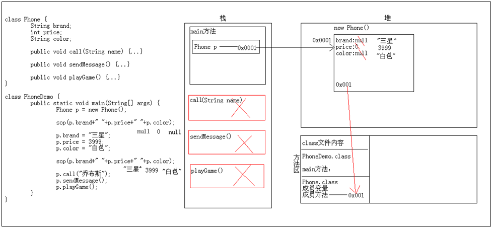

2个对象的内存图：方法的共用

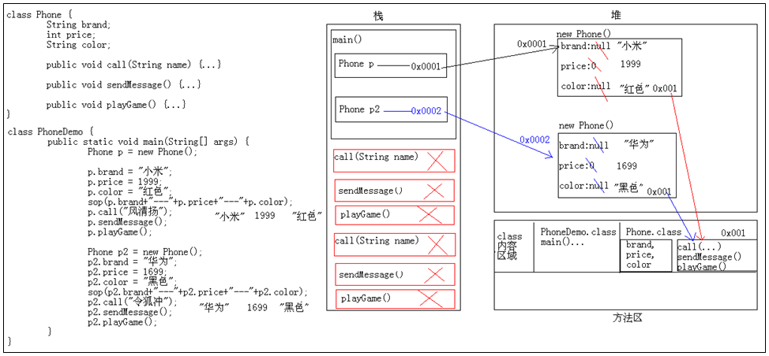

3个对象的内存图：其中有两个引用指向同一个对象

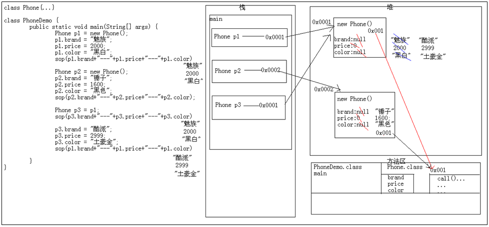

**垃圾回收**

在Java中，当一个对象成为垃圾后仍会占用内存空间，时间一长，就会导致内存空间的不足。针对这种情况，Java中引入了垃圾回收机制。有了这种机制，程序员不需要过多关心垃圾对象回收的问题，Java虚拟机会自动回收垃圾对象所占用的内存空间。

一个对象在成为垃圾后会暂时地保留在内存中，当这样的垃圾堆积到一定程度时，Java虚拟机就会启动垃圾回收器将这些垃圾对象从内存中释放，从而使程序获得更多可用的内存空间。除了等待Java虚拟机进行自动垃圾回收外，还可以通过调用System.gc()方法来通知Java虚拟机立即进行垃圾回收。当一个对象在内存中被释放时，它的finalize()方法会被自动调用，因此可以在类中通过定义finalize()方法来观察对象何时被释放。

## 2.4 成员变量和局部变量的区别

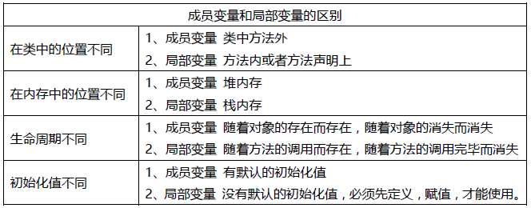

注意事项：局部变量名称可以和成员变量名称一样，在方法中使用的时候，采用的是就近原则。

```java
class Varialbe {
	//成员变量
	//int num = 10;
	int num; //0

	public void show() {
		//int num2 = 20; //局部变量
		//可能尚未初始化变量num2
		//int num2; //没有默认值
		int num2 = 20;
		System.out.println(num2);

		//int num = 100;
		System.out.println(num);
	}
}

class VariableDemo {
	public static void main(String[] args) {
		Varialbe v = new Varialbe();

		System.out.println(v.num); //访问成员变量

		v.show();

	}
}
```

## 2.5 形式参数问题

基本类型作为形式参数：形式参数的改变不影响实际参数
引用类型作为形式参数：形式参数的改变直接影响实际参数

```java
/**
	形式参数的问题：
		基本类型：形式参数的改变不影响实际参数
		引用类型：形式参数的改变直接影响实际参数
*/
//形式参数是基本类型
class Demo {
	public int sum(int a,int b) {
		return a + b;
	}
}

//形式参数是引用类型
class Student {
	public void show() {
		System.out.println("我爱学习");
	}
}

class StudentDemo {
	//如果你看到了一个方法的形式参数是一个类类型(引用类型)，这里其实需要的是该类的对象。
	public void method(Student s) { //调用的时候，把main方法中的s的地址传递到了这里 Student s = new Student();
		s.show();
	}
}

class ArgsTest {
	public static void main(String[] args) {
		//形式参数是基本类型的调用
		Demo d = new Demo();
		int result = d.sum(10,20);
		System.out.println("result:"+result);
		System.out.println("--------------");

		//形式参数是引用类型的调用
		//需求：我要调用StudentDemo类中的method()方法
		StudentDemo sd = new StudentDemo();
		//创建学生对象
		Student s = new Student();
		sd.method(s); //把s的地址给到了这里
	}
}
```
运行结果：

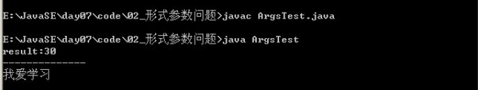

在java中，方法参数的传递永远都是传值，而这个值，对于基本数据类型，值就是你赋给变量的那个值。而对于引用数据类型，这个值是对象的引用，而不是这个对象本身。

## 2.6 匿名对象

匿名对象：就是没有名字的对象。是对象的一种简化表示形式
匿名对象的两种使用情况：对象调用方法仅仅一次的时候；作为实际参数传递。

```java
/**
	匿名对象：就是没有名字的对象。

	匿名对象的应用场景：
		A:调用方法，仅仅只调用一次的时候。
			注意：调用多次的时候，不适合。
			那么，这种匿名调用有什么好处吗?
				有，匿名对象调用完毕就是垃圾。可以被垃圾回收器回收。
		B:匿名对象可以作为实际参数传递
*/
class Student {
	public void show() {
		System.out.println("我爱学习");
	}
}

class StudentDemo {
	public void method(Student s) {
		s.show();
	}
}

class NoNameDemo {
	public static void main(String[] args) {
		//带名字的调用
		Student s = new Student();
		s.show();
		s.show();
		System.out.println("--------------");

		//匿名对象
		//new Student();
		//匿名对象调用方法
		new Student().show();
		new Student().show(); //这里其实是重新创建了一个新的对象
		System.out.println("--------------");


		//匿名对象作为实际参数传递
		StudentDemo sd = new StudentDemo();
		//Student ss = new Student();
		//sd.method(ss); //这里的s是一个实际参数
		//匿名对象
		sd.method(new Student());

		//在来一个
		new StudentDemo().method(new Student());
 	}
}
```
运行结果：

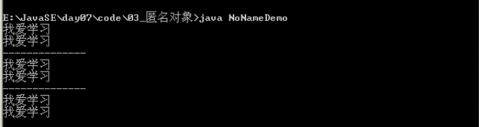

## 2.7 封装(private)

封装概述：是指隐藏对象的属性和实现细节，仅对外提供公共访问方式。

**封装的好处**

- 隐藏实现细节，提供公共的访问方式
- 提高了代码的复用性
- 提高安全性。

**封装原则**

- 将不需要对外提供的内容都隐藏起来。
- 把属性隐藏，提供公共方法对其访问。

**private关键字**

- 是一个权限修饰符。
- 可以修饰成员(成员变量和成员方法)
- 被private修饰的成员只在本类中才能访问。

**private最常见的应用**

- 把成员变量用private修饰
- 提供对应的getXxx()和setXxx()方法

一个标准的案例的使用

```java
/**
	封装和private的应用：
		A:把成员变量用private修饰
		B:提高对应的getXxx()和setXxx()方法
*/
//定义学生类
class Student {
	//姓名
	private String name;
	//年龄
	private int age;

	//姓名获取值
	public String getName() {
		return name;
	}

	//姓名设置值
	public void setName(String n) {
		name = n;
	}

	//年龄获取值
	public int getAge() {
		return age;
	}

	//年龄赋值
	public void setAge(int a) {
		age = a;
	}
}

//测试类
class StudentTest {
	public static void main(String[] args) {
		//创建学生对象
		Student s = new Student();

		//使用成员变量
		//错误：被私有修饰了，外界不能直接访问了
		//System.out.println(s.name+"---"+s.age);
		System.out.println(s.getName()+"---"+s.getAge());

		//给成员变量赋值
		//s.name = "林青霞";
		//s.age = 27;
		//通过方法给赋值
		s.setName("林青霞");
		s.setAge(27);
		System.out.println(s.getName()+"---"+s.getAge());
	}
}
```

运行结果：


## 2.8 this关键字

this代表其所在函数所属对象的引用。换言之，this代本类对象的引用。

当成员变量和局部变量重名，可以用关键字this来区分，this就是所在函数所属对象的引用。

简单说，哪个对象调用了this所在的函数，this就代表哪个对象。一般方法调用默认加this。（方法被哪个对象调用，this就代表那个对象）

什么时候使用this呢?

- 局部变量隐藏成员变量
- 其他用法后面和super一起讲解

```java
/**
	我们曾经曰：起名字要做到见名知意。

	this:是当前类的对象引用。简单的记，它就代表当前类的一个对象。

		注意：谁调用这个方法，在该方法内部的this就代表谁。

	this的场景：
		解决局部变量隐藏成员变量

	this:哪个对象调用那个方法，this就代表那个对象
*/
class Student {
	private String name;
	private int age;

	public String getName() {
		return name; //这里其实是隐含了this
	}

	public void setName(String name) {
		this.name = name;
	}

	public int getAge() {
		return age;
	}

	public void setAge(int age) {
		this.age = age;
	}
}

class StudentTest2 {
	public static void main(String[] args) {
		//创建一个对象
		Student s1 = new Student();
		s1.setName("林青霞");
		s1.setAge(27);
		System.out.println(s1.getName()+"---"+s1.getAge());

		//创建第二个对象
		Student s2 = new Student();
		s2.setName("刘意");
		s2.setAge(30);
		System.out.println(s2.getName()+"---"+s2.getAge());
	}
}
```

运行结果：

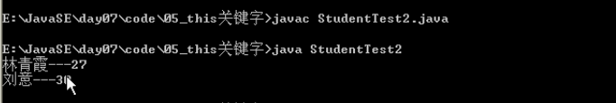

this关键字的内存图解：

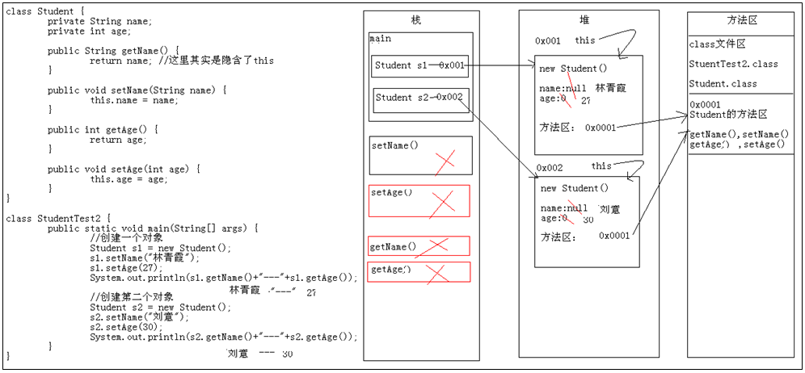

## 2.9 构造方法

构造方法作用概述：给对象的数据进行初始化

**构造方法格式**

- 方法名与类名相同
- 没有返回值类型，连void都没有
- 没有具体的返回值

**构造方法注意事项**

- 如果你不提供构造方法，系统会给出默认构造方法
- 如果你提供了构造方法，系统将不再提供
- 构造方法也是可以重载的

**给成员变量赋值有两种方式**
- setXxx()
- 构造方法

**PS：**

1. 一般函数和构造函数什么区别呢？

构造函数：对象创建时，就会调用与之对应的构造函数，对对象进行初始化。
一般函数：对象创建后，需要函数功能时才调用。

构造函数：对象创建时，会调用并且只调用一次。
一般函数：对象创建后，可以被调用多次。

2. 创建对象都必须要通过构造函数初始化。

一个类中如果没有定义过构造函数，那么该类中会有一个默认的空参数构造函数。

如果在类中定义了指定的构造函数，那么类中的默认构造函数就没有了。

3. 多个构造函数是以重载的形式存在的。

```java
/**
	我们一直在使用构造方法，但是，我们确没有定义构造方法，用的是哪里来的呢?

	构造方法的注意事项:
		A:如果我们没有给出构造方法，系统将自动提供一个无参构造方法。
		B:如果我们给出了构造方法，系统将不再提供默认的无参构造方法。
			注意：这个时候，如果我们还想使用无参构造方法，就必须自己给出。建议永远自己给出无参构造方法

	给成员变量赋值有两种方式：
		A:setXxx()
		B:构造方法
*/

class Student {
	private String name;
	private int age;

	public Student() {
		//System.out.println("我给了，你还给不");
		System.out.println("这是无参构造方法");
	}

	//构造方法的重载格式
	public Student(String name) {
		System.out.println("这是带一个String类型的构造方法");
		this.name = name;
	}

	public Student(int age) {
		System.out.println("这是带一个int类型的构造方法");
		this.age = age;
	}

	public Student(String name,int age) {
		System.out.println("这是一个带多个参数的构造方法");
		this.name = name;
		this.age = age;
	}

	public void show() {
		System.out.println(name+"---"+age);
	}
}

class ConstructDemo2 {
	public static void main(String[] args) {
		//创建对象
		Student s = new Student();
		s.show();
		System.out.println("-------------");

		//创建对象2
		Student s2 = new Student("林青霞");
		s2.show();
		System.out.println("-------------");

		//创建对象3
		Student s3 = new Student(27);
		s3.show();
		System.out.println("-------------");

		//创建对象4
		Student s4 = new Student("林青霞",27);
		s4.show();
	}
}
```

### 构造方法和成员变量初始化顺序

执行父类静态代码 执行子类静态代码
初始化父类成员变量（我们常说的赋值语句）
初始化父类构造函数
初始化子类成员变量
初始化子类构造函数

## 2.10 类的成员方法

成员方法其实就是我们前面讲过的方法

方法具体划分：
- 根据返回值：有明确返回值方法；返回void类型的方法
- 根据形式参数：无参方法；带参方法

一个基本类的标准代码写法

```java
/**
	一个标准代码的最终版。

	学生类：
		成员变量：
			name，age
		构造方法：
			无参，带两个参
		成员方法：
			getXxx()/setXxx()
			show()：输出该类的所有成员变量值

	给成员变量赋值：
		A:setXxx()方法
		B:构造方法

	输出成员变量值的方式：
		A:通过getXxx()分别获取然后拼接
		B:通过调用show()方法搞定
*/
class Student {
	//姓名
	private String name;
	//年龄
	private int age;

	//构造方法
	public Student() {
	}

	public Student(String name,int age) {
		this.name = name;
		this.age = age;
	}

	public String getName() {
		return name;
	}

	public void setName(String name) {
		this.name = name;
	}

	public int getAge() {
		return age;
	}

	public void setAge(int age) {
		this.age = age;
	}

	//输出所有的成员变量值
	public void show() {
		System.out.println(name+"---"+age);
	}
}

//测试类
class StudentTest {
	public static void main(String[] args) {
		//方式1给成员变量赋值
		//无参构造+setXxx()
		Student s1 = new Student();
		s1.setName("林青霞");
		s1.setAge(27);
		//输出值
		System.out.println(s1.getName()+"---"+s1.getAge());
		s1.show();
		System.out.println("----------------------------");

		//方式2给成员变量赋值
		Student s2 = new Student("刘意",30);
		System.out.println(s2.getName()+"---"+s2.getAge());
		s2.show();
	}
}
```

运行结果：

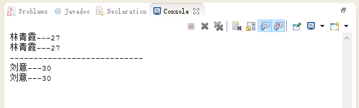

## 2.11 类的初始化过程

Student s = new Student();在内存中做了哪些事情?

- 加载Student.class文件进内存
- 在栈内存为s开辟空间
- 在堆内存为学生对象开辟空间
- 对学生对象的成员变量进行默认初始化
- 对学生对象的成员变量进行显示初始化
- 通过构造方法对学生对象的成员变量赋值
- 学生对象初始化完毕，把对象地址赋值给s变量

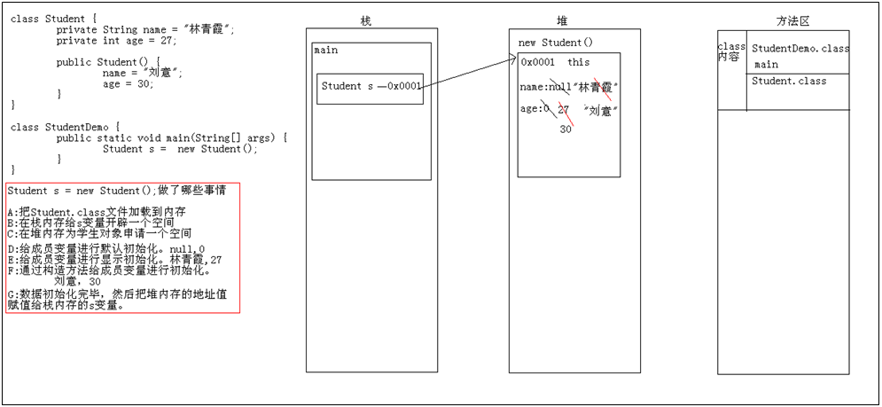

## 2.12 static关键字

static关键字可以修饰成员变量和成员方法

### static关键字特点

- 随着类的加载而加载
- 优先于对象存在
- 被类的所有对象共享
- 这也是我们判断是否使用静态关键字的条件
- 可以通过类名调用

### static关键字注意事项

- 在静态方法中是没有this关键字的
- 静态方法只能访问静态的成员变量和静态的成员方法

静态的内存图

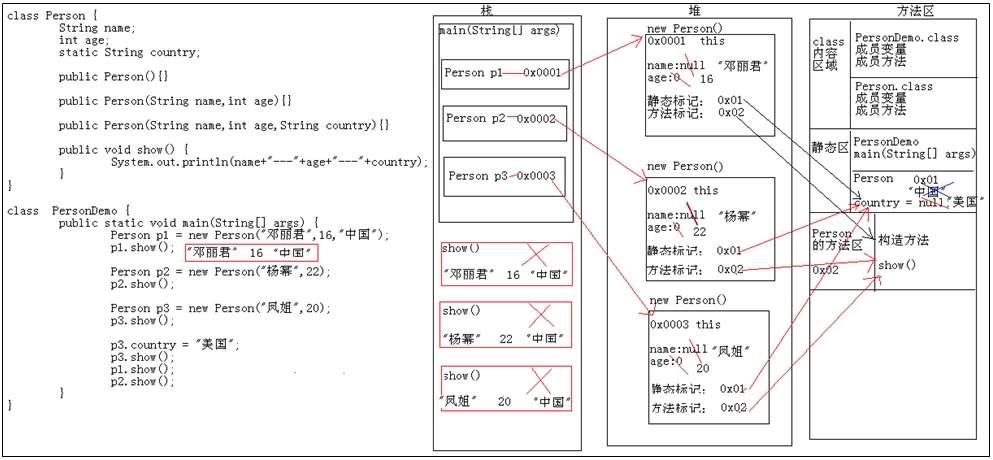

静态变量和成员变量的区别

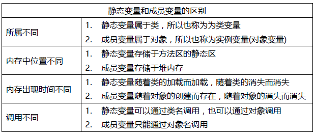

### main方法是静态的

public static void main(String[] args) {}

- public 被jvm调用，访问权限足够大。
- static 被jvm调用，不用创建对象，直接类名访问
- void被jvm调用，不需要给jvm返回值
- main 一个通用的名称，虽然不是关键字，但是被jvm识别
- String[] args 以前用于接收键盘录入的
- 静态什么时候用？

### 静态变量

当分析对象中所具备的成员变量的值都是相同时，这时这个成员就可以被静态修饰。

只要数据在对象中都是不同的，就是对象的特有数据，必须存储在对象中，是非静态的。

如果是相同的数据，对象不需要做修改，只需要使用即可，不需要存储在对象中，定义成静态的。

### 静态函数

函数是否用静态修饰，就参考一点，就是该函数功能是否需要访问到对象中的特有数据。

简单点说，从源代码看，该功能是否需要访问非静态的成员变量，如果需要，该功能就是非静态的。

如果不需要，就可以将该功能定义成静态的。当然，也可以定义成非静态，但是非静态需要被对象调用。

如果没有访问特有数据的方法，该对象的创建是没有意义。

```java
/*
	main方法的格式讲解：
		public static void main(String[] args) {...}

		public:公共的，访问权限是最大的。由于main方法是被jvm调用，所以权限要够大。
		static:静态的，不需要创建对象，通过类名就可以。方便jvm的调用。
		void:因为我们曾经说过，方法的返回值是返回给调用者，而main方法是被jvm调用。你返回内容给jvm没有意义。
		main:是一个常见的方法入口。我见过的语言都是以main作为入口。
		String[] args:这是一个字符串数组。值去哪里了?
			这个东西到底有什么用啊?怎么给值啊?
				这个东西早期是为了接收键盘录入的数据的。
				格式是：
					java MainDemo hello world java
*/
class MainDemo {
	public static void main(String[] args) {
		//System.out.println(args); //[Ljava.lang.String;@175078b
		//System.out.println(args.length); //0
		//System.out.println(args[0]); //ArrayIndexOutOfBoundsException

		//接收数据后
		System.out.println(args);
		System.out.println(args.length);
		//System.out.println(args[0]);
		for(int x=0; x<args.length; x++) {
			System.out.println(args[x]);
		}
	}
}
```

运行结果：


# 3. 修饰符

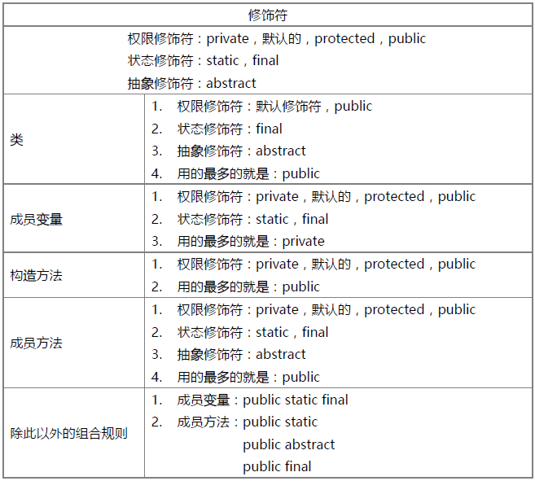

# 4. 关键字

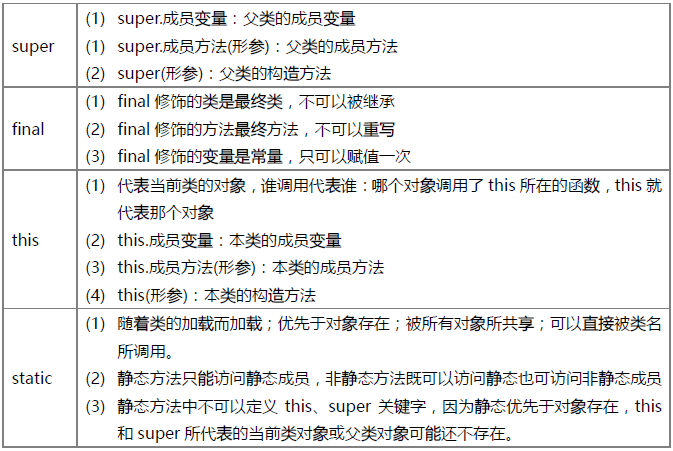
