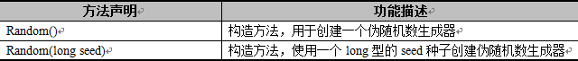

### Math类

Math类是数学操作类，Math类提供了常用的一些数学函数，如：三角函数、对数、指数等。一个数学公式如果想用代码表示，则可以将其拆分然后套用Math类下的方法即可。

Math类中有两个静态常量PI和E，分别代表数学常量π和e。

```java
Math.abs(12.3);                 //12.3 返回这个数的绝对值  
Math.abs(-12.3);                //12.3  
  
Math.copySign(1.23, -12.3);     //-1.23,返回第一个参数的量值和第二个参数的符号  
Math.copySign(-12.3, 1.23);     //12.3  
  
Math.signum(x);                 //如果x大于0则返回1.0，小于0则返回-1.0，等于0则返回0  
Math.signum(12.3);              //1.0  
Math.signum(-12.3);             //-1.0  
Math.signum(0);                 //0.0  
  
  
//指数  
Math.exp(x);                    //e的x次幂  
Math.expm1(x);                  //e的x次幂 - 1  
  
Math.scalb(x, y);               //x*(2的y次幂）  
Math.scalb(12.3, 3);            //12.3*2³  
  
//取整  
Math.ceil(12.3);                //返回最近的且大于这个数的整数13.0  
Math.ceil(-12.3);               //-12.0  
  
Math.floor(12.3);               //返回最近的且小于这个数的整数12.0  
Math.floor(-12.3);              //-13.0  
  
//x和y平方和的二次方根  
Math.hypot(x, y);               //√（x²+y²）  
  
//返回概述的二次方根  
Math.sqrt(x);                   //√(x) x的二次方根  
Math.sqrt(9);                   //3.0  
Math.sqrt(16);                  //4.0  
  
//返回该数的立方根  
Math.cbrt(27.0);                //3   
Math.cbrt(-125.0);              //-5  
  
//对数函数  
Math.log(e);                    //1 以e为底的对数  
Math.log10(100);                //10 以10为底的对数  
Math.log1p(x);                  //Ln（x+ 1）  
  
//返回较大值和较小值  
Math.max(x, y);                 //返回x、y中较大的那个数  
Math.min(x, y);                 //返回x、y中较小的那个数  
  
//返回 x的y次幂  
Math.pow(x, y);                   
Math.pow(2, 3);                 //即2³ 即返回：8  
  
//随机返回[0,1)之间的无符号double值  
Math.random();                    
  
//返回最接近这个数的整数,如果刚好居中，则取偶数  
Math.rint(12.3);                //12.0   
Math.rint(-12.3);               //-12.0  
Math.rint(78.9);                //79.0  
Math.rint(-78.9);               //-79.0  
Math.rint(34.5);                //34.0  
Math.rint(35.5);                //36.0  
  
Math.round(12.3);               //与rint相似，返回值为long  
  
//三角函数  
Math.sin(α);                    //sin（α）的值  
Math.cos(α);                    //cos（α）的值  
Math.tan(α);                    //tan（α）的值  
  
//求角  
Math.asin(x/z);                 //返回角度值[-π/2，π/2]  arc sin（x/z）  
Math.acos(y/z);                 //返回角度值[0~π]   arc cos（y/z）  
Math.atan(y/x);                 //返回角度值[-π/2，π/2]  
Math.atan2(y-y0, x-x0);         //同上，返回经过点（x，y）与原点的的直线和经过点（x0，y0）与原点的直线之间所成的夹角  
  
Math.sinh(x);                   //双曲正弦函数sinh(x)=(exp(x) - exp(-x)) / 2.0;  
Math.cosh(x);                   //双曲余弦函数cosh(x)=(exp(x) + exp(-x)) / 2.0;  
Math.tanh(x);                   //tanh(x) = sinh(x) / cosh(x);  
  
//角度弧度互换  360°角=2π弧度
Math.toDegrees(angrad);         //角度转换成弧度，返回：angrad * 180d / PI  
  
Math.toRadians(angdeg);         //弧度转换成角度，返回：angdeg / 180d * PI  

Math.PI
```
```java
package cn.itcast.chapter05.example15;
/**
 * Math类中比较常见的方法
 */
public class Example15 {
	public static void main(String[] args) {
		System.out.println("计算绝对值的结果: " + Math.abs(-1));
		System.out.println("求大于参数的最小整数: " + Math.ceil(5.6));
		System.out.println("求小于参数的最大整数: " + Math.floor(-4.2));
		System.out.println("对小数进行四舍五入后的结果: " + Math.round(-4.6));
		System.out.println("求两个数的较大值: " + Math.max(2.1, -2.1));
		System.out.println("求两个数的较小值: " + Math.min(2.1, -2.1));
		System.out.println("生成一个大于等于0.0小于1.0随机值: " + Math.random());
	}
}
```

### Random类

在JDK的java.util包中有一个Random类，它可以在指定的取值范围内随机产生数字。在Random类中提供了两个构造方法，具体如下表所示。



表中列举了Random类的两个构造方法，其中第一个构造方法是无参的，通过它创建的Random实例对象每次使用的种子是随机的，因此每个对象所产生的随机数不同。如果希望创建的多个Random实例对象产生相同序列的随机数，则可以在创建对象时调用第二个构造方法，传入相同的种子即可。

相对于Math的random()方法而言，Random类提供了更多的方法来生成各种伪随机数，不仅可以生成整数类型的随机数，还可以生成浮点类型的随机数，表中列举了Random类中的常用方法。


表中，列出了Random类常用的方法，其中，Random类的nextDouble()方法返回的是0.0和1.0之间double类型的值，nextFloat()方法返回的是0.0和1.0之间float类型的值，nextInt(int n)返回的是0（包括）和指定值n（不包括）之间的值。

```java
package cn.itcast.chapter05.example16;
import java.util.Random;
/**
 * 使用构造方法Random()产生随机数
 */
public class Example16 {
	public static void main(String args[]) {
		Random r = new Random(); // 不传入种子
		// 随机产生10个[0,100)之间的整数
		for (int x = 0; x < 10; x++) {
			System.out.println(r.nextInt(100));
		}
	}
}
```

```java
package cn.itcast.chapter05.example17;
import java.util.Random;
/**
 * 使用构造方法Random(long seed)产生随机数
 */
public class Example17 {
	public static void main(String args[]) {
		Random r = new Random(13); // 创建对象时传入种子
		// 随机产生10个[0,100)之间的整数
		for (int x = 0; x < 10; x++) {
			System.out.println(r.nextInt(100));
		}
	}
}
```

```java
package cn.itcast.chapter05.example18;
import java.util.Random;
/**
 * Random类中的常用方法
 */
public class Example18 {
	public static void main(String[] args) {
		Random r1 = new Random(); // 创建Random实例对象
		System.out.println("产生float类型随机数: " + r1.nextFloat());
		System.out.println("产生0~100之间int类型的随机数:" + r1.nextInt(100));
		System.out.println("产生double类型的随机数:" + r1.nextDouble());
	}
}
```