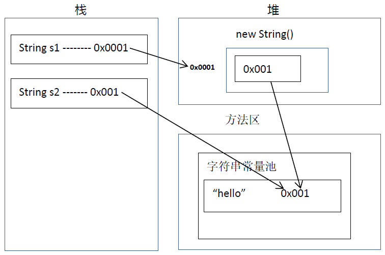
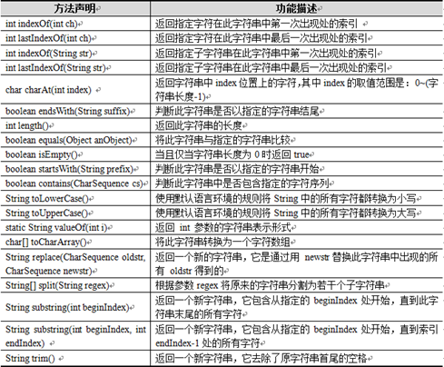
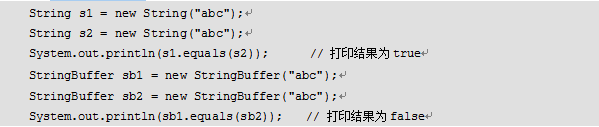
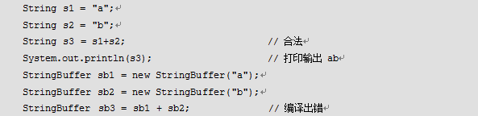
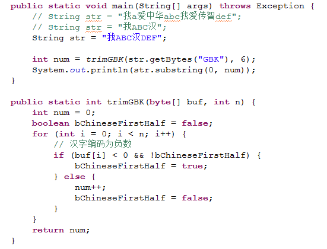
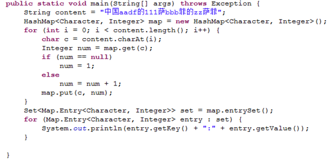
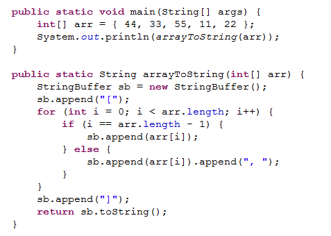
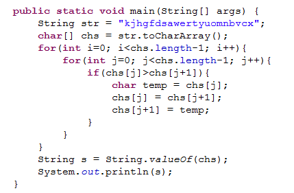

# 相关阅读
1. [Java基础：String类](http://blog.csdn.net/axi295309066/article/details/52765748)
2. [Java字符串格式化](http://blog.csdn.net/axi295309066/article/details/52820512)
3. [Java基础：正则表达式](http://blog.csdn.net/axi295309066/article/details/52822073)

# **1. 概述**
字符串是由多个字符组成的一串数据(字符序列)，字符串可以看成是字符数组。

在实际开发中，字符串的操作是最常见的操作，没有之一。而Java没有内置的字符串类型，所以，就在Java类库中提供了一个类String 供我们来使用。String 类代表字符串。

在应用程序中经常会用到字符串，所谓字符串就是指一连串的字符，它是由许多单个字符连接而成的，如多个英文字母所组成的一个英文单词。字符串中可以包含任意字符，这些字符必须包含在一对双引号“”之内，例如“abc”。在Java中定义了String和StringBuffer两个类来封装字符串，并提供了一系列操作字符串的方法，它们都位于java.lang包中，因此不需要导包就可以直接使用。

# **2. String类的特点**
- 字符串是常量,它的值在创建之后不能更改
- Java 程序中的所有字符串字面值（如 "abc" ）都作为此类的实例实现。
- 字符串如果是变量相加，先开空间，在拼接。
- 字符串如果是常量相加，是先加，然后在常量池找，如果有就直接返回，否则，就创建。
```java
package cn.itcast_02;  
/*
 * 字符串的特点：一旦被赋值，就不能改变。
 */  
public class StringDemo {  
    public static void main(String[] args) {  
        String s = "hello";  
        s += "world";  
        System.out.println("s:" + s); // helloworld  
    }  
}  
```

字符串在内存中1


字符串在内存中2

`String s1 = new String(“hello”);`和`String s2 = “hello”;`有什么区别？

前者创建了2个或1个对象，后者创建了1个或0个对象。

```java
String s1 = new String(“hello”);
String s2 = “hello”;
s1 == s2; // false   
s1.equals(s2); // true

String s3 = “hello”;    String s4 = “world”;   String s5 = “helloworld”;

S5== s3 + s4 ; //fale      
s5 == “hello” + ”world”; //true
```

字符串如果是变量相加，先开空间，再拼接。

字符串如果是常量相加，是先加，然后到字符串常量池中找，如果有就直接返回，否则就创建。



# **3. 常见操作方法**



## **3.1 构造方法**
| 方法                                    | 说明             |
| :------------------------------------ | :------------- |
| String()                              | 创建一个内容为空的字符串   |
| String(byte[])                        | 根据指定的字节数组创建对象  |
| String(byte[]，int，int)                | 根据字节数组的一部分创建对象 |
| String(char[])                        | 根据指定的字符数组创建对象  |
| String(char[]，int，int)                | 根据字符数组的一部分创建对象 |
| String(String)                        | 根据指定的字符串内容创建对象 |
| String(byte[] bytes, Charset charset) | 使用指定的编码构造字符串对象 |

```java
package cn.itcast_01;  
/*
 * 字符串：就是由多个字符组成的一串数据。也可以看成是一个字符数组。
 * 通过查看API，我们可以知道
 *      A:字符串字面值"abc"也可以看成是一个字符串对象。
 *      B:字符串是常量，一旦被赋值，就不能被改变。
 *  
 * 构造方法：
 *      public String():空构造
 *      public String(byte[] bytes):把字节数组转成字符串
 *      public String(byte[] bytes,int index,int length):把字节数组的一部分转成字符串
 *      public String(char[] value):把字符数组转成字符串
 *      public String(char[] value,int index,int count):把字符数组的一部分转成字符串
 *      public String(String original):把字符串常量值转成字符串
 *
 * 字符串的方法：
 *      public int length()：返回此字符串的长度。
 */  
public class StringDemo {  
    public static void main(String[] args) {  
        // public String():空构造  
        String s1 = new String();  
        System.out.println("s1:" + s1);  
        System.out.println("s1.length():" + s1.length());  
        System.out.println("--------------------------");  

        // public String(byte[] bytes):把字节数组转成字符串  
        byte[] bys = { 97, 98, 99, 100, 101 };  
        String s2 = new String(bys);  
        System.out.println("s2:" + s2);  
        System.out.println("s2.length():" + s2.length());  
        System.out.println("--------------------------");  

        // public String(byte[] bytes,int index,int length):把字节数组的一部分转成字符串  
        // 我想得到字符串"bcd"  
        String s3 = new String(bys, 1, 3);  
        System.out.println("s3:" + s3);  
        System.out.println("s3.length():" + s3.length());  
        System.out.println("--------------------------");  

        // public String(char[] value):把字符数组转成字符串  
        char[] chs = { 'a', 'b', 'c', 'd', 'e', '爱', '林', '亲' };  
        String s4 = new String(chs);  
        System.out.println("s4:" + s4);  
        System.out.println("s4.length():" + s4.length());  
        System.out.println("--------------------------");  

        // public String(char[] value,int index,int count):把字符数组的一部分转成字符串  
        String s5 = new String(chs, 2, 4);  
        System.out.println("s5:" + s5);  
        System.out.println("s5.length():" + s5.length());  
        System.out.println("--------------------------");  

        //public String(String original):把字符串常量值转成字符串  
        String s6 = new String("abcde");  
        System.out.println("s6:" + s6);  
        System.out.println("s6.length():" + s6.length());  
        System.out.println("--------------------------");  

        //字符串字面值"abc"也可以看成是一个字符串对象。  
        String s7 = "abcde";  
        System.out.println("s7:"+s7);  
        System.out.println("s7.length():"+s7.length());  
    }  
}  
```

运行结果：

```
s1:
s1.length():0
--------------------------
s2:abcde
s2.length():5
--------------------------
s3:bcd
s3.length():3
--------------------------
s4:abcde爱林亲
s4.length():8
--------------------------
s5:cde爱
s5.length():4
--------------------------
s6:abcde
s6.length():5
--------------------------
s7:abcde
s7.length():5
```

## **3.2 判断功能**
| 方法                   | 说明                 |
| :------------------- | :----------------- |
| equals()             | 比较字符串的内容是否相等，区分大小写 |
| equalsIgnoreCase()   | 比较字符串的内容是否相等，忽略大小写 |
| contains(String str) | 判断大字符串中是否包含小字符串    |
| startsWith()         | 判断字符串是否以某个字符串开头    |
| endsWith()           | 判断字符串是否以某个字符串结尾    |
| isEmpty()            | 判断字符串是否为空          |

```java
package cn.itcast_03;  
/*
 * String类的判断功能：
 * boolean equals(Object obj):比较字符串的内容是否相同,区分大小写
 * boolean equalsIgnoreCase(String str):比较字符串的内容是否相同,忽略大小写
 * boolean contains(String str):判断大字符串中是否包含小字符串
 * boolean startsWith(String str):判断字符串是否以某个指定的字符串开头
 * boolean endsWith(String str):判断字符串是否以某个指定的字符串结尾
 * boolean isEmpty():判断字符串是否为空。
 *  
 * 注意：
 *      字符串内容为空和字符串对象为空。
 *      String s = "";
 *      String s = null;
 */  
public class StringDemo {  
    public static void main(String[] args) {  
        // 创建字符串对象  
        String s1 = "helloworld";  
        String s2 = "helloworld";  
        String s3 = "HelloWorld";  

        // boolean equals(Object obj):比较字符串的内容是否相同,区分大小写  
        System.out.println("equals:" + s1.equals(s2));  
        System.out.println("equals:" + s1.equals(s3));  
        System.out.println("-----------------------");  

        // boolean equalsIgnoreCase(String str):比较字符串的内容是否相同,忽略大小写  
        System.out.println("equals:" + s1.equalsIgnoreCase(s2));  
        System.out.println("equals:" + s1.equalsIgnoreCase(s3));  
        System.out.println("-----------------------");  

        // boolean contains(String str):判断大字符串中是否包含小字符串  
        System.out.println("contains:" + s1.contains("hello"));  
        System.out.println("contains:" + s1.contains("hw"));  
        System.out.println("-----------------------");  

        // boolean startsWith(String str):判断字符串是否以某个指定的字符串开头  
        System.out.println("startsWith:" + s1.startsWith("h"));  
        System.out.println("startsWith:" + s1.startsWith("hello"));  
        System.out.println("startsWith:" + s1.startsWith("world"));  
        System.out.println("-----------------------");  

        // 练习：boolean endsWith(String str):判断字符串是否以某个指定的字符串结尾这个自己玩  

        // boolean isEmpty():判断字符串是否为空。  
        System.out.println("isEmpty:" + s1.isEmpty());  

        String s4 = "";  
        String s5 = null;  
        System.out.println("isEmpty:" + s4.isEmpty());  
        // NullPointerException  
        // s5对象都不存在，所以不能调用方法，空指针异常  
        System.out.println("isEmpty:" + s5.isEmpty());  
    }  
}  
```

运行结果：

```
equals:true
equals:false
-----------------------
equals:true
equals:true
-----------------------
contains:true
contains:false
-----------------------
startsWith:true
startsWith:true
startsWith:false
-----------------------
isEmpty:false
isEmpty:true
Exception in thread "main" java.lang.NullPointerException
	at Test.main(Test.java:43)
```

## **3.3 获取功能**
| 方法                            | 说明                |
| :---------------------------- | :---------------- |
| length()                      | 获取字符串长度           |
| charAt(int index)             | 获取指定位置的字符         |
| indexOf(int ch)               | 字符第一次出现的索引        |
| indexOf(String str)           | 字符串第一次出现的索引       |
| indexOf(int ch,int fromIndex) | 字符从指定位置后第一次出现的索引  |
| indexOf(String str,int from)  | 字符串从指定位置后第一次出现的索引 |
| lastIndexOf()                 | 字符串最后一次出现的索引      |
| subString(int start)          | 从指定位置开始截取字符串      |
| subString(int start,int end)  | 截取字符串，包左不包右       |

```java
package cn.itcast_04;   
/*
 * String类的获取功能
 * int length():获取字符串的长度。
 * char charAt(int index):获取指定索引位置的字符
 * int indexOf(int ch):返回指定字符在此字符串中第一次出现处的索引。
 *      为什么这里是int类型，而不是char类型?
 *      原因是：'a'和97其实都可以代表'a'
 * int indexOf(String str):返回指定字符串在此字符串中第一次出现处的索引。
 * int indexOf(int ch,int fromIndex):返回指定字符在此字符串中从指定位置后第一次出现处的索引。
 * int indexOf(String str,int fromIndex):返回指定字符串在此字符串中从指定位置后第一次出现处的索引。
 * String substring(int start):从指定位置开始截取字符串,默认到末尾。
 * String substring(int start,int end):从指定位置开始到指定位置结束截取字符串。
 */  
public class StringDemo {  
    public static void main(String[] args) {  
        // 定义一个字符串对象  
        String s = "helloworld";  

        // int length():获取字符串的长度。  
        System.out.println("s.length:" + s.length());  
        System.out.println("----------------------");  

        // char charAt(int index):获取指定索引位置的字符  
        System.out.println("charAt:" + s.charAt(7));  
        System.out.println("----------------------");  

        // int indexOf(int ch):返回指定字符在此字符串中第一次出现处的索引。  
        System.out.println("indexOf:" + s.indexOf('l'));  
        System.out.println("----------------------");  

        // int indexOf(String str):返回指定字符串在此字符串中第一次出现处的索引。  
        System.out.println("indexOf:" + s.indexOf("owo"));  
        System.out.println("----------------------");  

        // int indexOf(int ch,int fromIndex):返回指定字符在此字符串中从指定位置后第一次出现处的索引。  
        System.out.println("indexOf:" + s.indexOf('l', 4));  
        System.out.println("indexOf:" + s.indexOf('k', 4)); // -1  
        System.out.println("indexOf:" + s.indexOf('l', 40)); // -1  
        System.out.println("----------------------");  

        // 自己练习：int indexOf(String str,int  
        // fromIndex):返回指定字符串在此字符串中从指定位置后第一次出现处的索引。  

        // String substring(int start):从指定位置开始截取字符串,默认到末尾。包含start这个索引  
        System.out.println("substring:" + s.substring(5));  
        System.out.println("substring:" + s.substring(0));  
        System.out.println("----------------------");  

        // String substring(int start,int  
        // end):从指定位置开始到指定位置结束截取字符串。包括start索引但是不包end索引  
        System.out.println("substring:" + s.substring(3, 8));  
        System.out.println("substring:" + s.substring(0, s.length()));  
    }  
}  
```

运行结果：

```
s.length:10
----------------------
charAt:r
----------------------
indexOf:2
----------------------
indexOf:4
----------------------
indexOf:8
indexOf:-1
indexOf:-1
----------------------
substring:world
substring:helloworld
----------------------
substring:lowor
substring:helloworld
```

## **3.4 转换功能**
| 方法                  | 说明             |
| :------------------ | :------------- |
| getBytes()          | 把字符串转成字节数组     |
| getCharArray()      | 把字符串转成字符数组     |
| valueOf(char[] chs) | 把字符数组转成字符串     |
| valueOf(int i)      | 把int类型的数据转成字符串 |
| toLowerCase()       | 把字符串转成小写       |
| toUpperCase()       | 把字符串转成大写       |
| concat(String str)  | 字符串拼接          |

```java
package cn.itcast_05;  
/*
 * String的转换功能：
 * byte[] getBytes():把字符串转换为字节数组。
 * char[] toCharArray():把字符串转换为字符数组。
 * static String valueOf(char[] chs):把字符数组转成字符串。
 * static String valueOf(int i):把int类型的数据转成字符串。
 *      注意：String类的valueOf方法可以把任意类型的数据转成字符串。
 * String toLowerCase():把字符串转成小写。
 * String toUpperCase():把字符串转成大写。
 * String concat(String str):把字符串拼接。
 */  
public class StringDemo {  
    public static void main(String[] args) {  
        // 定义一个字符串对象  
        String s = "JavaSE";  

        // byte[] getBytes():把字符串转换为字节数组。  
        byte[] bys = s.getBytes();  
        for (int x = 0; x < bys.length; x++) {  
            System.out.println(bys[x]);  
        }  
        System.out.println("----------------");  

        // char[] toCharArray():把字符串转换为字符数组。  
        char[] chs = s.toCharArray();  
        for (int x = 0; x < chs.length; x++) {  
            System.out.println(chs[x]);  
        }  
        System.out.println("----------------");  

        // static String valueOf(char[] chs):把字符数组转成字符串。  
        String ss = String.valueOf(chs);  
        System.out.println(ss);  
        System.out.println("----------------");  

        // static String valueOf(int i):把int类型的数据转成字符串。  
        int i = 100;  
        String sss = String.valueOf(i);  
        System.out.println(sss);  
        System.out.println("----------------");  

        // String toLowerCase():把字符串转成小写。  
        System.out.println("toLowerCase:" + s.toLowerCase());  
        System.out.println("s:" + s);  
        // System.out.println("----------------");  
        // String toUpperCase():把字符串转成大写。  
        System.out.println("toUpperCase:" + s.toUpperCase());  
        System.out.println("----------------");  

        // String concat(String str):把字符串拼接。  
        String s1 = "hello";  
        String s2 = "world";  
        String s3 = s1 + s2;  
        String s4 = s1.concat(s2);  
        System.out.println("s3:"+s3);  
        System.out.println("s4:"+s4);  
    }  
}  
```

运行结果：

```
74
97
118
97
83
69
----------------
J
a
v
a
S
E
----------------
JavaSE
----------------
100
----------------
toLowerCase:javase
s:JavaSE
toUpperCase:JAVASE
----------------
s3:helloworld
s4:helloworld
```

## **3.5 其他功能**
| 方法                             | 说明               |
| :----------------------------- | :--------------- |
| replace(char old,char new)     | 替换字符             |
| replace(String old,String new) | 替换字符串            |
| trim()                         | 去掉字符串两端空格        |
| compareTo()                    | 按字典顺序比较字符串       |
| compareToIngnoreCase()         | 按字典顺序比较字符串，忽略大小写 |
| format()                       | 格式化字符串           |

```java
String.format(Locale.CHINA，"第%03d条数据%s"，10，"str")
```
更多关于字符串格式化的内容，请看[ Java字符串格式化String.format()的使用](http://blog.csdn.net/axi295309066/article/details/52820512)
```java
package cn.itcast_06;  
/*
 * String类的其他功能：
 *  
 * 替换功能：
 * String replace(char old,char new)
 * String replace(String old,String new)
 *
 * 去除字符串两空格  
 * String trim()
 *  
 * 按字典顺序比较两个字符串   
 * int compareTo(String str)
 * int compareToIgnoreCase(String str)
 */  
public class StringDemo {  
    public static void main(String[] args) {  
        // 替换功能  
        String s1 = "helloworld";  
        String s2 = s1.replace('l', 'k');  
        String s3 = s1.replace("owo", "ak47");  
        System.out.println("s1:" + s1);  
        System.out.println("s2:" + s2);  
        System.out.println("s3:" + s3);  
        System.out.println("---------------");  

        // 去除字符串两空格  
        String s4 = " hello world  ";  
        String s5 = s4.trim();  
        System.out.println("s4:" + s4 + "---");  
        System.out.println("s5:" + s5 + "---");  

        // 按字典顺序比较两个字符串  
        String s6 = "hello";  
        String s7 = "hello";  
        String s8 = "abc";  
        String s9 = "xyz";  
        System.out.println(s6.compareTo(s7));// 0  
        System.out.println(s6.compareTo(s8));// 7  
        System.out.println(s6.compareTo(s9));// -16  
    }  
}  
```

运行结果：

```
s1:helloworld
s2:hekkoworkd
s3:hellak47rld
---------------
s4: hello world  ---
s5:hello world---
0
7
-16
```

# **4. String类练习**

## 4.1 把数组中的数据按照指定个格式拼接成一个字符串

```java
package cn.itcast_07;  
/*
 * 需求：把数组中的数据按照指定个格式拼接成一个字符串
 * 举例：
 *      int[] arr = {1,2,3};     
 * 输出结果：
 *      "[1, 2, 3]"
 * 分析：
 *      A:定义一个字符串对象，只不过内容为空
 *      B:先把字符串拼接一个"["
 *      C:遍历int数组，得到每一个元素
 *      D:先判断该元素是否为最后一个
 *          是：就直接拼接元素和"]"
 *          不是：就拼接元素和逗号以及空格
 *      E:输出拼接后的字符串
 *  
 * 把代码用功能实现。
 */  
public class StringTest2 {  
    public static void main(String[] args) {  
        // 前提是数组已经存在  
        int[] arr = { 1, 2, 3 };  

        // 写一个功能，实现结果  
        String result = arrayToString(arr);  
        System.out.println("最终结果是：" + result);  
    }  

    /*
     * 两个明确： 返回值类型：String 参数列表：int[] arr
     */  
    public static String arrayToString(int[] arr) {  
        // 定义一个字符串  
        String s = "";  

        // 先把字符串拼接一个"["  
        s += "[";  

        // 遍历int数组，得到每一个元素  
        for (int x = 0; x < arr.length; x++) {  
            // 先判断该元素是否为最后一个  
            if (x == arr.length - 1) {  
                // 就直接拼接元素和"]"  
                s += arr[x];  
                s += "]";  
            } else {  
                // 就拼接元素和逗号以及空格  
                s += arr[x];  
                s += ", ";  
            }  
        }  

        return s;  
    }  
}  
```
## **4.2 字符串反转**
```java
package cn.itcast_07;  

import java.util.Scanner;  

/*
 * 字符串反转
 * 举例：键盘录入”abc”      
 * 输出结果：”cba”
 *  
 * 分析：
 *      A:键盘录入一个字符串
 *      B:定义一个新字符串
 *      C:倒着遍历字符串，得到每一个字符
 *          a:length()和charAt()结合
 *          b:把字符串转成字符数组
 *      D:用新字符串把每一个字符拼接起来
 *      E:输出新串
 */  
public class StringTest3 {  
    public static void main(String[] args) {  
        // 键盘录入一个字符串  
        Scanner sc = new Scanner(System.in);  
        System.out.println("请输入一个字符串：");  
        String line = sc.nextLine();  

        /*
        // 定义一个新字符串
        String result = "";

        // 把字符串转成字符数组
        char[] chs = line.toCharArray();

        // 倒着遍历字符串，得到每一个字符
        for (int x = chs.length - 1; x >= 0; x--) {
            // 用新字符串把每一个字符拼接起来
            result += chs[x];
        }

        // 输出新串
        System.out.println("反转后的结果是：" + result);
        */  

        // 改进为功能实现  
        String s = myReverse(line);  
        System.out.println("实现功能后的结果是：" + s);  
    }  

    /*
     * 两个明确： 返回值类型：String 参数列表：String
     */  
    public static String myReverse(String s) {  
        // 定义一个新字符串  
        String result = "";  

        // 把字符串转成字符数组  
        char[] chs = s.toCharArray();  

        // 倒着遍历字符串，得到每一个字符  
        for (int x = chs.length - 1; x >= 0; x--) {  
            // 用新字符串把每一个字符拼接起来  
            result += chs[x];  
        }  
        return result;  
    }  
}  
```
## **4.3 统计大串中小串出现的次数**
```java
package cn.itcast_07;  

/*
 * 统计大串中小串出现的次数
 * 举例：
 *      在字符串"woaijavawozhenaijavawozhendeaijavawozhendehenaijavaxinbuxinwoaijavagun"
 * 结果：
 *      java出现了5次
 *  
 * 分析：
 *      前提：是已经知道了大串和小串。
 *  
 *      A:定义一个统计变量，初始化值是0
 *      B:先在大串中查找一次小串第一次出现的位置
 *          a:索引是-1，说明不存在了，就返回统计变量
 *          b:索引不是-1，说明存在，统计变量++
 *      C:把刚才的索引+小串的长度作为开始位置截取上一次的大串，返回一个新的字符串，并把该字符串的值重新赋值给大串
 *      D:回到B
 */  
public class StringTest5 {  
    public static void main(String[] args) {  
        // 定义大串  
        String maxString = "woaijavawozhenaijavawozhendeaijavawozhendehenaijavaxinbuxinwoaijavagun";  
        // 定义小串  
        String minString = "java";  

        // 写功能实现  
        int count = getCount(maxString, minString);  
        System.out.println("Java在大串中出现了：" + count + "次");  
    }  

    /*
     * 两个明确： 返回值类型：int 参数列表：两个字符串
     */  
    public static int getCount(String maxString, String minString) {  
        // 定义一个统计变量，初始化值是0  
        int count = 0;  

        /*
        // 先在大串中查找一次小串第一次出现的位置
        int index = maxString.indexOf(minString);
        // 索引不是-1，说明存在，统计变量++
        while (index != -1) {
            count++;
            // 把刚才的索引+小串的长度作为开始位置截取上一次的大串，返回一个新的字符串，并把该字符串的值重新赋值给大串
            // int startIndex = index + minString.length();
            // maxString = maxString.substring(startIndex);
            maxString = maxString.substring(index + minString.length());
            // 继续查
            index = maxString.indexOf(minString);
        }
        */  

        int index;  
        //先查，赋值，判断  
        while((index=maxString.indexOf(minString))!=-1){  
            count++;  
            maxString = maxString.substring(index + minString.length());  
        }  

        return count;  
    }  
}  
```

# **5. StringBuffer**
由于字符串是常量，因此一旦创建，其内容和长度是不可改变的。如果需要对一个字符串进行修改，则只能创建新的字符串。为了便于对字符串进行修改，在JDK中提供了一个StringBuffer类（也称字符串缓冲区）。StringBuffer类和String类最大的区别在于它的内容和长度都是可以改变的。StringBuffer类似一个字符容器，当在其中添加或删除字符时，并不会产生新的StringBuffer对象。

我们如果对字符串进行拼接操作，每次拼接，都会构建一个新的String对象，既耗时，又浪费空间。而StringBuffer就可以解决这个问题

- StringBuffer是线程安全的可变字符序列。
- StringBuffer和String的区别?

前者长度和内容可变，后者不可变。如果使用前者做字符串的拼接，不会浪费太多的资源。

String类表示的字符串是常量，一旦创建后，内容和长度都是无法改变的。而StringBuffer表示字符容器，其内容和长度可以随时修改。在操作字符串时，如果该字符串仅用于表示数据类型，则使用String类即可，但是如果需要对字符串中的字符进行增删操作，则使用StringBuffer类。

String类覆盖了Object类的equals()方法，而StringBuffer类没有覆盖Object类的equals()方法，具体示例如下：



String类对象可以用操作符“+”进行连接，而StringBuffer类对象之间不能，具体示例如下：



# **6. 常见操作方法**


## **6.1 构造方法和获取方法**

```java
package cn.itcast_01;  

/*
 * StringBuffer:
 *      线程安全的可变字符串。
 *  
 * StringBuffer和String的区别?
 * 前者长度和内容可变，后者不可变。
 * 如果使用前者做字符串的拼接，不会浪费太多的资源。
 *  
 * StringBuffer的构造方法：
 *      public StringBuffer():无参构造方法
 *      public StringBuffer(int capacity):指定容量的字符串缓冲区对象
 *      public StringBuffer(String str):指定字符串内容的字符串缓冲区对象
 *
 * StringBuffer的获取方法：
 *      public int capacity()：返回当前容量。   理论值
 *      public int length():返回长度（字符数）。 实际值
 */  
public class StringBufferDemo {  
    public static void main(String[] args) {  
        // public StringBuffer():无参构造方法  
        StringBuffer sb = new StringBuffer();  
        System.out.println("sb:" + sb);  
        System.out.println("sb.capacity():" + sb.capacity());  
        System.out.println("sb.length():" + sb.length());  
        System.out.println("--------------------------");  

        // public StringBuffer(int capacity):指定容量的字符串缓冲区对象  
        StringBuffer sb2 = new StringBuffer(50);  
        System.out.println("sb2:" + sb2);  
        System.out.println("sb2.capacity():" + sb2.capacity());  
        System.out.println("sb2.length():" + sb2.length());  
        System.out.println("--------------------------");  

        // public StringBuffer(String str):指定字符串内容的字符串缓冲区对象  
        StringBuffer sb3 = new StringBuffer("hello");  
        System.out.println("sb3:" + sb3);  
        System.out.println("sb3.capacity():" + sb3.capacity());  
        System.out.println("sb3.length():" + sb3.length());  
    }  
}  
```
## **6.2 添加功能**
```java
package cn.itcast_02;  

/*
 * StringBuffer的添加功能：
 * public StringBuffer append(String str):可以把任意类型数据添加到字符串缓冲区里面,并返回字符串缓冲区本身
 *  
 * public StringBuffer insert(int offset,String str):在指定位置把任意类型的数据插入到字符串缓冲区里面,并返回字符串缓冲区本身
 */  
public class StringBufferDemo {  
    public static void main(String[] args) {  
        // 创建字符串缓冲区对象  
        StringBuffer sb = new StringBuffer();  

        // public StringBuffer append(String str)  
        // StringBuffer sb2 = sb.append("hello");  
        // System.out.println("sb:" + sb);  
        // System.out.println("sb2:" + sb2);  
        // System.out.println(sb == sb2); // true  

        // 一步一步的添加数据  
        // sb.append("hello");  
        // sb.append(true);  
        // sb.append(12);  
        // sb.append(34.56);  

        // 链式编程  
        sb.append("hello").append(true).append(12).append(34.56);  
        System.out.println("sb:" + sb);  

        // public StringBuffer insert(int offset,String  
        // str):在指定位置把任意类型的数据插入到字符串缓冲区里面,并返回字符串缓冲区本身  
        sb.insert(5, "world");  
        System.out.println("sb:" + sb);  
    }  
}
```
运行结果：

```
sb:hellotrue1234.56
sb:helloworldtrue1234.56
```

## **6.3 删除功能**
```java
package cn.itcast_03;  

/*
 * StringBuffer的删除功能
 * public StringBuffer deleteCharAt(int index):删除指定位置的字符，并返回本身
 * public StringBuffer delete(int start,int end):删除从指定位置开始指定位置结束的内容，并返回本身
 */  
public class StringBufferDemo {  
    public static void main(String[] args) {  
        // 创建对象  
        StringBuffer sb = new StringBuffer();  

        // 添加功能  
        sb.append("hello").append("world").append("java");  
        System.out.println("sb:" + sb);  

        // public StringBuffer deleteCharAt(int index):删除指定位置的字符，并返回本身  
        // 需求：我要删除e这个字符，肿么办?  
        // sb.deleteCharAt(1);  
        // 需求:我要删除第一个l这个字符，肿么办?  
        // sb.deleteCharAt(1);  

        // public StringBuffer delete(int start,int  
        // end):删除从指定位置开始指定位置结束的内容，并返回本身  
        // 需求：我要删除world这个字符串，肿么办?  
        // sb.delete(5, 10);  

        // 需求:我要删除所有的数据  
        sb.delete(0, sb.length());  

        System.out.println("sb:" + sb);  
    }  
}
```
运行结果：

```
sb:helloworldjava
sb:
```

## **6.4 替换功能**
```java
package cn.itcast_04;  

/*
 * StringBuffer的替换功能：
 * public StringBuffer replace(int start,int end,String str):从start开始到end用str替换
 */  
public class StringBufferDemo {  
    public static void main(String[] args) {  
        // 创建字符串缓冲区对象  
        StringBuffer sb = new StringBuffer();  

        // 添加数据  
        sb.append("hello");  
        sb.append("world");  
        sb.append("java");  
        System.out.println("sb:" + sb);  

        // public StringBuffer replace(int start,int end,String  
        // str):从start开始到end用str替换  
        // 需求：我要把world这个数据替换为"节日快乐"  
        sb.replace(5, 10, "节日快乐");  
        System.out.println("sb:" + sb);  
    }  
}
```

运行结果：

```
sb:helloworldjava
sb:hello节日快乐java
```

## **6.5 反转功能**

```java
package cn.itcast_05;  

/*
 * StringBuffer的反转功能：
 * public StringBuffer reverse()
 */  
public class StringBufferDemo {  
    public static void main(String[] args) {  
        // 创建字符串缓冲区对象  
        StringBuffer sb = new StringBuffer();  

        // 添加数据  
        sb.append("霞青林爱我");  
        System.out.println("sb:" + sb);  

        // public StringBuffer reverse()  
        sb.reverse();  
        System.out.println("sb:" + sb);  
    }  
}
```

运行结果：

```
sb:霞青林爱我
sb:我爱林青霞
```

## **6.6 截取功能**

```java
package cn.itcast_06;  

/*
 * StringBuffer的截取功能:注意返回值类型不再是StringBuffer本身了
 * public String substring(int start)
 * public String substring(int start,int end)
 */  
public class StringBufferDemo {  
    public static void main(String[] args) {  
        // 创建字符串缓冲区对象  
        StringBuffer sb = new StringBuffer();  

        // 添加元素  
        sb.append("hello").append("world").append("java");  
        System.out.println("sb:" + sb);  

        // 截取功能  
        // public String substring(int start)  
        String s = sb.substring(5);  
        System.out.println("s:" + s);  
        System.out.println("sb:" + sb);  

        // public String substring(int start,int end)  
        String ss = sb.substring(5, 10);  
        System.out.println("ss:" + ss);  
        System.out.println("sb:" + sb);  
    }  
}
```

运行结果：

```
sb:helloworldjava
s:worldjava
sb:helloworldjava
ss:world
sb:helloworldjava
```

# **7. StringBuffer类练习**
## **7.1 String和StringBuffer的相互转换**
```java
package cn.itcast_07;  

/*
 * 为什么我们要讲解类之间的转换：
 * A -- B的转换
 * 我们把A转换为B，其实是为了使用B的功能。
 * B -- A的转换
 * 我们可能要的结果是A类型，所以还得转回来。
 *  
 * String和StringBuffer的相互转换?
 */  
public class StringBufferTest {  
    public static void main(String[] args) {  
        // String -- StringBuffer  
        String s = "hello";  
        // 注意：不能把字符串的值直接赋值给StringBuffer  
        // StringBuffer sb = "hello";  
        // StringBuffer sb = s;  
        // 方式1:通过构造方法  
        StringBuffer sb = new StringBuffer(s);  
        // 方式2：通过append()方法  
        StringBuffer sb2 = new StringBuffer();  
        sb2.append(s);  
        System.out.println("sb:" + sb);  
        System.out.println("sb2:" + sb2);  
        System.out.println("---------------");  

        // StringBuffer -- String  
        StringBuffer buffer = new StringBuffer("java");  
        // String(StringBuffer buffer)  
        // 方式1:通过构造方法  
        String str = new String(buffer);  
        // 方式2：通过toString()方法  
        String str2 = buffer.toString();  
        System.out.println("str:" + str);  
        System.out.println("str2:" + str2);  
    }  
}
```
运行结果：

```
sb:hello
sb2:hello
---------------
str:java
str2:java
```

## **7.2 把数组拼接成一个字符串**
```java
package cn.itcast_07;  

/*
 * 把数组拼接成一个字符串
 */  
public class StringBufferTest2 {  
    public static void main(String[] args) {  
        // 定义一个数组  
        int[] arr = { 44, 33, 55, 11, 22 };  

        // 定义功能  
        // 方式1：用String做拼接的方式  
        String s1 = arrayToString(arr);  
        System.out.println("s1:" + s1);  

        // 方式2:用StringBuffer做拼接的方式  
        String s2 = arrayToString2(arr);  
        System.out.println("s2:" + s2);  
    }  

    // 用StringBuffer做拼接的方式  
    public static String arrayToString2(int[] arr) {  
        StringBuffer sb = new StringBuffer();  

        sb.append("[");  
        for (int x = 0; x < arr.length; x++) {  
            if (x == arr.length - 1) {  
                sb.append(arr[x]);  
            } else {  
                sb.append(arr[x]).append(", ");  
            }  
        }  
        sb.append("]");  

        return sb.toString();  
    }  

    // 用String做拼接的方式  
    public static String arrayToString(int[] arr) {  
        String s = "";  

        s += "[";  
        for (int x = 0; x < arr.length; x++) {  
            if (x == arr.length - 1) {  
                s += arr[x];  
            } else {  
                s += arr[x];  
                s += ", ";  
            }  
        }  
        s += "]";  

        return s;  
    }  
}
```
运行结果：

```
s1:[44, 33, 55, 11, 22]
s2:[44, 33, 55, 11, 22]
```

## **7.3 把字符串反转**
```java
package cn.itcast_07;  

import java.util.Scanner;  

/*
 * 把字符串反转
 */  
public class StringBufferTest3 {  
    public static void main(String[] args) {  
        // 键盘录入数据  
        Scanner sc = new Scanner(System.in);  
        System.out.println("请输入数据：");  
        String s = sc.nextLine();  

        // 方式1：用String做拼接  
        String s1 = myReverse(s);  
        System.out.println("s1:" + s1);  
        // 方式2：用StringBuffer的reverse()功能  
        String s2 = myReverse2(s);  
        System.out.println("s2:" + s2);  
    }  

    // 用StringBuffer的reverse()功能  
    public static String myReverse2(String s) {  
        // StringBuffer sb = new StringBuffer();  
        // sb.append(s);  

        // StringBuffer sb = new StringBuffer(s);  
        // sb.reverse();  
        // return sb.toString();  

        // 简易版  
        return new StringBuffer(s).reverse().toString();  
    }  

    // 用String做拼接  
    public static String myReverse(String s) {  
        String result = "";  

        char[] chs = s.toCharArray();  
        for (int x = chs.length - 1; x >= 0; x--) {  
            // char ch = chs[x];  
            // result += ch;  
            result += chs[x];  
        }  

        return result;  
    }  
}
```
运行结果：

```
请输入数据：
hello world
s1:dlrow olleh
s2:dlrow olleh
```

## **7.4 判断一个字符串是否是对称字符串**

```java
package cn.itcast_07;  

import java.util.Scanner;  

/*
 * 判断一个字符串是否是对称字符串
 * 例如"abc"不是对称字符串，"aba"、"abba"、"aaa"、"mnanm"是对称字符串
 *  
 * 分析：
 *      判断一个字符串是否是对称的字符串，我只需要把
 *          第一个和最后一个比较
 *          第二个和倒数第二个比较
 *          ...
 *      比较的次数是长度除以2。
 */  
public class StringBufferTest4 {  
    public static void main(String[] args) {  
        // 创建键盘录入对象  
        Scanner sc = new Scanner(System.in);  
        System.out.println("请输入一个字符串：");  
        String s = sc.nextLine();  

        // 一个一个的比较  
        boolean b = isSame(s);  
        System.out.println("b:" + b);  

        //用字符串缓冲区的反转功能  
        boolean b2 = isSame2(s);  
        System.out.println("b2:"+b2);  
    }  

    public static boolean isSame2(String s) {  
        return new StringBuffer(s).reverse().toString().equals(s);  
    }  


    // public static boolean isSame(String s) {  
    // // 把字符串转成字符数组  
    // char[] chs = s.toCharArray();  
    //  
    // for (int start = 0, end = chs.length - 1; start <= end; start++, end--) {  
    // if (chs[start] != chs[end]) {  
    // return false;  
    // }  
    // }  
    //  
    // return true;  
    // }  

    public static boolean isSame(String s) {  
        boolean flag = true;  

        // 把字符串转成字符数组  
        char[] chs = s.toCharArray();  

        for (int start = 0, end = chs.length - 1; start <= end; start++, end--) {  
            if (chs[start] != chs[end]) {  
                flag = false;  
                break;  
            }  
        }  

        return flag;  
    }  
}
```
运行结果：

```
请输入一个字符串：
abcba
b:true
b2:true
```

# 8. String常见问题

**8.1 Strings = new String("xyz")；创建了几个String Object？二者之间有什么区别？**

两个或一个，”xyz”对应一个对象，这个对象放在字符串常量缓冲区，常量”xyz”不管出现多少遍，都是缓冲区中的那一个。new String()每写一遍，就创建一个新的对象，它一句那个常量”xyz”对象的内容来创建出一个新String对象。如果以前就用过”xyz”，这句代表就不会创建”xyz”自己了，直接从缓冲区拿。

**8.2 String和StringBuffer的区别？**

String和StringBuffer，它们可以储存和操作字符串，即包含多个字符的字符数据。String类表示内容不可改变的字符串，而StringBuffer类表示内容可以被修改的字符串。String重写了equals()方法和hashCode()方法，而StringBuffer没有重写equals方法和hashCode方法，所以，将StringBuffer对象存储进Java集合类中时会出现问题。StringBuffer更加高效。

**8.3 StringBuffer与StringBuilder的区别？**

StringBuffer和StringBuilder类都表示内容可以被修改的字符串，StringBuilder是线程不安全的，运行效率高，如果一个字符串变量是在方法里面定义，这种情况只可能有一个线程访问它，不存在不安全的因素了，则用StringBuilder。如果要在类里面定义成员变量，并且这个类的实例对象会在多线程环境下使用，那么最好用StringBuffer。

**8.4 如何把一段逗号分割的字符串转换成一个数组?**

用正则表达式：`String [ ] result = Str.split(“, ”) ;`

**8.5 `Strings="a"+"b"+"c"+"d";` 一共创建了多少个对象？**

一个，相当于直接定义了一个”abcd”的字符串。Javac编译可以对字符串常量直接相加的表达式进行优化，不必要等到运行期去进行加法运算处理，而是在编译时去掉其中的加号，直接将其编译成一个这些常量相连的结果。

8.6 编写一个截取字符串的函数，输入为一个字符串和字节数，输出为按字节截取的字符串，但要保证汉字不被截取半个，如“我ABC”，4，应该截取“我AB”，输入“我ABC汉DEF”，6，应该输出“我ABC”，而不是“我ABC+汉的半个”。



**8.7 有一个字符串，其中包含中文字符、英文字符和数字字符，请统计和打印出各个字符的个数**

思路：取出字符串的每一个字符到HashMap中去找，如果不存在，则把该字符和1分别作为键和值添加到集合中，如果存在，则把该字符和值加1作为键和值添加到集合中。最后遍历集合即可得到字符的个数



**8.8 如果一串字符如"aaaabbc中国1512"要分别统计英文字符的数量，中文字符的数量，和数字字符的数量，假设字符中没有中文字符、英文字符、数字字符之外的其他特殊字符。**


```java
// 字符串反转
Public static String Reverce(String str){
		return new StringBuffer(str).reverce().toString();
}

// 判断字符串是否对称
Public static boolean isSame(String str){
		return new StringBuffer(str).reverce().toString().equals(str);
}
```

**8.9 把数组拼接成指定格式的字符串**



**8.10 把字符串中的字符进行排序**

