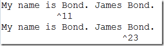
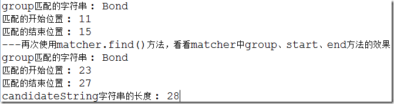
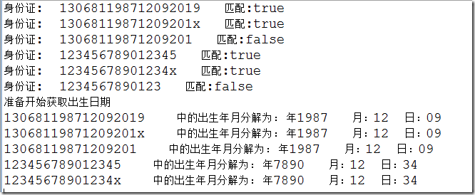

## 1. 正则表达式的应用

String 类提供的几个特殊方法

| 方法声明                | 功能描述                         |
| ------------------- | ---------------------------- |
| matches()           | 判断该字符串是否匹配指定的正则表达式           |
| replaceAll()        | 将该字符串所有匹配正则表达式的子串替换成指定的字符串   |
| replaceFirst()      | 将该字符串中第一个匹配正则表达式的子串替换成指定的字符串 |
| split(String regex) | 以regex为分隔符，将该字符串分割成多个子串      |

### 1.1 匹配功能

```java
public  boolean matches(String regex) // 编译给定正则表达式并尝试将给定输入与其匹配。
```

校验邮箱

```java
package cn.itcast_02;
import java.util.Scanner;
/*
 * 校验邮箱
 * 
 * 分析：
 * 		A:键盘录入邮箱
 * 		B:定义邮箱的规则
 * 			1517806580@qq.com
 * 			liuyi@163.com
 * 			linqingxia@126.com
 * 			fengqingyang@sina.com.cn
 * 			fqy@itcast.cn
 * 		C:调用功能，判断即可
 * 		D:输出结果
 */
public class RegexTest {
	public static void main(String[] args) {
		//键盘录入邮箱
		Scanner sc = new Scanner(System.in);
		System.out.println("请输入邮箱：");
		String email = sc.nextLine();
		
		//定义邮箱的规则
		//String regex = "[a-zA-Z_0-9]+@[a-zA-Z_0-9]{2,6}(\\.[a-zA-Z_0-9]{2,3})+";
		String regex = "\\w+@\\w{2,6}(\\.\\w{2,3})+";
		
		//调用功能，判断即可
		boolean flag = email.matches(regex);
		
		//输出结果
		System.out.println("flag:"+flag);
	}
}
```

### 1.2 分割功能

```java
public  String[] split(String regex) // 根据指定的正则表达式分割字符串
```

代码示例：我有如下一个字符串:”91 27 46 38 50”，请写代码实现最终输出结果是：”27 38 46 50 91”

```java
package cn.itcast_03;
import java.util.Arrays;
/*
 * 我有如下一个字符串:"91 27 46 38 50"
 * 请写代码实现最终输出结果是："27 38 46 50 91"
 * 
 * 分析：
 * 		A:定义一个字符串
 * 		B:把字符串进行分割，得到一个字符串数组
 * 		C:把字符串数组变换成int数组
 * 		D:对int数组排序
 * 		E:把排序后的int数组在组装成一个字符串
 * 		F:输出字符串
 */
public class RegexTest {
	public static void main(String[] args) {
		// 定义一个字符串
		String s = "91 27 46 38 50";

		// 把字符串进行分割，得到一个字符串数组
		String[] strArray = s.split(" ");

		// 把字符串数组变换成int数组
		int[] arr = new int[strArray.length];

		for (int x = 0; x < arr.length; x++) {
			arr[x] = Integer.parseInt(strArray[x]);
		}

		// 对int数组排序
		Arrays.sort(arr);

		// 把排序后的int数组在组装成一个字符串
		StringBuilder sb = new StringBuilder();
		for (int x = 0; x < arr.length; x++) {
			sb.append(arr[x]).append(" ");
		}
		//转化为字符串
		String result = sb.toString().trim();
		
		//输出字符串
		System.out.println("result:"+result);
	}
}
```

### 1.3 替换功能

```java
public  String replaceAll(String regex,String replacement)
```
使用给定的 replacement 替换此字符串所有匹配给定的正则表达式的子字符串。

- 论坛中不能出现数字字符，用\*替换

```java
package cn.itcast_04;
/*
 * 替换功能
 *  	String类的public String replaceAll(String regex,String replacement)
 *  	使用给定的 replacement 替换此字符串所有匹配给定的正则表达式的子字符串。 
 */
public class RegexDemo {
	public static void main(String[] args) {
		// 定义一个字符串
		String s = "helloqq12345worldkh622112345678java";

		// 我要去除所有的数字,用*给替换掉
		// String regex = "\\d+";
		// String regex = "\\d";
		//String ss = "*";
		
		
		// 直接把数字干掉
		String regex = "\\d+";
		String ss = "";

		String result = s.replaceAll(regex, ss);
		System.out.println(result);
	}
}
```

### 1.4 获取功能

Pattern和Matcher类的使用

```java
package cn.itcast_05;
import java.util.regex.Matcher;
import java.util.regex.Pattern;
/*
 * 获取功能
 *		Pattern和Matcher类的使用
 *		
 *		模式和匹配器的基本使用顺序
 */
public class RegexDemo {
	public static void main(String[] args) {
		// 模式和匹配器的典型调用顺序
		// 把正则表达式编译成模式对象
		Pattern p = Pattern.compile("a*b");
		// 通过模式对象得到匹配器对象，这个时候需要的是被匹配的字符串
		Matcher m = p.matcher("aaaaab");
		// 调用匹配器对象的功能
		boolean b = m.matches();
		System.out.println(b);
		
		//这个是判断功能，但是如果做判断，这样做就有点麻烦了，我们直接用字符串的方法做
		String s = "aaaaab";
		String regex = "a*b";
		boolean bb = s.matches(regex);
		System.out.println(bb);
	}
}
```
### 1.5 Pattern 匹配模式

Pattern类为正则表达式的编译表示形式。指定为字符串的表达式必须首先被编译为此类的实例。然后，可将得到的模式用于创建Matcher对象，依照正则表达式，该对象可与任意字符序列匹配。执行匹配所涉及的所有状态都驻留在匹配器中，所以多个匹配器可以共享同一个模式。

| 方法声明      | 功能描述                  |
| :-------- | :-------------------- |
| compile() | 把正则表达式编译成匹配模式         |
| matcher() | 根据匹配模式去匹配指定的字符串，得到匹配器 |

### 1.6 Matcher 匹配器

| 方法声明                      | 功能描述                                     |
| :------------------------ | :--------------------------------------- |
| matches()                 | 匹配字符串                                    |
| find()                    | 查找有没有满足条件的子串                             |
| group()                   | 获取满足条件的子串                                |
| reset()                   | 将Matcher的状态重新设置为最初的状态                    |
| reset(CharSequence input) | 重新设置Matcher的状态，并且将候选字符序列设置为input后进行Matcher, 这个方法和重新创建一个Matcher一样，只是这样可以重用以前的对象。 |
| start()                   | 返回Matcher所匹配的字符串在整个字符串的的开始下标             |
| start(int group)          | 指定你感兴趣的sub group,然后返回sup group(子分组)匹配的开始位置。 |
| end()                     | 返回在以前的匹配操作期间，由给定组所捕获子序列的最后字符之后的偏移量。      |

- 注意事项

Pattern类为正则表达式的编译表示形式。指定为字符串的正则表达式必须首先被编译为此类的实例。然后，可将得到的模式用于创建Matcher对象，依照正则表达式，该对象可以与任意字符序列匹配。执行匹配所涉及的所有状态都驻留在匹配器中，所以多个匹配器可以共享同一模式

分组：简单的说，分组其实就是为了能够指定同一个规则可以使用多少次。正则表达式中的分组就是整个大的正则表达式和用（）圈起来的内容。

在这个正则表达式"\\w(\\d\\d)(\\w+)"中

- 分组0：是"\\w(\\d\\d)(\\w+)"
- 分组1：是(\\d\\d)
- 分组2：是(\\w+)

如果我们稍稍变换一下，将原先的正则表达式改为"（\\w）(\\d\\d)(\\w+)"，我们的分组就变成了

- 分组0：是"\\w(\\d\\d)(\\w+)"
- 分组1：是"(\\w)"
- 分组2：是"(\\d\\d)"
- 分组3：是"(\\w+)"

我们看看和正则表达式”\\w(\\d\\d)(\\w+)”匹配的一个字符串A22happy

- group(0)是匹配整个表达式的字符串的那部分A22happy 
- group(1)是第1组(\d\d)匹配的部分:22 
- group(2)是第2组(\w+)匹配的那部分happy

```java
public static void main(String[] args) {
	String Regex="\\w(\\d\\d)(\\w+)";
	String TestStr="A22happy";
	Pattern p=Pattern.compile(Regex);
	Matcher matcher=p.matcher(TestStr);
	if (matcher.find()) {
	    int gc=matcher.groupCount();
	    for (int i = 0; i <= gc; i++) {
	        System.out.println("group "+i+" :"+matcher.group(i));
	    }
	}
}
```

- start()方法的使用

```java
public static void testStart(){
    //创建一个 Matcher ，使用 Matcher.start()方法
    String candidateString = "My name is Bond. James Bond.";
    String matchHelper[] ={"          ^","                      ^"};
    Pattern p = Pattern.compile("Bond");
    Matcher matcher = p.matcher(candidateString);
    //找到第一个 'Bond'的开始下标
    matcher.find();
    int startIndex = matcher.start();
    System.out.println(candidateString);
    System.out.println(matchHelper[0] + startIndex);
    //找到第二个'Bond'的开始下标
    matcher.find();
    int nextIndex = matcher.start();
    System.out.println(candidateString);
    System.out.println(matchHelper[1] + nextIndex);        
}
```

运行结果：



```java
/**
  * 测试matcher.group方法
  */
public static void testGroup() {
    // 创建一个 Pattern
    Pattern p = Pattern.compile("Bond");
    // 创建一个 Matcher ，以便使用 Matcher.group() 方法
    String candidateString = "My name is Bond. James Bond.";
    Matcher matcher = p.matcher(candidateString);
    // 提取 group
    matcher.find();
    System.out.println(String.format("group匹配的字符串 : %s",matcher.group()));
    System.out.println(String.format("匹配的开始位置 : %d", matcher.start()));
    System.out.println(String.format("匹配的结束位置 : %d", matcher.end()));

    System.out
            .println("---再次使用matcher.find()方法，看看matcher中group、start、end方法的效果");
    matcher.find();
    System.out.println(String.format("group匹配的字符串 : %s",matcher.group()));;
    System.out.println(String.format("匹配的开始位置 : %d", matcher.start()));
    System.out.println(String.format("匹配的结束位置 : %d", matcher.end()));
    System.out.println(String.format("candidateString字符串的长度 : %d", candidateString.length()));
}
```

运行结果：



- 获取由三个字符组成的单词

```java
package cn.itcast_05;
import java.util.regex.Matcher;
import java.util.regex.Pattern;
/*
 * 获取功能：
 * 获取下面这个字符串中由三个字符组成的单词
 * da jia ting wo shuo,jin tian yao xia yu,bu shang wan zi xi,gao xing bu?
 */
public class RegexDemo2 {
	public static void main(String[] args) {
		// 定义字符串
		String s = "da jia ting wo shuo,jin tian yao xia yu,bu shang wan zi xi,gao xing bu?";
		// 规则
		String regex = "\\b\\w{3}\\b";

		// 把规则编译成模式对象
		Pattern p = Pattern.compile(regex);
		// 通过模式对象得到匹配器对象
		Matcher m = p.matcher(s);
		// 调用匹配器对象的功能
		// 通过find方法就是查找有没有满足条件的子串
		// public boolean find()
		// boolean flag = m.find();
		// System.out.println(flag);
		// // 如何得到值呢?
		// // public String group()
		// String ss = m.group();
		// System.out.println(ss);
		//
		// // 再来一次
		// flag = m.find();
		// System.out.println(flag);
		// ss = m.group();
		// System.out.println(ss);

		while (m.find()) {
			System.out.println(m.group());
		}

		// 注意：一定要先find()，然后才能group()
		// IllegalStateException: No match found
		// String ss = m.group();
		// System.out.println(ss);
	}
}
```

- 判断身份证：要么是15位，要么是18位，最后一位可以为字母，并写程序提出其中的年月日。

```java
public static void main(String[] args) {
    testID_Card();
}

public static void testID_Card() {
    // 测试是否为合法的身份证号码
    String[] strs = { "130681198712092019", "13068119871209201x",
            "13068119871209201", "123456789012345", "12345678901234x",
            "1234567890123" };
    // 准备正则表达式（身份证有15位和18位两种，身份证的最后一位可能是字母）
    String regex = "(\\d{14}\\w)|\\d{17}\\w";
    // 准备开始匹配，判断所有的输入是否是正确的
    Pattern regular = Pattern.compile(regex); // 创建匹配的规则Patter

    StringBuilder sb = new StringBuilder();
    // 遍历所有要匹配的字符串
    for (int i = 0; i < strs.length; i++) {

        Matcher matcher = regular.matcher(strs[i]);// 创建一个Matcher
        sb.append("身份证:  ");
        sb.append(strs[i]);
        sb.append("   匹配:");
        sb.append(matcher.matches());
        System.out.println(sb.toString());
        sb.delete(0, sb.length());// 清空StringBuilder的方法
    }

    GetBirthDay(strs);

}

private static void GetBirthDay(String[] strs) {
    System.out.println("准备开始获取出生日期");
    // 准备验证规则
    Pattern BirthDayRegular = Pattern.compile("(\\d{6})(\\d{8})(.*)");
    // .*连在一起就意味着任意数量的不包含换行的字符
    Pattern YearMonthDayRegular = Pattern.compile("(\\d{4})(\\d{2})(\\d{2})");
    for (int i = 0; i < strs.length; i++) {
        Matcher matcher = BirthDayRegular.matcher(strs[i]);

        if (matcher.matches()) {
            Matcher matcher2 = YearMonthDayRegular.matcher(matcher.group(2));
            if (matcher2.matches()) {
                System.out.println(strs[i]+"    中的出生年月分解为： "+"年" + matcher2.group(1) + "   月：" + matcher2.group(2) + "  日：" + matcher2.group(3));

            }
        }
    }
}
```

运行结果：



## 2. 正则表达式工具类

```java
import java.util.regex.Matcher;
import java.util.regex.Pattern;

/**
 * 正则工具类 提供验证邮箱、手机号、电话号码、身份证号码、数字等方法
 */
public final class RegexUtils {

	/**
	 * 验证Email
	 * 
	 * @param email
	 *            email地址，格式：zhangsan@sina.com，zhangsan@xxx.com.cn，xxx代表邮件服务商
	 * @return 验证成功返回true，验证失败返回false ^ ：匹配输入的开始位置。 \：将下一个字符标记为特殊字符或字面值。
	 *         ：匹配前一个字符零次或几次。 + ：匹配前一个字符一次或多次。 (pattern) 与模式匹配并记住匹配。 x|y：匹配 x 或
	 *         y。 [a-z] ：表示某个范围内的字符。与指定区间内的任何字符匹配。 \w ：与任何单词字符匹配，包括下划线。
	 * 
	 *         {n,m} 最少匹配 n 次且最多匹配 m 次 $ ：匹配输入的结尾。
	 */
	public static boolean checkEmail(String email) {
		String regex = "^(\\w)+(\\.\\w+)*@(\\w)+((\\.\\w{2,3}){1,3})$";
		return Pattern.matches(regex, email);
	}

	/**
	 * 验证身份证号码
	 * 
	 * @param idCard
	 *            居民身份证号码15位或18位，最后一位可能是数字或字母
	 * @return 验证成功返回true，验证失败返回false
	 */
	public static boolean checkIdCard(String idCard) {
		String regex = "[1-9]\\d{13,16}[a-zA-Z0-9]{1}";
		return Pattern.matches(regex, idCard);
	}

	/**
	 * 验证手机号码（支持国际格式，+86135xxxx...（中国内地），+00852137xxxx...（中国香港））
	 * 
	 * @param mobile
	 *            移动、联通、电信运营商的号码段
	 *            <p>
	 *            移动的号段：134(0-8)、135、136、137、138、139、147（预计用于TD上网卡）
	 *            、150、151、152、157（TD专用）、158、159、187（未启用）、188（TD专用）
	 *            </p>
	 *            <p>
	 *            联通的号段：130、131、132、155、156（世界风专用）、185（未启用）、186（3g）
	 *            </p>
	 *            <p>
	 *            电信的号段：133、153、180（未启用）、189
	 *            </p>
	 *            <p>
	 *            虚拟运营商的号段：170
	 *            </p>
	 * @return 验证成功返回true，验证失败返回false
	 */
	public static boolean checkMobile(String mobile) {
		String regex = "(\\+\\d+)?1[34578]\\d{9}$";
		return Pattern.matches(regex, mobile);
	}

	/**
	 * 验证固定电话号码
	 * 
	 * @param phone
	 *            电话号码，格式：国家（地区）电话代码 + 区号（城市代码） + 电话号码，如：+8602085588447
	 *            <p>
	 *            <b>国家（地区） 代码 ：</b>标识电话号码的国家（地区）的标准国家（地区）代码。它包含从 0 到 9
	 *            的一位或多位数字， 数字之后是空格分隔的国家（地区）代码。
	 *            </p>
	 *            <p>
	 *            <b>区号（城市代码）：</b>这可能包含一个或多个从 0 到 9 的数字，地区或城市代码放在圆括号——
	 *            对不使用地区或城市代码的国家（地区），则省略该组件。
	 *            </p>
	 *            <p>
	 *            <b>电话号码：</b>这包含从 0 到 9 的一个或多个数字
	 *            </p>
	 * @return 验证成功返回true，验证失败返回false
	 */
	public static boolean checkPhone(String phone) {
		// String regex = "(\\+\\d+)?(\\d{3,4}\\-?)?\\d{7,8}$";
		String regex = "^1\\d{10}$";
		return Pattern.matches(regex, phone);
	}

	/**
	 * 验证整数（正整数和负整数）
	 * 
	 * @param digit
	 *            一位或多位0-9之间的整数
	 * @return 验证成功返回true，验证失败返回false
	 */
	public static boolean checkDigit(String digit) {
		String regex = "\\-?[1-9]\\d+";
		return Pattern.matches(regex, digit);
	}

	/**
	 * 验证整数和浮点数（正负整数和正负浮点数）
	 * 
	 * @param decimals
	 *            一位或多位0-9之间的浮点数，如：1.23，233.30
	 * @return 验证成功返回true，验证失败返回false
	 */
	public static boolean checkDecimals(String decimals) {
		String regex = "\\-?[1-9]\\d+(\\.\\d+)?";
		return Pattern.matches(regex, decimals);
	}

	/**
	 * 验证空白字符
	 * 
	 * @param blankSpace
	 *            空白字符，包括：空格、\t、\n、\r、\f、\x0B
	 * @return 验证成功返回true，验证失败返回false
	 */
	public static boolean checkBlankSpace(String blankSpace) {
		String regex = "\\s+";
		return Pattern.matches(regex, blankSpace);
	}

	/**
	 * 验证中文
	 * 
	 * @param chinese
	 *            中文字符
	 * @return 验证成功返回true，验证失败返回false
	 */
	public static boolean checkChinese(String chinese) {
		String regex = "^[\u4E00-\u9FA5]+$";
		return Pattern.matches(regex, chinese);
	}

	/**
	 * 验证日期（年月日）
	 * 
	 * @param birthday
	 *            日期，格式：1992-09-03，或1992.09.03
	 * @return 验证成功返回true，验证失败返回false
	 */
	public static boolean checkBirthday(String birthday) {
		String regex = "[1-9]{4}([-./])\\d{1,2}\\1\\d{1,2}";
		return Pattern.matches(regex, birthday);
	}

	/**
	 * 验证URL地址
	 * 
	 * @param url
	 *            格式：http://blog.csdn.net:80/xyang81/article/details/7705960? 或
	 *            http://www.csdn.net:80
	 * @return 验证成功返回true，验证失败返回false
	 */
	public static boolean checkURL(String url) {
		String regex = "(https?://(w{3}\\.)?)?\\w+\\.\\w+(\\.[a-zA-Z]+)*(:\\d{1,5})?(/\\w*)*(\\??(.+=.*)?(&.+=.*)?)?";
		return Pattern.matches(regex, url);
	}

	/**
	 * 匹配中国邮政编码
	 * 
	 * @param postcode
	 *            邮政编码
	 * @return 验证成功返回true，验证失败返回false
	 */
	public static boolean checkPostcode(String postcode) {
		String regex = "[1-9]\\d{5}";
		return Pattern.matches(regex, postcode);
	}

	/**
	 * 匹配IP地址(简单匹配，格式，如：192.168.1.1，127.0.0.1，没有匹配IP段的大小)
	 * 
	 * @param ipAddress
	 *            IPv4标准地址
	 * @return 验证成功返回true，验证失败返回false
	 */
	public static boolean checkIpAddress(String ipAddress) {
		String regex = "[1-9](\\d{1,2})?\\.(0|([1-9](\\d{1,2})?))\\.(0|([1-9](\\d{1,2})?))\\.(0|([1-9](\\d{1,2})?))";
		return Pattern.matches(regex, ipAddress);
	}

	public static boolean checkNickname(String nickname) {
		String regex = "^[a-zA-Z0-9\u4E00-\u9FA5_]+$";
		return Pattern.matches(regex, nickname);
	}
	

    public static boolean hasCrossSciptRiskInAddress(String str) {
        String regx = "[`~!@#$%^&*+=|{}':;',\\[\\].<>~！@#￥%……&*——+|{}【】‘；：”“’。，、？-]";
        if (str != null) {
            str = str.trim();
            Pattern p = Pattern.compile(regx, Pattern.CASE_INSENSITIVE);
            Matcher m = p.matcher(str);
            return m.find();
        }
        return false;
    }
}
```