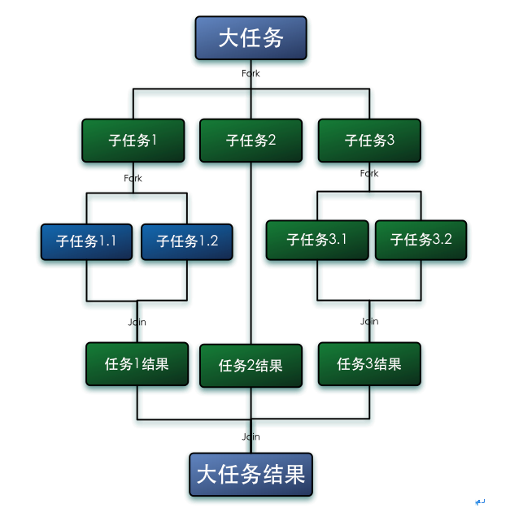
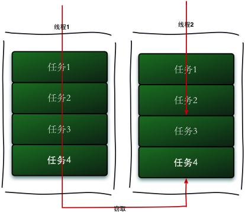
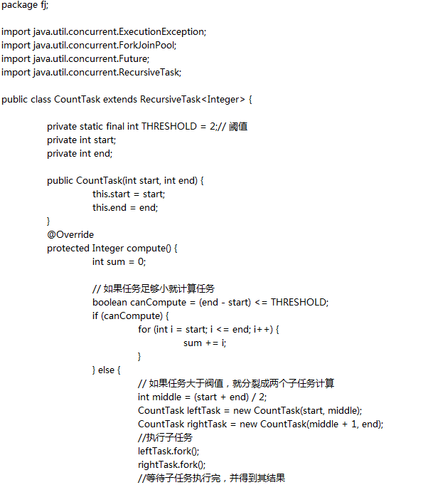
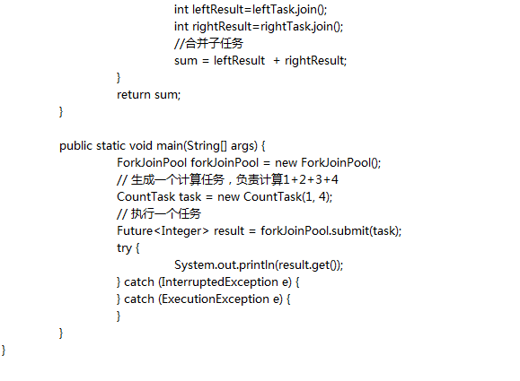

## 1. 什么是Fork/Join框架

Fork/Join框架是Java7提供了的一个用于并行执行任务的框架， 是一个把大任务分割成若干个小任务，最终汇总每个小任务结果后得到大任务结果的框架。

我们再通过Fork和Join这两个单词来理解下Fork/Join框架，Fork就是把一个大任务切分为若干子任务并行的执行，Join就是合并这些子任务的执行结果，最后得到这个大任务的结果。比如计算1+2+。。＋10000，可以分割成10个子任务，每个子任务分别对1000个数进行求和，最终汇总这10个子任务的结果。Fork/Join的运行流程图如下：



## 2. 工作窃取算法

工作窃取（work-stealing）算法是指某个线程从其他队列里窃取任务来执行。工作窃取的运行流程图如下：



那么为什么需要使用工作窃取算法呢？假如我们需要做一个比较大的任务，我们可以把这个任务分割为若干互不依赖的子任务，为了减少线程间的竞争，于是把这些子任务分别放到不同的队列里，并为每个队列创建一个单独的线程来执行队列里的任务，线程和队列一一对应，比如A线程负责处理A队列里的任务。但是有的线程会先把自己队列里的任务干完，而其他线程对应的队列里还有任务等待处理。干完活的线程与其等着，不如去帮其他线程干活，于是它就去其他线程的队列里窃取一个任务来执行。而在这时它们会访问同一个队列，所以为了减少窃取任务线程和被窃取任务线程之间的竞争，通常会使用双端队列，被窃取任务线程永远从双端队列的头部拿任务执行，而窃取任务的线程永远从双端队列的尾部拿任务执行。

工作窃取算法的优点是充分利用线程进行并行计算，并减少了线程间的竞争，其缺点是在某些情况下还是存在竞争，比如双端队列里只有一个任务时。并且消耗了更多的系统资源，比如创建多个线程和多个双端队列。

## 3. Fork/Join框架的介绍

我们已经很清楚Fork/Join框架的需求了，那么我们可以思考一下，如果让我们来设计一个Fork/Join框架，该如何设计？这个思考有助于你理解Fork/Join框架的设计。

第一步分割任务。首先我们需要有一个fork类来把大任务分割成子任务，有可能子任务还是很大，所以还需要不停的分割，直到分割出的子任务足够小。

第二步执行任务并合并结果。分割的子任务分别放在双端队列里，然后几个启动线程分别从双端队列里获取任务执行。子任务执行完的结果都统一放在一个队列里，启动一个线程从队列里拿数据，然后合并这些数据。

Fork/Join使用两个类来完成以上两件事情：

- ForkJoinTask：我们要使用ForkJoin框架，必须首先创建一个ForkJoin任务。它提供在任务中执行fork()和join()操作的机制，通常情况下我们不需要直接继承ForkJoinTask类，而只需要继承它的子类，Fork/Join框架提供了以下两个子类：
  - RecursiveAction：用于没有返回结果的任务。
  - RecursiveTask ：用于有返回结果的任务。
- ForkJoinPool ：ForkJoinTask需要通过ForkJoinPool来执行，任务分割出的子任务会添加到当前工作线程所维护的双端队列中，进入队列的头部。当一个工作线程的队列里暂时没有任务时，它会随机从其他工作线程的队列的尾部获取一个任务。

## 4. 使用Fork/Join框架

让我们通过一个简单的需求来使用下Fork／Join框架，需求是：计算1+2+3+4的结果。

使用Fork／Join框架首先要考虑到的是如何分割任务，如果我们希望每个子任务最多执行两个数的相加，那么我们设置分割的阈值是2，由于是4个数字相加，所以Fork／Join框架会把这个任务fork成两个子任务，子任务一负责计算1+2，子任务二负责计算3+4，然后再join两个子任务的结果。

因为是有结果的任务，所以必须继承RecursiveTask，实现代码如下：





通过这个例子让我们再来进一步了解ForkJoinTask，ForkJoinTask与一般的任务的主要区别在于它需要实现compute方法，在这个方法里，首先需要判断任务是否足够小，如果足够小就直接执行任务。如果不足够小，就必须分割成两个子任务，每个子任务在调用fork方法时，又会进入compute方法，看看当前子任务是否需要继续分割成孙任务，如果不需要继续分割，则执行当前子任务并返回结果。使用join方法会等待子任务执行完并得到其结果。

## 5. Fork/Join框架的异常处理

ForkJoinTask在执行的时候可能会抛出异常，但是我们没办法在主线程里直接捕获异常，所以ForkJoinTask提供了isCompletedAbnormally()方法来检查任务是否已经抛出异常或已经被取消了，并且可以通过ForkJoinTask的getException方法获取异常。使用如下代码：

```java
if(task.isCompletedAbnormally())
{
    System.out.println(task.getException());
}
```

getException方法返回Throwable对象，如果任务被取消了则返回CancellationException。如果任务没有完成或者没有抛出异常则返回null。

## 6. Fork/Join框架的实现原理

ForkJoinPool由ForkJoinTask数组和ForkJoinWorkerThread数组组成，ForkJoinTask数组负责存放程序提交给ForkJoinPool的任务，而ForkJoinWorkerThread数组负责执行这些任务。

ForkJoinTask的fork方法实现原理。当我们调用ForkJoinTask的fork方法时，程序会调用ForkJoinWorkerThread的pushTask方法异步的执行这个任务，然后立即返回结果。代码如下：

```java
public final ForkJoinTask fork() {         
	((ForkJoinWorkerThread) Thread.currentThread()).pushTask(this);         
	return this; 
}
```

pushTask方法把当前任务存放在ForkJoinTask 数组queue里。然后再调用ForkJoinPool的signalWork()方法唤醒或创建一个工作线程来执行任务。代码如下：

```java
final void pushTask(ForkJoinTask t) {
        ForkJoinTask[] q; int s, m;
        if ((q = queue) != null) {    // ignore if queue removed
            long u = (((s = queueTop) & (m = q.length - 1)) << ASHIFT) + ABASE;
            UNSAFE.putOrderedObject(q, u, t);
            queueTop = s + 1;         // or use putOrderedInt
            if ((s -= queueBase) <= 2)
                pool.signalWork();
			else if (s == m)
                growQueue();
        }
    }
```

ForkJoinTask的join方法实现原理。Join方法的主要作用是阻塞当前线程并等待获取结果。让我们一起看看ForkJoinTask的join方法的实现，代码如下：

```java
public final V join() {
        if (doJoin() != NORMAL)
            return reportResult();
        else
            return getRawResult();
}
private V reportResult() {
        int s; Throwable ex;
        if ((s = status) == CANCELLED)
            throw new CancellationException();
if (s == EXCEPTIONAL && (ex = getThrowableException()) != null)
            UNSAFE.throwException(ex);
        return getRawResult();
}
```

首先，它调用了doJoin()方法，通过doJoin()方法得到当前任务的状态来判断返回什么结果，任务状态有四种：已完成（NORMAL），被取消（CANCELLED），信号（SIGNAL）和出现异常（EXCEPTIONAL）。

- 如果任务状态是已完成，则直接返回任务结果。
- 如果任务状态是被取消，则直接抛出CancellationException。
- 如果任务状态是抛出异常，则直接抛出对应的异常。

让我们再来分析下doJoin()方法的实现代码：

```java
private int doJoin() {
        Thread t; ForkJoinWorkerThread w; int s; boolean completed;
        if ((t = Thread.currentThread()) instanceof ForkJoinWorkerThread) {
            if ((s = status) < 0)
 				return s;
            if ((w = (ForkJoinWorkerThread)t).unpushTask(this)) {
                try {
                    completed = exec();
                } catch (Throwable rex) {
                    return setExceptionalCompletion(rex);
                }
                if (completed)
                    return setCompletion(NORMAL);
            }
            return w.joinTask(this);
        }
        else
            return externalAwaitDone();
    }
```

在doJoin()方法里，首先通过查看任务的状态，看任务是否已经执行完了，如果执行完了，则直接返回任务状态，如果没有执行完，则从任务数组里取出任务并执行。如果任务顺利执行完成了，则设置任务状态为NORMAL，如果出现异常，则纪录异常，并将任务状态设置为EXCEPTIONAL。

## 7. 参考资料

- JDK1.7源码
- http://ifeve.com/fork-join-5/