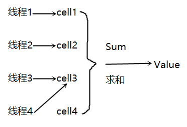

摘要: 本系列基于炼数成金课程，为了更好的学习，做了系列的记录。 本文主要介绍: 1. LongAdder 2. CompletableFuture 3. StampedLock

## 1. LongAdder

和AtomicLong类似的使用方式，但是性能比AtomicLong更好。

LongAdder与AtomicLong都是使用了原子操作来提高性能。但是LongAdder在AtomicLong的基础上进行了热点分离，热点分离类似于有锁操作中的[减小锁粒度](http://my.oschina.net/hosee/blog/615865)，将一个锁分离成若干个锁来提高性能。在无锁中，也可以用类似的方式来增加CAS的成功率，从而提高性能。

LongAdder原理图：



AtomicLong的实现方式是内部有个value 变量，当多线程并发自增，自减时，均通过CAS 指令从机器指令级别操作保证并发的原子性。唯一会制约AtomicLong高效的原因是高并发，高并发意味着CAS的失败几率更高， 重试次数更多，越多线程重试，CAS失败几率又越高，变成恶性循环，AtomicLong效率降低。

而LongAdder将把一个value拆分成若干cell，把所有cell加起来，就是value。所以对LongAdder进行加减操作，只需要对不同的cell来操作，不同的线程对不同的cell进行CAS操作，CAS的成功率当然高了（试想一下3+2+1=6，一个线程3+1，另一个线程2+1，最后是8，LongAdder没有乘法除法的API）。

可是在并发数不是很高的情况，拆分成若干的cell，还需要维护cell和求和，效率不如AtomicLong的实现。LongAdder用了巧妙的办法来解决了这个问题。

初始情况，LongAdder与AtomicLong是相同的，只有在CAS失败时，才会将value拆分成cell，每失败一次，都会增加cell的数量，这样在低并发时，同样高效，在高并发时，这种“自适应”的处理方式，达到一定cell数量后，CAS将不会失败，效率大大提高。

LongAdder是一种以空间换时间的策略。

## 2. CompletableFuture

实现CompletionStage接口（40余个方法），大多数方法多数应用在函数式编程中。并且支持流式调用 

CompletableFuture是Java 8中对[Future](http://my.oschina.net/hosee/blog/614826)的增强版 

简单实现：

```java
import java.util.concurrent.CompletableFuture;

public class AskThread implements Runnable {
	CompletableFuture<Integer> re = null;

	public AskThread(CompletableFuture<Integer> re) {
		this.re = re;
	}

	@Override
	public void run() {
		int myRe = 0;
		try {
			myRe = re.get() * re.get();
		} catch (Exception e) {
		}
		System.out.println(myRe);
	}

	public static void main(String[] args) throws InterruptedException {
		final CompletableFuture<Integer> future = new CompletableFuture<Integer>();
		new Thread(new AskThread(future)).start();
		// 模拟长时间的计算过程
		Thread.sleep(1000);
		// 告知完成结果
		future.complete(60);
	}
}
```

CompletableFuture的最大改进在于，任务完成的时间也开放了出来。

```java
future.complete(60);
```

CompletableFuture的异步执行：

```java
public static Integer calc(Integer para) {
		try {
			// 模拟一个长时间的执行
			Thread.sleep(1000);
		} catch (InterruptedException e) {
		}
		return para * para;
	}

	public static void main(String[] args) throws InterruptedException,
			ExecutionException {
		final CompletableFuture<Integer> future = CompletableFuture
				.supplyAsync(() -> calc(50));
		System.out.println(future.get());
	}
```

CompletableFuture的流式调用：

```java
public static Integer calc(Integer para) {
		try {
			// 模拟一个长时间的执行
			Thread.sleep(1000);
		} catch (InterruptedException e) {
		}
		return para * para;
	}

	public static void main(String[] args) throws InterruptedException,
			ExecutionException {
		CompletableFuture<Void> fu = CompletableFuture
				.supplyAsync(() -> calc(50))
				.thenApply((i) -> Integer.toString(i))
				.thenApply((str) -> "\"" + str + "\"")
				.thenAccept(System.out::println);
		fu.get();
	}
```

组合多个CompletableFuture：

```java
public static Integer calc(Integer para) {
		return para / 2;
	}

	public static void main(String[] args) throws InterruptedException,
			ExecutionException {
		CompletableFuture<Void> fu = CompletableFuture
				.supplyAsync(() -> calc(50))
				.thenCompose(
						(i) -> CompletableFuture.supplyAsync(() -> calc(i)))
				.thenApply((str) -> "\"" + str + "\"")
				.thenAccept(System.out::println);
		fu.get();
	}
```

 

CompletableFuture跟性能上关系不大，更多的是为了支持函数式编程，在功能上的增强。当然开放了完成时间的设置是一大亮点。

## 3. StampedLock

在上一篇中刚刚提到了[锁分离](http://my.oschina.net/hosee/blog/615865)，而锁分离的重要的实现就是ReadWriteLock。而StampedLock则是ReadWriteLock的一个改进。StampedLock与ReadWriteLock的区别在于，StampedLock认为读不应阻塞写，StampedLock认为当读写互斥的时候，读应该是重读，而不是不让写线程写。这样的设计解决了读多写少时，使用ReadWriteLock会产生写线程饥饿现象。

所以StampedLock是一种偏向于写线程的改进。

StampedLock示例：

```java
import java.util.concurrent.locks.StampedLock;

public class Point {
	private double x, y;
	private final StampedLock sl = new StampedLock();

	void move(double deltaX, double deltaY) { // an exclusively locked method
		long stamp = sl.writeLock();
		try {
			x += deltaX;
			y += deltaY;
		} finally {
			sl.unlockWrite(stamp);
		}
	}

	double distanceFromOrigin() { // A read-only method
		long stamp = sl.tryOptimisticRead();
		double currentX = x, currentY = y;
		if (!sl.validate(stamp)) {
			stamp = sl.readLock();
			try {
				currentX = x;
				currentY = y;
			} finally {
				sl.unlockRead(stamp);
			}
		}
		return Math.sqrt(currentX * currentX + currentY * currentY);
	}
}
```

StampedLock根据stamp来查看是否互斥，写一次stamp变增加某个值

```java
tryOptimisticRead()
```

每次读线程要读时，会先判断

```java
if (!sl.validate(stamp))
```

 

stamp是否相同

 

stamp数值不同，则返回失败。

如果判断失败，当然可以重复的尝试去读，在示例代码中，并没有让其重复尝试读，而采用的是将乐观锁退化成普通的读锁去读，这种情况就是一种悲观的读法。

```java
stamp = sl.readLock();
```

CLH自旋锁：当锁申请失败时，不会立即将读线程挂起，在锁当中会维护一个等待线程队列，所有申请锁，但是没有成功的线程都记录在这个队列中。每一个节点（一个节点代表一个线程），保存一个标记位（locked），用于判断当前线程是否已经释放锁。当一个线程试图获得锁时，取得当前等待队列的尾部节点作为其前序节点。并使用类似如下代码判断前序节点是否已经成功释放锁

```java
while (pred.locked) {   
}
```

当然不会进行无休止的自旋，会在若干次自旋后挂起线程。


原文链接：https://my.oschina.net/hosee/blog/615927