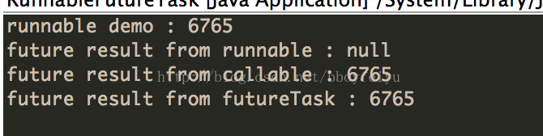

> 原文链接：Mr.Simple，http://blog.csdn.net/bboyfeiyu/article/details/24851847

Java中存在Runnable、Callable、Future、FutureTask这几个与线程相关的类或者接口，在Java中也是比较重要的几个概念，我们通过下面的简单示例来了解一下它们的作用于区别。

## Runnable
其中Runnable应该是我们最熟悉的接口，它只有一个run()函数，用于将耗时操作写在其中，该函数没有返回值。然后使用某个线程去执行该runnable即可实现多线程，Thread类在调用start()函数后就是执行的是Runnable的run()函数。Runnable的声明如下 : 
```java
public interface Runnable {  
    /** 
     * When an object implementing interface <code>Runnable</code> is used 
     * to create a thread, starting the thread causes the object's 
     * <code>run</code> method to be called in that separately executing 
     * thread. 
     * <p> 
     * 
     * @see     java.lang.Thread#run() 
     */  
    public abstract void run();  
}  
```
## Callable
Callable与Runnable的功能大致相似，Callable中有一个call()函数，但是call()函数有返回值，而Runnable的run()函数不能将结果返回给客户程序。Callable的声明如下 :
```java
public interface Callable<V> {  
    /** 
     * Computes a result, or throws an exception if unable to do so. 
     * 
     * @return computed result 
     * @throws Exception if unable to compute a result 
     */  
    V call() throws Exception;  
} 
```
可以看到，这是一个泛型接口，call()函数返回的类型就是客户程序传递进来的V类型。
## Future
Executor就是Runnable和Callable的调度容器，Future就是对于具体的Runnable或者Callable任务的执行结果进行取消、查询是否完成、获取结果、设置结果操作。get方法会阻塞，直到任务返回结果(Future简介)。Future声明如下 : 
```java
/** 
* @see FutureTask 
 * @see Executor 
 * @since 1.5 
 * @author Doug Lea 
 * @param <V> The result type returned by this Future's <tt>get</tt> method 
 */  
public interface Future<V> {  
  
    /** 
     * Attempts to cancel execution of this task.  This attempt will 
     * fail if the task has already completed, has already been cancelled, 
     * or could not be cancelled for some other reason. If successful, 
     * and this task has not started when <tt>cancel</tt> is called, 
     * this task should never run.  If the task has already started, 
     * then the <tt>mayInterruptIfRunning</tt> parameter determines 
     * whether the thread executing this task should be interrupted in 
     * an attempt to stop the task.     * 
     */  
    boolean cancel(boolean mayInterruptIfRunning);  
  
    /** 
     * Returns <tt>true</tt> if this task was cancelled before it completed 
     * normally. 
     */  
    boolean isCancelled();  
  
    /** 
     * Returns <tt>true</tt> if this task completed. 
     * 
     */  
    boolean isDone();  
  
    /** 
     * Waits if necessary for the computation to complete, and then 
     * retrieves its result. 
     * 
     * @return the computed result 
     */  
    V get() throws InterruptedException, ExecutionException;  
  
    /** 
     * Waits if necessary for at most the given time for the computation 
     * to complete, and then retrieves its result, if available. 
     * 
     * @param timeout the maximum time to wait 
     * @param unit the time unit of the timeout argument 
     * @return the computed result 
     */  
    V get(long timeout, TimeUnit unit)  
        throws InterruptedException, ExecutionException, TimeoutException;  
} 
```
## FutureTask
FutureTask则是一个RunnableFuture&lt;V>，而RunnableFuture实现了Runnbale又实现了Futrue&lt;V>这两个接口，
```java
public class FutureTask<V> implements RunnableFuture<V>  
```
RunnableFuture
```java
public interface RunnableFuture<V> extends Runnable, Future<V> {  
    /** 
     * Sets this Future to the result of its computation 
     * unless it has been cancelled. 
     */  
    void run();  
}  
```
另外它还可以包装Runnable和Callable&lt;V>， 由构造函数注入依赖。
```java
public FutureTask(Callable<V> callable) {  
    if (callable == null)  
        throw new NullPointerException();  
    this.callable = callable;  
    this.state = NEW;       // ensure visibility of callable  
}  
  
public FutureTask(Runnable runnable, V result) {  
    this.callable = Executors.callable(runnable, result);  
    this.state = NEW;       // ensure visibility of callable  
} 
```
可以看到，Runnable注入会被Executors.callable()函数转换为Callable类型，即FutureTask最终都是执行Callable类型的任务。该适配函数的实现如下 ：
```java
public static <T> Callable<T> callable(Runnable task, T result) {  
    if (task == null)  
        throw new NullPointerException();  
    return new RunnableAdapter<T>(task, result);  
}  
```
RunnableAdapter适配器
```java
/** 
 * A callable that runs given task and returns given result 
 */  
static final class RunnableAdapter<T> implements Callable<T> {  
    final Runnable task;  
    final T result;  
    RunnableAdapter(Runnable task, T result) {  
        this.task = task;  
        this.result = result;  
    }  
    public T call() {  
        task.run();  
        return result;  
    }  
}  
```
由于FutureTask实现了Runnable，因此它既可以通过Thread包装来直接执行，也可以提交给ExecuteService来执行。并且还可以直接通过get()函数获取执行结果，该函数会阻塞，直到结果返回。因此FutureTask既是Future、Runnable，又是包装了Callable( 如果是Runnable最终也会被转换为Callable )， 它是这两者的合体。

简单示例

```java
 package com.effective.java.concurrent.task;  
  
import java.util.concurrent.Callable;  
import java.util.concurrent.ExecutionException;  
import java.util.concurrent.ExecutorService;  
import java.util.concurrent.Executors;  
import java.util.concurrent.Future;  
import java.util.concurrent.FutureTask;  
  
/** 
 *  
 * @author mrsimple 
 * 
 */  
public class RunnableFutureTask {  
  
    /** 
     * ExecutorService 
     */  
    static ExecutorService mExecutor = Executors.newSingleThreadExecutor();  
  
    /** 
     *  
     * @param args 
     */  
    public static void main(String[] args) {  
        runnableDemo();  
        futureDemo();  
    }  
  
    /** 
     * runnable, 无返回值 
     */  
    static void runnableDemo() {  
  
        new Thread(new Runnable() {  
  
            @Override  
            public void run() {  
                System.out.println("runnable demo : " + fibc(20));  
            }  
        }).start();  
    }  
  
    /** 
     * 其中Runnable实现的是void run()方法，无返回值；Callable实现的是 V 
     * call()方法，并且可以返回执行结果。其中Runnable可以提交给Thread来包装下 
     * ，直接启动一个线程来执行，而Callable则一般都是提交给ExecuteService来执行。 
     */  
    static void futureDemo() {  
        try {  
            /** 
             * 提交runnable则没有返回值, future没有数据 
             */  
            Future<?> result = mExecutor.submit(new Runnable() {  
  
                @Override  
                public void run() {  
                    fibc(20);  
                }  
            });  
  
            System.out.println("future result from runnable : " + result.get());  
  
            /** 
             * 提交Callable, 有返回值, future中能够获取返回值 
             */  
            Future<Integer> result2 = mExecutor.submit(new Callable<Integer>() {  
                @Override  
                public Integer call() throws Exception {  
                    return fibc(20);  
                }  
            });  
  
            System.out  
                    .println("future result from callable : " + result2.get());  
  
            /** 
             * FutureTask则是一个RunnableFuture<V>，即实现了Runnbale又实现了Futrue<V>这两个接口， 
             * 另外它还可以包装Runnable(实际上会转换为Callable)和Callable 
             * <V>，所以一般来讲是一个符合体了，它可以通过Thread包装来直接执行，也可以提交给ExecuteService来执行 
             * ，并且还可以通过v get()返回执行结果，在线程体没有执行完成的时候，主线程一直阻塞等待，执行完则直接返回结果。 
             */  
            FutureTask<Integer> futureTask = new FutureTask<Integer>(  
                    new Callable<Integer>() {  
                        @Override  
                        public Integer call() throws Exception {  
                            return fibc(20);  
                        }  
                    });  
            // 提交futureTask  
            mExecutor.submit(futureTask) ;  
            System.out.println("future result from futureTask : "  
                    + futureTask.get());  
  
        } catch (InterruptedException e) {  
            e.printStackTrace();  
        } catch (ExecutionException e) {  
            e.printStackTrace();  
        }  
    }  
  
    /** 
     * 效率底下的斐波那契数列, 耗时的操作 
     *  
     * @param num 
     * @return 
     */  
    static int fibc(int num) {  
        if (num == 0) {  
            return 0;  
        }  
        if (num == 1) {  
            return 1;  
        }  
        return fibc(num - 1) + fibc(num - 2);  
    }  
  
}  
```
输出结果

