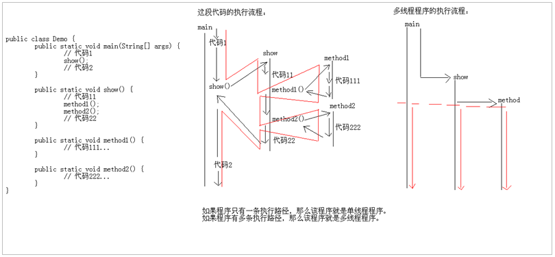
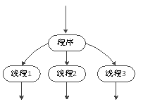
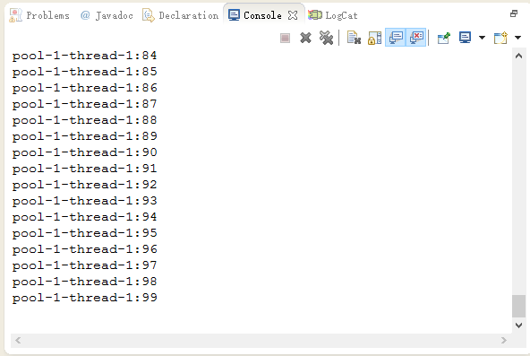
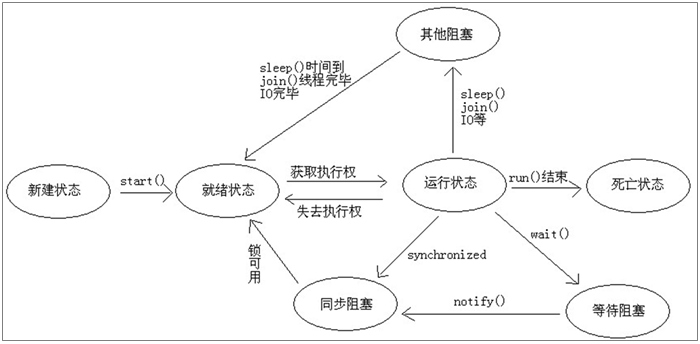
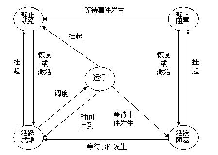
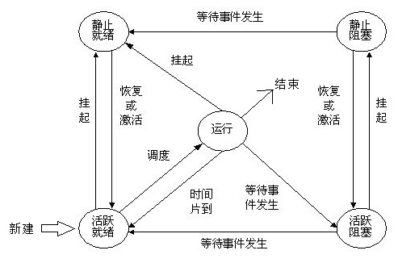
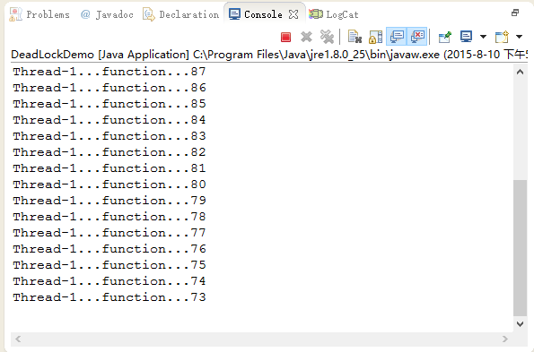
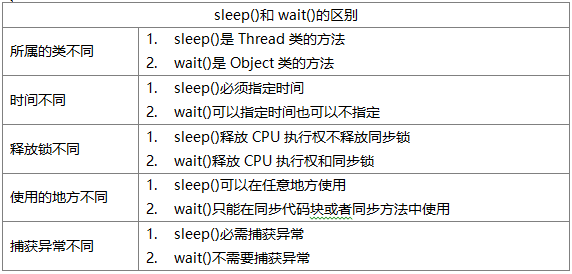
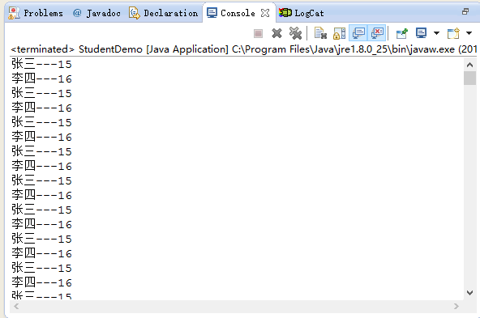
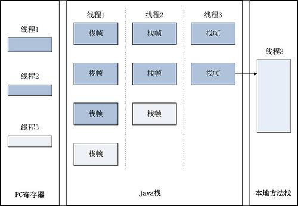

# 1. 多线程概述

人们在日常生活中，很多事情都是可以同时进行的。例如，一个人可以一边听音乐，一边打扫房间，可以一边吃饭，一边看电视。在使用计算机时，很多任务也是可以同时进行的。例如，可以一边浏览网页，一边打印文档，还可以一边聊天，一边复制文件等。计算机这种能够同时完成多项任务的技术，就是多线程技术。Java是支持多线程的语言之一，它内置了对多线程技术的支持，可以使程序同时执行多个执行片段。

## 1.1 多线程引入



由上图中程序的调用流程可知，这个程序只有一个执行流程，所以这样的程序就是单线程程序。假如一个程序有多条执行流程，那么，该程序就是多线程程序。

## 1.2 多线程概述

### 1.2.1 什么是进程？

进程就是正在运行的程序，是系统进行资源分配和调用的独立单位。每一个进程都有它自己的内存空间和系统资源。

在一个操作系统中，每个独立执行的程序都可称之为一个进程，也就是“正在运行的程序”。目前大部分计算机上安装的都
是多任务操作系统，即能够同时执行多个应用程序，最常见的有Windows、Linux、Unix等。在本教材使用的Windows操作系统下，鼠标右键单击任务栏，选择【启动任务管理器】选项可以打开任务管理器面板，在窗口的【进程】选项卡中可以看到当前正在运行的程序，也就是系统所有的进程，如chrome.exe、QQ.exe等。任务管理器的窗口如图所示。


在多任务操作系统中，表面上看是支持进程并发执行的，例如可以一边听音乐一边聊天。但实际上这些进程并不是同时运行的。在计算机中，所有的应用程序都是由CPU执行的，对于一个CPU而言，在某个时间点只能运行一个程序，也就是说只能执行一个进程。操作系统会为每一个进程分配一段有限的CPU使用时间，CPU在这段时间中执行某个进程，然后会在下一段时间切换到另一个进程中去执行。由于CPU运行速度很快，能在极短的时间内在不同的进程之间进行切换，所以给人以同时执行多个程序的感觉。

### 1.2.2 多进程有什么意义呢?

单进程的计算机只能做一件事情，而我们现在的计算机都可以做多件事情。举例：一边玩游戏(游戏进程)，一边听音乐(音乐进程)。也就是说现在的计算机都是支持多进程的，可以在一个时间段内执行多个任务。并且呢，可以提高CPU的使用率，解决了多部分代码同时运行的问题。

其实，多个应用程序同时执行都是CPU在做着快速的切换完成的。这个切换是随机的。CPU的切换是需要花费时间的，从而导致了效率的降低。

### 1.2.3 什么是线程?

每个运行的程序都是一个进程，在一个进程中还可以有多个执行单元同时运行，这些执行单元可以看作程序执行的一条条线索，被称为线程。操作系统中的每一个进程中都至少存在一个线程。例如当一个Java程序启动时，就会产生一个进程，该进程中会默认创建一个线程，在这个线程上会运行main()方法中的代码。

线程是程序的执行单元，执行路径；是进程中的单个顺序控制流，是一条执行路径；一个进程如果只有一条执行路径，则称为单线程程序。一个进程如果有多条执行路径，则称为多线程程序。

代码都是按照调用顺序依次往下执行，没有出现两段程序代码交替运行的效果，这样的程序称作单线程程序。如果希望程序中实现多段程序代码交替运行的效果，则需要创建多个线程，即多线程程序。所谓的多线程是指一个进程在执行过程中可以产生多个单线程，这些单线程程序在运行时是相互独立的，它们可以并发执行。

多线程程序的执行过程如图所示



图中所示的多条线程，看似是同时执行的，其实不然，它们和进程一样，也是由CPU轮流执行的，只不过CPU运行速度很快，故而给人同时执行的感觉。

### 1.2.4 多线程有什么意义呢?

多线程的存在，不是提高程序的执行速度。其实是为了提高应用程序的使用率。程序的执行其实都是在抢CPU的资源，CPU的执行权。多个进程是在抢这个资源，而其中的某一个进程如果执行路径比较多，就会有更高的几率抢到CPU的执行权。我们是不敢保证哪一个线程能够在哪个时刻抢到，所以线程的执行有随机性。

### 1.2.5 线程与进程的关系

线程是CPU调度的最小单元，同时线程是一种有限的系统资源，即线程不可能无限制地产生，并且线程的创建和销毁都有相应的开销。而进程一般指一个执行单元，在PC和移动设备上指一个程序或者一个应用。一个进程可以包含多个线程，因此进程和线程是包含与被包含的关系。

- 一个线程只能属于一个进程，而一个进程可以有多个线程，但至少有一个线程。

- 资源分配给进程，同一进程的所有线程共享该进程的所有资源。

- 处理机分给线程，即真正在处理机上运行的是线程。

- 线程在执行过程中，需要协作同步。不同进程的线程间要利用消息通信的办法实现同步。

- 线程有自己的堆栈和局部变量，但线程之间没有单独的地址空间，一个线程死掉就等于整个进程死掉，所以多进程的程序要比多线程的程序健壮，但在进程切换时，耗费资源较大，效率要差一些。但对于一些要求同时进行并且又要共享某些变量的并发操作，只能用线程，不能用进程。

### 1.2.6 进程与线程的区别

- 调度：线程作为CUP调度和分配的基本单位，进程作为拥有资源的基本单位。
- 并发性：不仅进程之间可以并发执行，同一个进程的多个线程之间也可并发执行。
- 拥有资源：进程是拥有资源的一个独立单位，线程不拥有系统资源，但可以访问隶属于进程的资源。
- 系统开销：在创建或撤消进程时，由于系统都要为之分配和回收资源，导致系统的开销明显大于创建或撤消线程时的开销。在进程切换时，耗费资源较大，效率要差一些。
- 健壮性：进程有独立的地址空间，一个进程崩溃后，在保护模式下不会对其它进程产生影响，而线程只是一个进程中的不同执行路径。线程有自己的堆栈和局部变量，但线程之间没有单独的地址空间，一个进程死掉就等于所有的线程死掉，所以多进程的程序要比多线程的程序健壮。进程间的crash不会相互影响，但是一个线程的crash会使整个进程都crash，其他线程也跟着都挂了。

总的来讲：进程只是一些资源的集合，真正的程序执行都是线程来完成的，程序启动的时候操作系统就帮你创建了一个主线程。每个线程有自己的堆栈。

Android在程序启动的时候，会我们分配一个主线程（UI线程），如果没有特殊处理，我们所有的操作都是在UI线程中完成的。

### 1.2.7 什么是并行、并发呢？

前者是逻辑上同时发生，指在某一个时间内同时运行多个程序；后者是物理上同时发生，指在某一个时间点同时运行多个程序。那么，我们能不能实现真正意义上的并发呢？答案是可以的，多个CPU就可以实现，不过你得知道如何调度和控制它们。

PS：

- 一个进程中可以有多个执行路径，称之为多线程。
- 一个进程中至少要有一个线程。
- 开启多个线程是为了同时运行多部分代码，每一个线程都有自己运行的内容，这个内容可以称为线程要执行的任务。

## 1.3 Java程序运行原理

java 命令会启动 java 虚拟机，启动 JVM，等于启动了一个应用程序，也就是启动了一个进程。该进程会自动启动一个 “主线程” ，然后主线程去调用某个类的 main 方法。所以 main方法运行在主线程中。在此之前的所有程序都是单线程的。

思考：JVM虚拟机的启动是单线程的还是多线程的？

答案：JVM启动时启动了多条线程，至少有两个线程可以分析的出来

- 执行main函数的线程，该线程的任务代码都定义在main函数中。

- 负责垃圾回收的线程。System类的gc方法告诉垃圾回收器调用finalize方法，但不一定立即执行。

# 2. 多线程的实现方案

由于线程是依赖进程而存在的，所以我们应该先创建一个进程出来。而进程是由系统创建的，所以我们应该去调用系统功能创建一个进程。Java是不能直接调用系统功能的，所以，我们没有办法直接实现多线程程序。但是呢?Java可以去调用C/C++写好的程序来实现多线程程序。由C/C++去调用系统功能创建进程，然后由Java去调用这样的东西，然后提供一些类供我们使用。我们就可以实现多线程程序了。

## 2.1 多线程的实现方案一：继承Thread类，重写run()方法

- 定义一个类继承Thread类
- 覆盖Thread类中的run方法
- 直接创建Thread的子类对象创建线程
- 调用start方法开启线程并调用线程的任务run方法执行

```java
package cn.itcast;

//多线程的实现方案一：继承Thread类，重写run()方法
//1、定义一个类继承Thread类。
class MyThread extends Thread {
    private String name;

    MyThread(String name) {
        this.name = name;
    }

    // 2、覆盖Thread类中的run方法。
    public void run() {
        for (int x = 0; x < 5; x++) {
            System.out.println(name + "...x=" + x + "...ThreadName="
                    + Thread.currentThread().getName());
        }
    }
}

class ThreadTest {
    public static void main(String[] args) {
        // 3、直接创建Thread的子类对象创建线程。
        MyThread d1 = new MyThread("黑马程序员");
        MyThread d2 = new MyThread("中关村在线");
        // 4、调用start方法开启线程并调用线程的任务run方法执行。
        d1.start();
        d2.start();
        for (int x = 0; x < 5; x++) {
            System.out.println("x = " + x + "...over..."
                    + Thread.currentThread().getName());
        }
    }
}
```

运行结果：

```
黑马程序员...x=0...ThreadName=Thread-0
中关村在线...x=0...ThreadName=Thread-1
x = 0...over...main
中关村在线...x=1...ThreadName=Thread-1
黑马程序员...x=1...ThreadName=Thread-0
中关村在线...x=2...ThreadName=Thread-1
x = 1...over...main
中关村在线...x=3...ThreadName=Thread-1
黑马程序员...x=2...ThreadName=Thread-0
中关村在线...x=4...ThreadName=Thread-1
x = 2...over...main
x = 3...over...main
x = 4...over...main
黑马程序员...x=3...ThreadName=Thread-0
黑马程序员...x=4...ThreadName=Thread-0
```

### 2.1.2 为什么要重写run()方法？

Thread类用于描述线程，线程是需要任务的。所以Thread类也有对任务的描述。这个任务就是通过Thread类中的run方法来体现。也就是说，run方法就是封装自定义线程运行任务的函数，run方法中定义的就是线程要运行的任务代码。所以只有继承Thread类，并复写run方法，将运行的代码定义在run方法中即可。

### 2.1.3 启动线程使用的是那个方法

启动线程调用的是start()方法，不是run()方法，run()方法只是封装了被线程执行的代码，调用run()只是普通方法的调用，无法启动线程。

### 2.1.4 线程能不能多次启动

不能，会出现IllegalThreadStateException非法的线程状态异常。

### 2.1.5 run()和start()方法的区别

- run()：仅仅是封装了被线程执行的代码，直接调用就是普通方法
- start()：首先是启动了线程，然后再由jvm去调用了该线程的run()方法

### 2.1.6 Thread类的基本获取和设置方法

- public final String getName()：获取线程的名称
- public final void setName(String name)：设置线程的名称
- Thread(String name) ：通过构造方法给线程起名字

思考：如何获取main方法所在的线程名称呢?

```java
public static Thread currentThread() // 获取任意方法所在的线程名称
```

## 2.2 多线程的实现方案二：实现Runnable接口

- 定义类实现Runnable接口
- 覆盖接口中的run方法，将线程的任务代码封装到run方法中
- 通过Thread类创建线程对象，并将Runnable接口的子类对象作为Thread类的构造函数的参数进行传递。为什么？因为线程的任务都封装在Runnable接口子类对象的run方法中。所以要在线程对象创建时就必须明确要运行的任务
- 调用线程对象的start方法开启线程

```java
package cn.itcast;

//多线程的实现方案二：实现Runnable接口
//1、定义类实现Runnable接口。
class MyThread implements Runnable {
    // 2、覆盖接口中的run方法，将线程的任务代码封装到run方法中。
    public void run() {
        show();
    }

    public void show() {
        for (int x = 0; x < 5; x++) {
            System.out.println(Thread.currentThread().getName() + "..." + x);
        }
    }
}

class ThreadTest {
    public static void main(String[] args) {
        MyThread d = new MyThread();
        // 3、通过Thread类创建线程对象，并将Runnable接口的子类对象作为Thread类的构造函数的参数进行传递。
        Thread t1 = new Thread(d);
        Thread t2 = new Thread(d);
        // 4、调用线程对象的start方法开启线程。
        t1.start();
        t2.start();
    }
}
```
运行结果：

```
Thread-0...0
Thread-1...0
Thread-0...1
Thread-1...1
Thread-0...2
Thread-1...2
Thread-0...3
Thread-1...3
Thread-0...4
Thread-1...4
```

- 如何获取线程名称：Thread.currentThread().getName()
- 如何给线程设置名称：setName()、Thread(Runnable target, String name)
- 实现接口方式的好处：
  - 可以避免由于Java单继承带来的局限性，所以，创建线程的第二种方式较为常用。
  - 适合多个相同程序的代码去处理同一个资源的情况，把线程同程序的代码，数据有效分离，较好的体现了面向对象的设计思想。

## 2.3 多线程程序实现方案三：实现Callable接口

- 创建一个线程池对象，控制要创建几个线程对象。

```java
public static ExecutorService newFixedThreadPool(int nThreads)
```

- 这种线程池的线程可以执行：可以执行Runnable对象或者Callable对象代表的线程。
- 调用如下方法即可
    - Future&lt;?>  submit(Runnable  task) 
      提交一个 Runnable 任务用于执行，并返回一个表示该任务的 Future
    - &lt;T>  Future&lt;T>  submit(Callable&lt;T>  task) 
      提交一个Callable任务用于执行，返回一个表示任务的未决结果的 Future
- 结束线程：shutdown() 关闭线程池

```java
package cn.itcast;

import java.util.concurrent.ExecutorService;
import java.util.concurrent.Executors;

import java.util.concurrent.Callable;

//Callable:是带泛型的接口。
//这里指定的泛型其实是call()方法的返回值类型。
class MyCallable implements Callable {

    public Object call() throws Exception {
        for (int x = 0; x < 100; x++) {
            System.out.println(Thread.currentThread().getName() + ":" + x);
        }
        return null;
    }

}

/*
 * 多线程实现的方式3： A:创建一个线程池对象，控制要创建几个线程对象。 public static ExecutorService
 * newFixedThreadPool(int nThreads) B:这种线程池的线程可以执行：
 * 可以执行Runnable对象或者Callable对象代表的线程 做一个类实现Runnable接口。 C:调用如下方法即可 Future<?>
 * submit(Runnable task) <T> Future<T> submit(Callable<T> task) D:我就要结束，可以吗? 可以。
 */
public class CallableDemo {
    public static void main(String[] args) {
        // 创建线程池对象
        ExecutorService pool = Executors.newFixedThreadPool(2);

        // 可以执行Runnable对象或者Callable对象代表的线程
        pool.submit(new MyCallable());
        pool.submit(new MyCallable());

        // 结束
        pool.shutdown();
    }
}
```

运行结果：




实现Callable的优缺点

- 好处：可以有返回值；可以抛出异常。
- 弊端：代码比较复杂，所以一般不用

## 2.4 匿名内部类方式使用多线程

```java
//新创建一个线程，重写run()方法
new Thread() {
    @Override
    public void run() {
        super.run();
        // code
    }
}.start();

//新创建一个线程，传递一个Runnable对象
new Thread(new Runnable() {
    @Override
    public void run() {
        // code
    }
}).start();
```

## 2.5 单线程和多线程的运行流程


从图可以看出，单线程的程序在运行时，会按照代码的调用顺序执行，而在多线程中，main()方法和MyThread类的run()方法却可以同时运行，互不影响，这正是单线程和多线程的区别。

# 3. 线程调度和线程控制

程序中的多个线程是并发执行的，某个线程若想被执行必须要得到CPU的使用权。Java虚拟机会按照特定的机制为程序中的每个线程分配CPU的使用权，这种机制被称作线程的调度。

在计算机中，线程调度有两种模型，分别是分时调度模型和抢占式调度模型。所谓分时调度模型是指让所有的线程轮流获得CPU的使用权，并且平均分配每个线程占用的CPU的时间片。抢占式调度模型是指让可运行池中优先级高的线程优先占用CPU，而对于优先级相同的线程，随机选择一个线程使其占用CPU，当它失去了CPU的使用权后，再随机选择其他线程获取CPU使用权。Java虚拟机默认采用抢占式调度模型，通常情况下程序员不需要去关心它，但在某些特定的需求下需要改变这种模式，由程序自己来控制CPU的调度。

## 3.1 线程调度

假如我们的计算机只有一个 CPU，那么 CPU 在某一个时刻只能执行一条指令，线程只有得到 CPU时间片，也就是使用权，才可以执行指令。那么Java是如何对线程进行调用的呢？

### 3.1.1 线程有两种调度模型

分时调度模型：所有线程轮流使用 CPU 的使用权，平均分配每个线程占用 CPU 的时间片 

抢占式调度模型：优先让优先级高的线程使用 CPU，如果线程的优先级相同，那么会随机选择一个，优先级高的线程获取的 CPU 时间片相对多一些。

Java使用的是抢占式调度模型。

### 3.1.2 如何设置和获取线程优先级

在应用程序中，如果要对线程进行调度，最直接的方式就是设置线程的优先级。优先级越高的线程获得CPU执行的机会越大，而优先级越低的线程获得CPU执行的机会越小。线程的优先级用1~10之间的整数来表示，数字越大优先级越高。除了可以直接使用数字表示线程的优先级，还可以使用Thread类中提供的三个静态常量表示线程的优先级，如表所示。


程序在运行期间，处于就绪状态的每个线程都有自己的优先级，例如main线程具有普通优先级。然而线程优先级不是固定不变的，可以通过Thread类的setPriority(int newPriority)方法对其进行设置，该方法中的参数newPriority接收的是1~10之间的整数或者Thread类的三个静态常量。

```java
public final int getPriority(); //获取线程的优先级
public final void setPriority(int newPriority); //设置线程的优先级
```

注意：线程默认的优先级是5；线程优先级的范围是：1-10；线程优先级高仅仅表示线程获取CPU的时间片的几率高，但是要在次数比较多，或者多次运行的时候才能卡到比较好的结果。

```java
package cn.itcast.chapter10.example06;
/**
 * 不同优先级的两个线程在程序中运行情况
 */
public class Example06 {
	public static void main(String[] args) {
		//创建两个线程
		Thread minPriority = new Thread(new Task(), "优先级较低的线程 ");
		Thread maxPriority = new Thread(new Task(), "优先级较高的线程 ");
		minPriority.setPriority(Thread.MIN_PRIORITY); //设置线程的优先级为1  
		maxPriority.setPriority(Thread.MAX_PRIORITY); //设置线程的优先级为10
		//开启两个线程
		minPriority.start();
		maxPriority.start();
	}
}

//定义一个线程的任务类
class Task implements Runnable {
	@Override
	public void run() {
		for (int i = 0; i < 10; i++) {
			System.out.println(Thread.currentThread().getName() + "正在输出" + i);
		}
	}
}
```

## 3.2 线程控制

| 方法声明                         | 功能描述                                     |
| :--------------------------- | :--------------------------------------- |
| sleep(long millis)           | 线程休眠，让当前线程暂停，进入休眠等待状态                    |
| join()                       | 线程加入，等待目标线程执行完之后再继续执行，调用该方法的线程会插入优先先执行   |
| yield()                      | 线程礼让，暂停当前正在执行的线程对象，并执行其他线程。              |
| setDaemon(boolean on)        | 将该线程标记为守护线程（后台线程）或用户线程。<br>当正在运行的线程都是守护线程时，Java 虚拟机退出。 <br>该方法必须在启动线程前调用。 |
| stop()                       | 让线程停止，过时了，但是还可以使用                        |
| interrupt()                  | 中断线程。 把线程的状态终止，并抛出一个InterruptedException。 |
| setPriority(int newPriority) | 更改线程的优先级                                 |
| isInterrupted()              | 线程是否被中断                                  |

### 线程休眠

优先级高的程序会先执行，而优先级低的程序会后执行。如果希望人为地控制线程，使正在执行的线程暂停，将CPU让给别的线程，这时可以使用静态方法sleep(long millis)，该方法可以让当前正在执行的线程暂停一段时间，进入休眠等待状态。当前线程调用sleep(long millis)方法后，在指定时间(参数millis)内该线程是不会执行的，这样其他的线程就可以得到执行的机会了。

sleep(long millis)方法声明会抛出InterruptedException异常，因此在调用该方法时应该捕获异常，或者声明抛出该异常。

```java
package cn.itcast.chapter10.example07;
/**
 * sleep(long millis) 方法在程序中的使用 
 */
public class Example07 {
	public static void main(String[] args) throws Exception {
		//创建一个线程
		new Thread(new Task()).start();		
		for (int i = 1; i <= 10; i++) {
			if (i == 5) {
				Thread.sleep(2000); //当前main主线程 休眠2秒
			} else {
				Thread.sleep(500); 
			}
			System.out.println("main主线程正在输出：" + i);
		}
	}
}
//定义线程的任务类
class Task implements Runnable {
	@Override
	public void run() {
		for (int i = 1; i <= 10; i++) {
			try{
				if (i == 3) {
					Thread.sleep(2000);//当前线程休眠2秒
				} else {
					Thread.sleep(500);
				}
				System.out.println("线程一正在输出：" + i);
			} catch (Exception e){
				e.printStackTrace();
			}
		}
	}
}
```

### 线程插队

现实生活中经常能碰到“插队”的情况，同样，在Thread类中也提供了一个join()方法来实现这个“功能”。当在某个线程中调用其他线程的join()方法时，调用的线程将被阻塞，直到被join()方法加入的线程执行完成后它才会继续运行。

线程加入，等待目标线程执行完之后再继续执行。阻塞当前调用join函数时所在的线程，直到接收函数执行完毕后再继续执行

```java
Worker worker1 = new Worker("work-1");
Worker worker2 = new Worker("work-2");

worker1.start();
System.out.println("启动线程1");
try {
    worker1.join();
    System.out.println("启动线程2");
    worker2.start();
    worker2.join();
} catch (InterruptedException e) {
    e.printStackTrace();
}

System.out.println("主线程继续执行");
```

```java
class Worker extends Thread {

    public Worker(String name) {
        super(name);
    }

    @Override
    public void run() {
        try {
            Thread.sleep(2000);
        } catch (InterruptedException e) {
            e.printStackTrace();
        }
        System.out.println("work in " + getName());
    }
}
```

输出结果

```
启动线程1
work in work-1
启动线程2
work in work-2
主线程继续执行
```

案例代码2

```java
package cn.itcast.chapter10.example09;
/**
 * 线程插队，join()方法的使用
 */
public class Example09{
	public static void main(String[] args) throws Exception {
		// 创建线程
		Thread t = new Thread(new EmergencyThread(),"线程一");
		t.start(); // 开启线程
		for (int i = 1; i < 6; i++) {
			System.out.println(Thread.currentThread().getName()+"输出："+i);
			if (i == 2) {
				t.join(); // 调用join()方法
		}
			Thread.sleep(500); // 线程休眠500毫秒
		}
	}
}
class EmergencyThread implements Runnable {
	public void run() {
		for (int i = 1; i < 6; i++) {
			System.out.println(Thread.currentThread().getName()+"输出："+i);
			try {
				Thread.sleep(500); // 线程休眠500毫秒
			} catch (InterruptedException e) {
				e.printStackTrace();
			}
		}
	}
}
```

### 线程让步

在篮球比赛中，我们经常会看到两队选手互相抢篮球，当某个选手抢到篮球后就可以拍一会，之后他会把篮球让出来，其他选手重新开始抢篮球，这个过程就相当于Java程序中的线程让步。所谓的线程让步是指正在执行的线程，在某些情况下将CPU资源让给其他线程执行。

线程让步可以通过yield()方法来实现，该方法和sleep()方法有点相似，都可以让当前正在运行的线程暂停，区别在于yield()方法不会阻塞该线程，它只是将线程转换成就绪状态，让系统的调度器重新调度一次。当某个线程调用yield()方法之后，只有与当前线程优先级相同或者更高的线程才能获得执行的机会。

使调用yield()函数的线程让出执行时间给其它已就绪状态的线程，也就是主动让出线程的执行权给其它的线程

```java
class YieldThread extends Thread {
    public YieldThread(String name) {
        super(name);
    }

    public synchronized void run() {
        for (int i = 0; i < MAX; i++) {
            System.out.printf("%s ,优先级为 : %d ----> %d\n", this.getName(), this.getPriority(), i);
            // i整除4时，调用yield
            if (i == 2) {
                Thread.yield();
            }
        }
    }
}
```

```java
YieldThread t1 = new YieldThread("thread-1");
YieldThread t2 = new YieldThread("thread-2");
t1.start();
t2.start();
```

```
thread-1 ,优先级为：5 ----> 0
thread-1 ,优先级为：5 ----> 1
thread-1 ,优先级为：5 ----> 2
thread-1 ,优先级为：5 ----> 0
thread-1 ,优先级为：5 ----> 1
thread-1 ,优先级为：5 ----> 2
thread-1 ,优先级为：5 ----> 3
thread-1 ,优先级为：5 ----> 4
thread-1 ,优先级为：5 ----> 3
thread-1 ,优先级为：5 ----> 4
```

案例代码2

```java
package cn.itcast.chapter10.example08;
/**
 * 线程让步，yield()方法的使用
 */
// 定义YieldThread类继承Thread类
class YieldThread extends Thread {
     // 定义一个有参的构造方法
	public YieldThread(String name) { 
		super(name); // 调用父类的构造方法
	}
	public void run() {
		for (int i = 0; i < 6; i++) {
			System.out.println(Thread.currentThread().getName() + "---" + i);
			if (i == 3) {
				System.out.print("线程让步:");
				Thread.yield(); // 线程运行到此，作出让步
			}
		}
	}
}
public class Example08 {
	public static void main(String[] args) {
         // 创建两个线程
		Thread t1 = new YieldThread("线程A");
		Thread t2 = new YieldThread("线程B");
         // 开启两个线程
		t1.start();
		t2.start();
	}
}
```

# 进程的基本状态

进程经常讨论的基本状态为：就绪状态（Ready）、运行状态（Running）、阻塞状态（Blocked）。此外，还包括不常讨论的创建和结束。

- 就绪状态：当进程已分配到除CPU以外的所有必要资源后，只要再获得CPU，便可立即执行，进程这时的状态称为就绪状态。在一个系统中处于就绪状态的进程可能有多个，通常将它们排成一个队列，称为就绪队列。
- 运行状态：进程已获得CPU，其程序正在执行。在单处理机系统中，只有一个进程处于执行状态； 在多处理机系统中，则有多个进程处于执行状态。
- 阻塞状态：正在执行的进程由于发生某事件而暂时无法继续执行时，便放弃处理机而处于暂停状态，亦即进程的执行受到阻塞，把这种暂停状态称为阻塞状态，有时也称为等待状态或封锁状态。致使进程阻塞的典型事件有：请求I/O，申请缓冲空间等。通常将这种处于阻塞状态的进程也排成一个队列。有的系统则根据阻塞原因的不同而把处于阻塞状态的进程排成多个队列。

三种状态的切换如下图所示：


# 4. 线程的生命周期

在Java中，任何对象都有生命周期，线程也不例外，它也有自己的生命周期。当Thread对象创建完成时，线程的生命周期便开始了。当run()方法中代码正常执行完毕或者线程抛出一个未捕获的异常(Exception)或者错误(Error)时，线程的生命周期便会结束。线程整个生命周期可以分为五个阶段，分别是新建状态(New)、就绪状态(Runnable)、运行状态(Running)、阻塞状态(Blocked)和死亡状态(Terminated)，线程的不同状态表明了线程当前正在进行的活动。在程序中，通过一些操作，可以使线程在不同状态之间转换，如图所示。


图中展示了线程各种状态的转换关系，箭头表示可转换的方向，其中，单箭头表示状态只能单向的转换，例如线程只能从新建状态转换到就绪状态，反之则不能；双箭头表示两种状态可以互相转换，例如就绪状态和运行状态可以互相转换。通过一张图还不能完全描述清楚线程各状态之间的区别，接下来针对线程生命周期中的五种状态分别进行详细讲解，具体如下：

**1．新建状态(New)**

创建一个线程对象后，该线程对象就处于新建状态，此时它不能运行，和其他Java对象一样，仅仅由Java虚拟机为其分配了内存，没有表现出任何线程的动态特征。

**2．就绪状态(Runnable)**

当线程对象调用了start()方法后，该线程就进入就绪状态。处于就绪状态的线程位于线程队列中，此时它只是具备了运行的条件，能否获得CPU的使用权并开始运行，还需要等待系统的调度。

**3．运行状态(Running)**

如果处于就绪状态的线程获得了CPU的使用权，并开始执行run()方法中的线程执行体，则该线程处于运行状态。一个线程启动后，它可能不会一直处于运行状态，当运行状态的线程使用完系统分配的时间后，系统就会剥夺该线程占用的CPU资源，让其他线程获得执行的机会。需要注意的是，只有处于就绪状态的线程才可能转换到运行状态。

**4．阻塞状态(Blocked)**

一个正在执行的线程在某些特殊情况下，如被人为挂起或执行耗时的输入/输出操作时，会让出CPU的使用权并暂时中止自己的执行，进入阻塞状态。线程进入阻塞状态后，就不能进入排队队列。只有当引起阻塞的原因被消除后，线程才可以转入就绪状态。

线程由运行状态转换成阻塞状态的原因，以及如何从阻塞状态转换成就绪状态。

- 当线程试图获取某个对象的同步锁时，如果该锁被其他线程所持有，则当前线程会进入阻塞状态，如果想从阻塞状态进入就绪状态必须得获取到其他线程所持有的锁。
- 当线程调用了一个阻塞式的IO方法时，该线程就会进入阻塞状态，如果想进入就绪状态就必须要等到这个阻塞的IO方法返回。
- 当线程调用了某个对象的wait()方法时，也会使线程进入阻塞状态，如果想进入就绪状态就需要使用notify()方法唤醒该线程。
- 当线程调用了Thread的sleep(long millis)方法时，也会使线程进入阻塞状态，在这种情况下，只需等到线程睡眠的时间到了以后，线程就会自动进入就绪状态。
- 当在一个线程中调用了另一个线程的join()方法时，会使当前线程进入阻塞状态，在这种情况下，需要等到新加入的线程运行结束后才会结束阻塞状态，进入就绪状态。

需要注意的是，线程从阻塞状态只能进入就绪状态，而不能直接进入运行状态，也就是说结束阻塞的线程需要重新进入可运行池中，等待系统的调度。

**5．死亡状态(Terminated)**

当线程调用stop()方法或run()方法正常执行完毕后，或者线程抛出一个未捕获的异常(Exception)、错误(Error)，线程就进入死亡状态。一旦进入死亡状态，线程将不再拥有运行的资格，也不能再转换到其他状态。

## 4.1 线程的状态

| 线程状态 | 状态说明                                     |
| :--- | :--------------------------------------- |
| 新建状态 | 等待状态，调用start()方法启动                       |
| 就绪状态 | 有执行资格，但是没有执行权                            |
| 运行状态 | 具有执行资格和执行权                               |
| 阻塞状态 | 遇到sleep()方法和wait()方法时，失去执行资格和执行权，<br>sleep()方法时间到或者调用notify()方法时，获取执行资格，变为临时状态 |
| 死亡状态 | 中断线程，或者run()方法结束                         |

## 4.2 线程的生命周期图



# 挂起状态

在不少系统中进程只有上述三种状态，但在另一些系统中，又增加了一些新状态，最重要的是挂起状态。引入挂起状态的原因有：

(1) 终端用户的请求。当终端用户在自己的程序运行期间发现有可疑问题时，希望暂时使自己的程序静止下来。亦即，使正在执行的进程暂停执行；若此时用户进程正处于就绪状态而未执行，则该进程暂不接受调度，以便用户研究其执行情况或对程序进行修改。我们把这种静止状态称为挂起状态。 　

(2) 父进程请求。有时父进程希望挂起自己的某个子进程，以便考查和修改该子进程，或者协调各子进程间的活动。

(3) 负荷调节的需要。当实时系统中的工作负荷较重，已可能影响到对实时任务的控制时，可由系统把一些不重要的进程挂起，以保证系统能正常运行。

(4) 操作系统的需要。操作系统有时希望挂起某些进程，以便检查运行中的资源使用情况或进行记账。



加上新建和结束态如下图所示：



# 5. 线程安全问题

## 5.1 判断一个程序是否会有线程安全问题的标准

- 是否是多线程环境
- 是否有共享数据
- 是否有多条语句操作共享数据

## 5.2 如何解决多线程安全问题呢?

基本思想：让程序没有安全问题的环境。
解决办法：同步机制：同步代码块、同步方法。把多个语句操作共享数据的代码给锁起来，让任意时刻只能有一个线程执行即可。

### 5.2.1 解决线程安全问题实现1：同步代码块，格式如下

当多个线程使用同一个共享资源时，可以将处理共享资源的代码放在一个使用synchronized关键字来修饰的代码块中，这个代码块被称作同步代码块

```java
synchronized(lock){
  需要同步的代码;
}
```
lock是一个锁对象，它是同步代码块的关键。当某一个线程执行同步代码块时，其它线程将无法执行当前同步代码块，会发生阻塞，等当前线程执行完同步代码块后，所有的线程开始抢夺线程的执行权，抢到执行权的线程将进入同步代码块，执行其中的代码。循环往复，直到共享资源被处理完为止。这个过程就好比一个公用电话亭，只有前一个人打完电话出来后，后面的人才可以打。

```java
package cn.itcast;

//卖票程序的同步代码块实现示例
class Ticket implements Runnable {
    private int num = 10;
    Object obj = new Object();

    public void run() {
        while (true) {
            // 给可能出现问题的代码加锁
            synchronized (obj) {
                if (num > 0) {
                    // 显示线程名及余票数
                    System.out.println(Thread.currentThread().getName()
                            + "...sale..." + num--);
                }
            }
        }
    }
}

class TicketDemo {
    public static void main(String[] args) {
        // 通过Thread类创建线程对象，并将Runnable接口的子类对象作为Thread类的构造函数的参数进行传递。
        Ticket t = new Ticket();
        Thread t1 = new Thread(t);
        Thread t2 = new Thread(t);
        Thread t3 = new Thread(t);
        Thread t4 = new Thread(t);
        // 调用线程对象的start方法开启线程。
        t1.start();
        t2.start();
        t3.start();
        t4.start();
    }
}
```

运行结果：

```
Thread-0...sale...10
Thread-0...sale...9
Thread-0...sale...8
Thread-0...sale...7
Thread-0...sale...6
Thread-0...sale...5
Thread-0...sale...4
Thread-0...sale...3
Thread-0...sale...2
Thread-0...sale...1
```

- 同步可以解决安全问题的根本原因就在那个对象上。该对象如同锁的功能。
- 同步代码块的对象可以是哪些呢? 可以是任意对象，但每个线程都必须是同一对象。
- 同步的前提：多个线程；多个线程使用的是同一个锁对象
- 同步的好处：同步的出现解决了多线程的安全问题。
- 同步的弊端：当线程相当多时，因为每个线程都会去判断同步上的锁，这是很耗费资源的，无形中会降低程序的运行效率。

## 5.3 解决线程安全问题实现2：同步方法   

同步方法：就是把同步关键字加到方法上

```java
package cn.itcast;

//卖票程序的同步代码块实现示例
class Ticket implements Runnable {
    // 定义100张票
    private static int tickets = 10;

    Object obj = new Object();

    public void run() {
        while (true) {
            sellTicket();
        }
    }

    private synchronized void sellTicket() {
        if (tickets > 0) {
            try {
                Thread.sleep(100);
            } catch (InterruptedException e) {
                e.printStackTrace();
            }
            System.out.println(Thread.currentThread().getName() + "正在出售第"
                    + (tickets--) + "张票 ");
        }
    }
}

class TicketDemo {
    public static void main(String[] args) {
        // 通过Thread类创建线程对象，并将Runnable接口的子类对象作为Thread类的构造函数的参数进行传递。
        Ticket t = new Ticket();
        Thread t1 = new Thread(t);
        Thread t2 = new Thread(t);
        Thread t3 = new Thread(t);
        Thread t4 = new Thread(t);
        // 调用线程对象的start方法开启线程。
        t1.start();
        t2.start();
        t3.start();
        t4.start();
    }
}
```

运行结果：

```
Thread-0正在出售第10张票 
Thread-0正在出售第9张票 
Thread-0正在出售第8张票 
Thread-3正在出售第7张票 
Thread-3正在出售第6张票 
Thread-3正在出售第5张票 
Thread-3正在出售第4张票 
Thread-3正在出售第3张票 
Thread-3正在出售第2张票 
Thread-3正在出售第1张票 
```

同步代码块的锁是自己定义的任意类型的对象，那么同步方法是否也存在锁？如果有，它的锁是什么呢？答案是肯定的，同步方法也有锁，它的锁就是当前调用该方法的对象，也就是this指向的对象。这样做的好处是，同步方法被所有线程所共享，方法所在的对象相对于所有线程来说是唯一的，从而保证了锁的唯一性。当一个线程执行该方法时，其他的线程就不能进入该方法中，直到这个线程执行完该方法为止。从而达到了线程同步的效果。

有时候需要同步的方法是静态方法，静态方法不需要创建对象就可以直接用“类名.方法名()”的方式调用。这时候读者就会有一个疑问，如果不创建对象，静态同步方法的锁就不会是this，那么静态同步方法的锁是什么？Java中静态方法的锁是该方法所在类的class对象，该对象在装载该类时自动创建，该对象可以直接用类名.class的方式获取。

PS：

- 同步方法的锁对象是什么呢?this对象
- 如果是静态方法，同步方法的锁对象又是什么呢?该类的字节码文件（类的class文件）
- 那么，我们到底使用同步方法还是同步代码块？

如果锁对象是this，就可以考虑使用同步方法。否则能使用同步代码块的尽量使用同步代码块。

### 5.3.1 线程安全与非线程安全的类

某些线程安全的类：StringBuffer、Vector、HashTable，虽然线程安全，但是效率较低，我们一般不用，而用Collections工具类解决线程安全的问题。

```java
List<String> list = Colletions.syncrinizedList(new ArrayList<String>()); // 获取线程安全的List集合
```
### 5.3.2 JDK5中Lock锁的使用
虽然我们可以理解同步代码块和同步方法的锁对象问题，但是我们并没有直接看到在哪里加上了锁，在哪里释放了锁，为了更清晰的表达如何加锁和释放锁，JDK5以后提供了一个新的锁对象Lock

Lock接口：Lock 实现提供了比使用 synchronized 方法和语句可获得的更广泛的锁定操作，此实现允许更灵活的结构。

- void lock()：获取锁

- void unlock()：释放锁

- ReentrantLock：Lock的实现类

```java
package cn.itcast;

import java.util.concurrent.locks.Lock;
import java.util.concurrent.locks.ReentrantLock;

class SellTicket implements Runnable {

    // 定义票
    private int tickets = 100;

    // 定义锁对象
    private Lock lock = new ReentrantLock();

    public void run() {
        while (true) {
            try {
                // 加锁
                lock.lock();
                if (tickets > 0) {
                    try {
                        Thread.sleep(100);
                    } catch (InterruptedException e) {
                        e.printStackTrace();
                    }
                    System.out.println(Thread.currentThread().getName()
                            + "正在出售第" + (tickets--) + "张票");
                }
            } finally {
                // 释放锁
                lock.unlock();
            }
        }
    }

}

/*
 * 虽然我们可以理解同步代码块和同步方法的锁对象问题，但是我们并没有直接看到在哪里加上了锁，在哪里释放了锁，
 * 为了更清晰的表达如何加锁和释放锁,JDK5以后提供了一个新的锁对象Lock。
 *
 * Lock： void lock()： 获取锁。 void unlock():释放锁。 ReentrantLock是Lock的实现类.
 */
public class SellTicketDemo {
    public static void main(String[] args) {
        // 创建资源对象
        SellTicket st = new SellTicket();

        // 创建三个窗口
        Thread t1 = new Thread(st, "窗口1");
        Thread t2 = new Thread(st, "窗口2");
        Thread t3 = new Thread(st, "窗口3");

        // 启动线程
        t1.start();
        t2.start();
        t3.start();
    }
}
```

运行结果：

```
...
窗口2正在出售第15张票
窗口2正在出售第14张票
窗口2正在出售第13张票
窗口2正在出售第12张票
窗口2正在出售第11张票
窗口3正在出售第10张票
窗口3正在出售第9张票
窗口3正在出售第8张票
窗口3正在出售第7张票
窗口3正在出售第6张票
窗口3正在出售第5张票
窗口3正在出售第4张票
窗口3正在出售第3张票
窗口1正在出售第2张票
窗口2正在出售第1张票
```

### synchronized和lock的用法区别

synchronized：在需要同步的对象中加入此控制，synchronized可以加在方法上，也可以加在特定代码块中，括号中表示需要锁的对象。

lock：需要显示指定起始位置和终止位置。一般使用ReentrantLock类做为锁，多个线程中必须要使用一个ReentrantLock类做为对象才能保证锁的生效。且在加锁和解锁处需要通过lock()和unlock()显示指出。所以一般会在finally块中写unlock()以防死锁。

用法区别比较简单，这里不赘述了，如果不懂的可以看看Java基本语法。

### synchronized和lock性能区别

synchronized是托管给JVM执行的，而lock是java写的控制锁的代码。在Java1.5中，synchronize是性能低效的。因为这是一个重量级操作，需要调用操作接口，导致有可能加锁消耗的系统时间比加锁以外的操作还多。相比之下使用Java提供的Lock对象，性能更高一些。但是到了Java1.6，发生了变化。synchronize在语义上很清晰，可以进行很多优化，有适应自旋，锁消除，锁粗化，轻量级锁，偏向锁等等。导致在Java1.6上synchronize的性能并不比Lock差。官方也表示，他们也更支持synchronize，在未来的版本中还有优化余地。

synchronized原始采用的是CPU悲观锁机制，即线程获得的是独占锁。独占锁意味着其他线程只能依靠阻塞来等待线程释放锁。而在CPU转换线程阻塞时会引起线程上下文切换，当有很多线程竞争锁的时候，会引起CPU频繁的上下文切换导致效率很低。

Lock用的是乐观锁方式。所谓乐观锁就是，每次不加锁而是假设没有冲突而去完成某项操作，如果因为冲突失败就重试，直到成功为止。

# 6. 死锁

所谓死锁 `<DeadLock>` : 是指两个或两个以上的进程在执行过程中，因争夺资源而造成的一种互相等待的现象，若无外力作用，它们都将无法推进下去.此时称系统处于死锁状态或系统产生了死锁，这些永远在互相等待的进程称为死锁进程.

### 产生死锁的原因主要是

- 因为系统资源不足。
- 进程运行推进的顺序不合适。
- 资源分配不当等。

如果系统资源充足，进程的资源请求都能够得到满足，死锁出现的可能性就很低，否则就会因争夺有限的资源而陷入死锁。其次，进程运行推进顺序与速度不同，也可能产生死锁。

### 产生死锁的四个必要条件

- 互斥条件：一个资源每次只能被一个进程使用。
- 请求与保持条件：一个进程因请求资源而阻塞时，对已获得的资源保持不放。
- 不剥夺条件:进程已获得的资源，在末使用完之前，不能强行剥夺。
- 循环等待条件:若干进程之间形成一种头尾相接的循环等待资源关系。

这四个条件是死锁的必要条件，只要系统发生死锁，这些条件必然成立，而只要上述条件之一不满足，就不会发生死锁。

### 死锁的解除与预防

理解了死锁的原因，尤其是产生死锁的四个必要条件，就可以最大可能地避免、预防和解除死锁。所以，在系统设计、进程调度等方面注意如何不让这四个必要条件成立，如何确定资源的合理分配算法，避免进程永久占据系统资源。此外，也要防止进程在处于等待状态的情况下占用资源，在系统运行过程中，对进程发出的每一个系统能够满足的资源申请进行动态检查，并根据检查结果决定是否分配资源，若分配后系统可能发生死锁，则不予分配，否则予以分配 。因此，对资源的分配要给予合理的规划。

**1. 有序资源分配法**

这种算法资源按某种规则系统中的所有资源统一编号（例如打印机为1、磁带机为2、磁盘为3、等等），申请时必须以上升的次序。系统要求申请进程：
　　
1、对它所必须使用的而且属于同一类的所有资源，必须一次申请完；
2、在申请不同类资源时，必须按各类设备的编号依次申请。例如：进程PA，使用资源的顺序是R1，R2； 进程PB，使用资源的顺序是R2，R1；若采用动态分配有可能形成环路条件，造成死锁。

采用有序资源分配法：R1的编号为1，R2的编号为2；
PA：申请次序应是：R1，R2
PB：申请次序应是：R1，R2
　　
这样就破坏了环路条件，避免了死锁的发生，即后来的申请者不可能会因为资源部分阻塞前面的申请者，可以保证最先申请的进程是绝对可以执行完的。

**2. 银行家算法**

避免死锁算法中最有代表性的算法是Dijkstra E.W 于1968年提出的银行家算法：
该算法需要检查申请者对资源的最大需求量，如果系统现存的各类资源可以满足申请者的请求，就满足申请者的请求。

这样申请者就可很快完成其计算，然后释放它占用的资源，从而保证了系统中的所有进程都能完成，所以可避免死锁的发生。

**3. 死锁排除的方法**

- 撤消陷于死锁的全部进程；
- 逐个撤消陷于死锁的进程，直到死锁不存在；
- 从陷于死锁的进程中逐个强迫放弃所占用的资源，直至死锁消失。
- 从另外一些进程那里强行剥夺足够数量的资源分配给死锁进程，以解除死锁状态

同步弊端：效率低，如果出现了同步嵌套，就容易产生死锁问题。
死锁问题：是指两个或者两个以上的线程在执行的过程中，因争夺资源产生的一种互相等待现象

```java
package cn.itcast;

class Ticket implements Runnable {
    private static int num = 100;
    Object obj = new Object();
    boolean flag = true;

    public void run() {
        if (flag) {
            while (true) {
                synchronized (obj) {
                    show();
                }
            }
        } else
            while (true)
                show();
    }

    public synchronized void show() {
        synchronized (obj) {
            if (num > 0) {
                try {
                    Thread.sleep(10);
                } catch (InterruptedException e) {
                    e.printStackTrace();
                }
                System.out.println(Thread.currentThread().getName()
                        + "...function..." + num--);
            }
        }
    }
}

class DeadLockDemo {
    public static void main(String[] args) {
        Ticket t = new Ticket();
        Thread t1 = new Thread(t);
        Thread t2 = new Thread(t);

        t1.start();
        try {
            Thread.sleep(10);
        } catch (InterruptedException e) {
            e.printStackTrace();
        }
        t.flag = false;
        t2.start();
    }
}
```

运行结果：



原因分析：

由上图可以看到程序已经被锁死，无法向下执行。run方法中的同步代码块需要获取obj对象锁，才能执行代码块中的show方法。而执行show方法则必须获取this对象锁，然后才能执行其中的同步代码块。当线程t1获取到obj对象锁执行同步代码块，线程t2获取到this对象锁执行show方法。同步代码块中的show方法因无法获取到this对象锁无法执行，show方法中的同步代码块因无法获取到obj对象锁无法执行，就会产生死锁。

# 7. 线程间通信

多个线程在处理统一资源，但是任务却不同，这时候就需要线程间通信。为了实现线程间的通信Java提供了等待唤醒机制。
等待/唤醒机制涉及的方法：

- wait()：让线程处于冻结状态，被wait的线程会被存储到线程池中。

- notify()：唤醒线程池中的一个线程（任何一个都有可能）。

- notifyAll()：唤醒线程池中的所有线程。

PS：

- 这些方法都必须定义在同步中，因为这些方法是用于操作线程状态的方法。

- 必须要明确到底操作的是哪个锁上的线程！

- wait和sleep区别？

     

4、为什么操作线程的方法wait、notify、notifyAll定义在了object类中，因为这些方法是监视器的方法，监视器其实就是锁。锁可以是任意的对象，任意的对象调用的方式一定在object类中。


5、生产者-消费者问题：

```java
package cn.itcast;

class Student {
    String name;
    int age;
    boolean flag;
}

class SetThread implements Runnable {

    private Student s;
    private int x = 0;

    public SetThread(Student s) {
        this.s = s;
    }

    public void run() {
        while (true) {
            synchronized (s) {
                // 判断有没有
                if (s.flag) {
                    try {
                        s.wait(); // t1等着，释放锁
                    } catch (InterruptedException e) {
                        e.printStackTrace();
                    }
                }

                if (x % 2 == 0) {
                    s.name = "张三";
                    s.age = 15;
                } else {
                    s.name = "李四";
                    s.age = 16;
                }
                x++; // x=1

                // 修改标记
                s.flag = true;
                // 唤醒线程
                s.notify(); // 唤醒t2,唤醒并不表示你立马可以执行，必须还得抢CPU的执行权。
            }
            // t1有，或者t2有
        }
    }
}

class GetThread implements Runnable {
    private Student s;

    public GetThread(Student s) {
        this.s = s;
    }

    public void run() {
        while (true) {
            synchronized (s) {
                if (!s.flag) {
                    try {
                        s.wait(); // t2就等待了。立即释放锁。将来醒过来的时候，是从这里醒过来的时候
                    } catch (InterruptedException e) {
                        e.printStackTrace();
                    }
                }

                System.out.println(s.name + "---" + s.age);
                // 林青霞---27
                // 刘意---30

                // 修改标记
                s.flag = false;
                // 唤醒线程
                s.notify(); // 唤醒t1
            }
        }
    }
}

public class StudentDemo {
    public static void main(String[] args) {
        // 创建资源
        Student s = new Student();

        // 设置和获取的类
        SetThread st = new SetThread(s);
        GetThread gt = new GetThread(s);

        // 线程类
        Thread t1 = new Thread(st);
        Thread t2 = new Thread(gt);

        // 启动线程
        t1.start();
        t2.start();
    }
}
```

运行结果：



# 8. 线程组

  Java中使用ThreadGroup来表示线程组，它可以对一批线程进行分类管理，Java允许程序直接对线程组进行控制。默认情况下，所有的线程都属于主线程组。

```java
public final ThreadGroup getThreadGroup() //返回该线程所属的线程组。

Thread(ThreadGroup group,Runnable target, String name) // 给线程设置分组
```

# 9. 线程池

程序启动一个新线程成本是比较高的，因为它涉及到要与操作系统进行交互。而使用线程池可以很好的提高性能，尤其是当程序中要创建大量生存期很短的线程时，更应该考虑使用线程池。

- 线程池里的每一个线程代码结束后，并不会死亡，而是再次回到线程池中成为空闲状态，等待下一个对象来使用。
- 在JDK5之前，我们必须手动实现自己的线程池，从JDK5开始，Java内置支持线程池。JDK5新增了一个Executors工厂类来产生线程池，有如下几个方法


| 返回值             | 方法声明                      | 功能描述                          |
| :-------------- | :------------------------ | :---------------------------- |
| ExecutorService | newCachedThreadPool()     | 创建一个可缓存的线程池对象                 |
| ExecutorService | newFixedThreadPool(int)   | 创建一个固定大小的线程池对象                |
| ExecutorService | newSingleThreadExecutor() | 创建一个单线程的线程池对象                 |
| ExecutorService | newScheduledThreadPool()  | 创建一个大小无限的线程池。此线程池支持定时以及周期性执行任 |

这些方法的返回值是ExecutorService对象，该对象表示一个线程池，可以执行Runnable对象或者Callable对象代表的线程。它提供了如下方法：

- Future&lt;?>  submit(Runnable  task)

提交一个Runnable任务用于执行，并返回一个表示该任务的 Future

- &lt;T>Future&lt;T>  submit(Callable&lt;T>  task)

提交一个Callable任务用于执行，返回一个表示任务的未决结果的Future

# 10. 定时器的使用

定时器是一个应用十分广泛的线程工具，可用于调度多个定时任务以后台线程的方式执行。在Java中，可以通过Timer和TimerTask类来实现定义调度的功能

## Timer定时类

一种工具，线程用其安排以后在后台线程中执行的任务。可安排任务执行一次，或者定期重复执行

| 方法声明                                     | 功能描述                        |
| :--------------------------------------- | :-------------------------- |
| public Timer()                           | 构造方法                        |
| public void schedule(TimerTask task, long delay) | 安排在指定延迟后执行指定的任务             |
| public void schedule(TimerTask task,long delay,long period) | 安排指定的任务从指定的延迟后开始进行重复的固定延迟执行 |

## TimerTask

任务类，有Timer安排为一次执行或重复执行的任务

| 方法声明                       | 功能描述         |
| :------------------------- | :----------- |
| public abstract void run() | 此计时器任务要执行的操作 |
| public boolean cancel()    | 取消此计时器任务     |

实际开发中使用的是Quartz：一个完全由java编写的开源调度框架。

# 11. 线程运行架构



# 12. 多线程总结

## 12.1 三种多选实现方案

1. 继承Thread类，重写run()方法。
2. 实现Runnable接口，new Thread(new Runnable(){…}){…};
3. 实现Callable接口。和线程池结合。

## 12.2 实现Runnable好处

- 将线程的任务从线程的子类中分离出来，进行了单独的封装，实现数据和程序分离，按照面向对象的思想将任务封装成对象
- 避免了Java单继承的局限性。所以，创建线程的第二种方式较为常用

## 12.3 线程间的通信

- 多个线程在处理同一资源，但是任务却不同，这时候就需要线程间通信。
- 等待/唤醒机制涉及的方法
  - wait()：让线程处于冻结状态，被wait的线程会被存储到线程池中。
  - notify()：唤醒线程池中的一个线程（任何一个都有可能）。
  - notifyAll()：唤醒线程池中的所有线程。

## 12.4 wait、sleep区别

- wait可以指定时间也可以不指定。sleep必须指定时间。
- 在同步中时，对CPU的执行权和锁的处理不同。
  - wait：释放CPU执行权，释放锁。Object中的方法。
  - sleep：释放CPU执行权，不释放锁。Thread中的方法。
- sleep必需捕获异常，wait，notify，notifyAll不需要捕获异常

## 12.5 常用方法

| 方法声明                              | 功能描述                  |
| :-------------------------------- | :-------------------- |
| String getName()                  | 获取线程的名称               |
| void setName(String name)         | 设置线程的名称               |
| static Thread currentThread()     | 获取当前正在执行的线程           |
| int getPriority()                 | 获取线程优先级               |
| void setPriority(int newPriority) | 设置线程优先级（1-10）         |
| static void sleep(long millis)    | 线程休眠                  |
| void join()                       | 线程加入，该线程执行完毕其他线程才可以执行 |
| static void yield()               | 线程礼让                  |
| setDaemon(boolean on)             | 后台线程/守护线程             |
| void stop( )                      | 已过时，不建议使用             |
| interrupt( )                      | 中断线程                  |
| isInterrupted()                   | 线程是否被中断               |

## 12.6 线程的生命周期

新建，就绪，运行，阻塞（同步阻塞，等待阻塞，其他阻塞），死亡