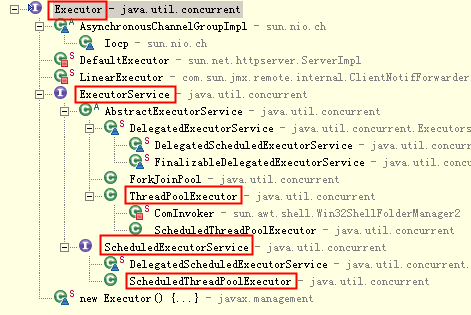
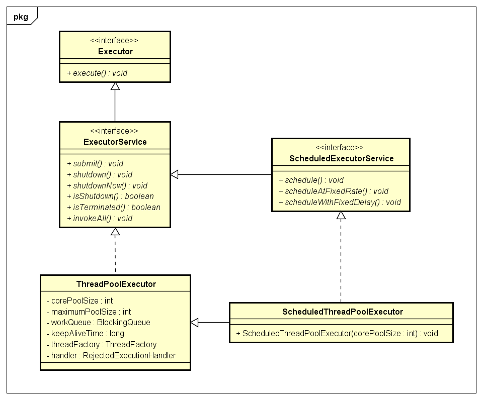
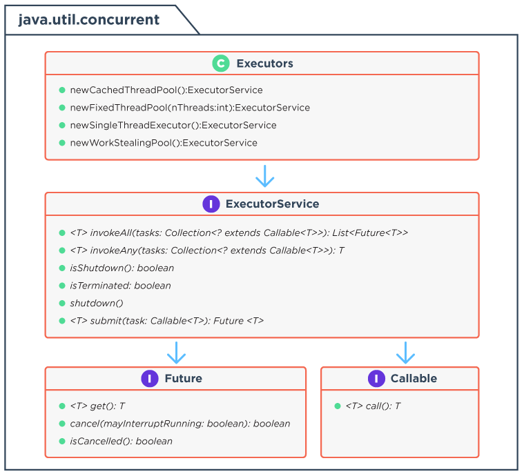
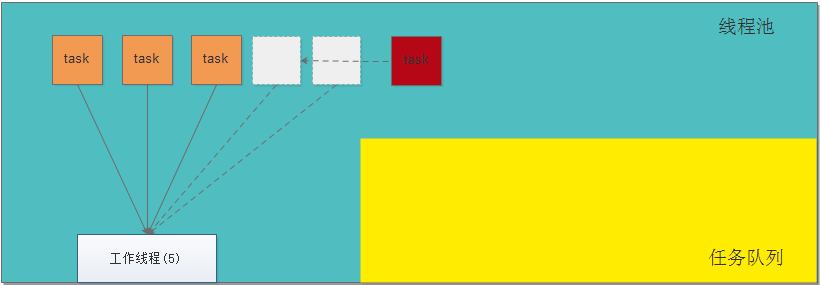
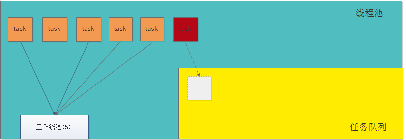
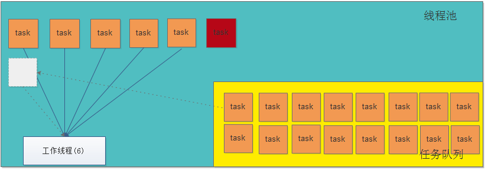

这里首先介绍了java5中的并发的小工具包：java.util.concurrent.atomic，然后介绍了线程池的概念，对使用java5的方式创建不同形式的线程进行了演示，之后介绍了两个 对象：Callable和Future，用于获取线程执行后的结果，对于[线程锁技术](线程锁技术.md)则在另外一篇文章中介绍。

Java5中的线程并发库都在java.util.concurrent包及子包中

# 1. Executor类的继承结构







Executor是线程池的顶级接口，只有一个执行任务的方法execute()

ExecutorService是Executor的子接口，该接口中包含了线程池常用的一些方法

| 方法             | 功能描述                                 |
| :------------- | :----------------------------------- |
| execute()      | 执行任务                                 |
| shutdown()     | 调用后不再接收新任务，如果里面有任务，就执行完              |
| shutdownNow()  | 调用后不再接受新任务，如果有等待任务，移出队列；有正在执行的，尝试停止之 |
| isShutdown()   | 判断线程池是否关闭                            |
| isTerminated() | 判断线程池中任务是否执行完成                       |
| submit()       | 提交任务                                 |
| invokeAll()    | 执行一组任务                               |

# 2. ThreadPoolExecutor

ExecutorService的默认实现，同时也是Executors的底层实现

## 2.1 构造方法

```java
public ThreadPoolExecutor(
    int corePoolSize, //核心线程数
    int maximumPoolSize, //最大线程数
    long keepAliveTime, //保持时间
    TimeUnit unit, //时间单位
    BlockingQueue<Runnable> workQueue, //用于保存等待执行的任务的阻塞队列
    ThreadFactory threadFactory, //线程工厂
    RejectedExecutionHandler handler //异常捕获器
)
```
### 2.1.1 int corePoolSize

核心池的大小，这个参数跟后面讲述的线程池的实现原理有非常大的关系。在创建了线程池后，默认情况下，线程池中并没有任何线程，而是等待有任务到来才创建线程去执行任务，除非调用了prestartAllCoreThreads()或者prestartCoreThread()方法，从这2个方法的名字就可以看出，是预创建线程的意思，即在没有任务到来之前就创建corePoolSize个线程或者一个线程。默认情况下，在创建了线程池后，线程池中的线程数为0，当有任务来之后，就会创建一个线程去执行任务，当线程池中的线程数目达到corePoolSize后，就会把到达的任务放到缓存队列当中

### 2.1.2 int maximumPoolSize

线程池最大线程数，这个参数也是一个非常重要的参数，它表示在线程池中最多能创建多少个线程

### 2.1.3 long keepAliveTime

表示线程没有任务执行时最多保持多久时间会终止。默认情况下，只有当线程池中的线程数大于corePoolSize时，keepAliveTime才会起作用，直到线程池中的线程数不大于corePoolSize，即当线程池中的线程数大于corePoolSize时，如果一个线程空闲的时间达到keepAliveTime，则会终止，直到线程池中的线程数不超过corePoolSize。但是如果调用了allowCoreThreadTimeOut(boolean)方法，在线程池中的线程数不大于corePoolSize时，keepAliveTime参数也会起作用，直到线程池中的线程数为0

### 2.1.4 TimeUnit unit

参数keepAliveTime的时间单位，有7种取值

- TimeUnit.DAYS                        //天
- TimeUnit.HOURS                    //小时
- TimeUnit.MINUTES                 //分钟
- TimeUnit.SECONDS               //秒
- TimeUnit.MILLISECONDS      //毫秒
- TimeUnit.MICROSECONDS      //微妙
- TimeUnit.NANOSECONDS       //纳秒

### 2.1.5 RejectedExecutionHandler

当线程池和workQueue都满了的情况下，对新加任务采取的处理策略也有几个默认的实现，分别如下

- ThreadPoolExecutor.AbortPolicy
  当添加任务出错时的策略捕获器，丢弃任务并抛出RejectedExecutionException异常

- ThreadPoolExecutor.DiscardPolicy 
  也是丢弃任务，但是不抛出异常

- ThreadPoolExecutor.DiscardOldestPolicy
  丢弃队列最前面的任务，然后重新尝试执行任务（重复此过程）

- ThreadPoolExecutor.CallerRunsPolicy
  拒绝新任务进入，如果该线程池还没有被关闭，那么由调用线程处理该任务

# 3. 任务提交给线程池之后的处理策略

3.1 如果当前线程池中的线程数目小于corePoolSize，则每来一个任务，就会创建线程执行这个任务



3.2 如果当前线程池中的线程数目>=corePoolSize，则每来一个任务，会尝试将其添加到任务缓存队列当中

3.2.1 若添加成功，则该任务会等待空闲线程将其取出去执行



3.2.2 若添加失败（一般来说是任务缓存队列已满），则会尝试创建新的线程去执行这个任务



3.3 如果当前线程池中的线程数目达到maximumPoolSize，则会采取任务拒绝策略进行处理


如果线程池中的线程数量大于 corePoolSize时，如果某线程空闲时间超过keepAliveTime，线程将被终止，直至线程池中的线程数目不大于corePoolSize；如果允许为核心池中的线程设置存活时间，那么核心池中的线程空闲时间超过keepAliveTime，线程也会被终止

# 4. 阻塞队列的介绍

## 4.1 BlockingQueue

| 阻塞队列                  | 功能描述                                     |
| :-------------------- | :--------------------------------------- |
| BlockingQueue         | 阻塞队列的顶级接口，主要用于实现生产者消费者队列                 |
| BlockingDeque         | 双端队列                                     |
| SynchronousQueue      | 同步队列，无界队列，直接提交策略，交替队列，在某次添加元素后必须等待其他线程取走后才能继续添加。静态工厂方法Executors.newCachedThreadPool使用了这个队列。 |
| LinkedBlockingQueue   | 无界队列，基于链表的阻塞队列，可以并发运行，FIFO。静态工厂方法Executors.newFixedThreadPool()使用了这个队列。 |
| LinkedBlockingDueue   | 双向链表实现的双向并发阻塞队列。同时支持FIFO和FILO两种操作方式，即可以从队列的头和尾同时操作（插入/删除），并且该阻塞队列是支持线程安全的。 |
| ConcurrentLinkedQueue | 基于链接节点的无界线程安全队列                          |
| ArrayBlockingQueue    | 基于数组的有界(固定大小的数组)阻塞队列，只有put方法和take方法才具有阻塞功能，公平性  fairness |
| PriorityBlockingQueue | 基于优先级的阻塞队列，依据对象的自然排序顺序或者是构造函数所带的Comparator决定的顺序，Volley中的请求队列使用了优先级队列 |
| DelayQueue            | 延时队列                                     |

## 4.2 排队策略

### 直接提交

工作队列的默认选项是 SynchronousQueue，它将任务直接提交给线程而不保持它们。在此，如果不存在可用于立即运行任务的线程，则试图把任务加入队列将失败，因此会构造一个新的线程。此策略可以避免在处理可能具有内部依赖性的请求集时出现锁。直接提交通常要求无界 maximumPoolSizes 以避免拒绝新提交的任务。当命令以超过队列所能处理的平均数连续到达时，此策略允许无界线程具有增长的可能性。

### 无界队列

使用无界队列（例如，不具有预定义容量的 LinkedBlockingQueue）使用无界队列将导致在所有 corePoolSize 线程都忙时新任务在队列中等待。这样，创建的线程就不会超过 corePoolSize。（因此，maximumPoolSize 的值也就无效了。）当每个任务完全独立于其他任务，即任务执行互不影响时，适合于使用无界队列。例如，在 Web 页服务器中。这种排队可用于处理瞬态突发请求，当命令以超过队列所能处理的平均数连续到达时，此策略允许无界线程具有增长的可能性

### 有界队列

当使用有限的 maximumPoolSizes 时，有界队列（如 ArrayBlockingQueue）有助于防止资源耗尽，但是可能较难调整和控制。队列大小和最大池大小可能需要相互折衷：使用大型队列和小型池可以最大限度地降低 CPU 使用率、操作系统资源和上下文切换开销，但是可能导致人工降低吞吐量。如果任务频繁阻塞（例如，如果它们是 I/O 边界），则系统可能为超过您许可的更多线程安排时间。使用小型队列通常要求较大的池大小，CPU 使用率较高，但是可能遇到不可接受的调度开销，这样也会降低吞吐量。

## 4.3 BlockingQueue

| 方法        | Throw exception  抛出异常 | Special value  特殊值 | Blocks   阻塞 | Time out  超时       |
| :-------- | :-------------------- | :----------------- | :---------- | :----------------- |
| Insert    | add()                 | offer()            | put()       | offer(e，time，unit) |
| Remove    | remove()              | poll()             | take()      | poll(time，unit)    |
| Examine检查 | element()             | peek()             | 不可用         | 不可用                |

`BlockingQueue` 不接受 `null` 元素。试图 `add`、`put` 或 `offer` 一个 `null` 元素时，某些实现会抛出 `NullPointerException`。`null` 被用作指示 `poll` 操作失败的警戒值。 

`BlockingQueue` 可以是限定容量的。它在任意给定时间都可以有一个 `remainingCapacity`，超出此容量，便无法无阻塞地 `put` 附加元素。没有任何内部容量约束的 `BlockingQueue` 总是报告 `Integer.MAX_VALUE` 的剩余容量。 

`BlockingQueue` 实现主要用于生产者-使用者队列，但它另外还支持 [`Collection`](../../../java/util/Collection.html) 接口。因此，举例来说，使用 `remove(x)` 从队列中移除任意一个元素是有可能的。然而，这种操作通常*不* 会有效执行，只能有计划地偶尔使用，比如在取消排队信息时。 

`BlockingQueue` 实现是线程安全的。所有排队方法都可以使用内部锁或其他形式的并发控制来自动达到它们的目的。然而，大量的 Collection 操作（`addAll`、`containsAll`、`retainAll` 和 `removeAll`）没有必要自动执行，除非在实现中特别说明。因此，举例来说，在只添加了 `c` 中的一些元素后，`addAll(c)` 有可能失败（抛出一个异常）。 

`BlockingQueue` 实质上不支持使用任何一种“close”或“shutdown”操作来指示不再添加任何项。这种功能的需求和使用有依赖于实现的倾向。例如，一种常用的策略是：对于生产者，插入特殊的end-of-stream或poison对象，并根据使用者获取这些对象的时间来对它们进行解释。 

## 4.4 BlockingDeque

双端队列

## 4.5 ArrayBlockingQueue

一个由数组支持的有界[阻塞队列](../../../java/util/concurrent/BlockingQueue.html)。此队列按 FIFO（先进先出）原则对元素进行排序。创建其对象必须明确大小，像数组一样。其内部实现是将对象放到一个数组里。有界也就意味着，它不能够存储无限多数量的元素。它有一个同一时间能够存储元素数量的上限。你可以在对其初始化的时候设定这个上限，但之后就无法对这个上限进行修改了(译者注：因为它是基于数组实现的，也就具有数组的特性：一旦初始化，大小就无法修改)。

实现互斥，你一下我一下

```java
public class BlockingQueueCondition {
    public static void main(String[] args) {
        ExecutorService service = Executors.newSingleThreadExecutor();
        final Business3 business = new Business3();
        service.execute(new Runnable(){
            public void run() {
                for(int i=0;i<50;i++){
                    business.sub();
                }
            }
        });
        for(int i=0;i<50;i++){
            business.main();
        }
    }
}
class Business3{
    BlockingQueue subQueue  = new ArrayBlockingQueue(1);
    BlockingQueue mainQueue = new ArrayBlockingQueue(1);
    {
        try {
            mainQueue.put(1);
        } catch (InterruptedException e) {
            e.printStackTrace();
        }
    }
    public void sub(){
        try
        {
            mainQueue.take();
            for(int i=0;i<10;i++){
                System.out.println(Thread.currentThread().getName() + " : " + i);
            }
            subQueue.put(1);
        }catch(Exception e){
        }
    }
    public void main(){
        try
        {
            subQueue.take();
            for(int i=0;i<5;i++){
                System.out.println(Thread.currentThread().getName() + " : " + i);
            }
            mainQueue.put(1);
        }catch(Exception e){
        }
    }
}
```

输出结果

```
pool-1-thread-1 : 0
pool-1-thread-1 : 1
pool-1-thread-1 : 2
pool-1-thread-1 : 3
pool-1-thread-1 : 4
pool-1-thread-1 : 5
pool-1-thread-1 : 6
pool-1-thread-1 : 7
pool-1-thread-1 : 8
pool-1-thread-1 : 9
main : 0
main : 1
main : 2
main : 3
main : 4
pool-1-thread-1 : 0
pool-1-thread-1 : 1
pool-1-thread-1 : 2
pool-1-thread-1 : 3
pool-1-thread-1 : 4
pool-1-thread-1 : 5
pool-1-thread-1 : 6
pool-1-thread-1 : 7
pool-1-thread-1 : 8
pool-1-thread-1 : 9
main : 0
main : 1
main : 2
main : 3
main : 4
pool-1-thread-1 : 0
pool-1-thread-1 : 1
pool-1-thread-1 : 2
pool-1-thread-1 : 3
pool-1-thread-1 : 4
pool-1-thread-1 : 5
pool-1-thread-1 : 6
pool-1-thread-1 : 7
pool-1-thread-1 : 8
pool-1-thread-1 : 9
...
```

## 4.6 LinkedBlockingQueue

一个可改变大小的阻塞队列。此队列按 FIFO（先进先出）原则对元素进行排序。创建其对象如果没有明确大小，默认值是Integer.MAX_VALUE。链接队列的吞吐量通常要高于基于数组的队列，但是在大多数并发应用程序中，其可预知的性能要低。 

## 4.7 SynchronousQueue

同步队列。同步队列没有任何容量，每个插入必须等待另一个线程移除，反之亦然。是一个特殊的队列，它的内部同时只能够容纳单个元素。如果该队列已有一元素的话，试图向队列中插入一个新元素的线程将会阻塞，直到另一个线程将该元素从队列中抽走。同样，如果该队列为空，试图向队列中抽取一个元素的线程将会阻塞，直到另一个线程向队列中插入了一条新的元素。据此，把这个类称作一个队列显然是夸大其词了。它更多像是一个汇合点。

## 4.8 DelayQueue

延时队列，对元素进行持有直到一个特定的延迟到期，只有在延迟期满时才能从中提取元素。注入其中的元素必须实现 java.util.concurrent.Delayed 接口。

## 4.9 PriorityBlockingQueue

基于优先级的阻塞队列，依据对象的自然排序顺序或者是构造函数所带的Comparator决定的顺序，应用：Volley

## 4.10 生产者消费者

生产者生产任务，消费者消费任务，那么这时就需要一个任务队列，生产者向队列里插入任务，消费者从队列里提取任务执行

# 5. 线程池工具类Executors

jdk1.5之后的一个新类，提供了一些静态工厂，生成一些常用的线程池，ThreadPoolExecutor是Executors类的底层实现

| 方法                        | 功能描述                                    |
| :------------------------ | :-------------------------------------- |
| newCachedThreadPool()     | 创建一个可缓存的线程池                             |
| newFixedThreadPool()      | 创建一个固定大小的线程池                            |
| newScheduledThreadPool()  | 创建一个大小无限的线程池。此线程池支持定时以及周期性执行任务的需求       |
| newSingleThreadExecutor() | 创建单个线程的线程池，始终保证线程池中会有一个线程在。当某线程死去，会找继任者 |
| defaultThreadFactory()    | 创建一个默认线程池工厂                             |

# 6. 线程池

在线程池的编程模式下，任务是提交给整个线程池，而不是直接交给某个线程，线程池在拿到任务后，它就在内部找有无空闲的线程，再把任务交给内部某个空闲的线程，这就是封装

记住：任务是提交给整个线程池，一个线程同时只能执行一个任务，但可以同时向一个线程池提交多个任务。

示例：

- 创建固定大小的线程池
- 创建缓存线程池  
- 用线程池创建定时器
- 创建单一线程池（始终保证线程池中会有一个线程在。当某线程死去，会找继任者）

注意：

定时器中总是相对时间，我们要想指定具体时间的方法：比如明天早上10点钟执行，则可以使用明天早上10点的时间减去当前的时间，得到时间间隔

```java
import java.util.concurrent.ExecutorService;  
import java.util.concurrent.Executors;  
import java.util.concurrent.TimeUnit;  
  
public class ThreadPoolTest {  
    public static void main(String[] args){  
          
        //创建固定大小的线程池，这里只能完成3个任务  
        //ExecutorService threadPool = Executors.newFixedThreadPool(3);  
          
        //创建缓存线程池，根据任务来自动创建线程的数量，可以完成创建的所有任务  
        //ExecutorService threadPool = Executors.newCachedThreadPool();  
          
        //创建单一线程池（始终保持线程池中有一个线程存活。当唯一线程死去，会创建新的继任者、  
        ExecutorService threadPool = Executors.newSingleThreadExecutor();  
          
        for(int i=1;i<=10;i++){  
			//内部类不能访问外部类的局部变量，所以i要定义为final，又由于i++.  
			//所以在循环内部定义一个变量接收i  
            final int task = i;  
        threadPool.execute(new Runnable() {  
              
            @Override  
            public void run() {  
                for(int j=1;j<=10;j++){  
                    System.out.println(Thread.currentThread().getName()  
                            +" is looping of "+ j+"  for task of " +task);  
                }  
            }  
        });  
        }  
        //验证10个任务都提交给了线程池  
        System.out.println("all of 10 tasks have committed! ");  
        //threadPool.shutdown();        //等任务完成后，杀死线程、  
        //threadPool.shutdownNow();     //立即停止线程  
      
        //用线程池启动定时器  
          
        Executors.newScheduledThreadPool(3).schedule(  
                new Runnable() {  //任务  
                @Override  
                public void run() {  
                    System.out.println("bombing!");  
                }  
            },   
                    5,  //5秒以后执行  
                    TimeUnit.SECONDS);  //单位  
              
    	//在某个时间执行一次后，再指定后续的执行间隔时间  
        Executors.newScheduledThreadPool(3).scheduleAtFixedRate(new Runnable(){  
  
            @Override  
            public void run() {           
                System.out.println("bombing!");  
            }  
              
        }, 10,   //第一次在10秒时爆炸  
            3,   //以后每隔3秒爆炸一次。  
        TimeUnit.SECONDS);   
    }  
}  
```

# 7. 线程池的简单使用

```java
/**
 * 一个简易的线程池管理类，提供三个线程池
 */
public class ThreadManager {
	public static final String DEFAULT_SINGLE_POOL_NAME = "DEFAULT_SINGLE_POOL_NAME";

	private static ThreadPoolProxy mLongPool = null;
	private static Object mLongLock = new Object();

	private static ThreadPoolProxy mShortPool = null;
	private static Object mShortLock = new Object();

	private static ThreadPoolProxy mDownloadPool = null;
	private static Object mDownloadLock = new Object();

	private static Map<String, ThreadPoolProxy> mMap = new HashMap<String, ThreadPoolProxy>();
	private static Object mSingleLock = new Object();

	/** 获取下载线程 */
	public static ThreadPoolProxy getDownloadPool() {
		synchronized (mDownloadLock) {
			if (mDownloadPool == null) {
				mDownloadPool = new ThreadPoolProxy(3, 3, 5L);
			}
			return mDownloadPool;
		}
	}

	/** 获取一个用于执行长耗时任务的线程池，避免和短耗时任务处在同一个队列而阻塞了重要的短耗时任务，通常用来联网操作 */
	public static ThreadPoolProxy getLongPool() {
		synchronized (mLongLock) {
			if (mLongPool == null) {
				mLongPool = new ThreadPoolProxy(5, 5, 5L);
			}
			return mLongPool;
		}
	}

	/** 获取一个用于执行短耗时任务的线程池，避免因为和耗时长的任务处在同一个队列而长时间得不到执行，通常用来执行本地的IO/SQL */
	public static ThreadPoolProxy getShortPool() {
		synchronized (mShortLock) {
			if (mShortPool == null) {
				mShortPool = new ThreadPoolProxy(2, 2, 5L);
			}
			return mShortPool;
		}
	}

	/** 获取一个单线程池，所有任务将会被按照加入的顺序执行，免除了同步开销的问题 */
	public static ThreadPoolProxy getSinglePool() {
		return getSinglePool(DEFAULT_SINGLE_POOL_NAME);
	}

	/** 获取一个单线程池，所有任务将会被按照加入的顺序执行，免除了同步开销的问题 */
	public static ThreadPoolProxy getSinglePool(String name) {
		synchronized (mSingleLock) {
			ThreadPoolProxy singlePool = mMap.get(name);
			if (singlePool == null) {
				singlePool = new ThreadPoolProxy(1, 1, 5L);
				mMap.put(name, singlePool);
			}
			return singlePool;
		}
	}

	public static class ThreadPoolProxy {
		private ThreadPoolExecutor mPool;
		private int mCorePoolSize;
		private int mMaximumPoolSize;
		private long mKeepAliveTime;

		private ThreadPoolProxy(int corePoolSize, int maximumPoolSize, long keepAliveTime) {
			mCorePoolSize = corePoolSize;
			mMaximumPoolSize = maximumPoolSize;
			mKeepAliveTime = keepAliveTime;
		}

		/** 执行任务，当线程池处于关闭，将会重新创建新的线程池 */
		public synchronized void execute(Runnable run) {
			if (run == null) {
				return;
			}
			if (mPool == null || mPool.isShutdown()) {
				//参数说明
				//当线程池中的线程小于mCorePoolSize，直接创建新的线程加入线程池执行任务
				//当线程池中的线程数目等于mCorePoolSize，将会把任务放入任务队列BlockingQueue中
				//当BlockingQueue中的任务放满了，将会创建新的线程去执行，
				//但是当总线程数大于mMaximumPoolSize时，将会抛出异常，交给RejectedExecutionHandler处理
				//mKeepAliveTime是线程执行完任务后，且队列中没有可以执行的任务，存活的时间，后面的参数是时间单位
				//ThreadFactory是每次创建新的线程工厂
				mPool = new ThreadPoolExecutor(mCorePoolSize, mMaximumPoolSize, mKeepAliveTime, TimeUnit.MILLISECONDS, new LinkedBlockingQueue<Runnable>(), Executors.defaultThreadFactory(), new AbortPolicy());
			}
			mPool.execute(run);
		}

		/** 取消线程池中某个还未执行的任务 */
		public synchronized void cancel(Runnable run) {
			if (mPool != null && (!mPool.isShutdown() || mPool.isTerminating())) {
				mPool.getQueue().remove(run);
			}
		}

		/** 取消线程池中某个还未执行的任务 */
		public synchronized boolean contains(Runnable run) {
			if (mPool != null && (!mPool.isShutdown() || mPool.isTerminating())) {
				return mPool.getQueue().contains(run);
			} else {
				return false;
			}
		}

		/** 立刻关闭线程池，并且正在执行的任务也将会被中断 */
		public void stop() {
			if (mPool != null && (!mPool.isShutdown() || mPool.isTerminating())) {
				mPool.shutdownNow();
			}
		}

		/** 平缓关闭单任务线程池，但是会确保所有已经加入的任务都将会被执行完毕才关闭 */
		public synchronized void shutdown() {
			if (mPool != null && (!mPool.isShutdown() || mPool.isTerminating())) {
				mPool.shutdownNow();
			}
		}
	}
}
```