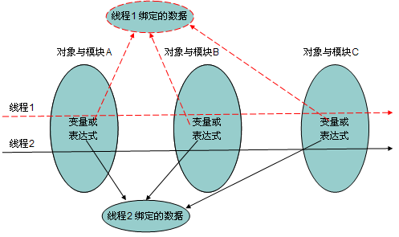

## **笔记摘要**
所谓线程范围内共享数据，即对于相同的程序代码，多个模块在同一个线程中运行时要共享一份数据，而在另外线程中运行时又共享另外一份数据，API中为我们提供了一个操作线程范围内共享数据的类ThreadLocal，对于线程范围内共享数据的应用，在ThreadLocal的应用场景中进行了介绍，然后主要对它的使用进行讲解，演示了由单一数据的共享到将多个数据封装到一个对象中，然后进行共享。在开始先用一个Map集合简单实现线程范围内数据的共享

## **1. 使用Map实现线程范围内数据的共享**

原理：将线程对象作为map的键存入，这样就保证了map对象的唯一，也就保证了线程内数据的唯一

关键:  明确一点，把当前线程对象作为map集合的键存进去

```java
import java.util.HashMap;  
import java.util.Map;  
import java.util.Random;  
  
public class ThreadScopeShareData {  
  
    private static int data = 0;    //定义一个全局的成员变量  
    private static Map<Thread, Integer> threadData = new HashMap<Thread, Integer>();  
    public static void main(String[] args) {  
        //启动两个线程  
        for(int i=0;i<2;i++){  
            new Thread(new Runnable(){  
                @Override  
                public void run() {  
                    int data = new Random().nextInt();  //准备一个数据  
                    System.out.println(Thread.currentThread().getName()   
                            + " has put data :" + data);  
                    //把当前线程对象作为键，就可以保证map对象的唯一，即保证线程内的数据唯一  
                    threadData.put(Thread.currentThread(), data);  
                    new A().get();  
                    new B().get();  
                }  
            }).start();  
        }  
    }  
    //定义一个类模拟获取数据  
    static class A{  
        public void get(){  
            int data = threadData.get(Thread.currentThread());  
            System.out.println("A from " + Thread.currentThread().getName()   
                    + " get data :" + data);  
        }  
    }  
      
    static class B{  
        public void get(){  
            int data = threadData.get(Thread.currentThread());            
            System.out.println("B from " + Thread.currentThread().getName()   
                    + " get data :" + data);  
        }         
    }  
}
```
打印结果

```
Thread-0 has put data:-49248136
Thread-1 has put data:311124475
A from Thread-0 get data:-49248136
A from Thread-1 get data:311124475
B from Thread-0 get data:-49248136
B from Thread-1 get data:311124475
```

## **2. ThreadLocal类**

ThreadLocal的作用和目的：

用于实现线程内的数据共享，即对于相同的程序代码，多个模块在同一个线程中运行时要共享一份数据，而在另外线程中运行时又共享另外一份数据。

每个线程调用全局ThreadLocal对象的set方法，就相当于往其内部的map中增加一条记录，key分别是各自的线程，value是各自的set方法传进去的值。在线程结束时可以调用ThreadLocal.clear()方法，这样会更快释放内存，不调用也可以，因为线程结束后也可以自动释放相关的ThreadLocal变量。

## **3. ThreadLocal的应用场景**

1、订单处理包含一系列操作：减少库存量、增加一条流水台账、修改总账，这几个操作要在同一个事务中完成，通常也即同一个线程中进行处理，如果累加公司应收款的操作失败了，则应该把前面的操作回滚，否则，提交所有操作，这要求这些操作使用相同的数据库连接对象，而这些操作的代码分别位于不同的模块类中。

2、 银行转账包含一系列操作：把转出帐户的余额减少，把转入帐户的余额增加，这两个操作要在同一个事务中完成，它们必须使用相同的数据库连接对象，转入和转出操作的代码分别是两个不同的帐户对象的方法。

3、例如Strut2的ActionContext，同一段代码被不同的线程调用运行时，该代码操作的数据是每个线程各自的状态和数据，对于不同的线程来说，getContext方法拿到的对象都不相同，对同一个线程来说，不管调用getContext方法多少次和在哪个模块中getContext方法，拿到的都是同一个。

线程范围内共享数据示意图

 

实现对ThreadLocal变量的封装， 让外界不要直接操作ThreadLocal变量由于对基本类型的数据的封装，这种应用相对很少见。而对对象类型的数据的封装，比较常见，即让某个类针对不同线程分别创建一个独立的实例对象。所以我们要对数据进行封装。

### **实现方式一**

示例说明：

1、 该示例包含了对基本类型数据的共享和对象类型数据的共享

2、定义一个全局共享的ThreadLocal变量，然后启动多个线程向该ThreadLocal变量中存储一个随机值，接着各个线程调用另外其他多个类的方法，这多个类的方法中读取这个ThreadLocal变量的值，就可以看到多个类在同一个线程中共享同一份数据。

3、但这里每次存储数据时，都是使用同一个ThreadLocal对象，只是重新赋值而已

```java
import java.util.HashMap;  
import java.util.Map;  
import java.util.Random;  
  
public class ThreadLocalTest {  
      
    private static ThreadLocal<Integer> x = new ThreadLocal<Integer>();  
    //创建一个存储封装类对象的ThreadLocal  
    private static ThreadLocal<MyThreadScopeData> myThreadScopeData = new  ThreadLocal<MyThreadScopeData>();  
    private static int data = 0;  
      
    public static void main(String[] args){  
      
        //产生两个线程  
        for(int i=0;i<2;i++){  
        new Thread(new Runnable(){  
  
        @Override  
        public void run() {  
            //共享单一的数据  
            int data = new Random().nextInt();  
            System.out.println(Thread.currentThread().getName()+"has put data : "+data);  
            x.set(data);      
              
            //共享多个数据  
            //将数据封装在myData对象中，并将myData作为myThreadScopeData的键  
            MyThreadScopeData myData = new MyThreadScopeData();  
            myData.setName("name "+data);  
            myData.setAge(data);  
            myThreadScopeData.set(myData);  
              
            new A().get();  
            new B().get();  
            }  
         }).start();  
      }  
   }  
      
    static class A{  
        public void get(){  
            int data = x.get();  
            System.out.println("A from "+Thread.currentThread().getName()+" get data :"+data);  
          
            //从myData中取出数据，并获取当前线程名，数据  
            MyThreadScopeData myData = myThreadScopeData.get();  
            System.out.println("A from "+Thread.currentThread().getName()+" getMyData: " +   
                    myData.getName() + "," +myData.getAge());  
        }  
    }  
          
    static class B{  
        public void get(){  
            int data = x.get();  
            System.out.println("B from "+Thread.currentThread().getName()+" get data :"+data);  
            MyThreadScopeData myData = myThreadScopeData.get();  
            System.out.println("B from "+Thread.currentThread().getName()+" getMyData: " +   
                    myData.getName() + "," +myData.getAge());  
        }  
    }  
}  
  
//封装数据的类  
class MyThreadScopeData{  
      
    private String name;  
    private int age;  
    public String getName() {  
        return name;  
    }  
    public void setName(String name) {  
        this.name = name;  
    }  
    public int getAge() {  
        return age;  
    }  
    public void setAge(int age) {  
        this.age = age;  
    }  
}  
```
输出结果

```
Thread-0has put data : 1317043235
Thread-1has put data : -969579752
A from Thread-0 get data :1317043235
A from Thread-1 get data :-969579752
A from Thread-0 getMyData: name 1317043235,1317043235
A from Thread-1 getMyData: name -969579752,-969579752
B from Thread-0 get data :1317043235
B from Thread-1 get data :-969579752
B from Thread-0 getMyData: name 1317043235,1317043235
B from Thread-1 getMyData: name -969579752,-969579752
```

### **实现方式二**

 示例说明：

这里模拟原始的单例模式，它们的区别是：单例模式中只有唯一的一个实例，而这里是每个线程拥有自己唯一的实例，只要是已经创建，就直接返回，保证每个线程拥有自己的唯一一份实例

优点：

这里可以返回每个线程自己唯一的实例对象，所以不必在外面定义，当在代码中的任意地方想获取到一个可以存储自己数据的线程实例的时候直接去调用getThreadInstance方法即可，直接定义在数据对象的内部，和数据关系更紧密，而方式一，则每次想存入数据的时候都需要在外面创建一个ThreadLocal对象用于存储数据。所以方式二更具封装性。

```java
package cn.itcast.heima2;  
  
import java.util.HashMap;  
import java.util.Map;  
import java.util.Random;  
  
public class ThreadLocalTest {  
      
    //创建一个ThreadLocal对象  
    private static ThreadLocal<Integer> x = new ThreadLocal<Integer>();  
      
    public static void main(String[] args) {  
        for(int i=0;i<2;i++){  
            new Thread(new Runnable(){  
                @Override  
                public void run() {  
                    int data = new Random().nextInt();  
                    System.out.println(Thread.currentThread().getName()   
                            + " has put data :" + data);  
                    x.set(data);    //往当前线程存入一条数据  
                      
                    //获取与当前线程绑定的实例并设置值  
                    MyThreadScopeData.getThreadInstance().setName("name：" + data);  
                    MyThreadScopeData.getThreadInstance().setAge(data);  
                    new A().get();  
                    new B().get();  
                }  
            }).start();  
        }  
    }  
      
    static class A{  
        public void get(){  
            int data = x.get();     //获取当前线程中的数据  
            System.out.println("A from " + Thread.currentThread().getName()   
                    + " get data :" + data);  
              
            //获取与当前线程绑定的实例  
            MyThreadScopeData myData = MyThreadScopeData.getThreadInstance();  
            System.out.println("A from " + Thread.currentThread().getName()   
                    + " getMyData: " + myData.getName() + "," +  
                    myData.getAge());  
        }  
    }  
      
    static class B{  
        public void get(){  
            int data = x.get();           
            System.out.println("B from " + Thread.currentThread().getName()   
                    + " get data :" + data);  
            MyThreadScopeData myData = MyThreadScopeData.getThreadInstance();  
            System.out.println("B from " + Thread.currentThread().getName()   
                    + " getMyData: " + myData.getName() + ",age: " +  
                    myData.getAge());             
        }         
    }  
}  
  
//一个绑定当前线程的类  
class MyThreadScopeData{  
  
    private MyThreadScopeData(){}   //构造方法私有化  
    private static ThreadLocal<MyThreadScopeData> map = new ThreadLocal<MyThreadScopeData>();  
      
    //定义一个静态方法，返回各线程自己的实例   
    //这里不必用同步，因为每个线程都要创建自己的实例，所以没有线程安全问题。  
    public static /*synchronized*/ MyThreadScopeData getThreadInstance(){  
        MyThreadScopeData instance = map.get();     //获取当前线程绑定的实例  
        if(instance == null){         
            instance = new MyThreadScopeData();  
            map.set(instance);  //创建完之后，将实例对象存进去  
        }  
        return instance;  
    }  
  
    private String name;  
    private int age;  
    public String getName() {  
        return name;  
    }  
    public void setName(String name) {  
        this.name = name;  
    }  
    public int getAge() {  
        return age;  
    }  
    public void setAge(int age) {  
        this.age = age;  
    }  
}  
```
输出结果

```
Thread-0 has put data :2105117242
Thread-1 has put data :-368218341
A from Thread-1 get data :-368218341
A from Thread-1 getMyData: name：-368218341,-368218341
A from Thread-0 get data :2105117242
A from Thread-0 getMyData: name：2105117242,2105117242
B from Thread-0 get data :2105117242
B from Thread-1 get data :-368218341
B from Thread-0 getMyData: name：2105117242,age: 2105117242
B from Thread-1 getMyData: name：-368218341,age: -368218341
```

## **4. 总结**

一个ThreadLocal代表一个变量，故其中只能放一个数据，有两个变量都要线程范围内共享，则要定义两个ThreadLocal对象，如果数据更多就很麻烦，可以先定义一个对象封装变量，然后在ThreadLocal中存储这一个对象，而这些操作都在提供线程数据类中完成