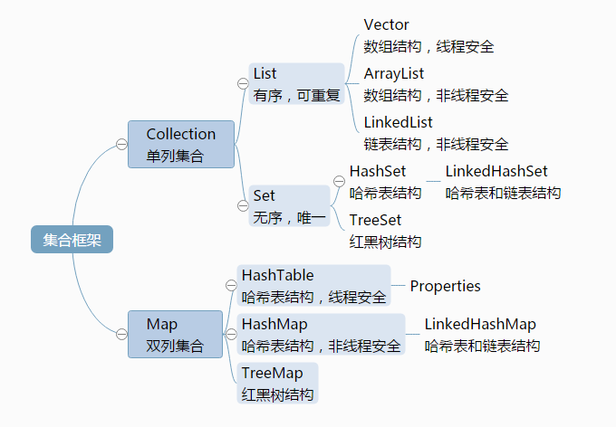
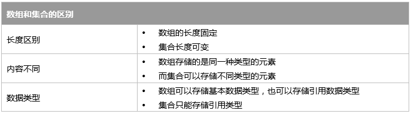
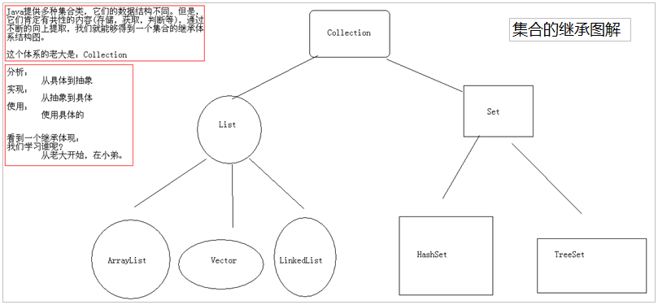
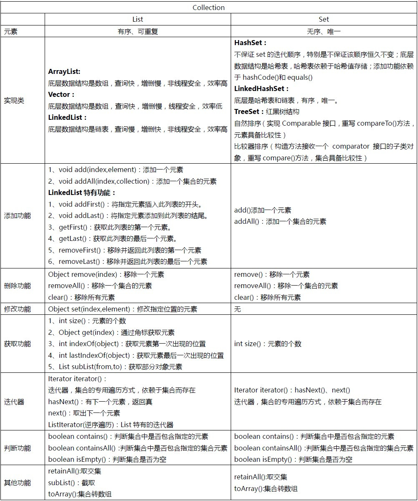

## 1. Java类中集合的关系图

## 2. 集合类概述

在程序中可以通过数组来保存多个对象，但在某些情况下开发人员无法预先确定需要保存对象的个数，此时数组将不再适用，因为数组的长度不可变。例如，要保存一个学校的学生信息，由于不停有新生来报道，同时也有学生毕业离开学校，这时学生的数目就很难确定。为了在程序中可以保存这些数目不确定的对象，JDK中提供了一系列特殊的类，这些类可以存储任意类型的对象，并且长度可变，在Java中这些类被统称为集合。集合类都位于java.util包中，在使用时一定要注意导包的问题，否则会出现异常。

### 2.1 为什么出现集合类？

面向对象语言对事物的体现都是以对象的形式，所以为了方便对多个对象的操作，Java就提供了集合类。

### 2.2 数组和集合类同是容器，有何不同？

### 2.3 集合类的特点

集合只用于存储对象，集合长度是可变的，集合可以存储不同类型的对象。

## 3. Collection接口概述

Collection：单列集合类的根接口，用于存储一系列符合某种规则的元素，它有两个重要的子接口，分别是List和Set。其中，List的特点是元素有序、元素可重复。Set的特点是元素无序，而且不可重复。List接口的主要实现类有ArrayList和LinkedList，Set接口的主要实现类有HashSet和TreeSet。

Collection 层次结构中的根接口。Collection 表示一组对象，这些对象也称为 collection 的元素。一些 collection 允许有重复的元素，而另一些则不允许。一些 collection 是有序的，而另一些则是无序的。

## 4. Collection接口成员方法

集合层次结构中的根接口。Collection表示一组对象，这些对象也称为Collection的元素。一些Collection允许有重复的元素，而另一些则不允许。一些Collection是有序的，而另一些则是无序的。

### 添加功能

| 方法声明     | 功能描述      |
| :------- | :-------- |
| add()    | 添加元素      |
| addAll() | 添加一个集合的元素 |

### 删除功能

| 方法声明        | 功能描述      |
| ----------- | --------- |
| remove()    | 删除元素      |
| removeAll() | 删除一个集合的元素 |
| clear()     | 清空集合      |

### 判断功能

| 方法声明          | 功能描述              |
| ------------- | ----------------- |
| contains()    | 判断集合是否包含指定的元素     |
| containsAll() | 判断一个集合是否包含一个集合的元素 |
| isEmpty()     | 判断集合是否为空          |

### 获取功能

| 方法声明        | 功能描述     |
| ----------- | -------- |
| size()      | 获取集合的长度  |
| retainAll() | 取两个集合的交集 |

### 其他功能

| 方法声明       | 功能描述              |
| ---------- | ----------------- |
| toArray()  | 把集合转成数组，可以实现集合的遍历 |
| iterator() | 迭代器，集合的专用遍历方式     |

