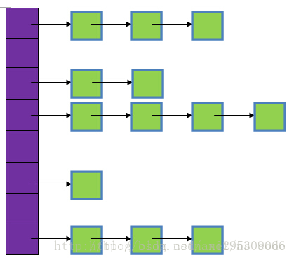
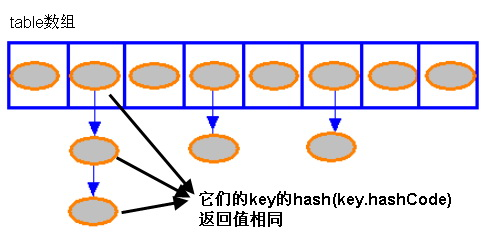
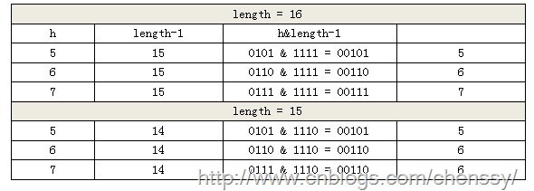
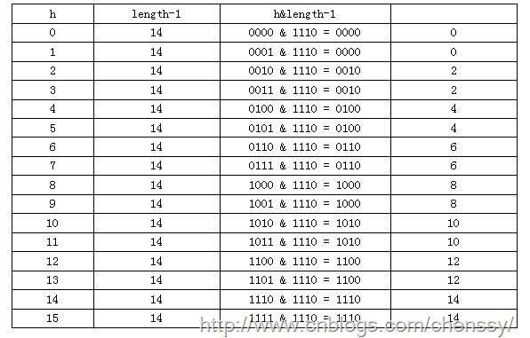

## 1. HashMap概述

HashMap是基于哈希表的Map接口的非同步实现（Hashtable跟HashMap很像，唯一的区别是Hashtalbe中的方法是线程安全的，也就是同步的）。此实现提供所有可选的映射操作，并允许使用null值和null键。此类不保证映射的顺序，特别是它不保证该顺序恒久不变。

## 2. 四个关注点在HashMap上的答案

| 关注点             | 结论                                       |
| :-------------- | :--------------------------------------- |
| HashMap是否允许空    | Key和Value都允许为空                           |
| HashMap是否允许重复数据 | Key重复会覆盖、Value允许重复                       |
| HashMap是否有序     | 无序，特别说明这个无序指的是遍历HashMap的时候，得到的元素的顺序基本不可能是put的顺序 |
| HashMap是否线程安全   | 非线程安全                                    |

## 3. HashMap的数据结构

在java编程语言中，最基本的结构就是两种，一个是数组，另外一个是模拟指针（引用），所有的数据结构都可以用这两个基本结构来构造的，HashMap也不例外。HashMap实际上是一个“链表的数组”的数据结构，每个元素存放链表头结点的数组，即数组和链表的结合体。


从上图中可以看出，HashMap底层就是一个数组结构，数组中的每一项又是一个链表。当新建一个HashMap的时候，就会初始化一个数组。源码如下：

```java
/**
 * The table, resized as necessary. Length MUST Always be a power of two.
 */
transient Entry[] table;

static class Entry<K,V> implements Map.Entry<K,V> {
    final K key;
    V value;
    Entry<K,V> next;
    final int hash;
    ……
}
```

可以看出，Entry就是数组中的元素，每个 Map.Entry 其实就是一个key-value对，它持有一个指向下一个元素的引用，这就构成了链表。

HashMap的底层主要是基于数组和链表来实现的，它之所以有相当快的查询速度主要是因为它是通过计算散列码来决定存储的位置。HashMap中主要是通过key的hashCode来计算hash值的，只要hashCode相同，计算出来的hash值就一样。如果存储的对象对多了，就有可能不同的对象所算出来的hash值是相同的，这就出现了所谓的hash冲突。学过数据结构的同学都知道，解决hash冲突的方法有很多，HashMap底层是通过链表来解决hash冲突的。



图中，紫色部分即代表哈希表，也称为哈希数组，数组的每个元素都是一个单链表的头节点，链表是用来解决冲突的，如果不同的key映射到了数组的同一位置处，就将其放入单链表中。

对于 HashMap 及其子类而言，它们采用 Hash 算法来决定集合中元素的存储位置。当系统开始初始化 HashMap 时，系统会创建一个长度为 capacity 的 Entry 数组，这个数组里可以存储元素的位置被称为“桶（bucket）”，每个 bucket 都有其指定索引，系统可以根据其索引快速访问该 bucket 里存储的元素。

无论何时，HashMap 的每个“桶”只存储一个元素（也就是一个 Entry），由于 Entry 对象可以包含一个引用变量（就是 Entry 构造器的的最后一个参数）用于指向下一个 Entry，因此可能出现的情况是：HashMap 的 bucket 中只有一个 Entry，但这个 Entry 指向另一个 Entry ——这就形成了一个 Entry 链。



## 4. HashMap的构造函数

HashMap提供了三个构造函数：

- HashMap()：构造一个具有默认初始容量 (16) 和默认加载因子 (0.75) 的空 HashMap。
- HashMap(int initialCapacity)：构造一个带指定初始容量和默认加载因子 (0.75) 的空 HashMap。
- HashMap(int initialCapacity, float loadFactor)：构造一个带指定初始容量和加载因子的空 HashMap。

在这里提到了两个参数：初始容量，加载因子。这两个参数是影响HashMap性能的重要参数，其中容量表示哈希表中桶的数量，初始容量是创建哈希表时的容量，加载因子是哈希表在其容量自动增加之前可以达到多满的一种尺度，它衡量的是一个散列表的空间的使用程度，负载因子越大表示散列表的装填程度越高，反之愈小。对于使用链表法的散列表来说，查找一个元素的平均时间是O(1+a)，因此如果负载因子越大，对空间的利用更充分，然而后果是查找效率的降低；如果负载因子太小，那么散列表的数据将过于稀疏，对空间造成严重浪费。系统默认负载因子为0.75，一般情况下我们是无需修改的。

若:加载因子越大,填满的元素越多,好处是,空间利用率高了,但:冲突的机会加大了.链表长度会越来越长,查找效率降低。
反之,加载因子越小,填满的元素越少,好处是:冲突的机会减小了,但:空间浪费多了.表中的数据将过于稀疏（很多空间还没用，就开始扩容了）

当哈希表中条目数超出了当前容量*加载因子(其实就是HashMap的实际容量)时，则对该哈希表进行rehash操作，将哈希表扩充至两倍的桶数。

## 5. HashMap的存取实现

### 5.1  存储

```java
public V put(K key, V value) {
    //当key为null，调用putForNullKey方法，保存null与table第一个位置中，这是HashMap允许为null的原因
    if (key == null)
        return putForNullKey(value);
    //计算key的hash值
    int hash = hash(key.hashCode());                  //------(1)
    //计算key hash 值在 table 数组中的位置
    int i = indexFor(hash, table.length);             //------(2)
    //从i出开始迭代 e,找到 key 保存的位置
    for (Entry<K, V> e = table[i]; e != null; e = e.next) {
        Object k;
        //判断该条链上是否存在相同的key值
        //若存在相同，则直接覆盖value，返回旧value
        if (e.hash == hash && ((k = e.key) == key || key.equals(k))) {
            V oldValue = e.value;    //旧值 = 新值
              e.value = value;
            e.recordAccess(this);
            return oldValue;     //返回旧值
        }
    }
    //修改次数增加1
    modCount++;
    //将key、value添加至i位置处
     addEntry(hash, key, value, i);
    return null;
}
```

通过源码我们可以清晰看到HashMap保存数据的过程为：首先判断key是否为null，若为null，则直接调用putForNullKey方法，将value放置在数组第一个位置上。若不为空则根据key的hashCode重新计算hash值，然后根据hash值得到这个元素在table数组中的位置（即下标），如果table数组在该位置处已经存放有其他元素了，则通过比较是否存在相同的key，若存在则覆盖原来key的value，否则将该元素保存在链头（最先保存的元素放在链尾）。若table在该处没有元素，就直接将该元素放到此数组中的该位置上。这个过程看似比较简单，其实深有内幕。有如下几点：

1、先看迭代处。此处迭代原因就是为了防止存在相同的key值，若发现两个key值相同时，HashMap的处理方式是用新value替换旧value，这里并没有处理key，这就解释了HashMap中没有两个相同的key。另外，注意一点，对比Key是否相同，是先比HashCode是否相同，HashCode相同再判断equals是否为true，这样大大增加了HashMap的效率。

2、在看（1）、（2）处。这里是HashMap的精华所在。首先是hash方法，该方法为一个纯粹的数学计算，就是计算h的hash值。此算法加入了高位计算，防止低位不变，高位变化时，造成的hash冲突。

```java
static int hash(int h) {
    h ^= (h >>> 20) ^ (h >>> 12);
    return h ^ (h >>> 7) ^ (h >>> 4);
}
```

为什么要经过这样的运算呢？这就是HashMap的高明之处。先看个例子，一个十进制数32768(二进制1000 0000 0000 0000)，经过上述公式运算之后的结果是35080(二进制1000 1001 0000 1000)。看出来了吗？或许这样还看不出什么，再举个数字61440(二进制1111 0000 0000 0000)，运算结果是65263(二进制1111 1110 1110 1111)，现在应该很明显了，它的目的是让“1”变的均匀一点，散列的本意就是要尽量均匀分布。

我们知道对于HashMap的table而言，数据分布需要均匀（最好每项都只有一个元素，这样就可以直接找到），不能太紧也不能太松，太紧会导致查询速度慢，太松则浪费空间。计算hash值后，怎么才能保证table元素分布均与呢？我们会想到取模，但是由于取模的消耗较大，HashMap是这样处理的：调用indexFor方法。

```java
static int indexFor(int h, int length) {
    return h & (length-1);
}
```

HashMap的底层数组长度总是2的n次方，在构造函数中存在：capacity <<= 1;这样做总是能够保证HashMap的底层数组长度为2的n次方。当length为2的n次方时，h&(length - 1)就相当于对length取模，也就是h%length，但是&比%具有更高的效率，速度比直接取模快得多，这是HashMap在速度上的一个优化。至于为什么是2的n次方下面解释。

我们回到indexFor方法，该方法仅有一条语句：h&(length - 1)，这句话除了上面的取模运算外还有一个非常重要的责任：均匀分布table数据和充分利用空间。这里我们假设length为16(2^n)和15，h为5、6、7。



当length=15时，6和7的结果一样，这样表示他们在table存储的位置是相同的，也就是产生了碰撞，6、7就会在一个位置形成链表，这样就会导致查询速度降低。诚然这里只分析三个数字不是很多，那么我们就看0-15。



从上面的图表中我们看到总共发生了8此碰撞，同时发现浪费的空间非常大，有1、3、5、7、9、11、13、15处没有记录，也就是没有存放数据。这是因为他们在与14进行&运算时，得到的结果最后一位永远都是0，即0001、0011、0101、0111、1001、1011、1101、1111位置处是不可能存储数据的，空间减少，进一步增加碰撞几率，这样就会导致查询速度慢。而当数组长度为16时，即为2的n次方时，2n-1得到的二进制数的每个位上的值都为1（比如(24-1)2=1111），这使得在低位上&时，得到的和原hash的低位相同，加之hash(int h)方法对key的hashCode的进一步优化，加入了高位计算，就使得只有相同的hash值的两个值才会被放到数组中的同一个位置上形成链表。所以说当length = 2^n时，不同的hash值发生碰撞的概率比较小，这样就会使得数据在table数组中分布较均匀，查询速度也较快。

这里我们再来复习put的流程：当我们想一个HashMap中添加一对key-value时，系统首先会计算key的hash值，然后根据hash值确认在table中存储的位置。若该位置没有元素，则直接插入。否则迭代该处元素链表并依此比较其key的hash值。如果两个hash值相等且key值相等(e.hash == hash && ((k = e.key) == key || key.equals(k))),则用新的Entry的value覆盖原来节点的value。如果两个hash值相等但key值不等 ，则将该节点插入该链表的链头。具体的实现过程见addEntry方法，如下：

```java
void addEntry(int hash, K key, V value, int bucketIndex) {
    //获取bucketIndex处的Entry
    Entry<K, V> e = table[bucketIndex];
    //将新创建的 Entry 放入 bucketIndex 索引处，并让新的 Entry 指向原来的 Entry 
    table[bucketIndex] = new Entry<K, V>(hash, key, value, e);
    //若HashMap中元素的个数超过极限了，则容量扩大两倍
    if (size++ >= threshold)
        resize(2 * table.length);
}
```

这个方法中有两点需要注意：

## 6. 链的产生

这是一个非常优雅的设计。系统总是将新的Entry对象添加到bucketIndex处。如果bucketIndex处已经有了对象，那么新添加的Entry对象将指向原有的Entry对象，形成一条Entry链，但是若bucketIndex处没有Entry对象，也就是e==null,那么新添加的Entry对象指向null，也就不会产生Entry链了。

## 7. 扩容问题

随着HashMap中元素的数量越来越多，发生碰撞的概率就越来越大，所产生的链表长度就会越来越长，这样势必会影响HashMap的速度，为了保证HashMap的效率，系统必须要在某个临界点进行扩容处理。该临界点在当HashMap中元素的数量等于table数组长度*加载因子。但是扩容是一个非常耗时的过程，因为它需要重新计算这些数据在新table数组中的位置并进行复制处理。所以如果我们已经预知HashMap中元素的个数，那么预设元素的个数能够有效的提高HashMap的性能。

根据上面 put 方法的源代码可以看出，当程序试图将一个 key-value 对放入 HashMap 中时，程序首先根据该 key 的 hashCode() 返回值决定该 Entry 的存储位置：如果两个 Entry 的 key 的 hashCode() 返回值相同，那它们的存储位置相同。如果这两个 Entry 的 key 通过 equals 比较返回 true，新添加 Entry 的 value 将覆盖集合中原有 Entry 的 value，但 key 不会覆盖。如果这两个 Entry 的 key 通过 equals 比较返回 false，新添加的 Entry 将与集合中原有 Entry 形成 Entry 链，而且新添加的 Entry 位于 Entry 链的头部。

## 8. 读取

相对于HashMap的存而言，取就显得比较简单了。通过key的hash值找到在table数组中的索引处的Entry，然后返回该key对应的value即可。

```java
public V get(Object key) {
    // 若为null，调用getForNullKey方法返回相对应的value
    if (key == null)
        return getForNullKey();
    // 根据该 key 的 hashCode 值计算它的 hash 码  
    int hash = hash(key.hashCode());
    // 取出 table 数组中指定索引处的值
    for (Entry<K, V> e = table[indexFor(hash, table.length)]; e != null; e = e.next) {
        Object k;
        //若搜索的key与查找的key相同，则返回相对应的value
        if (e.hash == hash && ((k = e.key) == key || key.equals(k)))
            return e.value;
    }
    return null;
}
```

有了上面存储时的hash算法作为基础，理解起来这段代码就很容易了。从上面的源代码中可以看出：从HashMap中get元素时，首先计算key的hashCode，找到数组中对应位置的某一元素，然后通过key的equals方法在对应位置的链表中找到需要的元素。

当 HashMap 的每个 bucket 里存储的 Entry 只是单个 Entry ——也就是没有通过指针产生 Entry 链时，此时的 HashMap 具有最好的性能：当程序通过 key 取出对应 value 时，系统只要先计算出该 key 的 hashCode() 返回值，在根据该 hashCode 返回值找出该 key 在 table 数组中的索引，然后取出该索引处的 Entry，最后返回该 key 对应的 value 即可。

从上面代码中可以看出，如果 HashMap 的每个 bucket 里只有一个 Entry 时，HashMap 可以根据索引、快速地取出该 bucket 里的 Entry；在发生“Hash 冲突”的情况下，单个 bucket 里存储的不是一个 Entry，而是一个 Entry 链，系统只能必须按顺序遍历每个 Entry，直到找到想搜索的 Entry 为止——如果恰好要搜索的 Entry 位于该 Entry 链的最末端（该 Entry 是最早放入该 bucket 中），那系统必须循环到最后才能找到该元素。

3) 归纳起来简单地说，HashMap 在底层将 key-value 当成一个整体进行处理，这个整体就是一个 Entry 对象。HashMap 底层采用一个 Entry[] 数组来保存所有的 key-value 对，当需要存储一个 Entry 对象时，会根据hash算法来决定其在数组中的存储位置，在根据equals方法决定其在该数组位置上的链表中的存储位置；当需要取出一个Entry时，也会根据hash算法找到其在数组中的存储位置，再根据equals方法从该位置上的链表中取出该Entry。

## 9. 再谈HashCode的重要性

前面讲到了，HashMap中对Key的HashCode要做一次rehash，防止一些糟糕的Hash算法生成的糟糕的HashCode，那么为什么要防止糟糕的HashCode？

糟糕的HashCode意味着的是Hash冲突，即多个不同的Key可能得到的是同一个HashCode，糟糕的Hash算法意味着的就是Hash冲突的概率增大，这意味着HashMap的性能将下降，表现在两方面：

(1)、有10个Key，可能6个Key的HashCode都相同，另外四个Key所在的Entry均匀分布在table的位置上，而某一个位置上却连接了6个Entry。这就失去了HashMap的意义，HashMap这种数据结构性高性能的前提是，Entry均匀地分布在table位置上，但现在确是1 1 1 1 6的分布。所以，我们要求HashCode有很强的随机性，这样就尽可能地可以保证了Entry分布的随机性，提升了HashMap的效率。

(2)、HashMap在一个某个table位置上遍历链表的时候的代码： 

```java
if (e.hash == hash && ((k = e.key) == key || key.equals(k)))
```

看到，由于采用了"&&"运算符，因此先比较HashCode，HashCode都不相同就直接pass了，不会再进行equals比较了。HashCode因为是int值，比较速度非常快，而equals方法往往会对比一系列的内容，速度会慢一些。Hash冲突的概率大，意味着equals比较的次数势必增多，必然降低了HashMap的效率了。

> 原文链接：博客园@平凡希 http://www.cnblogs.com/xiaoxi/p/5822209.html