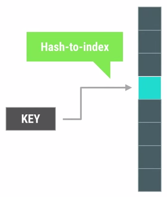
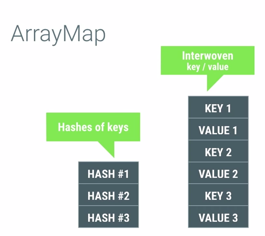
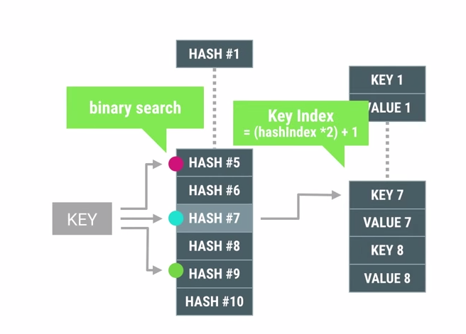
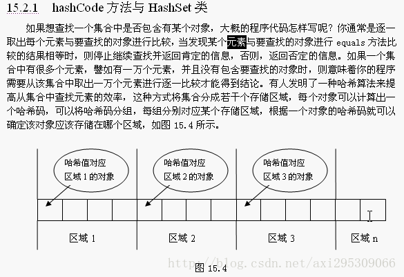
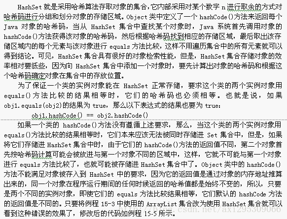
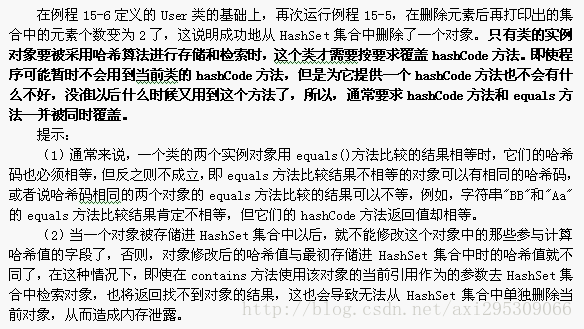
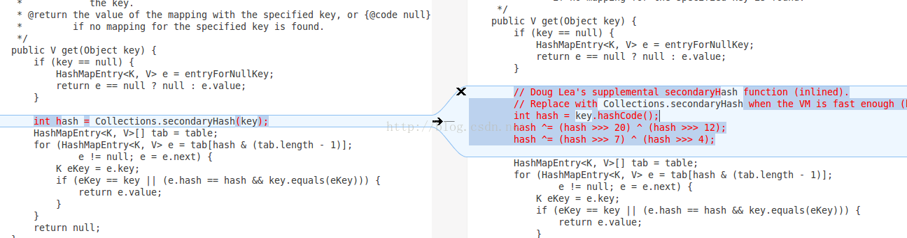

1. [HashMap源码理解](http://www.jianshu.com/p/3608749324bb)
2. [Java集合之HashMap](http://www.cnblogs.com/xiaoxi/p/5822209.html)
3. [HashMap原理及实现学习总结](http://blog.csdn.net/jianyuerensheng/article/details/51579091)
4. [ HashMap源码分析](http://blog.csdn.net/jianyuerensheng/article/details/51579923)
5. [HashMap原理及实现学习总结](http://www.bubuko.com/infodetail-1600586.html)

## 1. HashMap概述
HashMap是基于哈希表的Map接口的非同步实现。此实现提供所有可选的映射操作，并允许使用null值和null键。此类不保证映射的顺序，特别是它不保证该顺序恒久不变。

## 2. HashMap的数据结构
在java编程语言中，最基本的结构就是两种，一个是数组，另外一个是模拟指针（引用），所有的数据结构都可以用这两个基本结构来构造的，HashMap也不例外。HashMap实际上是一个“链表散列”的数据结构，即数组和链表的结合体。


从上图中可以看出，HashMap底层就是一个数组结构，数组中的每一项又是一个链表。当新建一个HashMap的时候，就会初始化一个数组

## 3. ArrayMap对比HashMap

在Java里面用Collection里面的HashMap作为容器我们使用的频率很高，而ArrayMap是Android api提供的一种用来提升特定场和内存使用率的特殊数据结构。今天我就写一篇博客记录一下

## 4. HashMap



Java库里的HashMap其实是一个连续的链表数组，通过让key计算hash值后插入对应的index里。当hash值发生碰撞时，可以采用线性探测，二次hash，或者后面直接变成链表的结构来避免碰撞。因为hash的值不是连续的，所以hashmap实际需要占用的大小会比它实际能装的item的容量要大。我们可以看一下HashMap的源码:

```java
 public HashMap(int initialCapacity, float loadFactor)   
 {   
     // 初始容量不能为负数  
     if (initialCapacity < 0)   
         throw new IllegalArgumentException("Illegal initial capacity: " + initialCapacity);   
     // 如果初始容量大于最大容量，让出示容量  
     if (initialCapacity > MAXIMUM_CAPACITY)   
         initialCapacity = MAXIMUM_CAPACITY;   
     // 负载因子必须大于 0 的数值  
     if (loadFactor <= 0 || Float.isNaN(loadFactor))   
         throw new IllegalArgumentException(   
         loadFactor);   
    //....
    // 设置容量极限等于容量 * 负载因子  
     threshold = (int)(capacity * loadFactor);   
     // 初始化 HashMap用于存储的数组  
     table = new Entry[capacity];    // ①  
     init();   
 }   
```

你会发现它又一个变量叫loadfactor，还有threshold。threshold就是临界值的意思，代表当前HashMap的储存机构能容纳的最大容量，它等于loadfactor * 容量。当HashMap记录存入的item size大于threshold后，HashMap就会进行扩容（resize）。当我们第一次新建一个HashMap对象的时候，默认的容量是16，若你只打算在HashMap里放入3个元素那将浪费至少13个空间。

## 6. ArrayMap

ArrayMap是怎么实现节省内存的呢？先放数据结构图：



他用两个数组来模拟Map，第一个数组存放存放item的hash值，第二数组是把key，value连续的存放在数组里，通过先算hash在第一个数组里找到它的hash index，根据这个index在去第二个数组里找到这个key-value。

在这里，在第一个数组里查找hash index的方法当然是用二分查找啦（binary search）。



这个数据结构的设计就做到了，有多个item我就分配多少内存，做到了memory的节约。并且因为数据结构是通过数组组织的，所以遍历的时候可以用index直接遍历也是很方便的有没有！但是缺点也很明显，查找达不到HashMap O(1)的查找时间。

当要存储的对象较少的时候（1000以下的时候）可以考虑用ArrayMap来减少内存的占用。

## 7. hashmap和hashtable的区别

> http://www.233.com/ncre2/JAVA/jichu/20100717/084230917.html

### 继承和实现区别

Hashtable是基于陈旧的Dictionary类，完成了Map接口；HashMap是Java 1.2引进的Map接口的一个实现（HashMap继承于AbstractMap,AbstractMap完成了Map接口）。

### 线程安全不同

HashTable的方法是同步的，HashMap是未同步，所以在多线程场合要手动同步HashMap。

### 对null的处理不同

HashTable不允许null值(key和value都不可以),HashMap允许null值(key和value都可以)。即 HashTable不允许null值其实在编译期不会有任何的不一样，会照样执行，只是在运行期的时候Hashtable中设置的话回出现空指针异常。 HashMap允许null值是指可以有一个或多个键所对应的值为null。当get()方法返回null值时，即可以表示 HashMap中没有该键，也可以表示该键所对应的值为null。因此，在HashMap中不能由get()方法来判断HashMap中是否存在某个键，而应该用containsKey()方法来判断。

### 方法不同

HashTable有一个contains(Object value)，功能和containsValue(Object value)功能一样。

5、HashTable使用Enumeration，HashMap使用Iterator。

6、HashTable中hash数组默认大小是11，增加的方式是 old*2+1。HashMap中hash数组的默认大小是16，而且一定是2的指数。

7、哈希值的使用不同，HashTable直接使用对象的hashCode，代码是这样的：

```java
int hash = key.hashCode();
int index = (hash & 0x7FFFFFFF) % tab.length;
```
而HashMap重新计算hash值，而且用与代替求模：

```java
int hash = hash(k);

int i = indexFor(hash, table.length);

static int hash(Object x) {

    int h = x.hashCode();
    h += ~(h << 9);
    h ^= (h >>> 14);
    h += (h << 4);
    h ^= (h >>> 10);
    return h;
}

static int indexFor(int h, int length) {
    return h & (length-1);
}
```

## Hashtable的实现原理

Hashtable类似HashMap，使用hash表来存储键值对。hash表定义:根据设定的hash函数和处理冲突的方式（开放定址、公共溢出区、链地址、重哈希...）将一组关键字映射到一个有限的连续的地址集上（即bucket数组或桶数组），并以关键字在地址集中的“像”作为记录在表中的存储位置，这种表称为hash表。

hash冲突发生时，通过“链表法”或叫"拉链法"来处理冲突，即通过一个链表存储键值对(Map.Entry)。每个Entry对象都有next指针用于指向下一个具有相同hashcode值的Entry。

## HashMap的实现原理

```java
public class HashMap<K, V> extends AbstractMap<K, V> implements Cloneable, Serializable {

    private static final int MINIMUM_CAPACITY = 4;//最小容量
    private static final int MAXIMUM_CAPACITY = 1 << 30;//最大容量
    static final float DEFAULT_LOAD_FACTOR = .75F;//装载因子
    transient int size;

    private static final Entry[] EMPTY_TABLE = new HashMapEntry[MINIMUM_CAPACITY >>> 1];
    transient HashMapEntry<K, V>[] table;
	
    static class HashMapEntry<K, V> implements Entry<K, V> {
        final K key;
        V value;
        final int hash;
        HashMapEntry<K, V> next;
    }
}
```

```java
class HashMapEntry{
    K key;
    V value;
    int hash;
    HashMapEntry<K, V> next;
}

```


## 二次哈希

```java
@Override public V put(K key, V value) {
   ...
   int hash = Collections.secondaryHash(key);
   HashMapEntry<K, V>[] tab = table;
   int index = hash & (tab.length - 1);
   ...
}

//Collections.secondaryHash

public static int secondaryHash(Object key) {
    return secondaryHash(key.hashCode());
}

private static int secondaryHash(int h) {
        // Spread bits to regularize both segment and index locations,
        // using variant of single-word Wang/Jenkins hash.
        h += (h <<  15) ^ 0xffffcd7d;
        h ^= (h >>> 10);
        h += (h <<   3);
        h ^= (h >>>  6);
        h += (h <<   2) + (h << 14);
        return h ^ (h >>> 16);
    }
```

table 是一个大小为 2 n 的一维数组，其中存放的是一个个的 HashMapEntry，而 HashMapEntry 是包含了 hash、key 与 value 值及一个指向 HashMapEntry 的 next 指针

key.hashCode()
哈希码就是将对象的信息经过一些转变形成一个独一无二的int值，这个值存储在一个array中

int hash = secondaryHash(key.hashCode())  二次 hash，减少碰撞
求出key的hash值，根据hash值得出在table中的索引，而后遍历对应的单链表，碰撞

int index = hash & (tab.length - 1)根据哈希值计算出对应的key在哈希数组中的索引，若在存放的过程中，index 值相同，则会链接当前 entry 的 next 指针上。

如果两个键的hashcode相同，你如何获取值对象？

当我们调用get()方法，HashMap会使用键对象的hashcode找到bucket位置，找到bucket位置之后，会调用keys.equals()方法去找到链表中正确的节点。

负载因子（百分比）：HashMap的大小 = 初始容量*负载因子，扩容集合，负载因子和初始容量会影响HashMap的性能，初始容量默认是16，负载因子默认是0.75

先通过key.hashCode()计算出key的哈希值，如果哈希值相等，则通过equals()方法比较内容是否相同

JDK8：位桶+链表/红黑树

concurrentHashMap：线程安全，分段锁
Collections.synchronizedMap()

底层数据结构使用的是哈希表（哈希数组），数组的每个元素都是一个单链表的头节点，链表是用来解决冲突的，如果不同的key映射到了数组的同一位置处，就将其放入单链表中

LinkedHashMap：双向链表，LruCache底层使用
LinkedHashMap(int initialCapacity, float loadFactor, boolean accessOrder)
参数1：初始容量，参数2：负载因子，参数3：是否开启按访问顺序排序

## LinkedHashMap

双向循环链表，LinkedHashMap可以用来实现LRU算法，accessOrder为true，表示按访问顺序排序 

当accessOrder为true时，才会开启按访问顺序排序的模式，才能用来实现LRU算法。我们可以看到，无论是put方法还是get方法，都会导致目标Entry成为最近访问的Entry，因此便把该Entry加入到了双向链表的末尾（get方法通过调用recordAccess方法来实现，put方法在覆盖已有key的情况下，也是通过调用recordAccess方法来实现，在插入新的Entry时，则是通过createEntry中的addBefore方法来实现），这样便把最近使用了的Entry放入到了双向链表的后面，多次操作后，双向链表前面的Entry便是最近没有使用的，这样当节点个数满的时候，删除的最前面的Entry(head后面的那个Entry)便是最近最少使用的Entry。

## HashSet的实现原理

HashSet是通过HashMap实现的，只是使用了HashMap的键，没有使用HashMap的值。

hashCode()，哈希值，HashSet的元素会根据哈希值存储，哈希值一样的元素会存储在同一个区域，也叫桶原理(bucket)，这也查找起来效率会高很多

但是在元素被添加进HashSet集合后，修改元素中参与计算哈希值的属性，再调用remove()方法时不起作用，会导致内存泄露

## HashMap与HashTable的主要区别

- HashTable线程更加安全，代价就是因为它粗暴的添加了同步锁，所以会有性能损失。其实有更好的concurrentHashMap可以替代HashTable
- HashTable：hash值对length取模，HashMap中则通过h&(length-1)的方法来代替取模
- Hashtable不允许key或者value使用null值，而HashMap可以。
- Hashtable扩容时，将容量变为原来的2倍加1，而HashMap扩容时，将容量变为原来的2倍。 
- Hashtable计算hash值，直接用key的hashCode()，而HashMap重新计算了key的hash值，Hashtable在求hash值对应的位置索引时，用取模运算，而HashMap在求位置索引时，则用与运算，且这里一般先用hash&0x7FFFFFFF后，再对length取模，&0x7FFFFFFF的目的是为了将负的hash值转化为正值，因为hash值有可能为负数，而&0x7FFFFFFF后，只有符号外改变，而后面的位都不变。

## ArrayList与HashSet的区别






##  Android 5.0之后对HashMap的修改

> 原文链接：http://blog.csdn.net/l2show/article/details/46970507

之前发现在Android 5.0的机子上放在HashMap里面的数据取出后跟Android 5.0之下的机子不一样,导致项目里面一个接口出了问题(接口做了缓存,request参数顺序变化的话就会导致一些数据拿不到),然后去查看了一下Android 5.0和Android 4.4 关于HashMap的源码,使用meld查看差异能够看到果然google对HashMap的实现做了修改.

下图左边为Android 5.0的源码,右边为Android 4.4的源码




从源码中可以看到,Android 5.0 在计算key的HashCode使用的是下面的算法.

```java
private static int secondaryHash(int h) {  
    // Spread bits to regularize both segment and index locations,  
    // using variant of single-word Wang/Jenkins hash.  
    h += (h <<  15) ^ 0xffffcd7d;  
    h ^= (h >>> 10);  
    h += (h <<   3);  
    h ^= (h >>>  6);  
    h += (h <<   2) + (h << 14);  
    return h ^ (h >>> 16);  
}  
```

而Android 4.4中计算Key的HashCode的算法明显跟Android 5.0中不同,所以这也导致了在get之后,在两个系统上同样的数据不同的顺序。如果对存储的数据有顺序需求的话改为使用红黑树构建的TreeMap就OK了.

```java
static int secondaryHash(Object key) {  
    int hash = key.hashCode();  
    hash ^= (hash >>> 20) ^ (hash >>> 12);  
    hash ^= (hash >>> 7) ^ (hash >>> 4);  
    return hash;  
}  
```