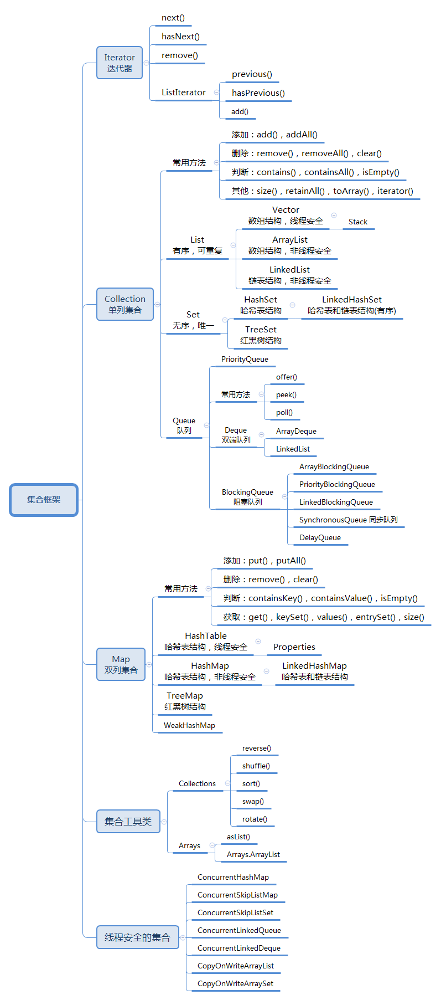

## 第6章 集合框架

* [Collection接口](Collection接口.md)
* [List接口](List接口.md)
* [Set接口](Set接口.md)
* [Queue接口](Queue接口.md)  
* [集合的遍历](集合的遍历.md)
* [集合工具类](集合工具类.md)
* [Map接口](Map接口.md)
* [Predicate和Stream操作集合](Predicate和Stream操作集合.md)
* [集合框架的综合应用](集合框架的综合应用.md)
* [Java集合类型详解](Java集合类型详解.md)
* [LinkedList源码剖析](LinkedList源码剖析.md)
* [LinkedHashMap源码剖析](LinkedHashMap源码剖析.md)
* [HashMap、哈希表、哈希函数](HashMap、哈希表、哈希函数.md)
* [HashMap的实现原理](HashMap的实现原理.md)
* [HashMap源码剖析](HashMap源码剖析.md)

