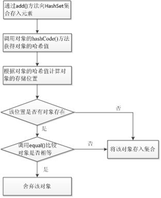

## 1. Set接口概述

一个不包含重复元素的 collection，无序。

哈希表确定元素是否相同

1、 判断的是两个元素的哈希值是否相同。
   如果相同，再判断两个对象的内容是否相同。

2、 判断哈希值相同，其实判断的是对象的HashCode方法。判断内容相同，用的是equals方法。

### 1.1 HashSet类概述

- 不保证 set 的迭代顺序，特别是它不保证该顺序恒久不变。
- HashSet如何保证元素唯一性
- 底层数据结构是哈希表(元素是链表的数组)
- 哈希表依赖于哈希值存储
- 添加功能底层依赖两个方法：int hashCode()、boolean equals(Object obj)

HashSet集合之所以能确保不出现重复的元素，是因为它在存入元素时做了很多工作。当调用HashSet集合的add()方法存入元素时，首先调用当前存入对象的hashCode()方法获得对象的哈希值，然后根据对象的哈希值计算出一个存储位置。如果该位置上没有元素，则直接将元素存入，如果该位置上有元素存在，则会调用equals()方法让当前存入的元素依次和该位置上的元素进行比较，如果返回的结果为false就将该元素存入集合，返回的结果为true则说明有重复元素，就将该元素舍弃。整个存储的流程如下图所示。



HashSet存储元素保证唯一性的代码及图解：


```java
package cn.itcast;

import java.util.HashSet;

class Dog {
	private String name;
	private int age;
	private String color;
	private char sex;

	public Dog() {
		super();
	}

	public Dog(String name, int age, String color, char sex) {
		super();
		this.name = name;
		this.age = age;
		this.color = color;
		this.sex = sex;
	}

	public String getName() {
		return name;
	}

	public void setName(String name) {
		this.name = name;
	}

	public int getAge() {
		return age;
	}

	public void setAge(int age) {
		this.age = age;
	}

	public String getColor() {
		return color;
	}

	public void setColor(String color) {
		this.color = color;
	}

	public char getSex() {
		return sex;
	}

	public void setSex(char sex) {
		this.sex = sex;
	}

	@Override
	public int hashCode() {
		final int prime = 31;
		int result = 1;
		result = prime * result + age;
		result = prime * result + ((color == null) ? 0 : color.hashCode());
		result = prime * result + ((name == null) ? 0 : name.hashCode());
		result = prime * result + sex;
		return result;
	}

	@Override
	public boolean equals(Object obj) {
		if (this == obj)
			return true;
		if (obj == null)
			return false;
		if (getClass() != obj.getClass())
			return false;
		Dog other = (Dog) obj;
		if (age != other.age)
			return false;
		if (color == null) {
			if (other.color != null)
				return false;
		} else if (!color.equals(other.color))
			return false;
		if (name == null) {
			if (other.name != null)
				return false;
		} else if (!name.equals(other.name))
			return false;
		if (sex != other.sex)
			return false;
		return true;
	}

}

/*
 * HashSet集合存储自定义对象并遍历。如果对象的成员变量值相同即为同一个对象
 * 
 * 注意了： 你使用的是HashSet集合，这个集合的底层是哈希表结构。 而哈希表结构底层依赖:hashCode()和equals()方法。
 * 如果你认为对象的成员变量值相同即为同一个对象的话，你就应该重写这两个方法。 如何重写呢?不同担心，自动生成即可。
 */
public class DogDemo {
	public static void main(String[] args) {
		// 创建集合对象
		HashSet<Dog> hs = new HashSet<Dog>();

		// 创建狗对象
		Dog d1 = new Dog("秦桧", 25, "红色", '男');
		Dog d2 = new Dog("高俅", 22, "黑色", '女');
		Dog d3 = new Dog("秦桧", 25, "红色", '男');
		Dog d4 = new Dog("秦桧", 20, "红色", '女');
		Dog d5 = new Dog("魏忠贤", 28, "白色", '男');
		Dog d6 = new Dog("李莲英", 23, "黄色", '女');
		Dog d7 = new Dog("李莲英", 23, "黄色", '女');
		Dog d8 = new Dog("李莲英", 23, "黄色", '男');

		// 添加元素
		hs.add(d1);
		hs.add(d2);
		hs.add(d3);
		hs.add(d4);
		hs.add(d5);
		hs.add(d6);
		hs.add(d7);
		hs.add(d8);

		// 遍历
		for (Dog d : hs) {
			System.out.println(d.getName() + "---" + d.getAge() + "---"
					+ d.getColor() + "---" + d.getSex());
		}
	}
}
```

运行结果：


### 1.2 LinkedHashSet类概述

元素有序唯一，由链表保证元素有序，由哈希表保证元素唯一。

### 1.3 TreeSet类概述

使用元素的自然顺序对元素进行排序，或者根据创建 set 时提供的 Comparator 进行排序，具体取决于使用的构造方法。

- TreeSet是如何保证元素的排序和唯一性
  底层数据结构是红黑树(红黑树是一种自平衡的二叉树)

- TreeSet判断元素唯一性的方式
  就是根据比较方法的返回结果是否是0，是0，就是相同元素，不存。

- TreeSet对元素进行排序的方式一
  让元素自身具备比较功能，元素就需要实现Comparable接口，覆盖compareTo方法。
  如果不要按照对象中具备的自然顺序进行排序。如果对象中不具备自然顺序。怎么办？

- 可以使用TreeSet集合第二种排序方式
  让集合自身具备比较功能，定义一个类实现Comparator接口，覆盖compare方法。将该类对象作为参数传递给TreeSet集合的构造函数。

TreeSet存储元素自然排序和唯一的图解：


```java
package cn.itcast;

import java.util.Comparator;
import java.util.TreeSet;

class Student {
	private String name;
	private int age;

	public Student() {
		super();
	}

	public Student(String name, int age) {
		super();
		this.name = name;
		this.age = age;
	}

	public String getName() {
		return name;
	}

	public void setName(String name) {
		this.name = name;
	}

	public int getAge() {
		return age;
	}

	public void setAge(int age) {
		this.age = age;
	}
}

class MyComparator implements Comparator<Student> {

	public int compare(Student s1, Student s2) {
		// int num = this.name.length() - s.name.length();
		// this -- s1
		// s -- s2
		// 姓名长度
		int num = s1.getName().length() - s2.getName().length();
		// 姓名内容
		int num2 = num == 0 ? s1.getName().compareTo(s2.getName()) : num;
		// 年龄
		int num3 = num2 == 0 ? s1.getAge() - s2.getAge() : num2;
		return num3;
	}

}

/*
 * 需求：请按照姓名的长度排序
 * 
 * TreeSet集合保证元素排序和唯一性的原理 唯一性：是根据比较的返回是否是0来决定。 排序： A:自然排序(元素具备比较性)
 * 让元素所属的类实现自然排序接口 Comparable B:比较器排序(集合具备比较性) 让集合的构造方法接收一个比较器接口的子类对象 Comparator
 */
public class TreeSetDemo {
	public static void main(String[] args) {
		// 创建集合对象
		// TreeSet<Student> ts = new TreeSet<Student>(); //自然排序
		// public TreeSet(Comparator comparator) //比较器排序
		// TreeSet<Student> ts = new TreeSet<Student>(new MyComparator());

		// 如果一个方法的参数是接口，那么真正要的是接口的实现类的对象
		// 而匿名内部类就可以实现这个东西
		TreeSet<Student> ts = new TreeSet<Student>(new Comparator<Student>() {
			public int compare(Student s1, Student s2) {
				// 姓名长度
				int num = s1.getName().length() - s2.getName().length();
				// 姓名内容
				int num2 = num == 0 ? s1.getName().compareTo(s2.getName())
						: num;
				// 年龄
				int num3 = num2 == 0 ? s1.getAge() - s2.getAge() : num2;
				return num3;
			}
		});

		// 创建元素
		Student s1 = new Student("linqingxia", 27);
		Student s2 = new Student("zhangguorong", 29);
		Student s3 = new Student("wanglihong", 23);
		Student s4 = new Student("linqingxia", 27);
		Student s5 = new Student("liushishi", 22);
		Student s6 = new Student("wuqilong", 40);
		Student s7 = new Student("fengqingy", 22);
		Student s8 = new Student("linqingxia", 29);

		// 添加元素
		ts.add(s1);
		ts.add(s2);
		ts.add(s3);
		ts.add(s4);
		ts.add(s5);
		ts.add(s6);
		ts.add(s7);
		ts.add(s8);

		// 遍历
		for (Student s : ts) {
			System.out.println(s.getName() + "---" + s.getAge());
		}
	}
}
```
运行结果：

