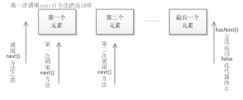

## 集合的遍历

在程序开发中，经常需要遍历集合中的所有元素。针对这种需求，JDK专门提供了一个接口Iterator。Iterator接口也是Java集合中的一员，但它与Collection、Map接口有所不同，Collection接口与Map接口主要用于存储元素，而Iterator主要用于迭代访问（即遍历）Collection中的元素，因此Iterator对象也被称为迭代器。

Iterator迭代器对象在遍历集合时，内部采用指针的方式来跟踪集合中的元素，为了让初学者能更好地理解迭代器的工作原理，接下来通过一个图例来演示Iterator对象迭代元素的过程，如下图所示。



图中，在调用Iterator的next()方法之前，迭代器的索引位于第一个元素之前，不指向任何元素，当第一次调用迭代器的next()方法后，迭代器的索引会向后移动一位，指向第一个元素并将该元素返回，当再次调用next()方法时，迭代器的索引会指向第二个元素并将该元素返回，依此类推，直到hasNext()方法返回false，表示到达了集合的末尾，终止对元素的遍历。

需要特别说明的是，当通过迭代器获取ArrayList集合中的元素时，都会将这些元素当做Object类型来看待，如果想得到特定类型的元素，则需要进行强制类型转换。

迭代：是取出集合中元素的一种方式。

而每一个容器的数据结构不同，所以取出的动作细节也不一样。但是都具有共性内容： 判断和取出。那么就可以将这些共性抽取。那么这些内部类都符合一个规则（或者说都抽取出来一个规则）。该规则就是Iterator。通过一个对外提供的方法：iterator();，来获取集合的取出对象。因为Collection中有iterator方法，所以每一个子类集合对象都具备迭代器。

迭代的常见操作


PS：在迭代时循环中next调用一次，就要hasNext判断一次。

并发修改异常，原因：迭代器依赖于集合存在，修改集合元素而迭代器却不知道。

解决方法：

A：迭代器迭代元素，迭代器修改。因为Iterator没有添加功能，所以使用其子接口ListIterator，元素在迭代元素的后面添加。
B：集合遍历元素，集合修改元素（普通for和get（index）结合），元素在最后添加

```java
package cn.itcast;

import java.util.ArrayList;
import java.util.Iterator;
import java.util.List;
import java.util.ListIterator;

/*
 * 问题:有一个集合，如下，请问，我想判断里面有没有"world"这个元素，如果有，我就添加一个"javaee"元素，请写代码实现。
 * 
 * ConcurrentModificationException:当方法检测到对象的并发修改，但不允许这种修改时，抛出此异常。 
 * 产生的原因：
 * 迭代器是依赖于集合而存在的，在判断成功后，集合的中新添加了元素，而迭代器却不知道，所以就报错了，这个错叫并发修改异常。
 * 其实这个问题描述的是：迭代器遍历元素的时候，通过集合是不能修改元素的。
 * 如何解决呢?
 * A:迭代器迭代元素，迭代器修改元素,元素是跟在刚才迭代的元素后面的。
 * B:集合遍历元素，集合修改元素(普通for),元素在最后添加的。
 */
public class ListIteratorDemo {
	public static void main(String[] args) {
		// 创建List集合对象
		List list = new ArrayList();
		// 添加元素
		list.add("hello");
		list.add("world");
		list.add("java");

		// 迭代器遍历
		// Iterator it = list.iterator();
		// while (it.hasNext()) {
		// String s = (String) it.next();
		// if ("world".equals(s)) {
		// list.add("javaee");
		// }
		// }

		// 方式1：迭代器迭代元素，迭代器修改元素
		// 而Iterator迭代器却没有添加功能，所以我们使用其子接口ListIterator
		ListIterator lit = list.listIterator();
		while (lit.hasNext()) {
			String s = (String) lit.next();
			if ("world".equals(s)) {
				lit.add("javaee");
			}
		}

		// 方式2：集合遍历元素，集合修改元素(普通for)
		for (int x = 0; x < list.size(); x++) {
			String s = (String) list.get(x);
			if ("world".equals(s)) {
				list.add("javaee");
			}
		}

		System.out.println("list:" + list);
	}
}
```