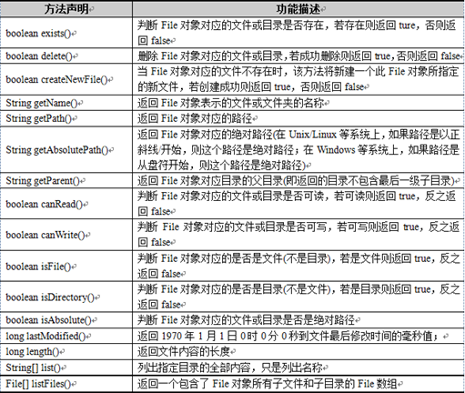

## 1. File类概述

File类用于封装一个路径，这个路径可以是从系统盘符开始的绝对路径，如：“D:\file\a.txt”，也可以是相对于当前目录而言的相对路径，如：“src\Hello.java”。File类内部封装的路径可以指向一个文件，也可以指向一个目录，在File类中提供了针对这些文件或目录的一些常规操作。

文件和目录路径名的抽象表示形式，表示一个文件或文件夹，并提供了一系列操作文件或文件夹的方法

File类中提供了一系列方法，用于操作其内部封装的路径指向的文件或者目录，例如判断文件/目录是否存在、创建、删除文件/目录等。



## 2. 构造方法

| 方法                               | 功能描述                 |
| :------------------------------- | :------------------- |
| File(String pathname)            | 根据路径得到File对象         |
| File(String parent,String child) | 根据目录和子文件/目录得到对象      |
| File(File parent,String child)   | 根据父File对象和子文件/目录得到对象 |

示例代码

```java
package cn.itcast_01;
import java.io.File;
/*
 * 我们要想实现IO的操作，就必须知道硬盘上文件的表现形式。
 * 而Java就提供了一个类File供我们使用。
 * 
 * File:文件和目录(文件夹)路径名的抽象表示形式
 * 构造方法：
 * 		File(String pathname)：根据一个路径得到File对象
 * 		File(String parent, String child):根据一个目录和一个子文件/目录得到File对象
 * 		File(File parent, String child):根据一个父File对象和一个子文件/目录得到File对象
 */
public class FileDemo {
	public static void main(String[] args) {
		// File(String pathname)：根据一个路径得到File对象
		// 把e:\\demo\\a.txt封装成一个File对象
		File file = new File("E:\\demo\\a.txt");

		// File(String parent, String child):根据一个目录和一个子文件/目录得到File对象
		File file2 = new File("E:\\demo", "a.txt");

		// File(File parent, String child):根据一个父File对象和一个子文件/目录得到File对象
		File file3 = new File("e:\\demo");
		File file4 = new File(file3, "a.txt");

		// 以上三种方式其实效果一样
	}
}
```

## 3. 创建功能

| 返回值     | 方法               | 功能描述                     |
| :------ | :--------------- | :----------------------- |
| boolean | createNewFile()  | 创建文件                     |
| File    | createTempFile() | 创建一个用于缓存的临时文件            |
| boolean | mkdir()          | 创建文件夹                    |
| boolean | mkdirs()         | 创建多级文件夹，如果父级文件夹不存在，会自动创建 |

代码示例

```java
package cn.itcast_02;
import java.io.File;
import java.io.IOException;
/*
 *创建功能：
 *public boolean createNewFile():创建文件 如果存在这样的文件，就不创建了
 *public boolean mkdir():创建文件夹 如果存在这样的文件夹，就不创建了
 *public boolean mkdirs():创建文件夹,如果父文件夹不存在，会帮你创建出来
 */
public class FileDemo {
	public static void main(String[] args) throws IOException {
		// 需求：我要在e盘目录下创建一个文件夹demo
		File file = new File("e:\\demo");
		System.out.println("mkdir:" + file.mkdir());

		// 需求:我要在e盘目录demo下创建一个文件a.txt
		File file2 = new File("e:\\demo\\a.txt");
		System.out.println("createNewFile:" + file2.createNewFile());

		// 需求：我要在e盘目录test下创建一个文件b.txt
		// Exception in thread "main" java.io.IOException: 系统找不到指定的路径。
		// 注意：要想在某个目录下创建内容，该目录首先必须存在。
		// File file3 = new File("e:\\test\\b.txt");
		// System.out.println("createNewFile:" + file3.createNewFile());

		// 需求:我要在e盘目录test下创建aaa目录
		// File file4 = new File("e:\\test\\aaa");
		// System.out.println("mkdir:" + file4.mkdir());

		// File file5 = new File("e:\\test");
		// File file6 = new File("e:\\test\\aaa");
		// System.out.println("mkdir:" + file5.mkdir());
		// System.out.println("mkdir:" + file6.mkdir());

		// 其实我们有更简单的方法
		File file7 = new File("e:\\aaa\\bbb\\ccc\\ddd");
		System.out.println("mkdirs:" + file7.mkdirs());

		// 看下面的这个东西：
		File file8 = new File("e:\\liuyi\\a.txt");
		System.out.println("mkdirs:" + file8.mkdirs());
	}
}
```
## 4. 删除功能

| 返回值     | 方法             | 功能描述                   |
| :------ | :------------- | :--------------------- |
| boolean | delete()       | 删除文件或文件夹               |
| void    | deleteOnExit() | JVM退出时删除File对象对应的文件和目录 |

代码示例

```java
package cn.itcast_03;
import java.io.File;
import java.io.IOException;
/*
 * 删除功能:public boolean delete()
 * 
 * 注意：
 * 		A:如果你创建文件或者文件夹忘了写盘符路径，那么，默认在项目路径下。
 * 		B:Java中的删除不走回收站。
 * 		C:要删除一个文件夹，请注意该文件夹内不能包含文件或者文件夹
 */
public class FileDemo {
	public static void main(String[] args) throws IOException {
		// 创建文件
		// File file = new File("e:\\a.txt");
		// System.out.println("createNewFile:" + file.createNewFile());

		// 我不小心写成这个样子了
		File file = new File("a.txt");
		System.out.println("createNewFile:" + file.createNewFile());

		// 继续玩几个
		File file2 = new File("aaa\\bbb\\ccc");
		System.out.println("mkdirs:" + file2.mkdirs());

		// 删除功能：我要删除a.txt这个文件
		File file3 = new File("a.txt");
		System.out.println("delete:" + file3.delete());

		// 删除功能：我要删除ccc这个文件夹
		File file4 = new File("aaa\\bbb\\ccc");
		System.out.println("delete:" + file4.delete());

		// 删除功能：我要删除aaa文件夹
		// File file5 = new File("aaa");
		// System.out.println("delete:" + file5.delete());

		File file6 = new File("aaa\\bbb");
		File file7 = new File("aaa");
		System.out.println("delete:" + file6.delete());
		System.out.println("delete:" + file7.delete());
	}
}
```

## 5. 重命名功能

| 方法                   | 功能描述                  |
| :------------------- | :-------------------- |
| renamneTo(File dest) | 路径名相同就是重命名，不一样就是改名加剪切 |

代码示例

```java
package cn.itcast_04;
import java.io.File;
/*
 * 重命名功能:public boolean renameTo(File dest)
 * 		如果路径名相同，就是改名。
 * 		如果路径名不同，就是改名并剪切。
 * 
 * 路径以盘符开始：绝对路径	c:\\a.txt
 * 路径不以盘符开始：相对路径	a.txt
 */
public class FileDemo {
	public static void main(String[] args) {
		// 创建一个文件对象
		// File file = new File("林青霞.jpg");
		// // 需求：我要修改这个文件的名称为"东方不败.jpg"
		// File newFile = new File("东方不败.jpg");
		// System.out.println("renameTo:" + file.renameTo(newFile));

		File file2 = new File("东方不败.jpg");
		File newFile2 = new File("e:\\林青霞.jpg");
		System.out.println("renameTo:" + file2.renameTo(newFile2));
	}
}
```
## 6. 判断功能

| 方法            | 功能描述    |
| :------------ | :------ |
| isDirectory() | 判断是否是目录 |
| isFile()      | 判断是否是文件 |
| exists()      | 判断是否是存在 |
| canRead()     | 判断是否是可读 |
| canWrite()    | 判断是否是可写 |
| isHidden()    | 判断是否是隐藏 |
| isAbsolute()  | 是否是绝对路径 |

示例代码

```java
import java.io.File;  
  
/* 
 * 判断功能: 
 * public boolean isDirectory():判断是否是目录 
 * public boolean isFile():判断是否是文件 
 * public boolean exists():判断是否存在 
 * public boolean canRead():判断是否可读 
 * public boolean canWrite():判断是否可写 
 * public boolean isHidden():判断是否隐藏 
 */  
public class FileDemo {  
    public static void main(String[] args) {  
        // 创建文件对象  
        File file = new File("a.txt");  
  
        System.out.println("isDirectory:" + file.isDirectory());// false  
        System.out.println("isFile:" + file.isFile());// true  
        System.out.println("exists:" + file.exists());// true  
        System.out.println("canRead:" + file.canRead());// true  
        System.out.println("canWrite:" + file.canWrite());// true  
        System.out.println("isHidden:" + file.isHidden());// false  
    }  
}
```
## 7. 获取功能

| 返回值      | 方法                | 功能描述                    |
| :------- | :---------------- | :---------------------- |
| String   | getAbsolutePath() | 获取绝对路径                  |
| String   | getPath()         | 获取相对路径                  |
| String   | getParent()       | 获取父目录                   |
| String   | getName()         | 获取名称                    |
| long     | getFreeSpace()    | 获取剩余可用空间                |
| long     | getTotalSpace()   | 获取总大小                   |
| long     | length()          | 获取长度，字节数                |
| long     | lastModified()    | 获取最后一次修改时间，毫秒值          |
| String[] | list()            | 获取指定目录下的所有文件或文件夹的名称数组   |
| File[]   | listFiles()       | 获取指定目录下的所有文件或文件夹的File数组 |

代码示例

```java
package cn.itcast_06;
import java.io.File;
import java.text.SimpleDateFormat;
import java.util.Date;
/*
 * 获取功能：
 * public String getAbsolutePath()：获取绝对路径
 * public String getPath():获取相对路径
 * public String getName():获取名称
 * public long length():获取长度。字节数
 * public long lastModified():获取最后一次的修改时间，毫秒值
 */
public class FileDemo {
	public static void main(String[] args) {
		// 创建文件对象
		File file = new File("demo\\test.txt");

		System.out.println("getAbsolutePath:" + file.getAbsolutePath());
		System.out.println("getPath:" + file.getPath());
		System.out.println("getName:" + file.getName());
		System.out.println("length:" + file.length());
		System.out.println("lastModified:" + file.lastModified());

		// 1416471971031
		Date d = new Date(1416471971031L);
		SimpleDateFormat sdf = new SimpleDateFormat("yyyy-MM-dd HH:mm:ss");
		String s = sdf.format(d);
		System.out.println(s);
	}
}
```
运行结果：

```
getAbsolutePath:D:\workspace\Test\demo\test.txt
getPath:demo\test.txt
getName:test.txt
length:0
lastModified:0
2014-11-20 16:26:11
```

判断缓存文件是否过期

```java
File file = ...;
long time = System.currentTimeMillis() - file.lastModified();
if (time < cachetime){
    // 缓存时间小于指定的时间，缓存有效，否则缓存过期
}else {
    
}
```

## 8. 高级获取功能

| 返回值      | 方法                               | 功能描述         |
| :------- | :------------------------------- | :----------- |
| String[] | list(FilenameFilter filter)      | 返回满足条件的文件名数组 |
| File[]   | listFiles(FilenameFilter filter) | 返回满足条件的文件数组  |
| File[]   | listRoots()                      | 列出系统所有的根路径   |

```java
package cn.itcast_07;
import java.io.File;
/*
 * 高级获取功能：
 * public String[] list():获取指定目录下的所有文件或者文件夹的名称数组
 * public File[] listFiles():获取指定目录下的所有文件或者文件夹的File数组
 */
public class FileDemo {
	public static void main(String[] args) {
		// 指定一个目录
		File file = new File("e:\\");

		// public String[] list():获取指定目录下的所有文件或者文件夹的名称数组
		String[] strArray = file.list();
		for (String s : strArray) {
			System.out.println(s);
		}
		System.out.println("------------");

		// public File[] listFiles():获取指定目录下的所有文件或者文件夹的File数组
		File[] fileArray = file.listFiles();
		for (File f : fileArray) {
			System.out.println(f.getName());
		}
	}
}
```
运行结果：


## 9. 文件过滤器

- list(FilenameFilter filter)
- listFiles(FilenameFilter filter)

FilenameFilter 接口

- accept(File dir, String name)

## 10. File练习

文件名称过滤器的实现思想及代码

- public String[] list(FilenameFilter filter)
- public File[] listFiles(FilenameFilter filter)

### 10.1 文件名称过滤器的实现

```java
package cn.itcast_08;
import java.io.File;
import java.io.FilenameFilter;
/*
 * 判断E盘目录下是否有后缀名为.jpg的文件，如果有，就输出此文件名称
 * A:先获取所有的，然后遍历的时候，依次判断，如果满足条件就输出。
 * B:获取的时候就已经是满足条件的了，然后输出即可。
 * 
 * 要想实现这个效果，就必须学习一个接口：文件名称过滤器
 * public String[] list(FilenameFilter filter)
 * public File[] listFiles(FilenameFilter filter)
 */
public class FileDemo2 {
	public static void main(String[] args) {
		// 封装e判断目录
		File file = new File("e:\\");

		// 获取该目录下所有文件或者文件夹的String数组
		// public String[] list(FilenameFilter filter)
		String[] strArray = file.list(new FilenameFilter() {
			@Override
			public boolean accept(File dir, String name) {
				// return false;
				// return true;
				// 通过这个测试，我们就知道了，到底把这个文件或者文件夹的名称加不加到数组中，取决于这里的返回值是true还是false
				// 所以，这个的true或者false应该是我们通过某种判断得到的
				// System.out.println(dir + "---" + name);
				// File file = new File(dir, name);
				// // System.out.println(file);
				// boolean flag = file.isFile();
				// boolean flag2 = name.endsWith(".jpg");
				// return flag && flag2;
				return new File(dir, name).isFile() && name.endsWith(".jpg");
			}
		});

		// 遍历
		for (String s : strArray) {
			System.out.println(s);
		}
	}
}
```
### 10.2 递归遍历目录下指定后缀名结尾的文件名称

```java
package cn.itcast_03;
import java.io.File;
/*
 * 需求：把E:\JavaSE目录下所有的java结尾的文件的绝对路径给输出在控制台。
 * 
 * 分析：
 * 		A:封装目录
 * 		B:获取该目录下所有的文件或者文件夹的File数组
 * 		C:遍历该File数组，得到每一个File对象
 * 		D:判断该File对象是否是文件夹
 * 			是：回到B
 * 			否：继续判断是否以.java结尾
 * 				是：就输出该文件的绝对路径
 * 				否：不搭理它
 */
public class FilePathDemo {
	public static void main(String[] args) {
		// 封装目录
		File srcFolder = new File("E:\\JavaSE");

		// 递归功能实现
		getAllJavaFilePaths(srcFolder);
	}

	private static void getAllJavaFilePaths(File srcFolder) {
		// 获取该目录下所有的文件或者文件夹的File数组
		File[] fileArray = srcFolder.listFiles();

		// 遍历该File数组，得到每一个File对象
		for (File file : fileArray) {
			// 判断该File对象是否是文件夹
			if (file.isDirectory()) {
				getAllJavaFilePaths(file);
			} else {
				// 继续判断是否以.java结尾
				if (file.getName().endsWith(".java")) {
					// 就输出该文件的绝对路径
					System.out.println(file.getAbsolutePath());
				}
			}
		}
	}
}
```
运行结果：


### 10.3 递归删除带内容的目录

```java
package cn.itcast_03;
import java.io.File;
/*
 * 需求：递归删除带内容的目录
 * 
 * 分析：
 * 		A:封装目录
 * 		B:获取该目录下的所有文件或者文件夹的File数组
 * 		C:遍历该File数组，得到每一个File对象
 * 		D:判断该File对象是否是文件夹
 * 			是：回到B
 * 			否：就删除
 */
public class FileDeleteDemo {
	public static void main(String[] args) {
		// 封装目录
		File srcFolder = new File("demo");
		// 递归实现
		deleteFolder(srcFolder);
	}

	private static void deleteFolder(File srcFolder) {
		// 获取该目录下的所有文件或者文件夹的File数组
		File[] fileArray = srcFolder.listFiles();

		if (fileArray != null) {
			// 遍历该File数组，得到每一个File对象
			for (File file : fileArray) {
				// 判断该File对象是否是文件夹
				if (file.isDirectory()) {
					deleteFolder(file);
				} else {
					System.out.println(file.getName() + "---" + file.delete());
				}
			}

			System.out.println(srcFolder.getName() + "---" + srcFolder.delete());
		}
	}
}
```

运行结果：


### 10.4 模拟文件管理器

DocumentManager

```java
package cn.itcast.chapter07.task03;

import java.io.File;
import java.util.ArrayList;
import java.util.Scanner;

public class DocumentManager {
	public static void main(String[] args) throws Exception {
		Scanner sc = new Scanner(System.in);
		System.out.println("--1:指定关键字检索文件  2:指定后缀名检索文件  " + "3:复制文件/目录  4:退出--");
		while (true) {
			System.out.print("请输入指令：");
			int command = sc.nextInt();
			switch (command) {
			case 1:
				searchByKeyWorld();// 指定关键字检索文件
				break;
			case 2:
				searchBySuffix();// 指定后缀名检索文件
				break;
			case 3:
				copyDirectory();// 复制文件/目录
				break;
			case 4:
				exit();// 退出
				break;
			default:
				System.out.println("您输入的指令错误！");
				break;
			}
		}
	}

	// *********1.指定关键字检索文件*********
	private static void searchByKeyWorld() {
		Scanner sc = new Scanner(System.in);
		System.out.print("请输入要检索的目录位置：");
		String path = sc.next();// 从控制台获取路径
		File file = new File(path);
		if (!file.exists() || !file.isDirectory()) {// 判断目录是否存在，是否是目录
			System.out.println(path + " (不是有效目录)");
			return;
		}
		System.out.print("请输入搜索关键字：");
		String key = sc.next();// 获取关键字
		// 在输入目录下获取所有包含关键字的文件路径
		ArrayList<String> list = FileUtils.listFiles(file, key);
		for (Object obj : list) {
			System.out.println(obj);// 将路径打印到控制台
		}
	}

	// *********2.指定后缀名检索文件********//
	private static void searchBySuffix() {
		Scanner sc = new Scanner(System.in);
		System.out.print("请输入要检索的目录位置：");
		String path = sc.next();// 从控制台获取路径
		File file = new File(path);
		if (!file.exists() || !file.isDirectory()) {// 判断目录是否存在，是否是目录
			System.out.println(path + " (不是有效目录)");
			return;
		}
		System.out.print("请输入搜索后缀：");
		String suffix = sc.next();
		String[] suffixArray = suffix.split(",");// 获取后缀字符串
		// 在输入目录下获取所有指定后缀名的文件路径
		ArrayList<String> list = FileUtils.listFiles(file, suffixArray);
		for (Object obj : list) {
			System.out.println(obj);// 将路径打印到控制台
		}
	}

	// *********3.复制文件/目录**********//
	private static void copyDirectory() throws Exception {
		Scanner sc = new Scanner(System.in);
		System.out.print("请输入源目录：");
		String srcDirectory = sc.next();// 从控制台获取源路径
		File srcFile = new File(srcDirectory);
		if (!srcFile.exists() || !srcFile.isDirectory()) {// 判断目录是否存在，是否是目录
			System.out.println("无效目录！");
			return;
		}
		System.out.print("请输入目标位置：");
		String destDirectory = sc.next();// 从控制台获取目标路径
		File destFile = new File(destDirectory);
		if (!destFile.exists() || !destFile.isDirectory()) {// 判断目录是否存在，是否是目录
			System.out.println("无效位置！");
			return;
		}
		// 将源路径中的内容复制到目标路径下
		FileUtils.copySrcPathToDestPath(srcFile, destFile);
	}

	// *********4.退出**********//
	private static void exit() {
		System.out.println("您已退出系统，谢谢使用！");
		System.exit(0);
	}
}
```

FileUtils

```java
package cn.itcast.chapter07.task03;

import java.io.File;
import java.io.FileInputStream;
import java.io.FileOutputStream;
import java.io.FilenameFilter;
import java.util.ArrayList;

public class FileUtils {
	/**
	 * 指定关键字检索文件
	 * @param file   File对象
	 * @param key    关键字
	 * @return 包含关键字的文件路径
	 */
	public static ArrayList<String> listFiles(File file, final String key) {
		FilenameFilter filter = new FilenameFilter() { // 创建过滤器对象
			public boolean accept(File dir, String name) {// 实现accept()方法
				File currFile = new File(dir, name);
				// 如果文件名包含关键字返回true，否则返回false
				if (currFile.isFile() && name.contains(key)) {
					return true;
				}
				return false;
			}
		};
		// 递归方式获取规定的路径
		ArrayList<String> arraylist = fileDir(file, filter);
		return arraylist;
	}

	/**
	 * 指定后缀名检索文件
	 * @param file   File对象
	 * @param suffixArray   后缀名数组
	 * @return 指定后缀名的文件路径
	 */
	public static ArrayList<String> listFiles(File file,
			final String[] suffixArray) {
		FilenameFilter filter = new FilenameFilter() { // 创建过滤器对象
			public boolean accept(File dir, String name) {// 实现accept()方法
				File currFile = new File(dir, name);
				if (currFile.isFile()) {// 如果文件名以指定后缀名结尾返回true，否则返回false
					for (String suffix : suffixArray) {
						if (name.endsWith("." + suffix)) {
							return true;
						}
					}
				}
				return false;
			}
		};
		// 递归方式获取规定的路径
		ArrayList<String> arraylist = fileDir(file, filter);
		return arraylist;
	}

	/**
	 * 递归方式获取规定的路径
	 * @param dir   File对象
	 * @param filter   过滤器
	 * @return 过滤器过滤后的文件路径
	 */
	public static ArrayList<String> fileDir(File dir, FilenameFilter filter) {
		ArrayList<String> arraylist = new ArrayList<String>();
		File[] lists = dir.listFiles(filter); // 获得过滤后的所有文件数组
		for (File list : lists) {
			// 将文件的绝对路径放到集合中
			arraylist.add(list.getAbsolutePath());
		}
		File[] files = dir.listFiles(); // 获得当前目录下所有文件的数组
		for (File file : files) { // 遍历所有的子目录和文件
			if (file.isDirectory()) {
				// 如果是目录，递归调用fileDir()
				ArrayList<String> every = fileDir(file, filter);
				arraylist.addAll(every);// 将文件夹下的文件路径添加到集合中
			}
		}// 此时的集合中有当前目录下的文件路径，和当前目录的子目录下的文件路径
		return arraylist;
	}

	/**
	 * 复制文件/目录
	 * @param srcFile   源目录
	 * @param destFile  目标目录
	 */
	public static void copySrcPathToDestPath(File srcDir, File destDir)
			throws Exception {
		File[] files = srcDir.listFiles();// 子文件目录
		for (int i = 0; i < files.length; i++) {
			File copiedFile = new File(destDir, files[i].getName());// 创建指定目录的文件
			if (files[i].isDirectory()) {// 如果是目录
				if (!copiedFile.mkdirs()) {// 创建文件夹
					System.out.println("无法创建：" + copiedFile);
					return;
				}
				// 调用递归，获取子文件夹下的文件路径
				copySrcPathToDestPath(files[i], copiedFile);
			} else {// 复制文件
				FileInputStream input = new FileInputStream(files[i]);// 获取输入流
				FileOutputStream output = new FileOutputStream(copiedFile);// 获取输出流
				byte[] buffer = new byte[1024];// 创建缓冲区
				int n = 0;
				// 循环读取字节
				while ((n = input.read(buffer)) != -1) {
					output.write(buffer, 0, n);
				}
				input.close();// 关闭输入流
				output.close();// 关闭输出流
			}
		}
	}
}
```