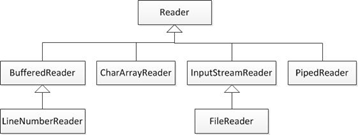
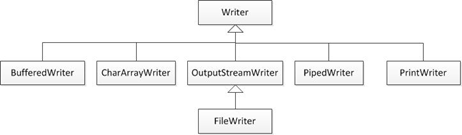

# 1. 字符流

InputStream类和OutputStream类在读写文件时操作的都是字节，如果希望在程序中操作字符，使用这两个类就不太方便，为此JDK提供了字符流。同字节流一样，字符流也有两个抽象的顶级父类，分别是Reader和Writer。其中Reader是字符输入流，用于从某个源设备读取字符，Writer是字符输出流，用于向某个目标设备写入字符。Reader和Writer作为字符流的顶级父类，也有许多子类，接下来通过继承关系图来列出Reader和Writer的一些常用子类，如图所示。





## 1.1 转换流出现的原因及思想
由于字节流操作中文不是特别方便，所以，java就提供了转换流。字符流=字节流+编码表。

编码表：由字符及其对应的数值组成的一张表

常见编码表

计算机只能识别二进制数据，早期由来是电信号。为了方便应用计算机，让它可以识别各个国家的文字。就将各个国家的文字用数字来表示，并一一对应，形成一张表。


字符串中的编码问题

编码：把看得懂的变成看不懂的
解码：把看不懂的变成看得懂

```java
package cn.itcast_01;
import java.io.UnsupportedEncodingException;
import java.util.Arrays;
/*
 * String(byte[] bytes, String charsetName):通过指定的字符集解码字节数组
 * byte[] getBytes(String charsetName):使用指定的字符集合把字符串编码为字节数组
 * 
 * 编码:把看得懂的变成看不懂的
 * String -- byte[]
 * 
 * 解码:把看不懂的变成看得懂的
 * byte[] -- String
 * 
 * 举例：谍战片(发电报，接电报)
 * 
 * 码表：小本子
 * 		字符	数值
 * 
 * 要发送一段文字：
 * 		今天晚上在老地方见
 * 
 * 		发送端：今 -- 数值 -- 二进制 -- 发出去
 * 		接收端：接收 -- 二进制 -- 十进制 -- 数值 -- 字符 -- 今
 * 
 * 		今天晚上在老地方见
 * 
 * 编码问题简单，只要编码解码的格式是一致的。
 */
public class StringDemo {
	public static void main(String[] args) throws UnsupportedEncodingException {
		String s = "你好";

		// String -- byte[]
		byte[] bys = s.getBytes(); // [-60, -29, -70, -61]
		// byte[] bys = s.getBytes("GBK");// [-60, -29, -70, -61]
		// byte[] bys = s.getBytes("UTF-8");// [-28, -67, -96, -27, -91, -67]
		System.out.println(Arrays.toString(bys));

		// byte[] -- String
		String ss = new String(bys); // 你好
		// String ss = new String(bys, "GBK"); // 你好
		// String ss = new String(bys, "UTF-8"); // ???
		System.out.println(ss);
	}
}
```
## 1.2 转换流概述

IO流可分为字节流和字符流，有时字节流和字符流之间也需要进行转换。在JDK中提供了两个类可以将字节流转换为字符流，它们分别是InputStreamReader和OutputStreamWriter。

OutputStreamWriter是Writer的子类，它可以将一个字节输出流转换成字符输出流，方便直接写入字符，而InputStreamReader是Reader的子类，它可以将一个字节输入流转换成字符输入流，方便直接读取字符。通过转换流进行数据读写的过程如图所示。


OutputStreamWriter 字符输出流


InputStreamReader 字符输入流


OutputStreamWriter写数据

| 方法                                 | 功能描述         |
| ---------------------------------- | ------------ |
| write(int c)                       | 写入一个字符       |
| write(char[] cbuf)                 | 写入一个字符数组     |
| write(char[] cbuf,int off,int len) | 写入一个字符数组的一部分 |
| write(String str)                  | 写入一个字符串      |
| write(String str,int off,int len)  | 写入一个字符串的一部分  |

字符流操作要注意的问题：

字符流数据没有直接进文件而是到缓冲区，所以要刷新缓冲区。

flush()和close()的区别：

- A：close()关闭流对象，但是先刷新一次缓冲区。关闭之后，流对象不可以继续再使用了。
- B：flush()仅仅刷新缓冲区,刷新之后，流对象还可以继续使用。

```java
package cn.itcast_03;
import java.io.FileOutputStream;
import java.io.IOException;
import java.io.OutputStreamWriter;
/*
 * OutputStreamWriter的方法：
 * public void write(int c):写一个字符
 * public void write(char[] cbuf):写一个字符数组
 * public void write(char[] cbuf,int off,int len):写一个字符数组的一部分
 * public void write(String str):写一个字符串
 * public void write(String str,int off,int len):写一个字符串的一部分
 */
public class OutputStreamWriterDemo {
	public static void main(String[] args) throws IOException {
		// 创建对象
		OutputStreamWriter osw = new OutputStreamWriter(new FileOutputStream(
				"osw2.txt"));

		// 写数据
		// public void write(int c):写一个字符
		// osw.write('a');
		// osw.write(97);
		// 为什么数据没有进去呢?
		// 原因是：字符 = 2字节
		// 文件中数据存储的基本单位是字节。
		// void flush()

		// public void write(char[] cbuf):写一个字符数组
		// char[] chs = {'a','b','c','d','e'};
		// osw.write(chs);

		// public void write(char[] cbuf,int off,int len):写一个字符数组的一部分
		// osw.write(chs,1,3);

		// public void write(String str):写一个字符串
		// osw.write("我爱林青霞");

		// public void write(String str,int off,int len):写一个字符串的一部分
		osw.write("我爱林青霞", 2, 3);

		// 刷新缓冲区
		osw.flush();
		// osw.write("我爱林青霞", 2, 3);

		// 释放资源
		osw.close();
		// java.io.IOException: Stream closed
		// osw.write("我爱林青霞", 2, 3);
	}
}
```
## 1.3 InputStreamReader读数据
- public int read()：一次读一个字符 
- public int read(char[] cbuf)：一次读一个字符数组

```java
package cn.itcast_03;
import java.io.FileInputStream;
import java.io.IOException;
import java.io.InputStreamReader;
/*
 * InputStreamReader的方法：
 * int read():一次读取一个字符
 * int read(char[] chs):一次读取一个字符数组
 */
public class InputStreamReaderDemo {
	public static void main(String[] args) throws IOException {
		// 创建对象
		InputStreamReader isr = new InputStreamReader(new FileInputStream(
				"StringDemo.java"));

		// 一次读取一个字符
		// int ch = 0;
		// while ((ch = isr.read()) != -1) {
		// System.out.print((char) ch);
		// }

		// 一次读取一个字符数组
		char[] chs = new char[1024];
		int len = 0;
		while ((len = isr.read(chs)) != -1) {
			System.out.print(new String(chs, 0, len));
		}

		// 释放资源
		isr.close();
	}
}
```
## 1.4 字符流复制文本文件

```java
package cn.itcast_04;
import java.io.FileInputStream;
import java.io.FileOutputStream;
import java.io.IOException;
import java.io.InputStreamReader;
import java.io.OutputStreamWriter;
/*
 * 需求：把当前项目目录下的a.txt内容复制到当前项目目录下的b.txt中
 * 
 * 数据源：
 * 		a.txt -- 读取数据 -- 字符转换流 -- InputStreamReader
 * 目的地：
 * 		b.txt -- 写出数据 -- 字符转换流 -- OutputStreamWriter
 */
public class CopyFileDemo {
	public static void main(String[] args) throws IOException {
		// 封装数据源
		InputStreamReader isr = new InputStreamReader(new FileInputStream(
				"a.txt"));
		// 封装目的地
		OutputStreamWriter osw = new OutputStreamWriter(new FileOutputStream(
				"b.txt"));

		// 读写数据
		// 方式1
		// int ch = 0;
		// while ((ch = isr.read()) != -1) {
		// osw.write(ch);
		// }

		// 方式2
		char[] chs = new char[1024];
		int len = 0;
		while ((len = isr.read(chs)) != -1) {
			osw.write(chs, 0, len);
			// osw.flush();
		}

		// 释放资源
		osw.close();
		isr.close();
	}
}
```
## 1.5 转换流的简化写法
转换流的名字比较长，而我们常见的操作都是按照本地默认编码实现的，所以，为了简化我们的书写，转换流提供了对应的子类。

FileWriter


代码示例：把当前项目目录下的a.txt内容复制到当前项目目录下的b.txt中

```java
package cn.itcast_04;
import java.io.FileReader;
import java.io.FileWriter;
import java.io.IOException;
/*
 * 由于我们常见的操作都是使用本地默认编码，所以，不用指定编码。
 * 而转换流的名称有点长，所以，Java就提供了其子类供我们使用。
 * OutputStreamWriter = FileOutputStream + 编码表(GBK)
 * FileWriter = FileOutputStream + 编码表(GBK)
 * 
 * InputStreamReader = FileInputStream + 编码表(GBK)
 * FileReader = FileInputStream + 编码表(GBK)
 * 
 /*
 * 需求：把当前项目目录下的a.txt内容复制到当前项目目录下的b.txt中
 * 
 * 数据源：
 * 		a.txt -- 读取数据 -- 字符转换流 -- InputStreamReader -- FileReader
 * 目的地：
 * 		b.txt -- 写出数据 -- 字符转换流 -- OutputStreamWriter -- FileWriter
 */
public class CopyFileDemo2 {
	public static void main(String[] args) throws IOException {
		// 封装数据源
		FileReader fr = new FileReader("a.txt");
		// 封装目的地
		FileWriter fw = new FileWriter("b.txt");

		// 一次一个字符
		// int ch = 0;
		// while ((ch = fr.read()) != -1) {
		// fw.write(ch);
		// }

		// 一次一个字符数组
		char[] chs = new char[1024];
		int len = 0;
		while ((len = fr.read(chs)) != -1) {
			fw.write(chs, 0, len);
			fw.flush();
		}

		// 释放资源
		fw.close();
		fr.close();
	}
}
```
## 1.6 FileReader


代码示例：把c:\\a.txt内容复制到d:\\b.txt中

```java
package cn.itcast_04;
import java.io.FileReader;
import java.io.FileWriter;
import java.io.IOException;
/*
 * 需求：把c:\\a.txt内容复制到d:\\b.txt中
 * 
 * 数据源：
 * 		c:\\a.txt -- FileReader
 * 目的地:
 * 		d:\\b.txt -- FileWriter
 */
public class CopyFileDemo3 {
	public static void main(String[] args) throws IOException {
		// 封装数据源
		FileReader fr = new FileReader("c:\\a.txt");
		// 封装目的地
		FileWriter fw = new FileWriter("d:\\b.txt");

		// 读写数据
		// int ch = 0;
		int ch;
		while ((ch = fr.read()) != -1) {
			fw.write(ch);
		}
		
		//释放资源
		fw.close();
		fr.close();
	}
}
```
# 2. 字符缓冲流
字符流为了高效读写，也提供了对应的字符缓冲流。BufferedWriter：字符缓冲输出流，BufferedReader：字符缓冲输入流。

## 2.1 BufferedWriter基本用法
将文本写入字符输出流，缓冲各个字符，从而提供单个字符、数组和字符串的高效写入。 可以指定缓冲区的大小，或者接受默认的大小。在大多数情况下，默认值就足够大了。 


代码示例：BufferedWriter基本用法

```java
package cn.itcast_05;
import java.io.BufferedWriter;
import java.io.FileWriter;
import java.io.IOException;
/**
 * 字符流为了高效读写，也提供了对应的字符缓冲流。
 * BufferedWriter:字符缓冲输出流
 * BufferedReader:字符缓冲输入流
 * 
 * BufferedWriter:字符缓冲输出流
 * 将文本写入字符输出流，缓冲各个字符，从而提供单个字符、数组和字符串的高效写入。 
 * 可以指定缓冲区的大小，或者接受默认的大小。在大多数情况下，默认值就足够大了。 
 */
public class BufferedWriterDemo {
	public static void main(String[] args) throws IOException {
		// BufferedWriter(Writer out)
		// BufferedWriter bw = new BufferedWriter(new OutputStreamWriter(
		// new FileOutputStream("bw.txt")));

		BufferedWriter bw = new BufferedWriter(new FileWriter("bw.txt"));

		bw.write("hello");
		bw.write("world");
		bw.write("java");
		bw.flush();

		bw.close();
	}
}
```
## 2.2 BufferedReader基本用法
从字符输入流中读取文本，缓冲各个字符，从而实现字符、数组和行的高效读取。  可以指定缓冲区的大小，或者可使用默认的大小。大多数情况下，默认值就足够大了。 


代码示例：  BufferedReader基本用法

```java
package cn.itcast_05;
import java.io.BufferedReader;
import java.io.FileReader;
import java.io.IOException;
/**
 * BufferedReader
 * 从字符输入流中读取文本，缓冲各个字符，从而实现字符、数组和行的高效读取。 
 * 可以指定缓冲区的大小，或者可使用默认的大小。大多数情况下，默认值就足够大了。 
 * 
 * BufferedReader(Reader in)
 */
public class BufferedReaderDemo {
	public static void main(String[] args) throws IOException {
		// 创建字符缓冲输入流对象
		BufferedReader br = new BufferedReader(new FileReader("bw.txt"));

		// 方式1
		// int ch = 0;
		// while ((ch = br.read()) != -1) {
		// System.out.print((char) ch);
		// }

		// 方式2
		char[] chs = new char[1024];
		int len = 0;
		while ((len = br.read(chs)) != -1) {
			System.out.print(new String(chs, 0, len));
		}

		// 释放资源
		br.close();
	}
}
```
## 2.3 特殊功能

- BufferedWriter，newLine()：根据系统来决定换行符
- BufferedReader，String readLine()：一次读取一行数据

代码示例：字符缓冲流的特殊方法

```java
package cn.itcast_05;
import java.io.BufferedReader;
import java.io.BufferedWriter;
import java.io.FileReader;
import java.io.FileWriter;
import java.io.IOException;
/*
 * 字符缓冲流的特殊方法：
 * BufferedWriter:
 * 		public void newLine():根据系统来决定换行符
 * BufferedReader:
 * 		public String readLine()：一次读取一行数据
 * 		包含该行内容的字符串，不包含任何行终止符，如果已到达流末尾，则返回 null
 */
public class BufferedDemo {
	public static void main(String[] args) throws IOException {
		// write();
		read();
	}

	private static void read() throws IOException {
		// 创建字符缓冲输入流对象
		BufferedReader br = new BufferedReader(new FileReader("bw2.txt"));

		// public String readLine()：一次读取一行数据
		// String line = br.readLine();
		// System.out.println(line);
		// line = br.readLine();
		// System.out.println(line);

		// 最终版代码
		String line = null;
		while ((line = br.readLine()) != null) {
			System.out.println(line);
		}
		
		//释放资源
		br.close();
	}

	private static void write() throws IOException {
		// 创建字符缓冲输出流对象
		BufferedWriter bw = new BufferedWriter(new FileWriter("bw2.txt"));
		for (int x = 0; x < 10; x++) {
			bw.write("hello" + x);
			// bw.write("\r\n");
			bw.newLine();
			bw.flush();
		}
		bw.close();
	}

}
```
代码示例：字符缓冲流复制文本文件

```java
package cn.itcast_06;
import java.io.BufferedReader;
import java.io.BufferedWriter;
import java.io.FileReader;
import java.io.FileWriter;
import java.io.IOException;
/*
 * 需求：把当前项目目录下的a.txt内容复制到当前项目目录下的b.txt中
 * 
 * 数据源：
 * 		a.txt -- 读取数据 -- 字符转换流 -- InputStreamReader -- FileReader -- BufferedReader
 * 目的地：
 * 		b.txt -- 写出数据 -- 字符转换流 -- OutputStreamWriter -- FileWriter -- BufferedWriter
 */
public class CopyFileDemo2 {
	public static void main(String[] args) throws IOException {
		// 封装数据源
		BufferedReader br = new BufferedReader(new FileReader("a.txt"));
		// 封装目的地
		BufferedWriter bw = new BufferedWriter(new FileWriter("b.txt"));

		// 读写数据
		String line = null;
		while ((line = br.readLine()) != null) {
			bw.write(line);
			bw.newLine();
			bw.flush();
		}

		// 释放资源
		bw.close();
		br.close();
	}
}
```

# 3. 模拟记事本

```java
package cn.itcast.chapter07.task02;
import java.io.FileReader;
import java.io.FileWriter;
import java.io.IOException;
import java.util.Scanner;
/**
 * 模拟记事本程序
 */
public class Notepad {
	private static String filePath;
	private static String message = "";
	public static void main(String[] args) throws Exception {
		Scanner sc = new Scanner(System.in);
		System.out.println("--1:新建文件 2:打开文件  3:修改文件  4:保存 5:退出--");
		while (true) {
			System.out.print("请输入操作指令：");
			int command = sc.nextInt();
			switch (command) {
			case 1:
				createFile();// 1:新建文件
				break;
			case 2:
				openFile();// 2:打开文件
				break;
			case 3:
				editFile();// 3:修改文件
				break;
			case 4:
				saveFile();// 4:保存
				break;
			case 5:
				exit();// 5:退出
				break;
			default:
				System.out.println("您输入的指令错误！");
				break;
			}
		}
	}
	/**
	 * 新建文件 从控制台获取内容
	 */
	private static void createFile() {
		message = "";// 新建文件时，暂存文件内容清空
		Scanner sc = new Scanner(System.in);
		System.out.println("请输入内容，停止编写请输入\"stop\":");// 提示
		StringBuffer stb = new StringBuffer();// 用于后期输入内容的拼接
		String inputMessage = "";
		while (!inputMessage.equals("stop")) {// 当输入“stop”时，停止输入
			if (stb.length() > 0) {
				stb.append("\r\n");// 追加换行符
			}
			stb.append(inputMessage);// 拼接输入信息
			inputMessage = sc.nextLine();// 获取输入信息
		}
		message = stb.toString();// 将输入内容暂存
	}
	/**
	 * 打开文件
	 */
	private static void openFile() throws Exception {
		message = "";// 打开文件时，将暂存内容清空
		Scanner sc = new Scanner(System.in);
		System.out.print("请输入打开文件的位置：");
		filePath = sc.next();// 获取打开文件的路径
		// 控制只能输入txt格式的文件路径
		if (filePath != null && !filePath.endsWith(".txt")) {
			System.out.print("请选择文本文件！");
			return;
		}
		FileReader in = new FileReader(filePath);// 实例化一个FileReader对象
		char[] charArray = new char[1024];// 缓冲数组
		int len = 0;
		StringBuffer sb = new StringBuffer();
		// 循环读取，一次读取一个字符数组
		while ((len = in.read(charArray)) != -1) {
			sb.append(charArray);
		}
		message = sb.toString();// 将打开文件内容暂存
		System.out.println("打开文件内容：" + "\r\n" + message);
		in.close();// 释放资源
	}
	/**
	 * 修改文件内容 通过字符串替换的形式
	 */
	private static void editFile() {
		if (message == "" && filePath == null) {
			System.out.println("请先新建文件或者打开文件");
			return;
		}
		Scanner sc = new Scanner(System.in);
		System.out.println("请输入要修改的内容（以 \"修改的目标文字:修改之后的文字\" 格式）,"
				+ "停止修改请输入\"stop\":");
		String inputMessage = "";
		while (!inputMessage.equals("stop")) {// 当输入stop时,停止修改
			inputMessage = sc.nextLine();
			if (inputMessage != null && inputMessage.length() > 0) {
				// 将输入的文字根据“：”拆分成数组
				String[] editMessage = inputMessage.split(":");
				if (editMessage != null && editMessage.length > 1) {
					// 根据输入的信息将文件中内容替换
					message = message.replace(editMessage[0], editMessage[1]);
				}
			}
		}
		System.out.println("修改后的内容:" + "\r\n" + message);
	}
	/**
	 * 保存 新建文件存在用户输入的路径 打开的文件将原文件覆盖
	 */
	private static void saveFile() throws IOException {
		Scanner sc = new Scanner(System.in);
		FileWriter out = null;
		if (filePath != null) {// 文件是由“打开”载入的
			out = new FileWriter(filePath);// 将原文件覆盖
		} else {// 新建的文件
			System.out.print("请输入文件保存的绝对路径：");
			String path = sc.next();// 获取文件保存的路径
			filePath = path;
			// 将输入路径中大写字母替换成小写字母后判断是不是文本格式
			if (!filePath.toLowerCase().endsWith(".txt")) {
				filePath += ".txt";
			}
			out = new FileWriter(filePath);// 构造输出流
		}
		out.write(message);// 写入暂存的内容
		out.close();// 关闭输出流
		message = "";// 修改文件前现将写入内容置空
		filePath = null;// 将文件路径至null
	}
	/**
	 * 退出
	 */
	private static void exit() {
		System.out.println("您已退出系统，谢谢使用！");
		System.exit(0);
	}
}
```

# 4. 总结


