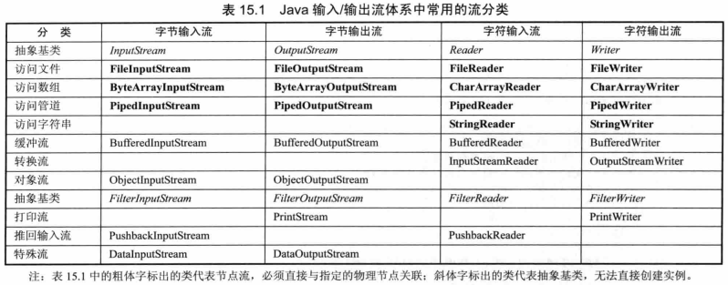
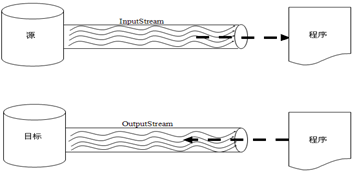
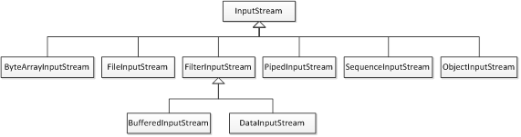
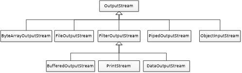

# 1. 流的概念

流(stream)的概念源于UNIX中管道(pipe)的概念。在UNIX中，管道是一条不间断的字节流，用来实现程序或进程间的通信，或读写外围设备、外部文件等。

一个流，必有源端和目的端，它们可以是计算机内存的某些区域，也可以是磁盘文件，甚至可以是Internet上的某个URL。

流的方向是重要的，根据流的方向，流可分为两类：输入流和输出流。用户可以从输入流中读取信息，但不能写它。相反，对输出流，只能往输入流写，而不能读它。

实际上，流的源端和目的端可简单地看成是字节的生产者和消费者，对输入流，可不必关心它的源端是什么，只要简单地从流中读数据，而对输出流，也可不知道它的目的端，只是简单地往流中写数据。

形象的比喻——水流 ，文件==程序 ，文件和程序之间连接一个管道，水流就在之间形成了,自然也就出现了方向：可以流进，也可以流出.便于理解，这么定义流： 流就是一个管道里面有流水，这个管道连接了文件和程序。

# 2. IO流概述

大多数应用程序都需要实现与设备之间的数据传输，例如键盘可以输入数据，显示器可以显示程序的运行结果等。在Java中，将这种通过不同输入输出设备（键盘，内存，显示器，网络等）之间的数据传输抽象的表述为“流”，程序允许通过流的方式与输入输出设备进行数据传输。Java中的“流”都位于Java.io包中，称之为IO（输入输出）流。 IO流：即InputOutput的缩写。

输入流和输出流相对于内存设备而言。将外设中的数据读取到内存中：输入。将内存的数写入到外设中：输出。

IO流的特点：

- IO流用来处理设备间的数据传输。
- Java对数据的操作是通过流的方式。
- Java用于操作流的对象都在IO包中。
- 流按操作数据分为两种：字节流和字符流。
- 流按流向分为：输入流和输出流。

PS：流只能操作数据，而不能操作文件。

# 3. 流的三种分类方式

- 按流的方向分为：输入流和输出流     
- 按流的数据单位不同分为：字节流和字符流     
- 按流的功能不同分为:节点流和处理流


# 4. 流的层次结构



 IO流的常用基类：

- 字节流的抽象基流：InputStream和OutputStream
- 字符流的抽象基流：Reader和Writer

PS：此四个类派生出来的子类名称都是以父类名作为子类名的后缀，以前缀为其功能；如InputStream子类FileInputStream；Reader子类FileReader

字符流的由来：
​      
其实就是：字节流读取文字字节数据后，不直接操作而是先查指定的编码表，获取对应的文字。再对这个文字进行操作。简单说：字节流+编码表。

## 4.1 InputStream


## 4.2 OutputStream


## 4.3 Reader


## 4.4 Writer


# 5. 字节流

在计算机中，无论是文本、图片、音频还是视频，所有文件都是以二进制(字节)形式存在的，IO流中针对字节的输入输出提供了一系列的流，统称为字节流。字节流是程序中最常用的流，根据数据的传输方向可将其分为字节输入流和字节输出流。在JDK中，提供了两个抽象类InputStream和OutputStream，它们是字节流的顶级父类，所有的字节输入流都继承自InputStream，所有的字节输出流都继承自OutputStream。为了方便理解，可以把InputStream和OutputStream比作两根“水管”，如图所示。



InputStream和OutputStream这两个类虽然提供了一系列和读写数据有关的方法，但是这两个类是抽象类，不能被实例化，因此，针对不同的功能，InputStream和OutputStream提供了不同的子类，这些子类形成了一个体系结构，如图所示。





## 5.1 字节流写数据

字节输出流：抽象类OutputStream，实现类FileOutputStream


字节输出流操作步骤：

- 创建字节输出流对象
- 写数据
- 释放资源

字节流写数据的方式

| 方法                              | 说明            |
| :------------------------------ | :------------ |
| write(int b)                    | 一次写一个字节       |
| write(byte[] b)                 | 一次写一个字节数组     |
| write(byte[] b,int off,int len) | 一次写一个字节数组的一部分 |
| flush()                         | 刷新缓冲区         |
| close()                         | 释放资源          |

如何实现数据的换行?

- 为什么没有换行呢?因为只是写了字节数据，并没有写入换行符号。
- 如何实现呢?写入换行符号即可

PS：不同的系统针对不同的换行符号识别是不一样的?

- windows：\r\n
- linux：\n
- Mac：\r
- 而一些常见的个高级记事本，是可以识别任意换行符号的。

如何实现数据的追加写入?

用构造方法带第二个参数是true的情况即可

```java
package cn.itcast_01;
import java.io.File;
import java.io.FileNotFoundException;
import java.io.FileOutputStream;
import java.io.IOException;
/*
 * 需求：我要往一个文本文件中输入一句话："hello,io"
 *
 * 分析：
 * 	A:这个操作最好是采用字符流来做，但是呢，字符流是在字节流之后才出现的，所以，今天我先讲解字节流如何操作。
 * 	B:由于我是要往文件中写一句话，所以我们要采用字节输出流。
 */
public class FileOutputStreamDemo {
	public static void main(String[] args) throws IOException {
		// 创建字节输出流对象
		// FileOutputStream(File file)
		// File file = new File("fos.txt");
		// FileOutputStream fos = new FileOutputStream(file);
		// FileOutputStream(String name)
		FileOutputStream fos = new FileOutputStream("fos.txt");
		/*
		 * 创建字节输出流对象了做了几件事情：
		 * A:调用系统功能去创建文件
		 * B:创建fos对象
		 * C:把fos对象指向这个文件
		 */

		//写数据
		fos.write("hello,IO".getBytes());
		fos.write("java".getBytes());

		//释放资源
		//关闭此文件输出流并释放与此流有关的所有系统资源。
		fos.close();
		/*
		 * 为什么一定要close()呢?
		 * A:让流对象变成垃圾，这样就可以被垃圾回收器回收了
		 * B:通知系统去释放跟该文件相关的资源
		 */
		//java.io.IOException: Stream Closed
		//fos.write("java".getBytes());
	}
}
```
## 5.2 字节流写数据的方式

```java
package cn.itcast_01;
import java.io.FileOutputStream;
import java.io.IOException;
/*
 * 字节输出流操作步骤：
 * A:创建字节输出流对象
 * B:调用write()方法
 * C:释放资源
 *
 * public void write(int b):写一个字节
 * public void write(byte[] b):写一个字节数组
 * public void write(byte[] b,int off,int len):写一个字节数组的一部分
 */
public class FileOutputStreamDemo2 {
	public static void main(String[] args) throws IOException {
		// 创建字节输出流对象
		// OutputStream os = new FileOutputStream("fos2.txt"); // 多态
		FileOutputStream fos = new FileOutputStream("fos2.txt");

		// 调用write()方法
		//fos.write(97); //97 -- 底层二进制数据	-- 通过记事本打开 -- 找97对应的字符值 -- a
		// fos.write(57);
		// fos.write(55);

		//public void write(byte[] b):写一个字节数组
		byte[] bys={97,98,99,100,101};
		fos.write(bys);

		//public void write(byte[] b,int off,int len):写一个字节数组的一部分
		fos.write(bys,1,3);

		//释放资源
		fos.close();
	}
}
```
字节流写数据加入异常处理

```java
package cn.itcast_01;
import java.io.FileNotFoundException;
import java.io.FileOutputStream;
import java.io.IOException;
/*
 * 加入异常处理的字节输出流操作
 */
public class FileOutputStreamDemo4 {
	public static void main(String[] args) {
		// 分开做异常处理
		// FileOutputStream fos = null;
		// try {
		// fos = new FileOutputStream("fos4.txt");
		// } catch (FileNotFoundException e) {
		// e.printStackTrace();
		// }
		//
		// try {
		// fos.write("java".getBytes());
		// } catch (IOException e) {
		// e.printStackTrace();
		// }
		//
		// try {
		// fos.close();
		// } catch (IOException e) {
		// e.printStackTrace();
		// }

		// 一起做异常处理
		// try {
		// FileOutputStream fos = new FileOutputStream("fos4.txt");
		// fos.write("java".getBytes());
		// fos.close();
		// } catch (FileNotFoundException e) {
		// e.printStackTrace();
		// } catch (IOException e) {
		// e.printStackTrace();
		// }

		// 改进版
		// 为了在finally里面能够看到该对象就必须定义到外面，为了访问不出问题，还必须给初始化值
		FileOutputStream fos = null;
		try {
			// fos = new FileOutputStream("z:\\fos4.txt");
			fos = new FileOutputStream("fos4.txt");
			fos.write("java".getBytes());
		} catch (FileNotFoundException e) {
			e.printStackTrace();
		} catch (IOException e) {
			e.printStackTrace();
		} finally {
			// 如果fos不是null，才需要close()
			if (fos != null) {
				// 为了保证close()一定会执行，就放到这里了
				try {
					fos.close();
				} catch (IOException e) {
					e.printStackTrace();
				}
			}
		}
	}
}
```
## 5.3 字节流读取数据

字节输入流：抽象类InputStream，实现类FileInputStream


字节输入流操作步骤：

- A：创建字节输入流对象
- B：调用read()方法读取数据，并把数据显示在控制台
- C：释放资源

字节流读数据的方式

| 方法                                 | 功能描述          |
| :--------------------------------- | :------------ |
| int read()                         | 一次读取一个字节      |
| int read(byte[] b)                 | 一次读取一个字节数组    |
| int read(byte[] b,int off,int len) | 一次读一个字节数组的一部分 |
| void close()                       | 释放资源          |

```java
package cn.itcast_02;
import java.io.FileInputStream;
import java.io.IOException;
/*
 * 字节输入流操作步骤：
 * A:创建字节输入流对象
 * B:调用read()方法读取数据，并把数据显示在控制台
 * C:释放资源
 *
 * 读取数据的方式：
 * A:int read():一次读取一个字节
 * B:int read(byte[] b):一次读取一个字节数组
 * C:int read(byte[] b):一次读取一个字节数组
 *   返回值其实是实际读取的字节个数。
 */
public class FileInputStreamDemo {
	public static void main(String[] args) throws IOException {
		// FileInputStream(String name)
		// FileInputStream fis = new FileInputStream("fis.txt");
		FileInputStream fis = new FileInputStream("FileOutputStreamDemo.java");

		// // 调用read()方法读取数据，并把数据显示在控制台
		// // 第一次读取
		// int by = fis.read();
		// System.out.println(by);
		// System.out.println((char) by);
		//
		// // 第二次读取
		// by = fis.read();
		// System.out.println(by);
		// System.out.println((char) by);
		//
		// // 第三次读取
		// by = fis.read();
		// System.out.println(by);
		// System.out.println((char) by);
		// // 我们发现代码的重复度很高，所以我们要用循环改进
		// // 而用循环，最麻烦的事情是如何控制循环判断条件呢?
		// // 第四次读取
		// by = fis.read();
		// System.out.println(by);
		// // 第五次读取
		// by = fis.read();
		// System.out.println(by);
		// //通过测试，我们知道如果你读取的数据是-1，就说明已经读取到文件的末尾了

		// 用循环改进
		// int by = fis.read();
		// while (by != -1) {
		// System.out.print((char) by);
		// by = fis.read();
		// }

		// 最终版代码
		int by = 0;
		// 读取，赋值，判断
		while ((by = fis.read()) != -1) {
			System.out.print((char) by);
		}
                // 数组的长度一般是1024或者1024的整数倍
		byte[] bys = new byte[1024];
		int len = 0;
		while ((len = fis.read(bys)) != -1) {
			System.out.print(new String(bys, 0, len));
		}

		// 释放资源
		fis.close();
	}
}
```

## 5.4 字节流复制数据练习

代码示例：把c:\\a.txt内容复制到d:\\b.txt中

```java
package cn.itcast_03;
import java.io.FileInputStream;
import java.io.FileOutputStream;
import java.io.IOException;
/*
 * 需求：把c盘下的a.txt的内容复制到d盘下的b.txt中
 *
 * 数据源：
 * 		c:\\a.txt	--	读取数据--	FileInputStream
 * 目的地：
 * 		d:\\b.txt	--	写出数据	--	FileOutputStream
 */
public class CopyFileDemo2 {
	public static void main(String[] args) throws IOException {
		// 封装数据源
		FileInputStream fis = new FileInputStream("c:\\a.txt");
		// 封装目的地
		FileOutputStream fos = new FileOutputStream("d:\\b.txt");

		// 复制数据
		int by = 0;
		while ((by = fis.read()) != -1) {
			fos.write(by);
		}

		// 释放资源
		fos.close();
		fis.close();
	}
}
```
## 5.5字节缓冲流

一个字节一个字节的读写，需要频繁的操作文件，效率非常低。这就好比从北京运送烤鸭到上海，如果有一万只烤鸭，每次运送一只，就必须运输一万次，这样的效率显然非常低。为了减少运输次数，可以先把一批烤鸭装在车厢中，这样就可以成批的运送烤鸭，这时的车厢就相当于一个临时缓冲区。当通过流的方式拷贝文件时，为了提高效率也可以定义一个字节数组作为缓冲区。在拷贝文件时，可以一次性读取多个字节的数据，并保存在字节数组中，然后将字节数组中的数据一次性写入文件。

在IO包中提供两个带缓冲的字节流，分别是BufferedInputStream和BufferedOutputStream，它们的构造方法中分别接收InputStream和OutputStream类型的参数作为对象，在读写数据时提供缓冲功能。应用程序、缓冲流和底层字节流之间的关系如图所示。


字节流一次读写一个数组的速度明显比一次读写一个字节的速度快很多，这是加入了数组这样的缓冲区效果，java本身在设计的时候，也考虑到了这样的设计思想(装饰设计模式后面讲解)，所以提供了字节缓冲区流。

字节缓冲输出流：BufferedOutputStream，字节缓冲输入流：BufferedInputStream。

```java
package cn.itcast_05;
import java.io.BufferedOutputStream;
import java.io.FileOutputStream;
import java.io.IOException;
/*
 * 通过定义数组的方式确实比以前一次读取一个字节的方式快很多，所以，看来有一个缓冲区还是非常好的。
 * 既然是这样的话，那么，java开始在设计的时候，它也考虑到了这个问题，就专门提供了带缓冲区的字节类。
 * 这种类被称为：缓冲区类(高效类)
 * 写数据：BufferedOutputStream
 * 读数据：BufferedInputStream
 *
 * 构造方法可以指定缓冲区的大小，但是我们一般用不上，因为默认缓冲区大小就足够了。
 *
 * 为什么不传递一个具体的文件或者文件路径，而是传递一个OutputStream对象呢?
 * 原因很简单，字节缓冲区流仅仅提供缓冲区，为高效而设计的。但是呢，真正的读写操作还得靠基本的流对象实现。
 */
public class BufferedOutputStreamDemo {
	public static void main(String[] args) throws IOException {
		// BufferedOutputStream(OutputStream out)
		// FileOutputStream fos = new FileOutputStream("bos.txt");
		// BufferedOutputStream bos = new BufferedOutputStream(fos);
		// 简单写法
		BufferedOutputStream bos = new BufferedOutputStream(
				new FileOutputStream("bos.txt"));

		// 写数据
		bos.write("hello".getBytes());

		// 释放资源
		bos.close();
	}
}
```
## 5.6 字节缓冲流复制数据练习

```java
package cn.itcast_06;
import java.io.BufferedInputStream;
import java.io.BufferedOutputStream;
import java.io.FileInputStream;
import java.io.FileOutputStream;
import java.io.IOException;
/*
 * 需求：把e:\\a.mp4复制到当前项目目录下的b.mp4中
 *
 * 字节流四种方式复制文件：
 * 基本字节流一次读写一个字节：	共耗时：117235毫秒
 * 基本字节流一次读写一个字节数组： 共耗时：156毫秒
 * 高效字节流一次读写一个字节： 共耗时：1141毫秒
 * 高效字节流一次读写一个字节数组： 共耗时：47毫秒
 */
public class CopyMp4Demo {
	public static void main(String[] args) throws IOException {
		long start = System.currentTimeMillis();
		// method1("e:\\a.mp4", "copy1.mp4");
		// method2("e:\\a.mp4", "copy2.mp4");
		// method3("e:\\a.mp4", "copy3.mp4");
		method4("e:\\a.mp4", "copy4.mp4");
		long end = System.currentTimeMillis();
		System.out.println("共耗时：" + (end - start) + "毫秒");
	}

	// 高效字节流一次读写一个字节数组：
	public static void method4(String srcString, String destString)
			throws IOException {
		BufferedInputStream bis = new BufferedInputStream(new FileInputStream(
				srcString));
		BufferedOutputStream bos = new BufferedOutputStream(
				new FileOutputStream(destString));

		byte[] bys = new byte[1024];
		int len = 0;
		while ((len = bis.read(bys)) != -1) {
			bos.write(bys, 0, len);
		}

		bos.close();
		bis.close();
	}

	// 高效字节流一次读写一个字节：
	public static void method3(String srcString, String destString)
			throws IOException {
		BufferedInputStream bis = new BufferedInputStream(new FileInputStream(
				srcString));
		BufferedOutputStream bos = new BufferedOutputStream(
				new FileOutputStream(destString));

		int by = 0;
		while ((by = bis.read()) != -1) {
			bos.write(by);

		}

		bos.close();
		bis.close();
	}

	// 基本字节流一次读写一个字节数组
	public static void method2(String srcString, String destString)
			throws IOException {
		FileInputStream fis = new FileInputStream(srcString);
		FileOutputStream fos = new FileOutputStream(destString);

		byte[] bys = new byte[1024];
		int len = 0;
		while ((len = fis.read(bys)) != -1) {
			fos.write(bys, 0, len);
		}

		fos.close();
		fis.close();
	}

	// 基本字节流一次读写一个字节
	public static void method1(String srcString, String destString)
			throws IOException {
		FileInputStream fis = new FileInputStream(srcString);
		FileOutputStream fos = new FileOutputStream(destString);

		int by = 0;
		while ((by = fis.read()) != -1) {
			fos.write(by);
		}

		fos.close();
		fis.close();
	}
}
```
