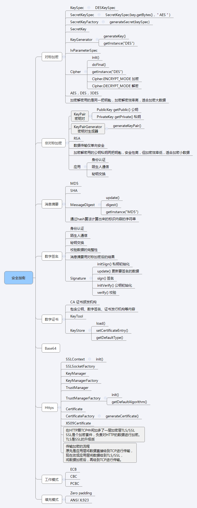

## Java安全加密专题文章索引

1. [Java安全加密：对称加密](http://blog.csdn.net/axi295309066/article/details/52491077)
2. [Java安全加密：非对称加密](http://blog.csdn.net/axi295309066/article/details/52494640)
3. [Java安全加密：消息摘要Message Digest](http://blog.csdn.net/axi295309066/article/details/52494725)
4. [Java安全加密：数字签名和数字证书](http://blog.csdn.net/axi295309066/article/details/52494832)
5. [Java安全加密：Https编程](http://blog.csdn.net/axi295309066/article/details/52494902)

## 概述
SSL(Secure Sockets Layer 安全套接层)，为网景公司(Netscape)所研发，用以保障在Internet 上数据传输之安全，利用数据加密(Encryption)技术，可确保数据在网络上之传输过程中不会被截取及窃听。一般通用之规格为40 bit 之安全标准，美国则已推出128 bit 之更高安全标准，但限制出境。只要3.0 版本以上之I.E.或Netscape 浏览器即可支持SSL。

TLS（Transport Layer Security 传输层安全），用于在两个通信应用程序之间提供保密性和数据完整性。TLS 是SSL 的标准化后的产物，有1.0 ，1.1 ，1.2 三个版本，默认使用1.0。TLS1.0 和SSL3.0 几乎没有区别，事实上我们现在用的都是TLS，但因为历史上习惯了SSL 这个称呼。

### SSL 通信简单图示


### SSL 通信详细图示


当请求使用自签名证书的网站数据时，例如请求12306 的客运服务页面：https://kyfw.12306.cn/otn/ ，则会报下面的错误，原因是客户端的根认证机构不能识别该证书错误信息：unable to find valid certification path to requested target

## 解决方案1
一个证书可不可信，是由TrustManager 决定的，所以我们只需要自定义一个什么都不做的TrustManager即可，服务器出示的所有证书都不做校验，一律放行。

```java
public static void main(String[] args) throws Exception {
//协议传输层安全TLS(transport layer secure)
SSLContext sslContext = SSLContext.getInstance("TLS");
//创建信任管理器（TrustManager 负责校验证书是否可信）
TrustManager[] tm = new TrustManager[]{new EmptyX509TrustManager()};
//使用自定义的信任管理器初始化SSL 上下文对象
sslContext.init(null, tm, null);
//设置全局的SSLSocketFactory 工厂（对所有ssl 链接都产生影响）
HttpsURLConnection.setDefaultSSLSocketFactory(sslContext.getSocketFactory());

 //URL url = new URL("https://www.baidu.com");
 URL url = new URL("https://kyfw.12306.cn/otn/");
 HttpsURLConnection conn = (HttpsURLConnection) url.openConnection();
 InputStream in = conn.getInputStream();
 System.out.println(Util.inputstream2String(in));
 }

 /
 * 自定义一个什么都不做的信任管理器，所有证书都不做校验，一律放行
 */
 private static class EmptyX509TrustManager implements X509TrustManager{
 @Override
 public void checkClientTrusted(X509Certificate[] chain, String authType)
 throws CertificateException {
 }

 @Override
 public void checkServerTrusted(X509Certificate[] chain, String authType)
 throws CertificateException {
 }

 @Override
 public X509Certificate[] getAcceptedIssuers() {
 return null;
 }
}
```
## 解决方案2
12306 服务器出示的证书是中铁集团SRCA 给他颁发的，所以SRCA 的证书是能够识别12306 的证书的，所以只需要把SRCA 证书导入系统的KeyStore 里，之后交给TrustManagerFactory 进行初始化，则可把SRCA 添加至根证书认证机构，之后校验的时候，SRCA 对12306 证书校验时就能通过认证。

这种解决方案有两种使用方式：一是直接使用SRCA.cer 文件，二是使用改文件的RFC 格式数据，将其写在代码里。

```java
//12306 证书的RFC 格式（注意要记得手动添加两个换行符）
 private static final String CERT_12306_RFC = "-----BEGIN CERTIFICATE-----\n"+
"MIICmjCCAgOgAwIBAgIIbyZr5/jKH6QwDQYJKoZIhvcNAQEFBQAwRzELMAkGA1UEBhMCQ04xKTAn"+
"BgNVBAoTIFNpbm9yYWlsIENlcnRpZmljYXRpb24gQXV0aG9yaXR5MQ0wCwYDVQQDEwRTUkNBMB4X"+
"DTA5MDUyNTA2NTYwMFoXDTI5MDUyMDA2NTYwMFowRzELMAkGA1UEBhMCQ04xKTAnBgNVBAoTIFNp"+
"bm9yYWlsIENlcnRpZmljYXRpb24gQXV0aG9yaXR5MQ0wCwYDVQQDEwRTUkNBMIGfMA0GCSqGSIb3"+
"DQEBAQUAA4GNADCBiQKBgQDMpbNeb34p0GvLkZ6t72/OOba4mX2K/eZRWFfnuk8e5jKDH+9BgCb2"+
"9bSotqPqTbxXWPxIOz8EjyUO3bfR5pQ8ovNTOlks2rS5BdMhoi4sUjCKi5ELiqtyww/XgY5iFqv6"+
"D4Pw9QvOUcdRVSbPWo1DwMmH75It6pk/rARIFHEjWwIDAQABo4GOMIGLMB8GA1UdIwQYMBaAFHle"+
"tne34lKDQ+3HUYhMY4UsAENYMAwGA1UdEwQFMAMBAf8wLgYDVR0fBCcwJTAjoCGgH4YdaHR0cDov"+
"LzE5Mi4xNjguOS4xNDkvY3JsMS5jcmwwCwYDVR0PBAQDAgH+MB0GA1UdDgQWBBR5XrZ3t+JSg0Pt"+
"x1GITGOFLABDWDANBgkqhkiG9w0BAQUFAAOBgQDGrAm2U/of1LbOnG2bnnQtgcVaBXiVJF8LKPaV"+
"23XQ96HU8xfgSZMJS6U00WHAI7zp0q208RSUft9wDq9ee///VOhzR6Tebg9QfyPSohkBrhXQenvQ"+
"og555S+C3eJAAVeNCTeMS3N/M5hzBRJAoffn3qoYdAO1Q8bTguOi+2849A=="+
"-----END CERTIFICATE-----\n";
 public static void main(String[] args) throws Exception {
 // 使用传输层安全协议TLS(transport layer secure)
 SSLContext sslContext = SSLContext.getInstance("TLS");
 //使用SRCA.cer 文件的形式

//FileInputStream certInputStream = new FileInputStream(new File("srca.cer"));
//也可以通过RFC 字符串的形式使用证书
ByteArrayInputStream certInputStream = new
ByteArrayInputStream(CERT_12306_RFC.getBytes());
// 初始化keyStore，用来导入证书
KeyStore keyStore = KeyStore.getInstance(KeyStore.getDefaultType());
//参数null 表示使用系统默认keystore，也可使用其他keystore（需事先将srca.cer 证书导入
keystore 里）
keyStore.load(null);
//通过流创建一个证书
Certificate certificate = CertificateFactory.getInstance("X.509")
.generateCertificate(certInputStream);
// 把srca.cer 这个证书导入到KeyStore 里，别名叫做srca
keyStore.setCertificateEntry("srca", certificate);
// 设置使用keyStore 去进行证书校验
TrustManagerFactory trustManagerFactory = TrustManagerFactory
.getInstance(TrustManagerFactory.getDefaultAlgorithm());
trustManagerFactory.init(keyStore);
//用我们设定好的TrustManager 去做ssl 通信协议校验，即证书校验
sslContext.init(null, trustManagerFactory.getTrustManagers(), null);
HttpsURLConnection.setDefaultSSLSocketFactory(sslContext
.getSocketFactory());
URL url = new URL("https://kyfw.12306.cn/otn/");
HttpsURLConnection conn = (HttpsURLConnection) url.openConnection();
InputStream in = conn.getInputStream();
System.out.println(Util.inputstream2String(in));
}
```
## Android 里的 https 请求
把scra.cer 文件考到assets 或raw 目录下，或者直接使用证书的RFC 格式，接下来的做法和java工程代码一样

```java
//ByteArrayInputStream in = new ByteArrayInputStream("rfc".getBytes());
CertificateFactory cf = CertificateFactory.getInstance("X.509");
InputStream caInput = new BufferedInputStream(new FileInputStream("load-der.crt"));
Certificate ca;
try {
    ca = cf.generateCertificate(caInput);
    System.out.println("ca=" + ((X509Certificate) ca).getSubjectDN());
} finally {
    caInput.close();
}
String keyStoreType = KeyStore.getDefaultType();
KeyStore keyStore = KeyStore.getInstance(keyStoreType);
keyStore.load(null, null);
keyStore.setCertificateEntry("ca", ca);

String tmfAlgorithm = TrustManagerFactory.getDefaultAlgorithm();
TrustManagerFactory tmf = TrustManagerFactory.getInstance(tmfAlgorithm);
tmf.init(keyStore);

SSLContext context = SSLContext.getInstance("TLS");
context.init(null, tmf.getTrustManagers(), null);

URL url = new URL("https://certs.cac.washington.edu/CAtest/");
HttpsURLConnection urlConnection =
        (HttpsURLConnection)url.openConnection();
urlConnection.setSSLSocketFactory(context.getSocketFactory());
InputStream in = urlConnection.getInputStream();
copyInputStreamToOutputStream(in, System.out);

```
## 双向证书验证

```java
CertificateFactory certificateFactory = CertificateFactory.getInstance("X.509");
KeyStore keyStore = KeyStore.getInstance(KeyStore.getDefaultType());
keyStore.load(null);

SSLContext sslContext = SSLContext.getInstance("TLS");
TrustManagerFactory trustManagerFactory = TrustManagerFactory.
        getInstance(TrustManagerFactory.getDefaultAlgorithm());
trustManagerFactory.init(keyStore);

//初始化keystore
KeyStore clientKeyStore = KeyStore.getInstance(KeyStore.getDefaultType());
clientKeyStore.load(getAssets().open("client.bks"), "123456".toCharArray());

KeyManagerFactory keyManagerFactory = KeyManagerFactory.getInstance(KeyManagerFactory.getDefaultAlgorithm());
keyManagerFactory.init(clientKeyStore, "123456".toCharArray());

sslContext.init(keyManagerFactory.getKeyManagers(), trustManagerFactory.getTrustManagers(), new SecureRandom());

```
## Nogotofail
网络流量安全测试工具，Google的开源项目：https://github.com/google/nogotofail

## 安全加密专题总结

以上学习所有内容，对称加密、非对称加密、消息摘要、数字签名等知识都是为了理解数字证书工作原理而作为一个预备知识。数字证书是密码学里的终极武器，是人类几千年历史总结的智慧的结晶，只有在明白了数字证书工作原理后，才能理解Https 协议的安全通讯机制。最终才能在SSL 开发过程中得心应手。

另外，对称加密和消息摘要这两个知识点是可以单独拿来使用的。

数字证书使用到了以上学习的所有知识

- 对称加密与非对称加密结合使用实现了秘钥交换，之后通信双方使用该秘钥进行对称加密通信。
- 消息摘要与非对称加密实现了数字签名，根证书机构对目标证书进行签名，在校验的时候，根证书用公钥对其进行校验。若校验成功，则说明该证书是受信任的。
- Keytool 工具可以创建证书，之后交给根证书机构认证后直接使用自签名证书，还可以输出证书的RFC格式信息等。
- 数字签名技术实现了身份认证与数据完整性保证。
- 加密技术保证了数据的保密性，消息摘要算法保证了数据的完整性，对称加密的高效保证了数据处理的可靠性，数字签名技术保证了操作的不可否认性。

通过以上内容的学习，我们要能掌握以下知识点：

- 基础知识：bit 位、字节、字符、字符编码、进制转换、io
- 知道怎样在实际开发里怎样使用对称加密解决问题
- 知道对称加密、非对称加密、消息摘要、数字签名、数字证书是为了解决什么问题而出现的
- 了解SSL 通讯流程
- 实际开发里怎样请求Https 的接口

