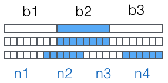

Base64是一种用64个字符来表示任意二进制数据的方法。

用记事本打开`exe`、`jpg`、`pdf`这些文件时，我们都会看到一大堆乱码，因为二进制文件包含很多无法显示和打印的字符，所以，如果要让记事本这样的文本处理软件能处理二进制数据，就需要一个二进制到字符串的转换方法。Base64是一种最常见的二进制编码方法。

Base64的原理很简单，首先，准备一个包含64个字符的数组：

```
['A', 'B', 'C', ... 'a', 'b', 'c', ... '0', '1', ... '+', '/']
```


然后，对二进制数据进行处理，每3个字节一组，一共是`3x8=24`bit，划为4组，每组正好6个bit：



这样我们得到4个数字作为索引，然后查表，获得相应的4个字符，就是编码后的字符串。

所以，Base64编码会把3字节的二进制数据编码为4字节的文本数据，长度增加33%，好处是编码后的文本数据可以在邮件正文、网页等直接显示。

如果要编码的二进制数据不是3的倍数，最后会剩下1个或2个字节怎么办？Base64用`\x00`字节在末尾补足后，再在编码的末尾加上1个或2个`=`号，表示补了多少字节，解码的时候，会自动去掉。

由于标准的Base64编码后可能出现字符`+`和`/`，在URL中就不能直接作为参数，所以又有一种"url safe"的base64编码，其实就是把字符`+`和`/`分别变成`-`和`_`：

还可以自己定义64个字符的排列顺序，这样就可以自定义Base64编码，不过，通常情况下完全没有必要。

Base64是一种通过查表的编码方法，不能用于加密，即使使用自定义的编码表也不行。

Base64适用于小段内容的编码，比如数字证书签名、Cookie的内容等。

由于`=`字符也可能出现在Base64编码中，但`=`用在URL、Cookie里面会造成歧义，所以，很多Base64编码后会把`=`去掉：

```
// 标准Base64:
'abcd' -> 'YWJjZA=='
// 自动去掉=:
'abcd' -> 'YWJjZA'

```

去掉`=`后怎么解码呢？因为Base64是把3个字节变为4个字节，所以，Base64编码的长度永远是4的倍数，因此，需要加上`=`把Base64字符串的长度变为4的倍数，就可以正常解码了。

### 应用

把一些对象转换成string，用处:传输的时候不要明文传输

- 上传图片，上传语音
- 如何把一个map存到sp-->Base64支持把byte[]-->String，只需把对象先转换成byte[]就可以存到sp中

```java
ImageView iv = (ImageView) findViewById(R.id.iv);
//1.得到bitmap
Bitmap bitmap = BitmapFactory.decodeResource(getResources(), R.drawable.ic_launcher);
//2.bitmap-->byte[]
ByteArrayOutputStream out = new ByteArrayOutputStream();
bitmap.compress(CompressFormat.PNG, 100, out);
byte[] bitmapByteArr = out.toByteArray();
//3.使用base64 byte[]--String--->上传到服务器
String bitmapBase64String = Base64.encodeToString(bitmapByteArr, Base64.DEFAULT);

//key-value jsonString

//4.String-->byte[]
byte[] bitmapByteArr2 = Base64.decode(bitmapBase64String, Base64.DEFAULT);
//5.byte[]-->Bitmap -->完成图片的上传
Bitmap bitmapPassed = BitmapFactory.decodeByteArray(bitmapByteArr2, 0, bitmapByteArr2.length);
//6.设置图片到imageView
iv.setImageBitmap(bitmapPassed);
```

### 小结

Base64是一种任意二进制到文本字符串的编码方法，常用于在URL、Cookie、网页中传输少量二进制数据。