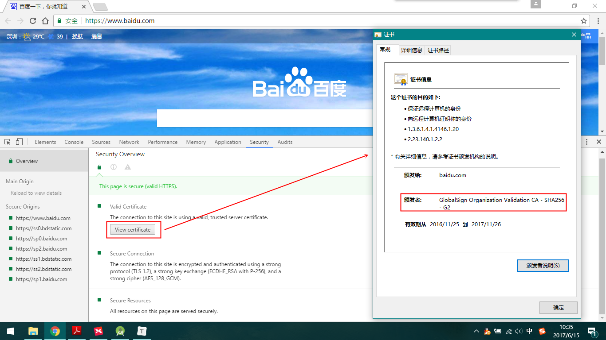
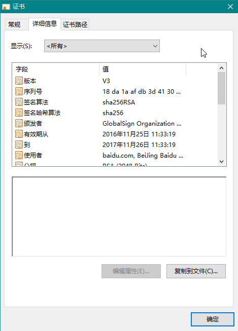

## Java安全加密专题文章索引

1. [Java安全加密：对称加密](http://blog.csdn.net/axi295309066/article/details/52491077)
2. [Java安全加密：非对称加密](http://blog.csdn.net/axi295309066/article/details/52494640)
3. [Java安全加密：消息摘要Message Digest](http://blog.csdn.net/axi295309066/article/details/52494725)
4. [Java安全加密：数字签名和数字证书](http://blog.csdn.net/axi295309066/article/details/52494832)
5. [Java安全加密：Https编程](http://blog.csdn.net/axi295309066/article/details/52494902)


# 1. 数字签名

## 1.1 概述

数字签名是非对称加密与数字摘要的组合应用

## 1.2 应用场景

- 校验用户身份（使用私钥签名，公钥校验，只要用公钥能校验通过，则该信息一定是私钥持有者发布的）
- 校验数据的完整性（用解密后的消息摘要跟原文的消息摘要进行对比）

## 1.3 签名过程

发送报文时，发送方用一个哈希函数从报文文本中生成[报文摘要](http://baike.baidu.com/view/4971320.htm),然后用自己的私人密钥对这个摘要进行加密，这个加密后的摘要将作为报文的数字签名和报文一起发送给接收方，接收方首先用与发送方一样的哈希函数从接收到的原始报文中计算出报文摘要，接着再用发送方的公用密钥来对报文附加的数字签名进行解密，如果这两个摘要相同、那么接收方就能确认该数字签名是发送方的。

数字签名有两种功效：一是能确定消息确实是由发送方签名并发出来的，因为别人假冒不了发送方的签名。二是数字签名能确定消息的完整性。因为数字签名的特点是它代表了文件的特征，文件如果发生改变，数字摘要的值也将发生变化。不同的文件将得到不同的数字摘要。一次数字签名涉及到一个哈希函数、发送者的[公钥](http://baike.baidu.com/view/355291.htm)、发送者的[私钥](http://baike.baidu.com/view/493846.htm)。


## 1.4 使用步骤

```java
//获取signature 对象，初始化算法：MD2withRSA, MD5withRSA, or SHA1withRSA
Signature signature = Signature.getInstance("MD5withRSA");
//创建私钥（从磁盘上读取）
PrivateKey privateKey = (PrivateKey)SerializableUtil.readObject("heima.privateKey");
//使用私钥进行初始化
signature.initSign(privateKey);
//传入需要签名的数据
signature.update(content.getBytes());
//执行签名
byte[] sign = signature.sign();

//创建公钥（从磁盘上读取）
PublicKey publicKey = (PublicKey) SerializableUtil.readObject("heima.publicKey");
//使用公钥进行初始化
signature.initVerify(publicKey);
//传入需要校验的数据（即上面的原文）
signature.update(content.getBytes());
//执行校验
boolean verify = signature.verify(sign);
```
## 1.5 总结

数字签名一般不单独使用，基本都是用在数字证书里实现SSL 通信协议。下面将学习的数字证书就是基于数字签名技术实现的。

# 2. 数字证书

## 2.1 概述

数字证书就是互联网通讯中标志通讯各方身份信息的一串数字，提供了一种在Internet 上验证通信实体身份的方式，数字证书不是数字身份证，而是身份认证机构盖在数字身份证上的一个章或印（或者说加在数字身份证上的一个签名）。它是由权威机构——CA 机构，又称为证书授权（Certificate Authority）中心发行的，人们可以在网上用它来识别对方的身份。

## 2.2 应用场景

- 交易者身份的确定性、不可否认性、不可修改性
- 对应用进行签名认证（例如Android 的apk）

## 2.3 数字证书格式


数字证书的格式普遍采用的是X.509V3 国际标准，一个标准的X.509 数字证书包含以下一些内容：

- 证书的版本信息
- 证书的序列号，每个证书都有一个唯一的证书序列号
- 证书所使用的签名算法
- 证书的发行机构名称，命名规则一般采用X.500 格式
- 证书的有效期，通用的证书一般采用UTC 时间格式，它的计时范围为1950-2049
- 证书所有人的名称，命名规则一般采用X.500 格式
- 证书所有人的公开密钥
- 证书发行者对证书的签名

## 2.4 数字证书原理


数字证书是安全领域里的终极武器，SSL 通信协议里最核心的东西就是数字证书。他涉及到前面提到的所有知识：对称加密、非对称加密、消息摘要、数字签名等。

数字证书可以通过java 自带的KeyTool 工具生成，生成后的数字证书一般保管在KeyStore 里。KeyStore可以叫做秘钥仓库。

秘钥仓库可以保管3 种类型的数据：

- KeyStore.PrivateKeyEntry（非对称机密里的私钥）
- KeyStore.SecretKeyEntry （对称加密里的秘钥）
- KeyStore.TrustedCertificateEntry（受信任的证书）

## 2.5 KeyTool工具

路径：jre\bin\keytool.exe


常用命令：
生成keypair

```java
keytool -genkeypair
keytool -genkeypair -alias lisi（后面部分是为证书指定别名，否则采用默认的名称为mykey）
```
看看keystore 中有哪些项目：

```java
keytool -list 或keytool -list -v
keytool -exportcert -alias lisi -file lisi.cer
```

生成可打印的证书：

```java
keytool -exportcert -alias lisi -file lisi.cer –rfc
```

显示数字证书文件中的证书信息：

```
keytool -printcert -file lisi.cer
```

直接双击lisi.cer，用window 系统的内置程序打开lisi.cer

## 2.6 Android的keystore相关知识

debug 签名路径：user\.android\debug.keystore


debug.keystore 的别名（alias）及密码:		

别名：androiddebugkey，密码：android

签名命令(jdk1.6)：

```java
jarsigner -verbose -keystore debug.keystore -signedjar 1signed.apk 1.apk androiddebugkey
```

签名命令(jdk1.7)：

```java
jarsigner -verbose -keystore debug.keystore -signedjar 1signed.apk 1.apk androiddebugkey -digestalg
SHA1 -sigalg MD5withRSA
```

优化命令：

```
zipalign -v 4 1signed.apk 1signedaligned.apk
```

验证签名是否成功：

```
jarsigner -verify 1signed.apk
```
## 2.7 补充

### 签名证书

由权威颁发机构颁发给服务器或者个人用于证明自己身份的东西，默认客户端都是信任的。主要目的是用来加密和保证数据的完整性和不可抵赖性

例如根证书机构Symantec 颁发给百度的就是签名证书，是受信任的。






### 自签名证书

由服务器自己颁发给自己，用于证明自己身份的东西，非权威颁发机构发布，默认客户端都是不信任的，主要目的是用来加密和保证数据的完整性和不可抵赖性,与签名证书相同.
例如中铁集团（SRCA）办法给12306 的证书就是自签名证书，自己给自己颁发的。


# 3. Android签名机制

## 3.1 什么是签名？

Android要求所有已安装的应用程序都使用数字证书做数字签名，数字证书的私钥由开发者持有。Android使用数字证书作为标识应用程序开发者的一种方式，并在应用程序之间建立信任的关系，证书并不用来控制用户能否安装那个应用程序，证书不需要有证书认证中心签名，完全可以使用自签名证书（seft-signed certificates）

没有正确签名的应用，Android系统不会安装或运行，此规则适用于任何地方运行的Android系统，不管是在模拟器还是在真实设备上。因为这个原因，在真机或模拟器上运行或调试应用前，必须为其设置好签名。

## 3.2 为什么需要签名？

开发Android的人很多，完全可以把包名，类名起成同样的名字，这时候如何区分？签名可以区分开发商或者恶意的开发者可以通过相同的包名混淆替换已安装应用。签名可以保证相同包名但是签名不同的包不被替换。

应用如果使用一种key签名，另外一个key签名的文件将无法安装或覆盖老的版本。防止已安装的应用被恶意的第三方覆盖或替换。签名可以防止交易抵赖

## 3.3 Android签名机制

在Android 系统中，所有安装到系统的应用程序都必有一个数字证书，此数字证书用于标识应用程序的作者和在应用程序之间建立信任关系。

Android 系统要求每一个安装进系统的应用程序都是经过数字证书签名的，数字证书的私钥则保存在程序开发者的手中。

Android 将数字证书用来标识应用程序的作者和在应用程序之间建立信任关系，不是用来决定最终用户可以安装哪些应用程序。

这个数字证书并不需要权威的数字证书签名机构认证(CA)，它只是用来让应用程序包自我认证的。

同一个开发者的多个程序尽可能使用同一个数字证书，这可以带来以下好处。

- 有利于程序升级，当新版程序和旧版程序的数字证书相同时，Android 系统才会认为这两个程序是同一个程序的不同版本。如果新版程序和旧版程序的数字证书不相同，则Android 系统认为他们是不同的程序，并产生冲突，会要求新程序更改包名。

- 有利于程序的模块化设计和开发。Android 系统允许拥有同一个数字签名的程序运行在一个进程中，Android程序会将他们视为同一个程序。所以开发者可以将自己的程序分模块开发，而用户只需要在需要的时候下载适当的模块

在签名时，需要考虑数字证书的有效期

- 数字证书的有效期要包含程序的预计生命周期，一旦数字证书失效，持有改数字证书的程序将不能正常升级。

- 如果多个程序使用同一个数字证书，则该数字证书的有效期要包含所有程序的预计生命周期。

- Android Market 强制要求所有应用程序数字证书的有效期要持续到2033 年10 月22 日以后。

Android 数字证书包含以下几个要点

- 所有的应用程序都必须有数字证书，Android 系统不会安装一个没有数字证书的应用程序

- Android 程序包使用的数字证书可以是自签名的，不需要一个权威的数字证书机构签名认证

- 如果要正式发布一个Android ，必须使用一个合适的私钥生成的数字证书来给程序签名，而不能使用adt 插件或者ant 工具生成的调试证书来发布

- 数字证书都是有有效期的，Android 只是在应用程序安装的时候才会检查证书的有效期。如果程序已经安装在系统中，即使证书过期也不会影响程序的正常功能

## 3.4 Android签名过程


创建证书


## 3.5 Android APP 升级流程


签名冲突：

如果两个应用程序, 包名相同, 但是签名不同, 就无法覆盖安装

正式签名：

- 有效期比较长，一般大于25年
- 需要设置密码
- 正式发布应用时，必须用正式签名来打包

测试签名(debug.keystore)

- 有效期是1年，很短
- 有默认的别名，密码，alias=android，密码是androiddebugkey
- 在Android Studio中直接运行项目是,系统默认采用此签名文件

如果正式签名丢失了怎么办?

- 修改包名，发布，会发现有两个手机卫士，用户会比较纠结
- 请用户先删掉原来的版本，再进行安装，用户会流失
- 作为一名有经验的开发人员，请不要犯这种低级错误
